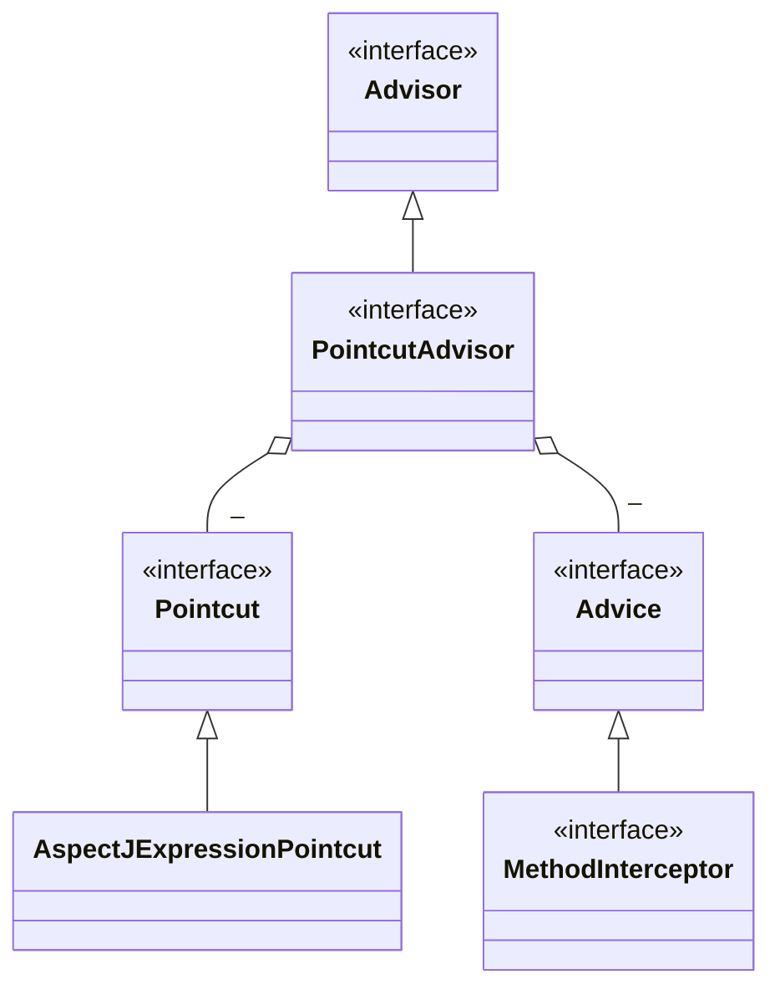
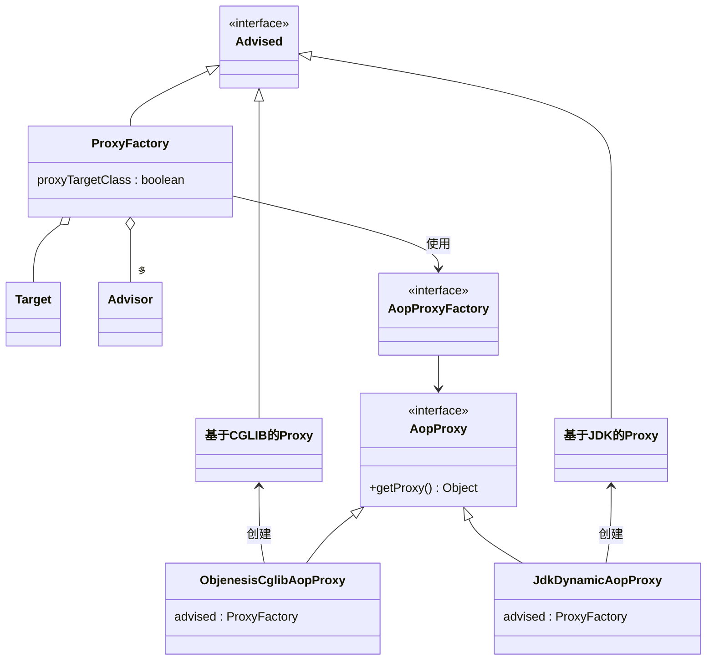
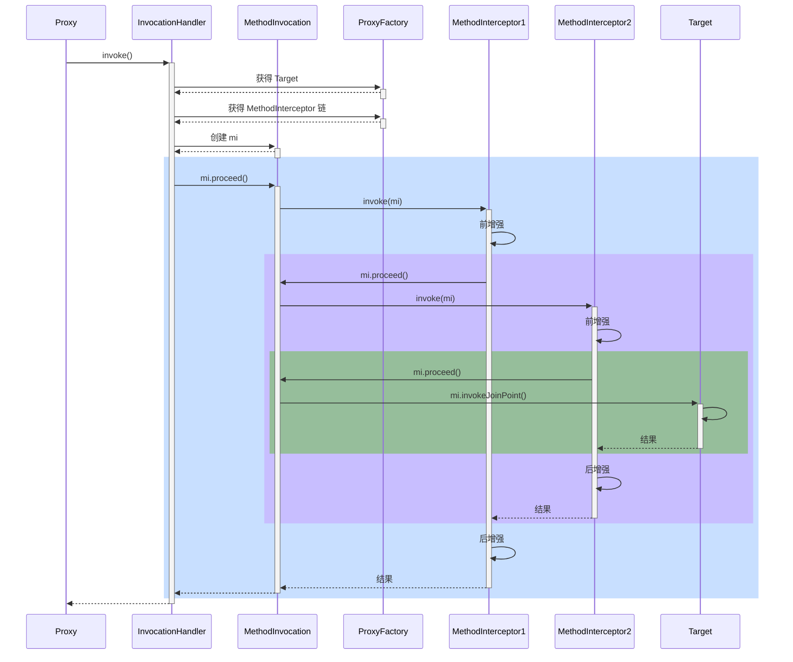

# Spring5：学习笔记

[课程地址](https://www.bilibili.com/video/BV1P44y1N7QG?p=32)

## AOP

### 09. AOP 实现之 ajc 编译器

**在Java编译阶段进行增强的方式**

```java
/*
    注意几点
    1. 版本选择了 java 8, 因为目前的 aspectj-maven-plugin 1.14.0 最高只支持到 java 16
    2. 一定要用 maven 的 compile 来编译, idea 不会调用 ajc 编译器
 */
@SpringBootApplication
public class A09 {

    private static final Logger log = LoggerFactory.getLogger(A09.class);

    public static void main(String[] args) {
        ConfigurableApplicationContext context = SpringApplication.run(A09.class, args);
        MyService service = context.getBean(MyService.class);

        log.debug("service class: {}", service.getClass());
        service.foo();

        context.close();
        /*
            学到了什么
            1. aop 的原理并非代理一种, 编译器也能玩出花样
         */
    }
}

@Service
public class MyService {

    private static final Logger log = LoggerFactory.getLogger(MyService.class);

    public static void foo() {
        log.debug("foo()");
    }
}

@Aspect // ⬅️注意此切面并未被 Spring 管理
public class MyAspect {

    private static final Logger log = LoggerFactory.getLogger(MyAspect.class);

    @Before("execution(* cn.xyc.a09.service.MyService.foo())")
    public void before() {
        log.debug("before()");
    }
}

// 运行结果
## 输出的不是代理类
[DEBUG] 10:30:49.263 [main] cn.xyc.a09.A09                      - service class: class cn.xyc.a09.service.MyService 
## 被增强了
[DEBUG] 10:30:49.264 [main] cn.xyc.a09.aop.MyAspect             - before() 
[DEBUG] 10:30:49.264 [main] cn.xyc.a09.service.MyService        - foo() 
```

查看编译后的类

```java
//
// Source code recreated from a .class file by IntelliJ IDEA
// (powered by FernFlower decompiler)
//

package cn.xyc.a09.service;

import cn.xyc.a09.aop.MyAspect;
import org.slf4j.Logger;
import org.slf4j.LoggerFactory;
import org.springframework.stereotype.Service;

@Service
public class MyService {
    private static final Logger log = LoggerFactory.getLogger(MyService.class);

    public MyService() {
    }

    public static void foo() {
        // 直接调用了切面的方法进行增强
        MyAspect.aspectOf().before();
        log.debug("foo()");
    }
}

```

> 有两点注意：
>
> **注意点1**：上述的实现是依赖了maven的编译，需要在pom文件中新增以下配置
>
> ```xml
> <build>
>     <plugins>
>         <plugin>
>             <groupId>org.springframework.boot</groupId>
>             <artifactId>spring-boot-maven-plugin</artifactId>
>         </plugin>
>         <plugin>
>             <groupId>org.codehaus.mojo</groupId>
>             <artifactId>aspectj-maven-plugin</artifactId>
>             <version>1.14.0</version>
>             <configuration>
>                 <complianceLevel>1.8</complianceLevel>
>                 <source>8</source>
>                 <target>8</target>
>                 <showWeaveInfo>true</showWeaveInfo>
>                 <verbose>true</verbose>
>                 <Xlint>ignore</Xlint>
>                 <encoding>UTF-8</encoding>
>             </configuration>
>             <executions>
>                 <execution>
>                     <goals>
>                         <!-- use this goal to weave all your main classes -->
>                         <goal>compile</goal>
>                         <!-- use this goal to weave all your test classes -->
>                         <goal>test-compile</goal>
>                     </goals>
>                 </execution>
>             </executions>
>         </plugin>
>     </plugins>
> </build>
> ```
>
> **注意点2**：上述的切面类没有被Spring管理，因为增强也不需要借助Spring实现
>
> ```java
> public class A09 {
>        public static void main(String[] args) {
>            new MyService().foo();
>        }
> }
> ```

**收获**

1. 编译器也能修改 class 实现增强
2. 编译器增强能突破代理仅能通过**方法重写**增强的限制：可以对**构造方法**、**静态方法**等实现增强

> 注意
>
> 1）版本选择了 java 8， 因为目前的 aspectj-maven-plugin 1.14.0 最高只支持到 java 16
>
> 2）一定要用 maven 的 compile 来编译， idea 不会调用 ajc 编译器

### 10. AOP 实现之 agent 类加载

**在类加载阶段进行增强**

```java
/*
    注意几点
    1. 版本选择了 java 8, 因为目前的 aspectj-maven-plugin 1.14.0 最高只支持到 java 16
    2. 运行时需要在 VM options 里加入 -javaagent:/Users/zhuchengchao/.m2/repository/org/aspectj/aspectjweaver/1.9.7/aspectjweaver-1.9.7.jar
        把其中 /Users/zhuchengchao/.m2/repository 改为你自己 maven 仓库起始地址
        1.9.7版本换成对应的依赖版本
 */
@SpringBootApplication
public class A10 {

    private static final Logger log = LoggerFactory.getLogger(A10.class);

    public static void main(String[] args) {
        ConfigurableApplicationContext context = SpringApplication.run(A10.class, args);
        MyService service = context.getBean(MyService.class);

        // ⬇️MyService 并非代理, 但 foo 方法也被增强了, 做增强的 java agent, 在加载类时, 修改了 class 字节码
        log.debug("service class: {}", service.getClass());
        service.foo();

        context.close();
        /*
            学到了什么
            1. aop 的原理并非代理一种, agent 也能, 只要字节码变了, 行为就变了
         */
    }
}

@Service
public class MyService {

    private static final Logger log = LoggerFactory.getLogger(MyService.class);

    final public void foo() {
        log.debug("foo()");
        // 因为bar方法被增强了，所以调用bar方法调用的就是被增强的bar方法
        this.bar();
    }

    public void bar() {
        log.debug("bar()");
    }
}

@Aspect // ⬅️注意此切面并未被 Spring 管理
public class MyAspect {

    private static final Logger log = LoggerFactory.getLogger(MyAspect.class);

    @Before("execution(* cn.xyc.a10.service.MyService.*())")
    public void before() {
        log.debug("before()");
    }
}
```

配置文件：classpath:resource/META-INF/aop.xml

```xml
<aspectj>
    <aspects>
        <aspect name="cn.xyc.a10.aop.MyAspect"/>
        <weaver options="-verbose -showWeaveInfo">
            <include within="cn.xyc.a10.service.MyService"/>
            <include within="cn.xyc.a10.aop.MyAspect"/>
        </weaver>
    </aspects>
</aspectj>
```

结果

```java
[DEBUG] 11:07:34.623 [main] cn.xyc.a10.A10                      - service class: class cn.xyc.a10.service.MyService 
[DEBUG] 11:07:34.627 [main] cn.xyc.a10.aop.MyAspect             - before() 
[DEBUG] 11:07:34.627 [main] cn.xyc.a10.service.MyService        - foo() 
[DEBUG] 11:07:34.627 [main] cn.xyc.a10.aop.MyAspect             - before() 
[DEBUG] 11:07:34.627 [main] cn.xyc.a10.service.MyService        - bar() 
```

**收获**：类加载时可以通过 agent 修改 class 实现增强

> 通过arthas查看被增强的字节码，容器启动后不要关闭，通过命令：jad cn.xyc.a10.service.MyService 
>
> ```java
> [arthas@28699]$ jad cn.xyc.a10.service.MyService
> 
> ClassLoader:                                                                                                                                                                
> +-sun.misc.Launcher$AppClassLoader@18b4aac2                                                                                                                                 
>   +-sun.misc.Launcher$ExtClassLoader@69663380                                                                                                                               
> 
> Location:                                                                                                                                                                   
> /Users/zhuchengchao/Desktop/%e4%b8%9a%e5%8a%a1%e5%ad%a6%e4%b9%a0/%e4%b8%aa%e4%ba%ba%e5%ad%a6%e4%b9%a0/codeTest/Spring5/target/classes/                                      
> 
>        /*
>         * Decompiled with CFR.
>         * 
>         * Could not load the following classes:
>         *  cn.xyc.a10.aop.MyAspect
>         */
>        package cn.xyc.a10.service;
>        
>        import cn.xyc.a10.aop.MyAspect;
>        import org.slf4j.Logger;
>        import org.slf4j.LoggerFactory;
>        import org.springframework.stereotype.Service;
>        
>        @Service
>        public class MyService {
>            private static final Logger log = LoggerFactory.getLogger(MyService.class);
>        
>            public final void foo() {
> /*13*/         MyAspect.aspectOf().before();
>                log.debug("foo()");
> /*14*/         this.bar();
>            }
>        
>            public void bar() {
> /*18*/         MyAspect.aspectOf().before();
>                log.debug("bar()");
>            }
>        }
> 
> Affect(row-cnt:1) cost in 565 ms.
> ```

### 11. AOP 实现之 proxy

#### jdk 动态代理

```java
public class JdkProxyDemo {

    interface Foo {
        void foo();
    }

    static final class Target implements Foo {
        public void foo() {
            System.out.println("target foo");
        }
    }

    // jdk 只能针对接口代理
    public static void main(String[] param) throws IOException {
        // 目标对象
        Target target = new Target();

        // 用来加载在运行期间动态生成的字节码
        ClassLoader loader = JdkProxyDemo.class.getClassLoader(); 
        Foo proxy = (Foo) Proxy.newProxyInstance(loader, new Class[]{Foo.class}, (p, method, args) -> {
            System.out.println("before...");
            // 目标.方法(参数)
            // 方法.invoke(目标, 参数);
            Object result = method.invoke(target, args);
            System.out.println("after....");
            // 让代理也返回目标方法执行的结果
            return result;
        });
        // 代理对象和目标对象是兄弟关系，不是继承关系，他们都继承了对应的父类
        System.out.println(proxy.getClass());
        proxy.foo();
        
        System.in.read();
    }
}

// 运行结果
class cn.xyc.a11.$Proxy0
before...
target foo
after....
```

**收获**：jdk 动态代理要求目标**必须**实现接口，生成的代理类实现相同接口，因此代理与目标之间是**平级兄弟关系**

> 通过arthas获取代理对象
>
> ```java
> [arthas@35811]$ jad cn.xyc.a11.$Proxy0
> 
> ClassLoader:                                                                                                                                                                   
> +-sun.misc.Launcher$AppClassLoader@18b4aac2                                                                                                                                    
> +-sun.misc.Launcher$ExtClassLoader@11bd633e                                                                                                                                  
> 
> Location:                                                                                                                                                                      
> 
> /*
>  * Decompiled with CFR.
>  * 
>  * Could not load the following classes:
>  *  cn.xyc.a11.JdkProxyDemo$Foo
>  */
> package cn.xyc.a11;
> 
> import cn.xyc.a11.JdkProxyDemo;
> import java.lang.reflect.InvocationHandler;
> import java.lang.reflect.Method;
> import java.lang.reflect.Proxy;
> import java.lang.reflect.UndeclaredThrowableException;
> 
> final class $Proxy0
> extends Proxy
> implements JdkProxyDemo.Foo {
>     private static Method m1;
>     private static Method m2;
>     private static Method m3;
>     private static Method m0;
> 
>     // 代理类的增强方法
>     public final void foo() {
>         try {
>             this.h.invoke(this, m3, null);
>             return;
>         }
>         catch (Error | RuntimeException throwable) {
>             throw throwable;
>         }
>         catch (Throwable throwable) {
>             throw new UndeclaredThrowableException(throwable);
>         }
>     }
> 
>     public $Proxy0(InvocationHandler invocationHandler) {
>         super(invocationHandler);
>     }
> 
>     static {
>         try {
>             m1 = Class.forName("java.lang.Object").getMethod("equals", Class.forName("java.lang.Object"));
>             m2 = Class.forName("java.lang.Object").getMethod("toString", new Class[0]);
>             // 代理类的增强方法
>             m3 = Class.forName("cn.xyc.a11.JdkProxyDemo$Foo").getMethod("foo", new Class[0]);
>             m0 = Class.forName("java.lang.Object").getMethod("hashCode", new Class[0]);
>             return;
>         }
>         catch (NoSuchMethodException noSuchMethodException) {
>             throw new NoSuchMethodError(noSuchMethodException.getMessage());
>         }
>         catch (ClassNotFoundException classNotFoundException) {
>             throw new NoClassDefFoundError(classNotFoundException.getMessage());
>         }
>     }
> 
>     public final boolean equals(Object object) {
>         try {
>             return (Boolean)this.h.invoke(this, m1, new Object[]{object});
>         }
>         catch (Error | RuntimeException throwable) {
>             throw throwable;
>         }
>         catch (Throwable throwable) {
>             throw new UndeclaredThrowableException(throwable);
>         }
>     }
> 
>     public final String toString() {
>         try {
>             return (String)this.h.invoke(this, m2, null);
>         }
>         catch (Error | RuntimeException throwable) {
>             throw throwable;
>         }
>         catch (Throwable throwable) {
>             throw new UndeclaredThrowableException(throwable);
>         }
>     }
> 
>     public final int hashCode() {
>         try {
>             return (Integer)this.h.invoke(this, m0, null);
>         }
>         catch (Error | RuntimeException throwable) {
>             throw throwable;
>         }
>         catch (Throwable throwable) {
>             throw new UndeclaredThrowableException(throwable);
>         }
>     }
> }
> 
> Affect(row-cnt:1) cost in 900 ms.
> ```

#### cglib 代理

```java
public class CglibProxyDemo {

    static class Target {
        public void foo() {
            System.out.println("target foo");
        }
    }

    // 代理是子类型, 目标是父类型
    public static void main(String[] param) {
        Target target = new Target();

        Target proxy = (Target)Enhancer.create(Target.class, new MethodInterceptor() {
            @Override
            public Object intercept(Object o, Method method, Object[] objects, MethodProxy methodProxy)
                throws Throwable {
                System.out.println("before...");
                // 用方法反射调用目标
                Object result = method.invoke(target, objects);
                // methodProxy 它可以避免反射调用
                // 内部没有用反射, 需要目标，spring使用的方式
                // Object result = methodProxy.invoke(target, objects);
                // 内部没有用反射, 不需要目标，仅需要代理，Object o=代理对象
                // Object result = methodProxy.invokeSuper(o, objects);
                System.out.println("after...");
                return result;
            }
        });

        proxy.foo();

    }
}
```

运行结果与 jdk 动态代理相同

**收获**

* cglib 不要求目标实现接口，它生成的代理类是目标的子类，因此代理与目标之间是**子父关系**
* 限制⛔：根据上述分析 final 类/final 方法 无法被 cglib 增强

### 12. jdk 动态代理进阶

#### 模拟 jdk 动态代理

```java
public class A12 {

    interface Foo {
        void foo();
        int bar();
    }

    static class Target implements Foo {
        public void foo() {
            System.out.println("target foo");
        }

        public int bar() {
            System.out.println("target bar");
            return 100;
        }
    }
    
    /*
    直接用Java自带的
    interface InvocationHandler {
        Object invoke(Object proxy, Method method, Object[] args) throws Throwable;
    }*/

    public static void main(String[] param) {
        // ⬇️1. 创建代理，这时传入 InvocationHandler
        Foo proxy = new $Proxy0(new InvocationHandler() {    
            // ⬇️5. 进入 InvocationHandler
            public Object invoke(Object proxy, Method method, Object[] args) throws Throwable{
                // ⬇️6. 功能增强
                System.out.println("before...");
                // ⬇️7. 反射调用目标方法
                return method.invoke(new Target(), args);
            }
        });
        // ⬇️2. 调用代理方法
        proxy.foo();
        proxy.bar();
    }
}
```

模拟代理实现

```java
// ⬇️这就是 jdk 代理类的源码, 秘密都在里面
public class $Proxy0 extends Proxy implements A12.Foo {

	static Method foo;
    static Method bar;
    static {
        try {
            foo = A12.Foo.class.getMethod("foo");
            bar = A12.Foo.class.getMethod("bar");
        } catch (NoSuchMethodException e) {
            throw new NoSuchMethodError(e.getMessage());
        }
    }
    
	/* 继承下Proxy类，用类中自带的InvocationHandler
    private A12.InvocationHandler h;

    public $Proxy0(A12.InvocationHandler invocationHandler) {
        this.h = invocationHandler;
    }*/
    
    public $Proxy0(InvocationHandler h) {
        super(h);
    }
    
    // ⬇️3. 进入代理方法
    public void foo() {
        try {
            // ⬇️4. 回调 InvocationHandler
            h.invoke(this, foo, new Object[0]);
        } catch (RuntimeException | Error e) {
            throw e;
        } catch (Throwable e) {
            throw new UndeclaredThrowableException(e);
        }
    }

    @Override
    public int bar() {
        try {
            Object result = h.invoke(this, bar, new Object[0]);
            return (int) result;
        } catch (RuntimeException | Error e) {
            throw e;
        } catch (Throwable e) {
            throw new UndeclaredThrowableException(e);
        }
    }
}
```

**收获**

代理一点都不难，无非就是利用了多态、反射的知识

1. 方法重写可以增强逻辑，只不过这【增强逻辑】千变万化，不能写死在代理内部
2. 通过接口回调将【增强逻辑】置于代理类之外
3. 配合接口方法反射（是多态调用），就可以再联动调用目标方法
4. 会用 arthas 的 jad 工具反编译代理类
5. 限制⛔：代理增强是借助多态来实现，因此成员变量、静态方法、final 方法均不能通过代理实现

> [JDK代理字节码生成](https://www.bilibili.com/video/BV1P44y1N7QG?p=39)

#### 方法反射优化

```java
// cn.xyc.a11.TestMethodInvoke
public class TestMethodInvoke {

    public static void main(String[] args) throws Exception {
        Method foo = TestMethodInvoke.class.getMethod("foo", int.class);
        for (int i = 1; i <= 17; i++) {
            show(i, foo);
            // 静态方法反射调用
            foo.invoke(null, i);
        }
        System.in.read();
    }

    // 方法反射调用时, 底层 MethodAccessor 的实现类
    private static void show(int i, Method foo) throws Exception {
        Method getMethodAccessor = Method.class.getDeclaredMethod("getMethodAccessor");
        getMethodAccessor.setAccessible(true);
        Object invoke = getMethodAccessor.invoke(foo);
        if (invoke == null) {
            System.out.println(i + ":" + null);
            return;
        }
        Field delegate = Class.forName("sun.reflect.DelegatingMethodAccessorImpl").getDeclaredField("delegate");
        delegate.setAccessible(true);
        System.out.println(i + ":" + delegate.get(invoke));
    }

    public static void foo(int i) {
        System.out.println(i + ":" + "foo");
    }
}
```

**收获**

1. 前 16 次反射性能较低：`sun.reflect.NativeMethodAccessorImpl@1c20c684`
2. 第 17 次调用会生成代理类，优化为非反射调用`sun.reflect.GeneratedMethodAccessor2@816f27d`
3. 会用 arthas 的 jad 工具反编译第 17 次调用生成的代理类

> `[arthas@38658]$ jad sun.reflect.GeneratedMethodAccessor2`
>
> ```java
> [arthas@38658]$ jad sun.reflect.GeneratedMethodAccessor2
> 
> ClassLoader:                                                                                                                                                                   
> +-sun.reflect.DelegatingClassLoader@1218025c                                                                                                                                   
>   +-sun.misc.Launcher$AppClassLoader@18b4aac2                                                                                                                                  
>     +-sun.misc.Launcher$ExtClassLoader@3cfd8d09                                                                                                                                
> 
> Location:                                                                                                                                                                      
> 
> /*
>  * Decompiled with CFR.
>  * 
>  * Could not load the following classes:
>  *  cn.xyc.a11.TestMethodInvoke
>  */
> package sun.reflect;
> 
> import cn.xyc.a11.TestMethodInvoke;
> import java.lang.reflect.InvocationTargetException;
> import sun.reflect.MethodAccessorImpl;
> 
> public class GeneratedMethodAccessor2
> extends MethodAccessorImpl {
>     /*
>      * Loose catch block
>      */
>     public Object invoke(Object object, Object[] objectArray) throws InvocationTargetException {
>         char c;
>         block9: {
>             if (objectArray.length != 1) {
>                 throw new IllegalArgumentException();
>             }
>             Object object2 = objectArray[0];
>             if (object2 instanceof Byte) {
>                 c = ((Byte)object2).byteValue();
>                 break block9;
>             }
>             if (object2 instanceof Character) {
>                 c = ((Character)object2).charValue();
>                 break block9;
>             }
>             if (object2 instanceof Short) {
>                 c = (char)((Short)object2).shortValue();
>                 break block9;
>             }
>             if (object2 instanceof Integer) {
>                 c = (char)((Integer)object2).intValue();
>                 break block9;
>             }
>             throw new IllegalArgumentException();
>         }
>         try {
>             // 正常调用，没有反射调用了，创建了一个反射类
>             TestMethodInvoke.foo((int)c);
>             return null;
>         }
>         catch (Throwable throwable) {
>             throw new InvocationTargetException(throwable);
>         }
>         catch (ClassCastException | NullPointerException runtimeException) {
>             throw new IllegalArgumentException(super.toString());
>         }
>     }
> }
> ```

### 13. cglib 代理进阶

```java
/**
 * @author xiaochao
 * @date 2024/11/10 16:51
 */
public class A13 {

    public static void main(String[] args) {

        Target target = new Target();

        Proxy proxy = new Proxy();
        proxy.setMethodInterceptor(new MethodInterceptor() {
            @Override
            public Object intercept(Object o, Method method, Object[] objects, MethodProxy methodProxy)
                throws Throwable {
                System.out.println("before...");
                // 反射调用
//                return method.invoke(target, objects);
                // 内部无反射, 结合目标用
//               
                return methodProxy.invoke(target, objects);
                // 内部无反射, 结合代理用
                return methodProxy.invokeSuper(o, objects);
            }
        });
        proxy.save();
        proxy.save(10);
        proxy.save(100L);
    }
}
```

自定义代理类

```java
/**
 * 目标类
 */
public class Target {
    public void save() {
        System.out.println("save()");
    }

    public void save(int i) {
        System.out.println("save(int)");
    }

    public void save(long j) {
        System.out.println("save(long)");
    }
}

/**
 * @author xiaochao
 * @date 2024/11/10 16:47
 */
public class Proxy extends Target {

    private MethodInterceptor methodInterceptor;

    public void setMethodInterceptor(MethodInterceptor methodInterceptor) {
        this.methodInterceptor = methodInterceptor;
    }

    static Method save0;
    static Method save1;
    static Method save2;
    static MethodProxy save0Proxy;
    static MethodProxy save1Proxy;
    static MethodProxy save2Proxy;

    static {
        try {
            save0 = Target.class.getDeclaredMethod("save");
            save1 = Target.class.getDeclaredMethod("save", int.class);
            save2 = Target.class.getDeclaredMethod("save", long.class);
			
            // 目标类型，代理类型，方法参数返回值描述，带增强功能的方法名，带原始功能的方法名
            save0Proxy = MethodProxy.create(Target.class, Proxy.class, "()V", "save", "saveSuper");
            save1Proxy = MethodProxy.create(Target.class, Proxy.class, "(I)V", "save", "saveSuper");
            save2Proxy = MethodProxy.create(Target.class, Proxy.class, "(J)V", "save", "saveSuper");
        } catch (NoSuchMethodException e) {
            throw new NoSuchMethodError(e.getMessage());
        }
    }

    // >>>>>>>>>>>>>>>>> 带原始功能的方法 >>>>>>>>>>>>>>>>>
    public void saveSuper() {
        super.save();
    }
    public void saveSuper(int i) {
        super.save(i);
    }
    public void saveSuper(long j) {
        super.save(j);
    }

    // >>>>>>>>>>>>>>>>> 带增强功能的方法 >>>>>>>>>>>>>>>>>
    @Override
    public void save() {
        try {
            methodInterceptor.intercept(this, save0, new Object[0], save0Proxy);
        } catch (Throwable e) {
            throw new UndeclaredThrowableException(e);
        }
    }

    @Override
    public void save(int i) {
        try {
            methodInterceptor.intercept(this, save1, new Object[]{i}, save1Proxy);
        } catch (Throwable e) {
            throw new UndeclaredThrowableException(e);
        }
    }

    @Override
    public void save(long j) {
        try {
            methodInterceptor.intercept(this, save2, new Object[]{j}, save2Proxy);
        } catch (Throwable e) {
            throw new UndeclaredThrowableException(e);
        }
    }
}
```

**收获**

和 jdk 动态代理原理查不多

1. 回调的接口换了一下，InvocationHandler 改成了 MethodInterceptor
2. 调用目标时有所改进，见下面代码片段
   1. method.invoke 是反射调用，必须调用到足够次数才会进行优化
   2. methodProxy.invoke 是**不反射调用**，它会正常（间接）调用目标对象的方法（Spring 采用这种方式）
   3. methodProxy.invokeSuper 也是**不反射调用**，它会正常（间接）调用代理对象的方法，可以省略目标对象


```java
public class A14Application {
    public static void main(String[] args) throws InvocationTargetException {

        Target target = new Target();
        Proxy proxy = new Proxy();
        
        proxy.setCallbacks(new Callback[]{(MethodInterceptor) (p, m, a, mp) -> {
            System.out.println("proxy before..." + mp.getSignature());
            // ⬇️调用目标方法(三种)
//            Object result = m.invoke(target, a);  // ⬅️反射调用
//            Object result = mp.invoke(target, a); // ⬅️非反射调用, 结合目标用
            Object result = mp.invokeSuper(p, a);   // ⬅️非反射调用, 结合代理用
            System.out.println("proxy after..." + mp.getSignature());
            return result;
        }});
        
        // ⬇️调用代理方法
        proxy.save();
    }
}
```

> 注意：调用 Object 的方法, 后两种在 jdk >= 9 时都有问题, 需要 --add-opens java.base/java.lang=ALL-UNNAMED
>

### 14. cglib 避免反射调用

> cglib 避免反射调用通过了FastClass，下面模拟类：org.springframework.cglib.reflect.FastClass

**TargetFastClass**

```java
package cn.xyc.a13;

import org.springframework.cglib.core.Signature;

/**
 * @author xiaochao
 * @date 2024/11/10 17:09
 */
public class TargetFastClass {

    static Signature s0 = new Signature("save", "()V");
    static Signature s1 = new Signature("save", "(I)V");
    static Signature s2 = new Signature("save", "(J)V");

    /*
    	获取目标方法的编号
        Target
            save()              0
            save(int)           1
            save(long)          2
        signature 包括方法名字、参数返回值
     */
    public int getIndex(Signature signature) {
        if (s0.equals(signature)) {
            return 0;
        } else if (s1.equals(signature)) {
            return 1;
        } else if (s2.equals(signature)) {
            return 2;
        }
        return -1;
    }

    // 根据方法编号, 正常调用目标对象方法
    public Object invoke(int index, Object target, Object[] args) {
        if (index == 0) {
            ((Target) target).save();
            return null;
        } else if (index == 1) {
            ((Target) target).save((int) args[0]);
            return null;
        } else if (index == 2) {
            ((Target) target).save((long) args[0]);
            return null;
        } else {
            throw new RuntimeException("无此方法");
        }
    }

    // 测试TargetFastClass
    public static void main(String[] args) {
        TargetFastClass fastClass = new TargetFastClass();
        int index = fastClass.getIndex(new Signature("save", "(I)V"));
        System.out.println(index);
        fastClass.invoke(index, new Target(), new Object[]{100});
    }

}
```

**ProxyFastClass**

```java
package cn.xyc.a13;

import org.springframework.cglib.core.Signature;

/**
 * @author xiaochao
 * @date 2024/11/10 17:12
 */
public class ProxyFastClass {
    static Signature s0 = new Signature("saveSuper", "()V");
    static Signature s1 = new Signature("saveSuper", "(I)V");
    static Signature s2 = new Signature("saveSuper", "(J)V");

    // 获取代理方法的编号
    /*
        Proxy
            saveSuper()              0
            saveSuper(int)           1
            saveSuper(long)          2
        signature 包括方法名字、参数返回值
     */
    public int getIndex(Signature signature) {
        if (s0.equals(signature)) {
            return 0;
        } else if (s1.equals(signature)) {
            return 1;
        } else if (s2.equals(signature)) {
            return 2;
        }
        return -1;
    }

    // 根据方法编号, 正常调用目标对象方法
    public Object invoke(int index, Object proxy, Object[] args) {
        if (index == 0) {
            ((Proxy) proxy).saveSuper();
            return null;
        } else if (index == 1) {
            ((Proxy) proxy).saveSuper((int) args[0]);
            return null;
        } else if (index == 2) {
            ((Proxy) proxy).saveSuper((long) args[0]);
            return null;
        } else {
            throw new RuntimeException("无此方法");
        }
    }

    public static void main(String[] args) {
        ProxyFastClass fastClass = new ProxyFastClass();
        int index = fastClass.getIndex(new Signature("saveSuper", "()V"));
        System.out.println(index);

        fastClass.invoke(index, new Proxy(), new Object[0]);
    }
}

```

**收获**

1. 当调用 MethodProxy 的 invoke 或 invokeSuper 方法时, **会动态生成两个类**
   * ProxyFastClass 配合代理对象一起使用, 避免反射
   * TargetFastClass 配合目标对象一起使用, 避免反射 (Spring 用的这种)
2. TargetFastClass 记录了 Target 中方法与编号的对应关系
   - `save(long)` 编号 2
   - `save(int)` 编号 1
   - `save()` 编号 0
   - 首先根据方法名和参数个数、类型, 用 switch 和 if 找到这些方法编号
   - 然后再根据编号去调用目标方法, 又用了一大堆 switch 和 if, 但避免了反射
3. ProxyFastClass 记录了 Proxy 中方法与编号的对应关系，不过 Proxy 额外提供了下面几个方法
   * `saveSuper(long)` 编号 2，不增强，仅是调用 `super.save(long)`
   * `saveSuper(int)` 编号 1，不增强, 仅是调用 `super.save(int)`
   * `saveSuper()` 编号 0，不增强, 仅是调用 `super.save()`
   * 查找方式与 TargetFastClass 类似
4. 为什么有这么麻烦的一套东西呢？
   * 避免反射，提高性能，代价是一个代理类配两个 FastClass 类，代理类中还得增加仅调用 super 的一堆方法
   * 用编号处理方法对应关系比较省内存，另外，最初获得方法顺序是不确定的，这个过程没法固定死

```java
// org.springframework.cglib.proxy.MethodProxy#invoke
public Object invoke(Object obj, Object[] args) throws Throwable {
    try {
        this.init();
        FastClassInfo fci = this.fastClassInfo;
        return fci.f1.invoke(fci.i1, obj, args);
    } catch (InvocationTargetException var4) {
        throw var4.getTargetException();
    } catch (IllegalArgumentException var5) {
        if (this.fastClassInfo.i1 < 0) {
            throw new IllegalArgumentException("Protected method: " + this.sig1);
        } else {
            throw var5;
        }
    }
}

// org.springframework.cglib.proxy.MethodProxy#invokeSuper
public Object invokeSuper(Object obj, Object[] args) throws Throwable {
    try {
        this.init();
        FastClassInfo fci = this.fastClassInfo;
        return fci.f2.invoke(fci.i2, obj, args);
    } catch (InvocationTargetException var4) {
        throw var4.getTargetException();
    }
}

private static class FastClassInfo {
    FastClass f1;
    FastClass f2;
    int i1;
    int i2;

    private FastClassInfo() {
    }
}
```

### 15. jdk 和 cglib 在 Spring 中的统一

Spring 中对切点、通知、切面的抽象如下

* 切点：接口 Pointcut，典型实现 AspectJExpressionPointcut
* 通知：典型接口为 MethodInterceptor 代表环绕通知
* 切面：Advisor，包含一个通知和切点，PointcutAdvisor 包含一个 Advice 通知和一个 Pointcut



代理相关类图

* AopProxyFactory 根据 proxyTargetClass 等设置选择 AopProxy 实现
* AopProxy 通过 getProxy 创建代理对象
* 图中 Proxy 都实现了 Advised 接口，能够获得关联的切面集合与目标（其实是从 ProxyFactory 取得）
* 调用代理方法时，会借助 ProxyFactory 将通知统一转为环绕通知：MethodInterceptor



```java
package cn.xyc.a15;

import org.aopalliance.intercept.MethodInterceptor;
import org.springframework.aop.aspectj.AspectJExpressionPointcut;
import org.springframework.aop.framework.ProxyFactory;
import org.springframework.aop.support.DefaultPointcutAdvisor;

public class A15 {
    public static void main(String[] args) {
        /*
            两个切面概念
            aspect =
                通知1(advice) +  切点1(pointcut)
                通知2(advice) +  切点2(pointcut)
                通知3(advice) +  切点3(pointcut)
                ...
            advisor = 更细粒度的切面，包含一个通知和切点
         */

        // 1. 备好切点
        AspectJExpressionPointcut pointcut = new AspectJExpressionPointcut();
        pointcut.setExpression("execution(* foo())");
        // 2. 备好通知
        MethodInterceptor advice = invocation -> {
            System.out.println("before...");
            Object result = invocation.proceed(); // 调用目标
            System.out.println("after...");
            return result;
        };
        // 3. 备好切面
        DefaultPointcutAdvisor advisor = new DefaultPointcutAdvisor(pointcut, advice);

        /*
           4. 创建代理
                a. proxyTargetClass = false, 目标实现了接口, 用 jdk 实现
                b. proxyTargetClass = false, 目标没有实现接口, 用 cglib 实现
                c. proxyTargetClass = true, 总是使用 cglib 实现
         */
        // 情况b:proxyTargetClass = false, 目标没有实现接口, 用 cglib 实现（因为没有告诉ProxyFactory接口，只是传入了目标）
        /*Target1 target = new Target1();
        ProxyFactory factory = new ProxyFactory();
        factory.setTarget(target);
        factory.addAdvisor(advisor);
        I1 proxy = (I1)factory.getProxy();
        System.out.println(proxy.getClass());
        // class cn.xyc.a15.A15$Target1$$EnhancerBySpringCGLIB$$a2098617
        proxy.bar();
        proxy.foo();*/

        // 情况a:a. proxyTargetClass = false, 目标实现了接口, 用 jdk 实现
        /*Target1 target = new Target1();
        ProxyFactory factory = new ProxyFactory();
        factory.setTarget(target);
        factory.addAdvisor(advisor);
        factory.setInterfaces(target.getClass().getInterfaces());
        I1 proxy = (I1)factory.getProxy();
        System.out.println(proxy.getClass());
        // class cn.xyc.a15.$Proxy2
        proxy.bar();
        proxy.foo();*/

        // 情况b:proxyTargetClass = false, 目标没有实现接口, 用 cglib 实现
        Target2 target = new Target2();
        ProxyFactory factory = new ProxyFactory();
        factory.setTarget(target);
        factory.addAdvisor(advisor);
        factory.setInterfaces(target.getClass().getInterfaces());
        factory.setProxyTargetClass(false);
        Target2 proxy = (Target2)factory.getProxy();
        System.out.println(proxy.getClass());
        // class cn.xyc.a15.A15$Target2$$EnhancerBySpringCGLIB$$b5a50eba
        proxy.bar();
        proxy.foo();

        /*
            学到了什么
                a. Spring 的代理选择规则
                b. 底层的切点实现
                c. 底层的通知实现
                d. ProxyFactory 是用来创建代理的核心实现, 用 AopProxyFactory 选择具体代理实现
                    - JdkDynamicAopProxy
                    - ObjenesisCglibAopProxy
         */
    }

    interface I1 {
        void foo();

        void bar();
    }

    static class Target1 implements I1 {
        public void foo() {
            System.out.println("target1 foo");
        }

        public void bar() {
            System.out.println("target1 bar");
        }
    }

    static class Target2 {
        public void foo() {
            System.out.println("target2 foo");
        }

        public void bar() {
            System.out.println("target2 bar");
        }
    }
}
```

**收获**

底层的切点实现、底层的通知实现、底层的切面实现

ProxyFactory 用来创建代理
* 如果指定了接口，且 proxyTargetClass = false，使用 JdkDynamicAopProxy
* 如果没有指定接口，或者 proxyTargetClass = true，使用 ObjenesisCglibAopProxy，例外：如果目标是接口类型或已经是 Jdk 代理，使用 JdkDynamicAopProxy

> 注意：要区分本章节提到的 MethodInterceptor，它与之前 cglib 中用的的 MethodInterceptor 是不同的接口
>

### 16. 切点匹配

```java
package cn.xyc.a16;

import org.springframework.aop.aspectj.AspectJExpressionPointcut;
import org.springframework.aop.support.StaticMethodMatcherPointcut;
import org.springframework.core.annotation.MergedAnnotations;
import org.springframework.transaction.annotation.Transactional;

import java.lang.reflect.Method;

public class A16 {
    public static void main(String[] args) throws NoSuchMethodException {
        AspectJExpressionPointcut pt1 = new AspectJExpressionPointcut();
        pt1.setExpression("execution(* bar())");
        System.out.println(pt1.matches(T1.class.getMethod("foo"), T1.class));
        // false
        System.out.println(pt1.matches(T1.class.getMethod("bar"), T1.class));
        // true

        AspectJExpressionPointcut pt2 = new AspectJExpressionPointcut();
        pt2.setExpression("@annotation(org.springframework.transaction.annotation.Transactional)");
        System.out.println(pt2.matches(T1.class.getMethod("foo"), T1.class));
        // true
        System.out.println(pt2.matches(T1.class.getMethod("bar"), T1.class));
        // false

        StaticMethodMatcherPointcut pt3 = new StaticMethodMatcherPointcut() {
            @Override
            public boolean matches(Method method, Class<?> targetClass) {
                // 检查方法上是否加了 Transactional 注解
                MergedAnnotations annotations = MergedAnnotations.from(method);
                if (annotations.isPresent(Transactional.class)) {
                    return true;
                }
                // 查看类上是否加了 Transactional 注解,
                // from默认情况下只会找一层（本类中），加了参数MergedAnnotations.SearchStrategy.TYPE_HIERARCHY会查找继承/实现
                annotations = MergedAnnotations.from(targetClass, MergedAnnotations.SearchStrategy.TYPE_HIERARCHY);
                if (annotations.isPresent(Transactional.class)) {
                    return true;
                }
                return false;
            }
        };

        System.out.println(pt3.matches(T1.class.getMethod("foo"), T1.class));
        // true
        System.out.println(pt3.matches(T1.class.getMethod("bar"), T1.class));
        // false
        System.out.println(pt3.matches(T2.class.getMethod("foo"), T2.class));
        // true
        System.out.println(pt3.matches(T3.class.getMethod("foo"), T3.class));
        // true

        /*
            学到了什么
                a. 底层切点实现是如何匹配的: 调用了 aspectj 的匹配方法
                b. 比较关键的是它实现了 MethodMatcher 接口, 用来执行方法的匹配
         */
    }

    static class T1 {
        @Transactional
        public void foo() {
        }

        public void bar() {
        }
    }

    @Transactional
    static class T2 {
        public void foo() {
        }
    }

    @Transactional
    interface I3 {
        void foo();
    }

    static class T3 implements I3 {
        public void foo() {
        }
    }
}
```

**收获**

1. 常见 aspectj 切点用法
2. aspectj 切点的局限性，实际的 @Transactional 切点实现

### 17. 从 @Aspect 到 Advisor

#### 代理创建器

```java
/**
 * cn.xyc.a17.A17
 */
public class A17 {

    public static void main(String[] args) throws Exception {

        GenericApplicationContext context = new GenericApplicationContext();
        context.registerBean("aspect1", Aspect1.class);
        context.registerBean("config", Config.class);
        context.registerBean(ConfigurationClassPostProcessor.class);
        // AnnotationAware + AspectJ + AutoProxyCreator
        // BeanPostProcessor，创建实例-》（*）依赖注入-》初始化（*）
        context.registerBean(AnnotationAwareAspectJAutoProxyCreator.class);

        context.refresh();

        /*for (String beanName : context.getBeanDefinitionNames()) {
            System.out.println(beanName);
        }*/

        /**
         * 第一个重要的方法findEligibleAdvisors 找到有【资格】的 Advisors
         * a. 有【资格】的 Advisor 一部分是低级的, 可以由自己编写, 如本例中的 advisor3
         * b. 有【资格】的 Advisor 另一部分是高级的, 由解析 @Aspect 后获得
         */
        AnnotationAwareAspectJAutoProxyCreator creator = context.getBean(AnnotationAwareAspectJAutoProxyCreator.class);
        /*Method findEligibleAdvisors = AbstractAdvisorAutoProxyCreator.class.getDeclaredMethod("findEligibleAdvisors", Class.class, String.class);
        findEligibleAdvisors.setAccessible(true);
        List<Advisor> advisors = (List<Advisor>)findEligibleAdvisors.invoke(creator, Target1.class, "target1");
        for (Advisor advisor : advisors) {
            System.out.println(advisor);
        }
        System.out.println("===============");
        advisors = (List<Advisor>)findEligibleAdvisors.invoke(creator, Target2.class, "target2");
        for (Advisor advisor : advisors) {
            System.out.println(advisor);
        }
        System.out.println("===============");*/

        /**
         * 第二个重要的方法wrapIfNecessary
         * a. 它内部调用 findEligibleAdvisors, 只要返回集合不空, 则表示需要创建代理
         * b. 它的调用时机通常在原始对象初始化后执行, 但碰到循环依赖会提前至依赖注入之前执行
         */
        Method wrapIfNecessary =
            AbstractAutoProxyCreator.class.getDeclaredMethod("wrapIfNecessary", Object.class, String.class, Object.class);
        wrapIfNecessary.setAccessible(true);
        Object t1 = wrapIfNecessary.invoke(creator, new Target1(), "target1", "target1");
        System.out.println(t1.getClass());
        // 输出：class cn.xyc.a17.A17$Target1$$EnhancerBySpringCGLIB$$5999c89d
        Object t2 = wrapIfNecessary.invoke(creator, new Target2(), "target2", "target2");
        System.out.println(t2.getClass());
        // 输出：class cn.xyc.a17.A17$Target2
        ((Target1)t1).foo();
        ((Target2)t2).bar();

        context.close();
    }

    public static class Target1 {
        public void foo() {
            System.out.println("target1 foo");
        }
    }

    public static class Target2 {
        public void bar() {
            System.out.println("target2 bar");
        }
    }

    /**
     * 高等级切面类
     */
    @Aspect
    public static class Aspect1 {

        @Before("execution(* foo())")
        public void before() {
            System.out.println("aspect1 before");
        }

        @After("execution(* foo())")
        public void after() {
            System.out.println("aspect1 after");
        }
    }

    @Configuration
    public static class Config {
        /**
         * 低等级的切面
         * @param advice3
         * @return
         */
        @Bean
        public Advisor advisor3(MethodInterceptor advice3) {
            AspectJExpressionPointcut pointcut = new AspectJExpressionPointcut();
            pointcut.setExpression("execution(* foo())");
            return new DefaultPointcutAdvisor(pointcut, advice3);
        }

        @Bean
        public MethodInterceptor advice3() {
            return invocation -> {
                System.out.println("advice3 before");
                Object result = invocation.proceed();
                System.out.println("advice3 after");
                return result;
            };
        }
    }
}
```

**收获**

AnnotationAwareAspectJAutoProxyCreator 的作用
* 将高级 @Aspect 切面统一为低级 Advisor 切面
* 在合适的时机创建代理

findEligibleAdvisors 找到有【资格】的 Advisors
* 有【资格】的 Advisor 一部分是低级的，可以由自己编写，如本例 A17 中的 advisor3
* 有【资格】的 Advisor 另一部分是高级的，由解析 @Aspect 后获得

wrapIfNecessary
* 它内部调用 findEligibleAdvisors，只要返回集合不空，则表示需要创建代理
* 它的调用时机通常在原始对象初始化后执行，但碰到循环依赖会提前至依赖注入之前执行

#### 代理创建时机

```java
/**
 * cn.xyc.a17.A17_2
 */
public class A17_2 {

    public static void main(String[] args) throws Exception {

        GenericApplicationContext context = new GenericApplicationContext();
        context.registerBean(ConfigurationClassPostProcessor.class);
        context.registerBean(Config.class);
        context.refresh();

        /**
         * 没有循环依赖的情况下【初始化之后 (无循环依赖时)】，输出：
         * Bean()1
         * Bean1 init()
         * [TRACE] 18:23:35.610 [main] o.s.a.a.a.AnnotationAwareAspectJAutoProxyCreator - Creating implicit proxy for bean 'bean1' with 0 common interceptors and 2 specific interceptors
         * Bean()2
         * class bean1:class cn.xyc.a17.A17_2$Bean1$$EnhancerBySpringCGLIB$$e1ac5647
         * Bean2 init()
         */

        /**
         * 有循环依赖情况下【实例创建后, 依赖注入前 (有循环依赖时), 并暂存于二级缓存】，输出
         *[TRACE] 18:31:39.348 [main] o.s.a.a.a.AnnotationAwareAspectJAutoProxyCreator - Did not attempt to auto-proxy infrastructure class [org.springframework.aop.Advisor] 
         * [TRACE] 18:31:39.351 [main] o.s.a.a.a.AnnotationAwareAspectJAutoProxyCreator - Did not attempt to auto-proxy infrastructure class [org.aopalliance.intercept.MethodInterceptor] 
         * Bean()1
         * Bean()2
         * [TRACE] 18:31:39.539 [main] o.s.a.a.a.AnnotationAwareAspectJAutoProxyCreator - Creating implicit proxy for bean 'bean1' with 0 common interceptors and 2 specific interceptors 
         * class bean1:class cn.xyc.a17.A17_2$Bean1$$EnhancerBySpringCGLIB$$6ba4ec85
         * Bean2 init()
         * class bean2:class cn.xyc.a17.A17_2$Bean2
         * Bean1 init()
         */
        context.close();
    }

    @Configuration
    public static class Config {

        @Bean // 解析@Aspect、产生代理
        public AnnotationAwareAspectJAutoProxyCreator annotationAwareAspectJAutoProxyCreator() {
            return new AnnotationAwareAspectJAutoProxyCreator();
        }

        @Bean  // 解析 @Autowired
        public AutowiredAnnotationBeanPostProcessor autowiredAnnotationBeanPostProcessor() {
            return new AutowiredAnnotationBeanPostProcessor();
        }

        @Bean  // 解析 @PostConstruct
        public CommonAnnotationBeanPostProcessor commonAnnotationBeanPostProcessor() {
            return new CommonAnnotationBeanPostProcessor();
        }

        /**
         * 底层的切面
         * @param advice
         * @return
         */
        @Bean
        public Advisor advisor(MethodInterceptor advice) {
            AspectJExpressionPointcut pointcut = new AspectJExpressionPointcut();
            pointcut.setExpression("execution(* foo())");
            return new DefaultPointcutAdvisor(pointcut, advice);
        }

        /**
         * 通知
         * @return
         */
        @Bean
        public MethodInterceptor advice() {
            return invocation -> {
                System.out.println("advice before");
                Object result = invocation.proceed();
                System.out.println("advice after");
                return result;
            };
        }

        @Bean
        public Bean1 bean1() {
            return new Bean1();
        }

        @Bean
        public Bean2 bean2() {
            return new Bean2();
        }

    }

    static class Bean1 {
        public void foo() {}
        
        public Bean1() {
            System.out.println("Bean()1");
        }

        /**
         * 循环依赖上了
         * @param bean2
         */
        @Autowired
        public void setBean2(Bean2 bean2) {
            System.out.println("class bean2:" + bean2.getClass());
        }

        @PostConstruct
        public void init() {
            System.out.println("Bean1 init()");
        }
    }

    static class Bean2 {
        
        public Bean2() {
            System.out.println("Bean()2");
        }
        
        @Autowired
        public void setBean1(Bean1 bean1) {
            System.out.println("class bean1:" + bean1.getClass());
        }
        
        @PostConstruct
        public void init() {
            System.out.println("Bean2 init()");
        }
    }
}
```

**收获**

代理的创建时机
* 初始化之后 (无循环依赖时)
* 实例创建后，依赖注入前 (有循环依赖时)，并暂存于二级缓存

依赖注入与初始化不应该被增强，仍应被施加于原始对象

#### @Before 对应的低级通知

高级转换（Aspect）为低级切面（Advisor）的时机及代理生成时机。

```java
/**
 * cn.xyc.a17.A17_3
 */
public class A17_3 {

    static class Aspect {

        @Before("execution(* foo())")
        public void before1() {
            System.out.println("before1");
        }

        @Before("execution(* foo())")
        public void before2() {
            System.out.println("before2");
        }

        public void after() {
            System.out.println("after");
        }

        public void afterReturning() {
            System.out.println("afterReturning");
        }

        public void afterThrowing() {
            System.out.println("afterThrowing");
        }

        public Object around(ProceedingJoinPoint pjp) throws Throwable {
            Object result = pjp.proceed();
            return result;
        }
    }

    static class Target {
        public void foo() {
            System.out.println("target foo");
        }
    }

    public static void main(String[] args) {

        AspectInstanceFactory factory = new SingletonAspectInstanceFactory(new Aspect());
        List<Advisor> advisors = new ArrayList<>();
        // 高级切面转低级切面类
        for (Method method : Aspect.class.getDeclaredMethods()) {
            if (method.isAnnotationPresent(Before.class)) {
                // 解析切点
                String expression = method.getAnnotation(Before.class).value();
                AspectJExpressionPointcut pointcut = new AspectJExpressionPointcut();
                pointcut.setExpression(expression);
                // 准备通知
                AspectJMethodBeforeAdvice advice = new AspectJMethodBeforeAdvice(method, pointcut, factory);
                // 切面
                Advisor advisor = new DefaultPointcutAdvisor(pointcut, advice);
                advisors.add(advisor);
            }
        }
        for (Advisor advisor : advisors) {
            System.out.println(advisor);
        }

        /**
         * @Before 前置通知会被转换为原始的 AspectJMethodBeforeAdvice 形式, 该对象包含了如下信息
         *
         * 1. 通知代码从哪儿来
         * 2. 切点是什么(这里为啥要切点, 后面解释)
         * 3. 通知对象如何创建, 本例共用同一个 Aspect 对象
         */
    }
}
```

**收获**

@Before 前置通知会被转换为原始的 AspectJMethodBeforeAdvice 形式，该对象包含了如下信息
1. 通知代码从哪儿来
2. 切点是什么(这里为啥要切点, 后面解释)
3. 通知对象如何创建，本例共用同一个 Aspect 对象

类似的还有：
1. AspectJAroundAdvice (环绕通知)
2. AspectJAfterReturningAdvice
3. AspectJAfterThrowingAdvice (环绕通知)
4. AspectJAfterAdvice (环绕通知)

#### 切面的顺序控制

```java
/**
 * 高等级切面类
 */
@Aspect
@Order(1)  // 使用注解
public static class Aspect1 {
    @Before("execution(* foo())") // @Order加在方法上不会生效
    public void before() {
        System.out.println("aspect1 before");
    }

    @After("execution(* foo())")
    public void after() {
        System.out.println("aspect1 after");
    }
}

@Configuration
public static class Config {

    /**
     * 低等级的切面
     * @param advice3
     * @return
     */
    @Bean // 注意：这里只用@Order不会生效
    public Advisor advisor3(MethodInterceptor advice3) {
        AspectJExpressionPointcut pointcut = new AspectJExpressionPointcut();
        pointcut.setExpression("execution(* foo())");
        DefaultPointcutAdvisor advisor = new DefaultPointcutAdvisor(pointcut, advice3);
        // set指定顺序
        advisor.setOrder(2);
        return advisor;
    }

    @Bean
    public MethodInterceptor advice3() {
        return invocation -> {
            System.out.println("advice3 before");
            Object result = invocation.proceed();
            System.out.println("advice3 after");
            return result;
        };
    }
}
```

### 18. 静态通知调用

代理对象调用流程如下（以 JDK 动态代理实现为例）

1. 从 ProxyFactory 获得 Target 和环绕通知链，根据他俩创建 MethodInvocation，简称 mi

2. 首次执行 mi.proceed() 发现有下一个环绕通知，调用它的 invoke(mi)
3. 进入环绕通知1，执行前增强，再次调用 mi.proceed() 发现有下一个环绕通知，调用它的 invoke(mi)
4. 进入环绕通知2，执行前增强，调用 mi.proceed() 发现没有环绕通知，调用 mi.invokeJoinPoint() 执行目标方法
5. 目标方法执行结束，将结果返回给环绕通知2，执行环绕通知2 的后增强
6. 环绕通知2继续将结果返回给环绕通知1，执行环绕通知1 的后增强
7. 环绕通知1返回最终的结果

图中不同颜色对应一次环绕通知或目标的调用起始至终结



#### 通知调用过程

```java
/**
 * cn.xyc.a18.A18
 */
public class A18 {

    static class Aspect {

        @Before("execution(* foo())")
        public void before1() {
            System.out.println("before1");
        }

        @Before("execution(* foo())")
        public void before2() {
            System.out.println("before2");
        }

        @After("execution(* foo())")
        public void after() {
            System.out.println("after");
        }

        @AfterReturning("execution(* foo())")
        public void afterReturning() {
            System.out.println("afterReturning");
        }

        @AfterThrowing("execution(* foo())")
        public void afterThrowing() {
            System.out.println("afterThrowing");
        }

        @Around("execution(* foo())")
        public Object around(ProceedingJoinPoint pjp) throws Throwable {
            Object result = pjp.proceed();
            return result;
        }
    }

    static class Target {
        public void foo() {
            System.out.println("target foo");
        }
    }

    public static void main(String[] args) throws Throwable {

        AspectInstanceFactory factory = new SingletonAspectInstanceFactory(new Aspect());
        List<Advisor> advisors = new ArrayList<>();
        /**
         * 1. 高级切面转低级切面类
         */
        for (Method method : Aspect.class.getDeclaredMethods()) {
            if (method.isAnnotationPresent(Before.class)) {
                // 解析切点
                String expression = method.getAnnotation(Before.class).value();
                AspectJExpressionPointcut pointcut = new AspectJExpressionPointcut();
                pointcut.setExpression(expression);
                // 准备通知
                AspectJMethodBeforeAdvice advice = new AspectJMethodBeforeAdvice(method, pointcut, factory);
                // 切面
                Advisor advisor = new DefaultPointcutAdvisor(pointcut, advice);
                advisors.add(advisor);
            } else if (method.isAnnotationPresent(AfterReturning.class)) {
                // 解析切点
                String expression = method.getAnnotation(AfterReturning.class).value();
                AspectJExpressionPointcut pointcut = new AspectJExpressionPointcut();
                pointcut.setExpression(expression);
                // 准备通知
                AspectJAfterReturningAdvice advice = new AspectJAfterReturningAdvice(method, pointcut, factory);
                // 切面
                Advisor advisor = new DefaultPointcutAdvisor(pointcut, advice);
                advisors.add(advisor);
            } else if (method.isAnnotationPresent(Around.class)) {
                // 解析切点
                String expression = method.getAnnotation(Around.class).value();
                AspectJExpressionPointcut pointcut = new AspectJExpressionPointcut();
                pointcut.setExpression(expression);
                // 准备通知
                AspectJAroundAdvice advice = new AspectJAroundAdvice(method, pointcut, factory);
                // 切面
                Advisor advisor = new DefaultPointcutAdvisor(pointcut, advice);
                advisors.add(advisor);
            }
        }
        for (Advisor advisor : advisors) {
            System.out.println(advisor);
        }

        /**
         * 2. 通知统一转换为环绕通知 MethodInterceptor
         *
         * 其实无论ProxyFactory基于哪种方式创建代理，最后干活（调用 advice）的是一个MethodInterceptor对象
         * a. 因为advisor有多个，且一套一个调用，因此需要一个调用链对象，即MethodInterceptor
         * b. MethodInterceptor要知道advice有哪些，还要知道目标，调用次序如下
         *  将MethodInvocation放入当前线程
         * |-》before1 ------------------------------ 从当前线程获取MethodInvocation
         * |    |-》before2 -------------          |  从当前线程获取MethodInvocation
         * |    |   |-》target -- 目标  advice2   advice1
         * |    |-》after2 --------------          |
         * |-》after1 -------------------------------
         * c. 从上图看出，环绕通知才适合作为advice，因此其他before、afterReturning 都会被传成环绕通知
         * d. 统一转换为环绕通知，体现的是设计模式中的适配器模式
         *  - 对外是为了方便使用要区分 before、afterReturning、afterThrowing
         *  - 对内统一都是环绕通知，统一用MethodInterceptor表示
         *
         *  此步骤获取所有执行需要的 advice（静态）
         *    a. 即统一转换为MethodInterceptor环绕通知，这体现在方法名中的Interceptors上
         *    b. 适配如下
         *      - AfterReturningAdviceAdapter将@AfterReturning的AspectJAfterReturningAdvice适配为AfterReturningAdviceInterceptor
         *      - MethodBeforeAdviceAdapter将@Before的AspectJMethodBeforeAdvice适配为MethodBeforeAdviceInterceptor
         */
        Target target = new Target();
        ProxyFactory proxyFactory = new ProxyFactory();
        proxyFactory.setTarget(target);
        // 将MethodInvocation放入当前线程
        proxyFactory.addAdvice(ExposeInvocationInterceptor.INSTANCE);
        proxyFactory.addAdvisors(advisors);
        System.out.println(">>>>>>>>>>>>>>>>>>>>>>>>>>>>");
        List<Object> methodInterceptorList =
            proxyFactory.getInterceptorsAndDynamicInterceptionAdvice(Target.class.getMethod("foo"), Target.class);
        for (Object o : methodInterceptorList) {
            System.out.println(o);
        }

        /**
         * 3. 创建并执行调用链（环绕通知s + 目标）
         */
        System.out.println(">>>>>>>>>>>>>>>>>>>>>>>>>>>>");
        Constructor<ReflectiveMethodInvocation> declaredConstructor = ReflectiveMethodInvocation.class.getDeclaredConstructor(
            Object.class, Object.class, Method.class, Object[].class, Class.class, List.class
        );
        declaredConstructor.setAccessible(true);
        MethodInvocation methodInvocation =
            declaredConstructor.newInstance(null, target, Target.class.getMethod("foo"), new Object[0], Target.class,
                methodInterceptorList);
        methodInvocation.proceed();

        /**
         * 此步骤模拟调用链过程，是一个简单的递归过程
         *  a. proceed() 方法调用链中下一个环绕通知
         *  b. 每个环绕通知内部继续调用proceed()
         *  c. 调用到没有更多通知了，就调用目标方法
         */

    }
}
```

**收获**

代理方法执行时会做如下工作

1. 通过 proxyFactory 的 `getInterceptorsAndDynamicInterceptionAdvice()` 将其他通知统一转换为 MethodInterceptor 环绕通知
   - MethodBeforeAdviceAdapter 将 @Before AspectJMethodBeforeAdvice 适配为 MethodBeforeAdviceInterceptor
   - AfterReturningAdviceAdapter 将 @AfterReturning AspectJAfterReturningAdvice 适配为 AfterReturningAdviceInterceptor
   - 这体现的是适配器设计模式
2. 所谓静态通知，体现在上面方法的 Interceptors 部分，这些通知调用时无需再次检查切点，直接调用即可
3. 结合目标与环绕通知链，创建 MethodInvocation 对象，通过它完成整个调用

#### 模拟 MethodInvocation

```java
/**
 * cn.xyc.a18.A18_2
 */
public class A18_2 {

    public static void main(String[] args) throws Throwable {
        Target target = new Target();
        List<MethodInterceptor> methodInterceptors = Arrays.asList(
            new Advice1(), new Advice2()
        );
        MyInvocation myInvocation = new MyInvocation(target, Target.class.getMethod("foo"), new Object[0], methodInterceptors);
        myInvocation.proceed();
    }

    static class Target {
        public void foo() {
            System.out.println("target foo");
        }
    }

    static class Advice1 implements MethodInterceptor {

        @Override
        public Object invoke(MethodInvocation invocation) throws Throwable {
            System.out.println("Advice1.before");
            // 调用下一个通知或目标
            Object result = invocation.proceed();
            System.out.println("Advice1.after");
            return result;
        }
    }

    static class Advice2 implements MethodInterceptor {

        @Override
        public Object invoke(MethodInvocation invocation) throws Throwable {
            System.out.println("Advice2.before");
            // 调用下一个通知或目标
            Object result = invocation.proceed();
            System.out.println("Advice2.after");
            return result;
        }
    }

    static class MyInvocation implements MethodInvocation {

        private Object target;
        private Method method;
        private Object[] args;
        private List<MethodInterceptor> methodInterceptors;
        private int count = 1;

        public MyInvocation(Object target, Method method, Object[] args, List<MethodInterceptor> methodInterceptors) {
            this.target = target;
            this.method = method;
            this.args = args;
            this.methodInterceptors = methodInterceptors;
        }

        @Override
        public Method getMethod() {
            return method;
        }

        @Override
        public Object[] getArguments() {
            return args;
        }

        /**
         * 调用每一个环绕通知，调用目标
         * @return
         * @throws Throwable
         */
        @Override
        public Object proceed() throws Throwable {
            if (count > methodInterceptors.size()) {
                // 调用目标，返回并结束递归
                return method.invoke(target, args);
            }
            // 注意调用通知，count+1
            MethodInterceptor methodInterceptor = methodInterceptors.get(count++ - 1);
            return methodInterceptor.invoke(this);
        }

        @Override
        public Object getThis() {
            return target;
        }

        @Override
        public AccessibleObject getStaticPart() {
            return method;
        }
    }
}
```

**收获**

1. `proceed()` 方法调用链中下一个环绕通知
2. 每个环绕通知内部继续调用 `proceed()`
3. 调用到没有更多通知了, 就调用目标方法

MethodInvocation 的编程技巧在实现拦截器、过滤器时能用上

### 19. 动态通知调用

**演示：带参数绑定的通知方法调用**

```java
/**
 * cn.xyc.a19.A19
 */
public class A19 {

    @Aspect
    static class MyAspect {
        /**
         * 静态通知调用，不带参数绑定，执行是不需要切点
         */
        @Before("execution(* foo(..))")
        public void before1() {
            System.out.println("before1");
        }

        /**
         * 动态通知调用，需要参数绑定，执行是还需要切点对象
         *
         * @param x
         */
        @Before("execution(* foo(..)) && args(x)")
        public void before2(int x) {
            System.out.printf("before2(%d)%n", x);
        }
    }

    static class Target {
        public void foo(int x) {
            System.out.printf("target foo(%d)%n", x);
        }
    }

    @Configuration
    static class MyConfig {
        @Bean
        AnnotationAwareAspectJAutoProxyCreator proxyCreator() {
            return new AnnotationAwareAspectJAutoProxyCreator();
        }

        @Bean
        public MyAspect myAspect() {
            return new MyAspect();
        }
    }

    public static void main(String[] args) throws Throwable {
        GenericApplicationContext context = new GenericApplicationContext();
        context.registerBean(ConfigurationClassPostProcessor.class);
        context.registerBean(MyConfig.class);
        context.refresh();

        AnnotationAwareAspectJAutoProxyCreator creator = context.getBean(AnnotationAwareAspectJAutoProxyCreator.class);
        Method findEligibleAdvisors =
            AbstractAdvisorAutoProxyCreator.class.getDeclaredMethod("findEligibleAdvisors", Class.class, String.class);
        findEligibleAdvisors.setAccessible(true);
        List<Advisor> advisors = (List<Advisor>)findEligibleAdvisors.invoke(creator, Target.class, "target");

        Target target = new Target();
        ProxyFactory proxyFactory = new ProxyFactory();
        proxyFactory.setTarget(target);
        proxyFactory.addAdvisors(advisors);
        // 获取代理
        Object proxy = proxyFactory.getProxy();

        List<Object> interceptionAdvices =
            proxyFactory.getInterceptorsAndDynamicInterceptionAdvice(Target.class.getMethod("foo", int.class),
                Target.class);
        for (Object interceptionAdvice : interceptionAdvices) {
            System.out.println(interceptionAdvice);
            //org.springframework.aop.interceptor.ExposeInvocationInterceptor@342c38f8
            //org.springframework.aop.framework.adapter.MethodBeforeAdviceInterceptor@c88a337
            //org.springframework.aop.framework.InterceptorAndDynamicMethodMatcher@5d0a1059
            // InterceptorAndDynamicMethodMatcher(环绕通知+切点对象)
            showDetail(interceptionAdvice);
        }

        System.out.println(">>>>>>>>>>>>>>>>>>>>");
        ReflectiveMethodInvocation invocation = new ReflectiveMethodInvocation(
            proxy, target, Target.class.getMethod("foo", int.class), new Object[]{100}, Target.class, interceptionAdvices
        ) {};
        invocation.proceed();

    }

    public static void showDetail(Object o) {
        try {
            Class<?> aClass = Class.forName("org.springframework.aop.framework.InterceptorAndDynamicMethodMatcher");
            if (aClass.isInstance(o)) {
                Field methodMatcher = aClass.getDeclaredField("methodMatcher");
                methodMatcher.setAccessible(true);
                Field interceptor = aClass.getDeclaredField("interceptor");
                interceptor.setAccessible(true);
                System.out.println("环绕通知和切点：" + o);
                System.out.println("\t切点为：" + methodMatcher.get(o));
                System.out.println("\t通知为：" + interceptor.get(o));
            } else {
                System.out.println("普通环绕通知" + o);
            }
        } catch (Exception e) {

        }
    }
}
```

**收获**

通过 proxyFactory 的 `getInterceptorsAndDynamicInterceptionAdvice()` 将其他通知统一转换为 MethodInterceptor 环绕通知

所谓动态通知，体现在上面方法的 **DynamicInterceptionAdvice** 部分，这些通知调用时因为要为通知方法绑定参数，还需再次利用切点表达式

动态通知调用复杂程度高，性能较低

