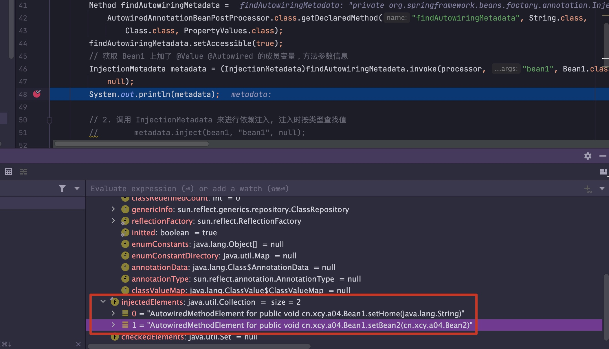
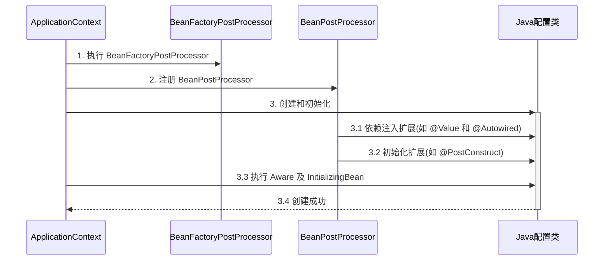
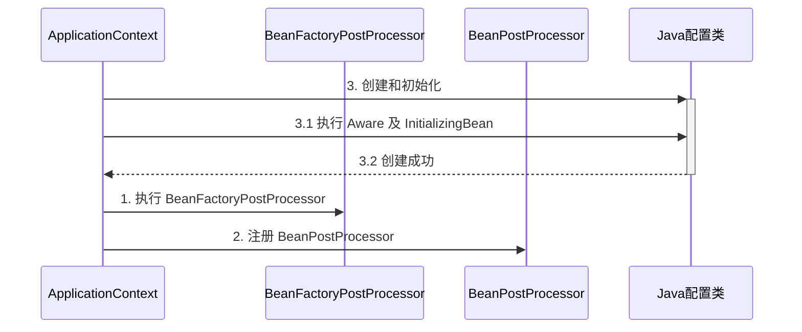
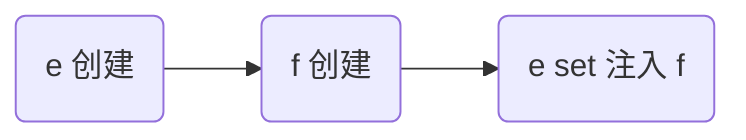
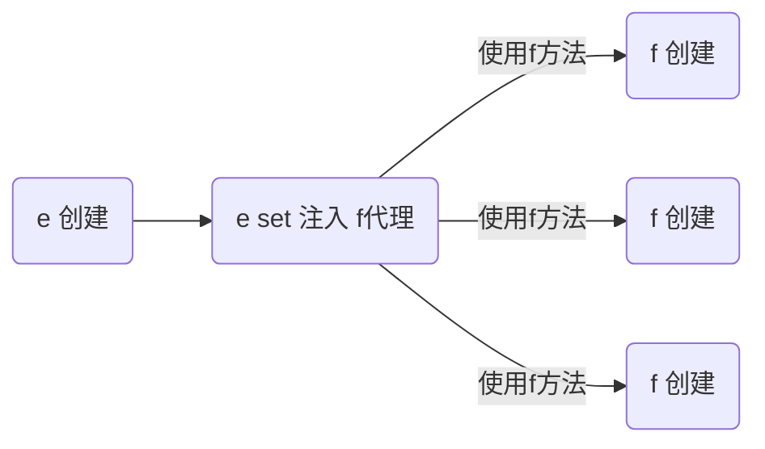

# Spring5：学习笔记

[课程地址](https://www.bilibili.com/video/BV1P44y1N7QG)

## 容器与Bean

### 01. 容器接口

> 完整代码在包：package cn.xyc.a01 下

BeanFactory 接口，典型功能有：getBean

ApplicationContext 接口，是 BeanFactory 的子接口。它扩展了 BeanFactory 接口的功能，如：

* 国际化
* 通配符方式获取一组 Resource 资源
* 整合 Environment 环境（能通过它获取各种来源的配置信息）
* 事件发布与监听，实现组件之间的解耦

可以看到，这里都是 BeanFactory 提供的基本功能，ApplicationContext 中的扩展功能都没有用到。

#### BeanFactory 与 ApplicationContext 的区别

首先的话创建一个SpringBoot的应用：

```java
package cn.xyc;


import lombok.extern.slf4j.Slf4j;
import org.springframework.boot.SpringApplication;
import org.springframework.boot.autoconfigure.SpringBootApplication;
import org.springframework.context.ConfigurableApplicationContext;

/**
 * BeanFactory 与 ApplicationContext 的区别
 */
@Slf4j
@SpringBootApplication
public class Class01Application {

    public static void main(String[] args) {

        ConfigurableApplicationContext context = SpringApplication.run(Class01Application.class, args);
    }
}
```

可以看到在SpringApplication.run后，我们获取到了一个容器ConfigurableApplicationContext，查看其类图：


可以看到 ConfigurableApplicationContext 继承自 ApplicationContext，而 ApplicationContext 又继承自 BeanFactory，**那到底什么是 BeanFactory？**

1. 它是 ApplicationContext 的父接口；

2. 它才是 Spring 的核心容器， 主要的 ApplicationContext 实现都 **组合** 了它的功能

   > 【组合】是指 ApplicationContext 的一个重要成员变量就是 BeanFactory

利用ApplicationContext从spring容器中获取bean：`context.getBean("ClassName");` 实则是调用了BeanFactory中的方法，BeanFactory的类结构如下：


在 Debug 模式下查看下 ConfigurableApplicationContext 中的内容（这里看到的是ConfigurableApplicationContext 的实现类 AnnotationConfigServletWebApplicationContext）：


可以看到其中包含了这个 BeanFactory 的子类 DefaultListableBeanFactory，下面有类图。

#### BeanFactory的功能

BeanFactory类结构：


**BeanFactory 能干点啥？**

1. 表面上只有 `getBean`；
2. 实际上控制反转、基本的依赖注入、直至 Bean 的生命周期的各种功能，都由它的实现类提供；

> 其实现类：DefaultListableBeanFactory，后续分析
>
> 

暂且不细看DefaultListableBeanFactory，查看类DefaultSingletonBeanRegistry中的成员变量：


```java
// 写个DEMO查看一下：拿出DefaultSingletonBeanRegistry类中的单例对象
Field singletonObjects = DefaultSingletonBeanRegistry.class.getDeclaredField("singletonObjects");
singletonObjects.setAccessible(true);
ConfigurableListableBeanFactory beanFactory = context.getBeanFactory();
Map<String, Object> map = (Map<String, Object>) singletonObjects.get(beanFactory);
map.forEach((k, v)->{
    System.out.println(k + "=" + v);
});
```

> 上面输出的类过多了，这里通过自己往Spring容器中放入对象来观察：
>
> class：cn.xyc.a01.Component1
>
> class：cn.xyc.a01.Component2
>
> ```java
> // main函数中找出这两个我们注入进去的类：
> Field singletonObjects = DefaultSingletonBeanRegistry.class.getDeclaredField("singletonObjects");
> singletonObjects.setAccessible(true);
> ConfigurableListableBeanFactory beanFactory = context.getBeanFactory();
> Map<String, Object> map = (Map<String, Object>) singletonObjects.get(beanFactory);
> 
> map.entrySet().stream().filter(e -> e.getKey().startsWith("component"))
> .forEach(e-> System.out.println(e.getKey() + "=" + e.getValue()));
> 
> // 输出结果：
> // component1=cn.xyc.Component1@45f24169
> // component2=cn.xyc.Component2@6ad5923a
> ```

#### ApplicationContext接口


**ApplicationContext 比 BeanFactory 多点啥？**ApplicationContext 多实现了四个接口：

**接口1：MessageSource: 国际化功能，支持多种语言**

> resource文件夹下搞点配置文件：
>
> * resource/messages.propertes，添加内容：空
> * resource/message_en.properties，添加内容：hi=hello
> * resource/messages_zh.properties，添加内容：hi=你好
> * resource/messages_ja.properties，添加内容：hi=こんにちは
>
> ```java
> System.out.println(context.getMessage("hi", null, Locale.CHINA));  // 输出：你好
> System.out.println(context.getMessage("hi", null, Locale.ENGLISH));  // 输出：Hello
> System.out.println(context.getMessage("hi", null, Locale.JAPANESE));  // 输出：こんにちは
> ```

**接口2：ResourcePatternResolver: 通配符匹配资源路径**

```java
// classpath:application.properties路径下的文件
Resource[] resources = context.getResources("classpath:application.properties");
for (Resource resource : resources) {
    System.out.println(resource);
}
// 输出如下：class path resource [application.properties]

Resource[] resources = context.getResources("classpath*:META-INF/spring.factories");
for (Resource resource : resources) {
    System.out.println(resource);
}
// 输出如下：
// URL [file:/C:/Users/ZhuCC/Desktop/Spring/SpringCode/spring_class_01/target/classes/META-INF/spring.factories]
// URL [jar:file:/C:/Software/Maven/repository/org/springframework/boot/spring-boot/2.6.4/spring-boot-2.6.4.jar!/META-INF/spring.factories]
// URL [jar:file:/C:/Software/Maven/repository/org/springframework/boot/spring-boot-autoconfigure/2.6.4/spring-boot-autoconfigure-2.6.4.jar!/META-INF/spring.factories]
// URL [jar:file:/C:/Software/Maven/repository/org/springframework/spring-beans/5.3.16/spring-beans-5.3.16.jar!/META-INF/spring.factories]
```

> 对上述`classpath*`加`*`与`不加*`的说明，不加就不会去jar包里搜索，机会搜索你工程目录下的内容，即不加的话仅输出：`class path resource [META-INF/spring.factories]`

**接口3：EnvironmentCapable: 环境信息，系统环境变量**，`*.properties`、`*.application.yml` 等配置文件中的值

```java
// 拿系统变量的信息
System.out.println(context.getEnvironment().getProperty("java_home"));
// 输出：C:\Software\Java\jdk1.8.0_241

// 拿配置文件中的信息
System.out.println(context.getEnvironment().getProperty("server.port"));
// 输出：8080
```

**接口4：ApplicationEventPublisher: 发布事件对象，用于解耦**

* **案例1**

```java
context.publishEvent(new UserRegisteredEvent(context));
// 启动后输出：
// [DEBUG] 15:17:41.451 [main] cn.xyc.Component2                   - 收到事件：cn.xyc.UserRegisteredEvent[source=org.springframework.boot.web.servlet.context.AnnotationConfigServletWebServerApplicationContext@3c947bc5, started on Sat Jul 23 15:17:40 CST 2022] 
```

> 事件来源，需要继承ApplicationEvent
>
> 见 cn.xyc.a01.UserRegisteredEvent 实现
> 
> 监听器：任何一个由Spring管理的组件都可以作为监听器，但需要定义一个处理事件的方法，参数类型为**用户注册事**件类的对象，方法头上需要加上@EventListener注解，这里选择Component2作为监听器，
> 
> 见 cn.xyc.a01.Component2 实现

* **案例2：**

```java
// main方法中获取Component1，调用注册方法
context.getBean(Component1.class).register();

// cn.xyc.a01.Component1#register，发布事件
context.publishEvent(new UserRegisteredEvent(this));

// 监听者还是cn.xyc.a01.Component2
```

> 日志输出：
> 
> ```java
> [DEBUG] 15:23:29.811 [main] cn.xyc.Component1                   - 用户注册 
> [DEBUG] 15:23:29.811 [main] cn.xyc.Component2                   - 收到事件：cn.xyc.UserRegisteredEvent[source=cn.xyc.Component1@1dab9dd6] 
> ```

#### 总结

BeanFactory 与 ApplicationContext 并不仅仅是简单接口继承的关系，ApplicationContext 组合并扩展了 BeanFactory 的功能（扩展实现）

又新学一种代码之间解耦途径

**练习**：完成用户注册与发送短信之间的解耦，用事件方式、和 AOP 方式分别实现

### 02. 容器实现

Spring 的发展历史较为悠久，因此很多资料还在讲解它较旧的实现，这里出于怀旧的原因，把它们都列出来，供参考

* DefaultListableBeanFactory，是 BeanFactory 最重要的实现，像**控制反转**和**依赖注入**功能，都是它来实现
* ClassPathXmlApplicationContext，从类路径查找 XML 配置文件，创建容器（旧）
* FileSystemXmlApplicationContext，从磁盘路径查找 XML 配置文件，创建容器（旧）
* XmlWebApplicationContext，传统 SSM 整合时，基于 XML 配置文件的容器（旧）
* AnnotationConfigWebApplicationContext，传统 SSM 整合时，基于 java 配置类的容器（旧）
* AnnotationConfigApplicationContext，SpringBoot 中非 web 环境容器（新）
* AnnotationConfigServletWebServerApplicationContext，SpringBoot 中 servlet web 环境容器（新）
* AnnotationConfigReactiveWebServerApplicationContext，SpringBoot 中 reactive web 环境容器（新）

另外要注意的是，后面这些带有 ApplicationContext 的类都是 ApplicationContext 接口的实现，但它们是**组合**了 DefaultListableBeanFactory 的功能，并非继承而来

#### BeanFactory实现的特点


DefaultListableBeanFactory类作为BeanFactory最为重要的实现，先看个例子：

见 cn.xyc.a02.TestBeanFactory

```java
/**
 * @author xiaochao
 * @date 2024/10/26 16:46
 */
public class TestBeanFactory {

    public static void main(String[] args) {
        DefaultListableBeanFactory beanFactory = new DefaultListableBeanFactory();
        // bean 的定义（class, scope, 初始化, 销毁）
        AbstractBeanDefinition beanDefinition =
            BeanDefinitionBuilder.genericBeanDefinition(Config.class).setScope("singleton").getBeanDefinition();
        beanFactory.registerBeanDefinition("config", beanDefinition);
        
        for (String name : beanFactory.getBeanDefinitionNames()) {
            System.out.println(name);
        }
    }

    @Configuration
    static class Config {
        @Bean
        public Bean1 bean1() {
            return new Bean1();
        }

        @Bean
        public Bean2 bean2() {
            return new Bean2();
        }

        @Bean
        public Bean3 bean3() {
            return new Bean3();
        }

        @Bean
        public Bean4 bean4() {
            return new Bean4();
        }
    }

    interface Inter {

    }

    static class Bean3 implements Inter {

    }

    static class Bean4 implements Inter {

    }

    static class Bean1 {
        private static final Logger log = LoggerFactory.getLogger(Bean1.class);

        public Bean1() {
            log.debug("构造 Bean1()");
        }

        @Autowired
        private Bean2 bean2;

        public Bean2 getBean2() {
            return bean2;
        }

        @Autowired
        @Resource(name = "bean4")
        private Inter bean3;

        public Inter getInter() {
            return bean3;
        }
    }

    static class Bean2 {
        private static final Logger log = LoggerFactory.getLogger(Bean2.class);

        public Bean2() {
            log.debug("构造 Bean2()");
        }
    }
}
```

上述输出仅输出：config，可见此时容器中仅有一个bean对象，可见@Configuration和@Bean注解并没有被解析，说明类DefaultListableBeanFactory的功能并不完整，**即@Configuration和@Bean注解对BeanFactory而言为拓展功能；**

继续添加内容：

```java
// 给 BeanFactory 添加一些常用的后处理器
AnnotationConfigUtils.registerAnnotationConfigProcessors(beanFactory);
```

> 再次执行，可见此时容器中bean多了：
>
> ```java
> config
> // BeanFactory后处理器，用于解析@Configuration，@Bean
> org.springframework.context.annotation.internalConfigurationAnnotationProcessor
> // bean后处理器，用于解析@Autowired注解
> org.springframework.context.annotation.internalAutowiredAnnotationProcessor
> // bean后处理器，用于解析@Resource注解
> org.springframework.context.annotation.internalCommonAnnotationProcessor
> org.springframework.context.event.internalEventListenerProcessor
> org.springframework.context.event.internalEventListenerFactory
> ```

继续在后面添加内容：

```java
// BeanFactory 后处理器主要功能，补充了一些 bean 定义
beanFactory.getBeansOfType(BeanFactoryPostProcessor.class).values().forEach(beanFactoryPostProcessor -> {
    beanFactoryPostProcessor.postProcessBeanFactory(beanFactory);
});
```

> 再次执行，
>
> ```java
> config
> org.springframework.context.annotation.internalConfigurationAnnotationProcessor
> org.springframework.context.annotation.internalAutowiredAnnotationProcessor
> org.springframework.context.annotation.internalCommonAnnotationProcessor
> org.springframework.context.event.internalEventListenerProcessor
> org.springframework.context.event.internalEventListenerFactory
> bean1  // 注解起作用，所定义的Bean都被注入了
> bean2
> ```

继续添加，在注入了bean1和bean2后，可以使用bean1&bean2了，如下：

```java
System.out.println(beanFactory.getBean(Bean1.class).getBean2());
// [DEBUG] 15:56:24.125 [main] cn.xyc.TestBeanFactory$Bean1        - 构造 Bean1() 
// null
```

上面可知，bean1被成功构造，但bean2却没有被@Autowired，**可知@Autowired对于BeanFactory而言也是拓展功能**；

继续添加后处理器：

```java
// Bean 后处理器, 针对 bean 的生命周期的各个阶段提供扩展, 例如 @Autowired @Resource ...
beanFactory.getBeansOfType(BeanPostProcessor.class).values().stream()
    .sorted(beanFactory.getDependencyComparator())
    .forEach(beanPostProcessor -> {
        System.out.println(">>>>" + beanPostProcessor);
        beanFactory.addBeanPostProcessor(beanPostProcessor);
    });
```

> 再次执行：`System.out.println(beanFactory.getBean(Bean1.class).getBean2());`
>
> ```java
> [DEBUG] 16:03:51.816 [main] cn.xyc.TestBeanFactory$Bean1        - 构造 Bean1() 
> [DEBUG] 16:03:51.826 [main] cn.xyc.TestBeanFactory$Bean2        - 构造 Bean2() 
> ```

关于Bean的创建时机，从上述输出来看，Bean对象都是在用的时候被创建的，但对于单例对象可以选择先创建：

```java
// 准备好所有单例
beanFactory.preInstantiateSingletons(); 
System.out.println(">>>>>>>>>>>>>>>>>>>>>>>>>>>>>>>>>>>> ");
System.out.println(beanFactory.getBean(Bean1.class).getInter());
```

> 输出如下：
>
> ```java
> [DEBUG] 16:07:20.584 [main] cn.xyc.TestBeanFactory$Bean1        - 构造 Bean1() 
> [DEBUG] 16:07:20.594 [main] cn.xyc.TestBeanFactory$Bean2        - 构造 Bean2() 
> >>>>>>>>>>>>>>>>>>>>>>>>>>>>>>>>>>>>  
> // 如果不加beanFactory.preInstantiateSingletons()的话，>>>>>>>>>会输出在构造函数前
> ```

**总结如下**

beanFactory 不会做的事

1. 不会主动调用 BeanFactory 后处理器（BeanFactoryPostProcessor）

   > 可参考：Spring学习-IOC-04. 基于xml的Spring应用-Spring的后处理器
2. 不会主动添加 Bean 后处理器（BeanPostProcessor）

   > 可参考：Spring学习-IOC-04. 基于xml的Spring应用-Spring的后处理器
3. 不会主动初始化单例
4. 不会解析beanFactory 还不会解析 `${ }` 与 `#{ }`

bean 后处理器会有排序的逻辑

> 重新定义下类内容：
>
> ```java
> @Configuration
> static class Config {
>     @Bean
>     public Bean1 bean1() {
>         return new Bean1();
>     }
> 
>     @Bean
>     public Bean2 bean2() {
>         return new Bean2();
>     }
> 
>     @Bean
>     public Bean3 bean3() {
>         return new Bean3();
>     }
> 
>     @Bean
>     public Bean4 bean4() {
>         return new Bean4();
>     }
> }
> 
> static class Bean1 {
>     private static final Logger log = LoggerFactory.getLogger(Bean1.class);
> 
>     public Bean1() {
>         log.debug("构造 Bean1()");
>     }
> 
>     @Autowired
>     @Getter
>     private Bean2 bean2;
> 
>     @Autowired
>     @Getter
>     private Inter inter;
> }
> 
> static class Bean2 {
>     private static final Logger log = LoggerFactory.getLogger(Bean2.class);
> 
>     public Bean2() {
>         log.debug("构造 Bean2()");
>     }
> }
> 
> interface Inter {
> }
> 
> static class Bean3 implements Inter {
> }
> 
> static class Bean4 implements Inter {
> }
> ```
>
> 情景1：是否能注入成功？**不能！Bean3&Bean4都实现了Inter，因此@Autowired无法区分**
>
> ```java
> // class:Bean1
> @Autowired
> private Inter inter;
> ```
>
> 情景2：是否能注入成功？**可以注入成功，@Autowired注入时当类型相同时，还会按照成员变量的名字区分**
>
> ```java
> // class:Bean1
> @Autowired
> private Inter bean3;
> 
> public Inter getInter() {
>     return bean3;
> }
> // 验证下：System.out.println(beanFactory.getBean(Bean1.class).getInter());
> // cn.xyc.TestBeanFactory$Bean3@9225652
> ```
>
> 情景3：`@Resource`注解，基本和`@Autowired`相同
>
> ```java
> @Resource(name = "bean4")
> private Inter bean3;
> 
> // 验证下：System.out.println(beanFactory.getBean(Bean1.class).getInter());
> // cn.xyc.TestBeanFactory$Bean4@6a28ffa4
> ```
>
> 情景4：同时加上`@Autowired`注解和`@Resource`注解
>
> ```java
> @Autowired  // 应该会匹配到bena3
> @Resource(name = "bean4")  // 应该会匹配到bena4
> private Inter bean3;
> // 输出：cn.xyc.TestBeanFactory$Bean3@1700915
> ```
>
> 那情景4中为什么注入的是Bean3呢？**这就涉及到了Bean后处理器加入的顺序**：
>
> ```java
> // BeanFactory 的加入顺序如下
> beanFactory.getBeansOfType(BeanPostProcessor.class).values().forEach(beanPostProcessor -> {
>  System.out.println(beanPostProcessor);
>  beanFactory.addBeanPostProcessor(beanPostProcessor);
> });
> 
> // 输出如下：可以看到是Autowired后处理器先加进来的
> // org.springframework.beans.factory.annotation.AutowiredAnnotationBeanPostProcessor@7ee955a8
> // org.springframework.context.annotation.CommonAnnotationBeanPostProcessor@1677d1
> ```
>
> 控制注入的先后：
>
> ```java
> beanFactory.getBeansOfType(BeanPostProcessor.class).values().stream()
>  .sorted(beanFactory.getDependencyComparator())
>  .forEach(beanPostProcessor -> {
>      System.out.println(beanPostProcessor);
>      beanFactory.addBeanPostProcessor(beanPostProcessor);
>  });
> 
> // 输出：这回是CommonAnnotationBean先被注入，可以看到@Resource注解起作用了，注入的是Bean4对象
> // org.springframework.context.annotation.CommonAnnotationBeanPostProcessor@730d2164
> // org.springframework.beans.factory.annotation.AutowiredAnnotationBeanPostProcessor@24959ca4
> // cn.xyc.TestBeanFactory$Bean4@2a7ed1f
> ```
>
> 这里关于如何排序的内容不再展开：
>
> ```java
> System.out.println("Common:" + (Ordered.LOWEST_PRECEDENCE - 3));
> System.out.println("Autowired:" + (Ordered.LOWEST_PRECEDENCE - 2));
> ```

#### 常见ApplicationContext接口

##### ClassPathXmlApplicationContext

ClassPathXmlApplicationContext，从类路径查找 XML 配置文件，创建容器

**创建配置文件**

```xml
<?xml version="1.0" encoding="UTF-8"?>
<beans xmlns="http://www.springframework.org/schema/beans"
       xmlns:xsi="http://www.w3.org/2001/XMLSchema-instance"
       xsi:schemaLocation="http://www.springframework.org/schema/beans http://www.springframework.org/schema/beans/spring-beans.xsd">

    <!-- 控制反转, 让 bean1 被 Spring 容器管理 -->
    <bean id="bean1" class="cn.xyc.Class02Application.Bean1"/>

    <!-- 控制反转, 让 bean2 被 Spring 容器管理 -->
    <bean id="bean2" class="cn.xyc.Class02Application.Bean2">
        <!-- 依赖注入, 建立与 bean1 的依赖关系 -->
        <property name="bean1" ref="bean1"/>
    </bean>
</beans>
```

**Bean类定义：**

```java
static class Bean1 { }

static class Bean2 {
    @Setter
    @Getter
    private Bean1 bean1;
}
```

**测试函数：**

```java
package cn.xyc;

import lombok.Getter;
import lombok.Setter;
import org.slf4j.Logger;
import org.slf4j.LoggerFactory;
import org.springframework.context.support.ClassPathXmlApplicationContext;

/**
 * 常见 ApplicationContext 实现
 */
public class Class02Application {

    private static final Logger log = LoggerFactory.getLogger(Class02Application.class);

    public static void main(String[] args) {
        testClassPathXmlApplicationContext();
    }

    // 较为经典的容器, 基于 classpath 下 xml 格式的配置文件来创建
    private static void testClassPathXmlApplicationContext() {
        ClassPathXmlApplicationContext context =
                new ClassPathXmlApplicationContext("Class02Applicaiton.xml");

        for (String name : context.getBeanDefinitionNames()) {
            System.out.println(name);
        }

        System.out.println(context.getBean(Bean2.class).getBean1());
    }
}

// 输出如下：
// org.springframework.context.annotation.CommonAnnotationBeanPostProcessor@1677d1
// org.springframework.beans.factory.annotation.AutowiredAnnotationBeanPostProcessor@48fa0f47
// [DEBUG] 16:46:05.111 [main] cn.xyc.TestBeanFactory$Bean1        - 构造 Bean1() 
// [DEBUG] 16:46:05.123 [main] cn.xyc.TestBeanFactory$Bean2        - 构造 Bean2() 
// cn.xyc.TestBeanFactory$Bean4@21de60b4
```

ClassPathXmlApplicationContext内部干了啥？

```java
DefaultListableBeanFactory beanFactory = new DefaultListableBeanFactory();
System.out.println("读取之前...");
for (String name : beanFactory.getBeanDefinitionNames()) {
    System.out.println(name);
}
System.out.println("读取之后...");
XmlBeanDefinitionReader reader = new XmlBeanDefinitionReader(beanFactory);
reader.loadBeanDefinitions(new ClassPathResource("Class02Applicaiton.xml"));
for (String name : beanFactory.getBeanDefinitionNames()) {
    System.out.println(name);
}

-- 输出内容：
// 读取之前...  (可以看到这里没有内容)
// 读取之后...  (可以看到在读取之后存在内容了)
// bean1
// bean2
```

##### FileSystemXmlApplicationContext

FileSystemXmlApplicationContext，从磁盘路径查找 XML 配置文件，创建容器（旧）

测试代码

```java
// 基于磁盘路径下 xml 格式的配置文件来创建
private static void testFileSystemXmlApplicationContext() {
    FileSystemXmlApplicationContext context =
        new FileSystemXmlApplicationContext(
        "src\\main\\resources\\Class02Applicaiton.xml");
    for (String name : context.getBeanDefinitionNames()) {
        System.out.println(name);
    }

    System.out.println(context.getBean(Bean2.class).getBean1());
}
```

FileSystemXmlApplicationContext内部干了啥？

```java
DefaultListableBeanFactory beanFactory = new DefaultListableBeanFactory();
System.out.println("读取之前...");
for (String name : beanFactory.getBeanDefinitionNames()) {
    System.out.println(name);
}
System.out.println("读取之后...");
XmlBeanDefinitionReader reader = new XmlBeanDefinitionReader(beanFactory);
reader.loadBeanDefinitions(new FileSystemResource("src\\main\\resources\\Class02Applicaiton.xml"));
for (String name : beanFactory.getBeanDefinitionNames()) {
    System.out.println(name);
}
```

> 这里注意运行时工作目录的设置

##### AnnotationConfigApplicationContext

AnnotationConfigApplicationContext，SpringBoot 中非 web 环境容器

测试代码

```java
// 较为经典的容器, 基于 java 配置类来创建
private static void testAnnotationConfigApplicationContext() {
    AnnotationConfigApplicationContext context =
        new AnnotationConfigApplicationContext(Config.class);

    for (String name : context.getBeanDefinitionNames()) {
        System.out.println(name);
    }

    System.out.println(context.getBean(Bean2.class).getBean1());
}
```

其中Config类，见：cn.xyc.a02.A02.Config

输出如下：

```java
org.springframework.context.annotation.internalConfigurationAnnotationProcessor
org.springframework.context.annotation.internalAutowiredAnnotationProcessor
org.springframework.context.annotation.internalCommonAnnotationProcessor
org.springframework.context.event.internalEventListenerProcessor
org.springframework.context.event.internalEventListenerFactory
class02Application.Config
bean1
bean2
cn.xyc.Class02Application$Bean1@368f2016
```

> 可以看到容器中默认加了很多的处理器，其实这些就等价于在xml配置文件中的`<context:annotation-config/>`，如下：在配置文件中加入`<context:annotation-config/>`，再次执行方法`testClassPathXmlApplicationContext();`，输出如下：
>
> ```java
> bean1
> bean2
> org.springframework.context.annotation.internalConfigurationAnnotationProcessor
> org.springframework.context.annotation.internalAutowiredAnnotationProcessor
> org.springframework.context.annotation.internalCommonAnnotationProcessor
> org.springframework.context.event.internalEventListenerProcessor
> org.springframework.context.event.internalEventListenerFactory
> cn.xyc.Class02Application$Bean1@1f3f4916
> ```
>
> 对比之前没有加这个配置项的输出，可以明显发现这里多加了几个处理器。

##### AnnotationConfigServletWebServerApplicationContext

AnnotationConfigServletWebServerApplicationContext，SpringBoot 中 servlet web 环境容器（新）

测试代码

```java
// 较为经典的容器, 基于 java 配置类来创建, 用于 web 环境
private static void testAnnotationConfigServletWebServerApplicationContext() {
    AnnotationConfigServletWebServerApplicationContext context =
        new AnnotationConfigServletWebServerApplicationContext(WebConfig.class);
    for (String name : context.getBeanDefinitionNames()) {
        System.out.println(name);
    }
}
```

其中WebConfig见：cn.xyc.a02.A02.WebConfig

#### 常见容器总结

常见的 ApplicationContext 容器实现；

内嵌容器、DispatcherServlet 的创建方法、作用

### 03. Bean的生命周期

一个受 Spring 管理的 bean，生命周期主要阶段有

**创建**：根据 bean 的构造方法或者工厂方法来创建 bean 实例对象；

**依赖注入**：根据 @Autowired，@Value 或其它一些手段，为 bean 的成员变量填充值、建立关系

**初始化**：回调各种 Aware 接口，调用对象的各种初始化方法

**销毁**：在容器关闭时，会销毁所有单例对象（即调用它们的销毁方法），prototype 对象也能够销毁，不过需要容器这边主动调用

> 一些资料会提到，生命周期中还有一类 bean 后处理器：BeanPostProcessor，会在 bean 的初始化的前后，提供一些扩展逻辑。但这种说法是不完整的，见下方内容；

#### Bean的生命周期

准备代码：cn.xyc.a03.A03

```java
/*
    bean 的生命周期, 以及 bean 后处理器

    学到了什么
        a. Spring bean 生命周期各个阶段
        b. 模板设计模式, 大流程已经固定好了, 通过接口回调(bean 后处理器)扩展
 */
@SpringBootApplication
public class A03 {
    public static void main(String[] args) {
        ConfigurableApplicationContext context = SpringApplication.run(A03.class, args);
        context.close();
    }
}
```

准备一个放入容器中的类：cn.xyc.a03.LifeCycleBean

```java
@Component
public class LifeCycleBean {
    private static final Logger log = LoggerFactory.getLogger(LifeCycleBean.class);

    public LifeCycleBean() {
        log.debug("构造");
    }

    @Autowired
    public void autowire(@Value("${JAVA_HOME}") String home) {
        log.debug("依赖注入: {}", home);
    }

    @PostConstruct
    public void init() {
        log.debug("初始化");
    }

    @PreDestroy
    public void destroy() {
        log.debug("销毁");
    }
}
```

验证执行顺序：

```java
[DEBUG] 16:38:04.322 [main] cn.xyc.LifeCycleBean                - 构造函数 
[DEBUG] 16:38:04.327 [main] cn.xyc.LifeCycleBean                - 依赖注入: C:\Software\Java\jdk1.8.0_241 
[DEBUG] 16:38:04.328 [main] cn.xyc.LifeCycleBean                - 初始化 
[DEBUG] 16:38:04.629 [main] cn.xyc.LifeCycleBean                - 销毁
```

**bean的后处理器**：cn.xyc.a03.MyBeanPostProcessor

```java
@Component
public class MyBeanPostProcessor implements InstantiationAwareBeanPostProcessor, DestructionAwareBeanPostProcessor {

    private static final Logger log = LoggerFactory.getLogger(MyBeanPostProcessor.class);

    @Override
    public Object postProcessBeforeInstantiation(Class<?> beanClass, String beanName) throws BeansException {
        if (beanName.equals("lifeCycleBean"))
            log.debug("<<<<<< 实例化之前执行, 这里返回的对象会替换掉原本的 bean");
        return null;
    }

    @Override
    public boolean postProcessAfterInstantiation(Object bean, String beanName) throws BeansException {
        if (beanName.equals("lifeCycleBean")) {
            log.debug("<<<<<< 实例化之后执行, 这里如果返回 false 会跳过依赖注入阶段");
            //            return false;
        }
        return true;
    }

    @Override
    public PropertyValues postProcessProperties(PropertyValues pvs, Object bean, String beanName) throws BeansException {
        if (beanName.equals("lifeCycleBean"))
            log.debug("<<<<<< 依赖注入阶段执行, 如 @Autowired、@Value、@Resource");
        return pvs;
    }

    @Override
    public Object postProcessBeforeInitialization(Object bean, String beanName) throws BeansException {
        if (beanName.equals("lifeCycleBean"))
            log.debug("<<<<<< 初始化之前执行, 这里返回的对象会替换掉原本的 bean, 如 @PostConstruct、@ConfigurationProperties");
        return bean;
    }

    @Override
    public Object postProcessAfterInitialization(Object bean, String beanName) throws BeansException {
        if (beanName.equals("lifeCycleBean"))
            log.debug("<<<<<< 初始化之后执行, 这里返回的对象会替换掉原本的 bean, 如代理增强");
        return bean;
    }

    @Override
    public void postProcessBeforeDestruction(Object bean, String beanName) throws BeansException {
        if (beanName.equals("lifeCycleBean"))
            log.debug("<<<<<< 销毁之前执行, 如 @PreDestroy");
    }
}
```

> 其中：`InstantiationAwareBeanPostProcessor`，`DestructionAwareBeanPostProcessor`，都继承自：`BeanPostProcessor`

运行main方法，输出如下：

```java
[DEBUG] 16:49:42.828 [main] cn.xyc.MyBeanPostProcessor          - <<<<<< 实例化之前执行, 这里返回的对象会替换掉原本的 bean 
[DEBUG] 16:49:42.829 [main] cn.xyc.LifeCycleBean                - 构造函数 
[DEBUG] 16:49:42.831 [main] cn.xyc.MyBeanPostProcessor          - <<<<<< 实例化之后执行, 这里如果返回 false 会跳过依赖注入阶段 
[DEBUG] 16:49:42.831 [main] cn.xyc.MyBeanPostProcessor          - <<<<<< 依赖注入阶段执行, 如 @Autowired、@Value、@Resource 
[DEBUG] 16:49:42.833 [main] cn.xyc.LifeCycleBean                - 依赖注入: C:\Software\Java\jdk1.8.0_241 
[DEBUG] 16:49:42.834 [main] cn.xyc.MyBeanPostProcessor          - <<<<<< 初始化之前执行, 这里返回的对象会替换掉原本的 bean, 如 @PostConstruct、@ConfigurationProperties 
[DEBUG] 16:49:42.834 [main] cn.xyc.LifeCycleBean                - 初始化 
[DEBUG] 16:49:42.834 [main] cn.xyc.MyBeanPostProcessor          - <<<<<< 初始化之后执行, 这里返回的对象会替换掉原本的 bean, 如代理增强 
[DEBUG] 16:49:43.075 [main] cn.xyc.MyBeanPostProcessor          - <<<<<< 销毁之前执行, 如 @PreDestroy 
[DEBUG] 16:49:43.076 [main] cn.xyc.LifeCycleBean                - 销毁 
```

**收获**

1. Spring bean 生命周期各个阶段
2. 模板设计模式，指大流程已经固定好了，通过接口回调（bean 后处理器）在一些关键点前后提供扩展

#### 模版设计模式

**提高现有代码的扩展能力。**

初始实现：实现Bean工厂

```java
package cn.xyc;

public class TestMethodTemplate {

    public static void main(String[] args) {
        MyBeanFactory beanFactory = new MyBeanFactory();
        beanFactory.getBean();
    }

    // 模板方法  Template Method Pattern
    static class MyBeanFactory {
        public Object getBean() {
            Object bean = new Object();
            System.out.println("构造 " + bean);
            System.out.println("依赖注入 " + bean);
            // 后续要支持： @Autowired, @Resource
            System.out.println("初始化 " + bean);
            return bean;
        }
    }
}
```

问题：扩展性比较弱；优化如下，先来实现一个接口：

```java
static interface BeanPostProcessor {
    // 对依赖注入阶段的扩展
    public void inject(Object bean); 
}
```

修改原先代码：对固定不变的内容写在方法中（**静态部分**），对有变化的内容改成接口（**动态部分**）：

```java
// 模板方法  Template Method Pattern
static class MyBeanFactory {
    
    private List<BeanPostProcessor> processors = new ArrayList<>();

	public void addBeanPostProcessor(BeanPostProcessor processor) {
        processors.add(processor);
    }
    
    public Object getBean() {
        Object bean = new Object();
        System.out.println("构造 " + bean);
        System.out.println("依赖注入 " + bean); 
        // 后续要支持： @Autowired, @Resource
        for (BeanPostProcessor processor : processors) {
            processor.inject(bean);
        }
        System.out.println("初始化 " + bean);
        return bean;
    }
   
}
```

修改main方法：

```java
public static void main(String[] args) {
    MyBeanFactory beanFactory = new MyBeanFactory();
    beanFactory.addBeanPostProcessor(processer -> System.out.println("解析 @Autowired"));
    beanFactory.addBeanPostProcessor(processer -> System.out.println("解析 @Resource"));
    beanFactory.getBean();
}
```

执行输出如下：

```java
构造 java.lang.Object@4783da3f
依赖注入 java.lang.Object@4783da3f
解析 @Autowired
解析 @Resource
初始化 java.lang.Object@4783da3f
```

此时代码的扩展性就较强，当需要加扩展功能时，getBean 方法无需改动。

### 04. Bean后处理器

#### Bean后处理器作用

为Bean生命周期各个阶段提供扩展

测试代码构建：

```java
package cn.xyc;

import org.springframework.boot.autoconfigure.SpringBootApplication;
import org.springframework.context.support.GenericApplicationContext;

public class Class04Application {

    public static void main(String[] args) {

        // GenericApplicationContext 是一个【干净】的容器
        GenericApplicationContext context = new GenericApplicationContext();

        // 用原始方法注册三个 bean
        context.registerBean("bean1", Bean1.class);
        context.registerBean("bean2", Bean2.class);
        context.registerBean("bean3", Bean3.class);

        // 初始化容器
        context.refresh(); // 执行beanFactory后处理器, 添加bean后处理器, 初始化所有单例

        // 销毁容器
        context.close();
    }
}
```

其中：cn.xyc.a04.Bean1、cn.xyc.a04.Bean2、cn.xyc.a04.Bean3

```java
public class Bean1 {
    private static final Logger log = LoggerFactory.getLogger(Bean1.class);

    private Bean2 bean2;

    @Autowired
    public void setBean2(Bean2 bean2) {
        log.debug("@Autowired 生效: {}", bean2);
        this.bean2 = bean2;
    }

    private Bean3 bean3;

    @Resource
    public void setBean3(Bean3 bean3) {
        log.debug("@Resource 生效: {}", bean3);
        this.bean3 = bean3;
    }

    private String home;

    @Autowired
    public void setHome(@Value("${JAVA_HOME}") String home) {
        log.debug("@Value 生效: {}", home);
        this.home = home;
    }

    @PostConstruct
    public void init() {
        log.debug("@PostConstruct 生效");
    }

    @PreDestroy
    public void destroy() {
        log.debug("@PreDestroy 生效");
    }

    @Override
    public String toString() {
        return "Bean1{" +
            "bean2=" + bean2 +
            ", bean3=" + bean3 +
            ", home='" + home + '\'' +
            '}';
    }
}

public class Bean2 {
}

public class Bean3 {
}
```

执行main方法后，并无Bean被注入的输出内容；

继续往context中加入内容：

```java
context.getDefaultListableBeanFactory().setAutowireCandidateResolver(new ContextAnnotationAutowireCandidateResolver());
// 在依赖注入阶段解析@Autowired @Value
context.registerBean(AutowiredAnnotationBeanPostProcessor.class);
```

执行main方法，输出如下：

```java
[DEBUG] 18:00:40.209 [main] cn.xyc.Bean1     - @Autowired 生效: cn.xyc.Bean2@7fe8ea47 
[DEBUG] 18:00:40.221 [main] cn.xyc.Bean1     - @Value 生效: C:\Software\Java\jdk1.8.0_241 
```

继续添加后处理器：

```java
// 在依赖注入前解析@Resource 初始化前解析@PostConstruct 销毁前解析@PreDestroy
context.registerBean(CommonAnnotationBeanPostProcessor.class);
```

执行main方法，输出如下：

```java
[DEBUG] 18:01:05.439 [main] cn.xyc.Bean1       - @Resource 生效: cn.xyc.Bean3@3b2c72c2 
[DEBUG] 18:01:05.446 [main] cn.xyc.Bean1       - @Autowired 生效: cn.xyc.Bean2@145eaa29 
[DEBUG] 18:01:05.455 [main] cn.xyc.Bean1       - @Value 生效: C:\Software\Java\jdk1.8.0_241 
[DEBUG] 18:01:05.455 [main] cn.xyc.Bean1       - @PostConstruct 生效 
[DEBUG] 18:01:05.460 [main] cn.xyc.Bean1       - @PreDestroy 生效 
```

> 看下上面的输出顺序：@Resource 先生效再生效 @Autowired，因为这里CommonAnnotationBeanPostProcessor 排在 AutowiredAnnotationBeanPostProcessor 前面

再看下 SpringBoot 中的后处理器：添加 cn.xyc.a04.Bean4

让容器中放入 Bean4.class

```java
@ConfigurationProperties(prefix = "java")
public class Bean4 {

    private String home;

    private String version;

    public String getHome() {
        return home;
    }

    public void setHome(String home) {
        this.home = home;
    }

    public String getVersion() {
        return version;
    }

    public void setVersion(String version) {
        this.version = version;
    }

    @Override
    public String toString() {
        return "Bean4{" +
            "home='" + home + '\'' +
            ", version='" + version + '\'' +
            '}';
    }
}
```

放入后获取下是否注入：

```java
context.registerBean("bean4", Bean4.class);
// ...
System.out.println(context.getBean(Bean4.class));
// 输出如下：Bean4(home=null, version=null)
```

加上后处理器，注册，再次测试，代码如下：

```java
// Springboot的一个后处理器，使得注解@ConfigurationProperties注解起作用，在初始化前解析
ConfigurationPropertiesBindingPostProcessor.register(context.getDefaultListableBeanFactory());
// ...
System.out.println(context.getBean(Bean4.class));
// 输出如下：Bean4{home='/Library/Java/JavaVirtualMachines/jdk1.8.0_311.jdk/Contents/Home/jre', version='1.8.0_311'}
```

**收获**

@Autowired 等注解的解析属于 bean 生命周期阶段（依赖注入, 初始化）的扩展功能，这些扩展功能由 bean 后处理器（BeanPostProcessor）来完成

每个后处理器各自增强什么功能
* AutowiredAnnotationBeanPostProcessor 解析 @Autowired 与 @Value
* CommonAnnotationBeanPostProcessor 解析 @Resource、@PostConstruct、@PreDestroy
* ConfigurationPropertiesBindingPostProcessor 解析 @ConfigurationProperties

另外 ContextAnnotationAutowireCandidateResolver 负责获取 @Value 的值，解析 @Qualifier、泛型、@Lazy 等

#### 常见的后处理器

**@Autowired bean 后处理器运行分析**

```java
/**
 * AutowiredAnnotationBeanPostProcessor 运行分析
 */
public class DigInAutowired {
    public static void main(String[] args) throws Throwable {
        DefaultListableBeanFactory beanFactory = new DefaultListableBeanFactory();
        // registerSingleton方法，会跳过创建过程,依赖注入,初始化过程，直接把beng放入beanFactory
        beanFactory.registerSingleton("bean2", new Bean2());
        beanFactory.registerSingleton("bean3", new Bean3());
        // 支持获取@Value中的值
        beanFactory.setAutowireCandidateResolver(new ContextAnnotationAutowireCandidateResolver());
        // ${} 的解析器
        beanFactory.addEmbeddedValueResolver(new StandardEnvironment()::resolvePlaceholders);

        AutowiredAnnotationBeanPostProcessor processor = new AutowiredAnnotationBeanPostProcessor();
        processor.setBeanFactory(beanFactory);

        Bean1 bean1 = new Bean1();
        System.out.println(bean1);
        /*// 输出：Bean1{bean2=null, bean3=null, home='null'}，可以看到注解未生效
        // 执行依赖注入 @Autowired @Value
        processor.postProcessProperties(null, bean1, "bean1");
        System.out.println(bean1);
        // 输出：Bean1{bean2=cn.xcy.a04.Bean2@4fcd19b3, bean3=null, home='/Library/Java/JavaVirtualMachines/jdk1.8.0_311.jdk/Contents/Home'}
        // 可以看到@Autowired @Value生效了，但是@Resource未生效*/

        // 0. 对 processor.postProcessProperties(null, bean1, "bean1"); 进行分解
        // 1. 查找哪些属性、方法加了 @Autowired, 这称之为 InjectionMetadata
        Method findAutowiringMetadata =
            AutowiredAnnotationBeanPostProcessor.class.getDeclaredMethod("findAutowiringMetadata", String.class,
                Class.class, PropertyValues.class);
        findAutowiringMetadata.setAccessible(true);
        // 获取 Bean1 上加了 @Value @Autowired 的成员变量，方法参数信息
        InjectionMetadata metadata = (InjectionMetadata)findAutowiringMetadata.invoke(processor, "bean1", Bean1.class,
            null);
        System.out.println(metadata);

        // 2. 调用 InjectionMetadata 来进行依赖注入, 注入时按类型查找值
        metadata.inject(bean1, "bean1", null);
        System.out.println(bean1);
        // 输出：Bean1{bean2=cn.xcy.a04.Bean2@376b4233, bean3=null, home='/Library/Java/JavaVirtualMachines/jdk1.8.0_311.jdk/Contents/Home'}

        // 3. 如何按类型查找值（先在Bean1对象中，往Bean3对象也加上@Autowired注解
        // @Autowired
        // private Bean3 bean3;
        Field bean3 = Bean1.class.getDeclaredField("bean3");
        DependencyDescriptor dd1 = new DependencyDescriptor(bean3, false);
        Object o1 = beanFactory.doResolveDependency(dd1, null, null, null);
        System.out.println(o1);

        Method setBean2 = Bean1.class.getDeclaredMethod("setBean2", Bean2.class);
        DependencyDescriptor dd2 = new DependencyDescriptor(new MethodParameter(setBean2, 0), true);
        Object o2 = beanFactory.doResolveDependency(dd2, null, null, null);
        System.out.println(o2);

        Method setHome = Bean1.class.getDeclaredMethod("setHome", String.class);
        DependencyDescriptor dd3 = new DependencyDescriptor(new MethodParameter(setHome, 0), true);
        Object o3 = beanFactory.doResolveDependency(dd3, null, null, null);
        System.out.println(o3);

    }
}
```

> 查找哪些属性、方法加了 @Autowired， 这称之为 InjectionMetadata
>
> 

**收获**

1. `AutowiredAnnotationBeanPostProcessor.findAutowiringMetadata()` 用来获取某个 bean 上加了 @Value 、@Autowired 的成员变量，方法参数的信息，表示为 InjectionMetadata
2. InjectionMetadata 可以完成依赖注入
3. InjectionMetadata 内部根据成员变量，方法参数封装为 DependencyDescriptor 类型
4. 有了 DependencyDescriptor，就可以利用 `beanFactory.doResolveDependency` 方法进行基于类型的查找

### 05 BeanFactory 后处理器

#### BeanFactory 后处理器的作用

ConfigurationClassPostProcessor 可以解析以下注解

* @ComponentScan
* @Bean
* @Import
* @ImportResource

示例代码：

```java
public class A05 {
    private static final Logger log = LoggerFactory.getLogger(A05.class);

    public static void main(String[] args) throws IOException {

        // ⬇️GenericApplicationContext 是一个【干净】的容器
        GenericApplicationContext context = new GenericApplicationContext();
        context.registerBean("config", Config.class);
        // 类ConfigurationClassPostProcessor解析了注解：@ComponentScan @Bean @Import @ImportResource
        context.registerBean(ConfigurationClassPostProcessor.class);
        // 类MapperScannerConfigurer可以解析注解@Mapper
        context.registerBean(MapperScannerConfigurer.class, bd -> { 
            // @MapperScanner
            bd.getPropertyValues().add("basePackage", "cn.xyc.a05.mapper");
        });

        // ⬇️初始化容器
        context.refresh();

        for (String name : context.getBeanDefinitionNames()) {
            System.out.println(name);
        }

        // ⬇️销毁容器
        context.close();
    }
}
```

config类：cn.xyc.a05.Config

```java
@Configuration
@ComponentScan("cn.xyc.a05.component")
public class Config {

    @Bean
    public Bean1 bean1() {
        return new Bean1();
    }

    public Bean2 bean2() {
        return new Bean2();
    }

    @Bean
    public SqlSessionFactoryBean sqlSessionFactoryBean(DataSource dataSource) {
        SqlSessionFactoryBean sqlSessionFactoryBean = new SqlSessionFactoryBean();
        sqlSessionFactoryBean.setDataSource(dataSource);
        return sqlSessionFactoryBean;
    }

    @Bean(initMethod = "init")
    public DruidDataSource dataSource() {
        DruidDataSource dataSource = new DruidDataSource();
        dataSource.setUrl("jdbc:mysql://localhost:3306/test");
        dataSource.setUsername("root");
        dataSource.setPassword("root");
        return dataSource;
    }
}
```

Bean1/Bean2：cn.xyc.a05.Bean1、cn.xyc.a05.component.Bean2

```java
public class Bean1 {

    private static final Logger log = LoggerFactory.getLogger(Bean1.class);

    public Bean1() {
        log.debug("我被 Spring 管理啦");
    }
}

@Component
public class Bean2 {

    private static final Logger log = LoggerFactory.getLogger(Bean2.class);

    public Bean2() {
        log.debug("bean2 我被 Spring 管理啦");
    }
}
```

Mapper1/Mapper2：cn.xyc.a05.mapper.Mapper1、cn.xyc.a05.mapper.Mapper2

```java
/**
 * @author xiaochao
 * @date 2024/11/9 15:14
 */
@Mapper
public interface Mapper1 {
}

/**
 * @author xiaochao
 * @date 2024/11/9 15:14
 */
@Mapper
public interface Mapper2 {
}
```

输出：

```
config
org.springframework.context.annotation.ConfigurationClassPostProcessor
org.mybatis.spring.mapper.MapperScannerConfigurer
bean2
bean3
bean1
sqlSessionFactoryBean
dataSource
mapper1
mapper2
org.springframework.context.annotation.internalConfigurationAnnotationProcessor
org.springframework.context.annotation.internalAutowiredAnnotationProcessor
org.springframework.context.annotation.internalCommonAnnotationProcessor
org.springframework.context.event.internalEventListenerProcessor
org.springframework.context.event.internalEventListenerFactory
```

**收获**

1. @ComponentScan， @Bean， @Mapper 等注解的解析属于核心容器（即 BeanFactory）的扩展功能
2. 这些扩展功能由不同的 BeanFactory 后处理器来完成，其实主要就是补充了一些 bean 定义

#### 模拟解析 @ComponentScan

模拟解析的类注册到Spring容器：`context.registerBean(ComponentScanPostProcessor.class);`

Bean2/Bean3/Bean4类见：cn.xyc.a05.component.Bean2、cn.xyc.a05.component.Bean3、cn.xyc.a05.component.Bean4

通过实现类：BeanDefinitionRegistryPostProcessor（cn.xyc.a05.ComponentScanPostProcessor） 完成

```java
/**
 * @author xiaochao
 * @date 2024/11/9 16:13
 */
public class ComponentScanPostProcessor implements BeanDefinitionRegistryPostProcessor {
    @Override
    public void postProcessBeanDefinitionRegistry(BeanDefinitionRegistry beanDefinitionRegistry) throws BeansException {

        try {

            ComponentScan annotation = AnnotationUtils.findAnnotation(Config.class, ComponentScan.class);
            if (annotation != null) {
                CachingMetadataReaderFactory factory = new CachingMetadataReaderFactory();
                AnnotationBeanNameGenerator generator = new AnnotationBeanNameGenerator();

                for (String s : annotation.basePackages()) {
                    System.out.println(s);
                    // cn.xcy.a05.component 替换路径：classpath*:/cn.xcy.a05.component/**/*.class
                    String path = "classpath*:/" + s.replace(".", "/") + "/**/*.class";
                    System.out.println(path);
                    Resource[] resources = new PathMatchingResourcePatternResolver().getResources(path);
                    for (Resource resource : resources) {
                        System.out.println(resource);
                        MetadataReader reader = factory.getMetadataReader(resource);
                        String className = reader.getClassMetadata().getClassName();
                        System.out.println("类名：" + className);
                        boolean hasAnnotationComponent =
                            reader.getAnnotationMetadata().hasAnnotation(Component.class.getName());
//                        System.out.println("是否加了注解@Component：" + hasAnnotationComponent);
                        boolean hasMetaAnnotationComponent =
                            reader.getAnnotationMetadata().hasMetaAnnotation(Component.class.getName());
//                        System.out.println("是否加了注解@Component派生：" + hasMetaAnnotationComponent);

                        if (hasAnnotationComponent || hasMetaAnnotationComponent) {
                            AbstractBeanDefinition beanDefinition =
                                BeanDefinitionBuilder.genericBeanDefinition(className).getBeanDefinition();
                            String name = generator.generateBeanName(beanDefinition, beanDefinitionRegistry);
                            beanDefinitionRegistry.registerBeanDefinition(name, beanDefinition);
                        }
                    }
                }
            }
        } catch (Exception e) {
            e.printStackTrace();
        }
    }

    @Override
    public void postProcessBeanFactory(ConfigurableListableBeanFactory configurableListableBeanFactory)
        throws BeansException {

    }
}
```

**收获**

1. Spring 操作元数据的工具类 CachingMetadataReaderFactory
2. 通过注解元数据（AnnotationMetadata）获取直接或间接标注的注解信息
3. 通过类元数据（ClassMetadata）获取类名，AnnotationBeanNameGenerator 生成 bean 名
4. 解析元数据是基于 ASM 技术

#### 模拟解析 @Bean

模拟解析的类注册到Spring容器：`context.registerBean(AtBeanPostProcessor.class);`

通过实现类 cn.xyc.a05.AtBeanPostProcessor 完成

```java
/**
 * @author xiaochao
 * @date 2024/11/9 16:43
 */
public class AtBeanPostProcessor implements BeanDefinitionRegistryPostProcessor {
    @Override
    public void postProcessBeanDefinitionRegistry(BeanDefinitionRegistry beanDefinitionRegistry) throws BeansException {
        try {
            CachingMetadataReaderFactory factory = new CachingMetadataReaderFactory();
            MetadataReader reader = factory.getMetadataReader(new ClassPathResource("cn/xyc/a05/Config.class"));
            Set<MethodMetadata> methods = reader.getAnnotationMetadata().getAnnotatedMethods(Bean.class.getName());
            for (MethodMetadata method : methods) {
                System.out.println(method);
                String initMethod = method.getAnnotationAttributes(Bean.class.getName()).get("initMethod").toString();
                BeanDefinitionBuilder builder = BeanDefinitionBuilder.genericBeanDefinition();
                builder.setFactoryMethodOnBean(method.getMethodName(), "config");
                builder.setAutowireMode(AbstractBeanDefinition.AUTOWIRE_CONSTRUCTOR);
                if (initMethod.length() > 0) {
                    builder.setInitMethodName(initMethod);
                }
                AbstractBeanDefinition bd = builder.getBeanDefinition();
                beanDefinitionRegistry.registerBeanDefinition(method.getMethodName(), bd);
            }
        } catch (Exception e) {
            e.printStackTrace();
        }
    }

    @Override
    public void postProcessBeanFactory(ConfigurableListableBeanFactory configurableListableBeanFactory)
        throws BeansException {

    }
}
```

**收获**：进一步熟悉注解元数据（AnnotationMetadata）获取方法上注解信息

#### 模拟解析 Mapper 接口

模拟解析的类注册到Spring容器：

```java
context.registerBean(AtBeanPostProcessor.class);
context.registerBean(MapperPostProcessor.class);
```

通过实现类：cn.xyc.a05.MapperPostProcessor 完成

```java
/**
 * @author xiaochao
 * @date 2024/11/9 17:22
 */
public class MapperPostProcessor implements BeanDefinitionRegistryPostProcessor {
    @Override
    public void postProcessBeanDefinitionRegistry(BeanDefinitionRegistry beanDefinitionRegistry) throws BeansException {
        try {
            PathMatchingResourcePatternResolver resolver = new PathMatchingResourcePatternResolver();
            Resource[] resources = resolver.getResources("classpath:cn/xcy/a05/mapper/**/*.class");
            AnnotationBeanNameGenerator generator = new AnnotationBeanNameGenerator();
            CachingMetadataReaderFactory factory = new CachingMetadataReaderFactory();
            for (Resource resource : resources) {
                MetadataReader reader = factory.getMetadataReader(resource);
                ClassMetadata classMetadata = reader.getClassMetadata();
                if (classMetadata.isInterface()) {
                    AbstractBeanDefinition bd = BeanDefinitionBuilder.genericBeanDefinition(MapperFactoryBean.class)
                        // addConstructorArgValue = new MapperFactoryBean<>(Mapper1.class);
                        .addConstructorArgValue(classMetadata.getClassName())
                        // setAutowireMode = factory.setSqlSessionFactory(sqlSessionFactory);
                        .setAutowireMode(AbstractBeanDefinition.AUTOWIRE_BY_TYPE).getBeanDefinition();
                    AbstractBeanDefinition bd2 =
                        BeanDefinitionBuilder.genericBeanDefinition(classMetadata.getClassName()).getBeanDefinition();
                    String name = generator.generateBeanName(bd2, beanDefinitionRegistry);
                    beanDefinitionRegistry.registerBeanDefinition(name, bd);
                }
            }
        } catch (Exception e) {
            e.printStackTrace();
        }
    }

    @Override
    public void postProcessBeanFactory(ConfigurableListableBeanFactory configurableListableBeanFactory)
        throws BeansException {

    }
}
```

config类中实现把Mapper接口转换成类MapperFactoryBean放入到Spring容器中

```java
// config类中实现把Mapper接口转换成类MapperFactoryBean放入到Spring容器中
@Bean
public MapperFactoryBean<Mapper1> mapper1(SqlSessionFactory sqlSessionFactory) {
    MapperFactoryBean<Mapper1> factory = new MapperFactoryBean<>(Mapper1.class);
    factory.setSqlSessionFactory(sqlSessionFactory);
    return factory;
}

@Bean
public MapperFactoryBean<Mapper2> mapper2(SqlSessionFactory sqlSessionFactory) {
    MapperFactoryBean<Mapper2> factory = new MapperFactoryBean<>(Mapper2.class);
    factory.setSqlSessionFactory(sqlSessionFactory);
    return factory;
}
```

**收获**

1. Mapper 接口被 Spring 管理的本质：实际是被作为 MapperFactoryBean 注册到容器中
2. Spring 的诡异做法，根据接口生成的 BeanDefinition 仅为根据接口名生成 bean 名

### 06. Aware接口

#### Aware 接口及 InitializingBean 接口

```java
/*
    Aware 接口及 InitializingBean 接口
 */
public class A06 {

    private static final Logger log = LoggerFactory.getLogger(A06.class);

    public static void main(String[] args) {
        /*
            1. Aware 接口用于注入一些与容器相关信息, 例如
                a. BeanNameAware 注入 bean 的名字
                b. BeanFactoryAware 注入 BeanFactory 容器
                c. ApplicationContextAware 注入 ApplicationContext 容器
                d. EmbeddedValueResolverAware ${}
         */

        GenericApplicationContext context = new GenericApplicationContext();
        context.registerBean("myBean", MyBean.class);

        // 1. beanFactory 后处理器,  2. 添加 bean 后处理器, 3. 初始化单例
        context.refresh();
        
        context.close();
    }
}

/**
 * @author xiaochao
 * @date 2024/11/9 18:06
 */
public class MyBean implements BeanNameAware, ApplicationContextAware, InitializingBean {

    private static final Logger log = LoggerFactory.getLogger(MyBean.class);

    @Override
    public void setBeanName(String name) {
        log.debug("当前bean " + this + " 名字叫:" + name);
    }

    @Override
    public void setApplicationContext(ApplicationContext applicationContext) throws BeansException {
        log.debug("当前bean " + this + " 容器是:" + applicationContext);
    }

    @Override
    public void afterPropertiesSet() throws Exception {
        log.debug("当前bean " + this + " 初始化");
    }

    @Autowired
    public void autoWired(ApplicationContext applicationContext) {
        // 使用Autowired注入
        log.debug("当前bean " + this + " 使用@Autowired 容器是:" + applicationContext);
    }

    @PostConstruct
    public void init() {
        log.debug("当前bean " + this + " 使用@PostConstruct 初始化");
    }
}

```

输出：

```java
[DEBUG] 11:46:33.796 [main] cn.xyc.a06.MyBean                   - 当前bean cn.xyc.a06.MyBean@12c8a2c0 名字叫:myBean 
[DEBUG] 11:46:33.807 [main] cn.xyc.a06.MyBean                   - 当前bean cn.xyc.a06.MyBean@12c8a2c0 容器是:org.springframework.context.support.GenericApplicationContext@35fb3008, started on Sun Dec 01 11:46:33 CST 2024 
[DEBUG] 11:46:33.807 [main] cn.xyc.a06.MyBean                   - 当前bean cn.xyc.a06.MyBean@12c8a2c0 初始化 
```

**收获**

Aware 接口提供了一种【内置】 的注入手段，例如
* BeanNameAware 注入 bean 的名字
* BeanFactoryAware 注入 BeanFactory 容器
* ApplicationContextAware 注入 ApplicationContext 容器
* EmbeddedValueResolverAware 注入 `${}` 解析器

InitializingBean 接口提供了一种【内置】的初始化手段

对比

* 内置的注入和初始化不受扩展功能的影响，总会被执行
* **而扩展功能受某些情况影响可能会失效**
* 因此 Spring 框架内部的类常用内置注入和初始化

#### 配置类 @Autowired 失效分析

Java 配置类不包含 BeanFactoryPostProcessor 的情况



Java 配置类包含 BeanFactoryPostProcessor 的情况，因此要创建其中的 BeanFactoryPostProcessor 必须提前创建 Java 配置类，而此时的 BeanPostProcessor 还未准备好，导致 @Autowired 等注解失效



对应代码

```java
/*
    Aware 接口及 InitializingBean 接口
 */
public class A06 {

    private static final Logger log = LoggerFactory.getLogger(A06.class);

    public static void main(String[] args) {

        GenericApplicationContext context = new GenericApplicationContext();
        // context.registerBean("myBean", MyBean.class);
        context.registerBean(AutowiredAnnotationBeanPostProcessor.class);
        context.registerBean(CommonAnnotationBeanPostProcessor.class);
        context.registerBean(ConfigurationClassPostProcessor.class);
        
		/*
            1. Aware 接口用于注入一些与容器相关信息, 例如
                a. BeanNameAware 注入 bean 的名字
                b. BeanFactoryAware 注入 BeanFactory 容器
                c. ApplicationContextAware 注入 ApplicationContext 容器
                d. EmbeddedValueResolverAware ${}
         */

        /*
            2. 有同学说: b、c、d 的功能用 @Autowired 就能实现啊, 为啥还要用 Aware 接口呢
            简单地说:
                a. @Autowired 的解析需要用到 bean 后处理器, 属于扩展功能
                b. 而 Aware 接口属于内置功能, 不加任何扩展, Spring 就能识别
            某些情况下, 扩展功能会失效, 而内置功能不会失效

            例1: 你会发现用 Aware 注入 ApplicationContext 成功, 而 @Autowired 注入 ApplicationContext 失败
         */
        context.registerBean("myConfig1", MyConfig1.class);

        /*
            例2: Java 配置类在添加了 bean 工厂后处理器后,
                你会发现用传统接口方式的注入和初始化仍然成功, 而 @Autowired 和 @PostConstruct 的注入和初始化失败
         */
        context.registerBean("myConfig2", MyConfig2.class);

        // refresh执行顺序：
        // 1. beanFactory 后处理器
        // 2. 添加 bean 后处理器
        // 3. 初始化单例
        context.refresh();
        context.close();
    }
}
```

其中类 MyConfig1/MyConfig2见：cn.xyc.a06.MyConfig1、cn.xyc.a06.MyConfig2

```java
@Configuration
public class MyConfig1 {

    private static final Logger log = LoggerFactory.getLogger(MyConfig1.class);

    @Autowired
    public void setApplicationContext(ApplicationContext applicationContext) {
        log.debug("注入 ApplicationContext");
    }

    @PostConstruct
    public void init() {
        log.debug("初始化");
    }

    @Bean //  beanFactory 后处理器
    public BeanFactoryPostProcessor processor1() {
        return beanFactory -> {
            log.debug("执行 processor1");
        };
    }
}

@Configuration
public class MyConfig2 implements InitializingBean, ApplicationContextAware {

    /**
     * ***注意***
     *
     * 解决方法：
     *
     * * 用内置依赖注入和初始化取代扩展依赖注入和初始化
     * * 用静态工厂方法代替实例工厂方法，避免工厂对象提前被创建
     */
    private static final Logger log = LoggerFactory.getLogger(MyConfig2.class);

    @Override
    public void afterPropertiesSet() throws Exception {
        log.debug("初始化");
    }

    @Override
    public void setApplicationContext(ApplicationContext applicationContext) throws BeansException {
        log.debug("注入 ApplicationContext");
    }

    @Bean //  beanFactory 后处理器
    public BeanFactoryPostProcessor processor2() {
        return beanFactory -> {
            log.debug("执行 processor2");
        };
    }
}
```

### 07. 初始化与销毁

初始化与销毁，参考代码：cn.xyc.a07.A07_1

```java
@SpringBootApplication
public class A07_1 {

    public static void main(String[] args) {
        ConfigurableApplicationContext context = SpringApplication.run(A07_1.class, args);
        context.close();
        /*
            学到了什么
                a. Spring 提供了多种初始化和销毁手段
                b. Spring 的面试有多么地卷
         */
    }

    @Bean(initMethod = "init3")
    public Bean1 bean1() {
        return new Bean1();
    }

    @Bean(destroyMethod = "destroy3")
    public Bean2 bean2() {
        return new Bean2();
    }
}

public class Bean1 implements InitializingBean {
    private static final Logger log = LoggerFactory.getLogger(Bean1.class);

    @PostConstruct
    public void init1() {
        log.debug("初始化1");
    }

    @Override
    public void afterPropertiesSet() throws Exception {
        log.debug("初始化2");
    }

    public void init3() {
        log.debug("初始化3");
    }
}

public class Bean2 implements DisposableBean {
    private static final Logger log = LoggerFactory.getLogger(Bean2.class);

    @PreDestroy
    public void destroy1() {
        log.debug("销毁1");
    }

    @Override
    public void destroy() throws Exception {
        log.debug("销毁2");
    }

    public void destroy3() {
        log.debug("销毁3");
    }
}
```

**收获**

Spring 提供了多种初始化手段，除了课堂上讲的 @PostConstruct，@Bean(initMethod = "方法名") 之外，还可以实现 InitializingBean 接口来进行初始化，如果同一个 bean 用了以上手段声明了 3 个初始化方法，那么它们的执行顺序是

1. @PostConstruct 标注的初始化方法
2. InitializingBean 接口的初始化方法
3. @Bean(initMethod) 指定的初始化方法

与初始化类似，Spring 也提供了多种销毁手段，执行顺序为

1. @PreDestroy 标注的销毁方法
2. DisposableBean 接口的销毁方法
3. @Bean(destroyMethod) 指定的销毁方法

> 其他内容：bean在销毁后还可以再次创建，参考代码：cn.xyc.a07.A07_2
>
> ```java
> public class A07_2 {
> 
>     public static void main(String[] args) {
>         DefaultListableBeanFactory beanFactory = new DefaultListableBeanFactory();
>         beanFactory.registerBeanDefinition(
>             "myBean",
>             BeanDefinitionBuilder.genericBeanDefinition(MyBean.class)
>                 .setDestroyMethodName("destroy")
>                 .getBeanDefinition()
>         );
> 
>         System.out.println(beanFactory.getBean(MyBean.class));
>         beanFactory.destroySingletons(); // 销毁之后, 仍可创建新的单例
>         System.out.println(beanFactory.getBean(MyBean.class));
> 
>     }
> 
>     static class MyBean {
>         public MyBean() {
>             System.out.println("MyBean()");
>         }
> 
>         public void destroy() {
>             System.out.println("destroy()");
>         }
>     }
> }
> ```

### 08. Scope

在当前版本的 Spring 和 Spring Boot 程序中，支持五种 Scope

* singleton：容器启动时创建（未设置延迟），容器关闭时销毁
* prototype：每次使用时创建，不会自动销毁，需要调用 `DefaultListableBeanFactory.destroyBean(bean)` 销毁
* request：每次请求用到此 bean 时创建，请求结束时销毁
* session：每个会话用到此 bean 时创建，会话结束时销毁
* application：web 容器用到此 bean 时创建，容器停止时销毁

> 有些文章提到有 globalSession 这一 Scope，也是陈旧的说法，目前 Spring 中已废弃

但要注意，如果在 singleton 注入其它 scope 都会有问题，解决方法有

* @Lazy
* @Scope(proxyMode = ScopedProxyMode.TARGET_CLASS)
* ObjectFactory
* ApplicationContext.getBean

 #### request, session, application 作用域

```java
@RestController
public class MyController {

    @Lazy  // 单例使用其他作用域都要加上@Lazy，避免失效； 注入的都是代理对象
    @Autowired
    private BeanForRequest beanForRequest;

    @Lazy
    @Autowired
    private BeanForSession beanForSession;

    @Lazy
    @Autowired
    private BeanForApplication beanForApplication;

    @GetMapping(value = "/test", produces = "text/html")
    public String test(HttpServletRequest request, HttpSession session) {
        ServletContext sc = request.getServletContext();
        String sb = "<ul>" +
            "<li>" + "request scope:" + beanForRequest + "</li>" +
            "<li>" + "session scope:" + beanForSession + "</li>" +
            "<li>" + "application scope:" + beanForApplication + "</li>" +
            "</ul>";
        return sb;
    }

}


@Scope("request")
@Component
public class BeanForRequest {
    private static final Logger log = LoggerFactory.getLogger(BeanForRequest.class);

    @PreDestroy
    public void destroy() {
        log.debug("destroy");
    }

}

@Scope("session")
@Component
public class BeanForSession {
    private static final Logger log = LoggerFactory.getLogger(BeanForSession.class);

    @PreDestroy
    public void destroy() {
        log.debug("destroy");
    }
}

@Scope("application")
@Component
public class BeanForApplication {
    private static final Logger log = LoggerFactory.getLogger(BeanForApplication.class);

    @PreDestroy
    public void destroy() {
        log.debug("destroy");
    }
}


@SpringBootApplication
public class A08 {
    public static void main(String[] args) {
        SpringApplication.run(A08.class, args);
        /*
            学到了什么
                a. 有几种 scope
                b. 在 singleton 中使用其它几种 scope 的方法
                c. 其它 scope 的销毁
                    1. 可以将通过 server.servlet.session.timeout=10s 观察 session bean 的销毁
                    2. ServletContextScope 销毁机制疑似实现有误
         */
    }
}
```

浏览器访问请求：http://localhost:8080/test

**收获**

1. 有几种 scope
2. 在 singleton 中使用其它几种 scope 的方法
3. 其它 scope 的销毁时机
   * 可以将通过 server.servlet.session.timeout=30s 观察 session bean 的销毁
   * ServletContextScope 销毁机制疑似实现有误

#### singleton 注入其它 scope 失效

**以单例注入多例为例**

有一个单例对象 E

```java
@Component
public class E {
    private static final Logger log = LoggerFactory.getLogger(E.class);

    private F f;

    public E() {
        log.info("E()");
    }

    @Autowired
    public void setF(F f) {
        this.f = f;
        log.info("setF(F f) {}", f.getClass());
    }

    public F getF() {
        return f;
    }
}
```

要注入的对象 F 期望是多例

```java
@Component
@Scope("prototype")
public class F {
    private static final Logger log = LoggerFactory.getLogger(F.class);

    public F() {
        log.info("F()");
    }
}
```

测试

```java
@ComponentScan("cn.xyc.a08.sub")
public class A08_1 {

    private static final Logger log = LoggerFactory.getLogger(A08_1.class);

    public static void main(String[] args) {
        AnnotationConfigApplicationContext context =
            new AnnotationConfigApplicationContext(A08_1.class);

        E e = context.getBean(E.class);
        log.debug("{}", e.getF().getClass());
        log.debug("{}", e.getF());
        log.debug("{}", e.getF());
        log.debug("{}", e.getF());


        context.close();
    }
}

// 输出：
// [INFO ] 21:31:06.791 [main] cn.xyc.a08.sub.E                    - E() 
// [INFO ] 21:31:06.834 [main] cn.xyc.a08.sub.F                    - F() 
// [INFO ] 21:31:06.835 [main] cn.xyc.a08.sub.E                    - setF(F f) class cn.xyc.a08.sub.F 
// [DEBUG] 21:31:06.948 [main] cn.xyc.a08.A08_1                    - class cn.xyc.a08.sub.F 
// [DEBUG] 21:31:06.948 [main] cn.xyc.a08.A08_1                    - cn.xyc.a08.sub.F@683dbc2c 
// [DEBUG] 21:31:06.948 [main] cn.xyc.a08.A08_1                    - cn.xyc.a08.sub.F@683dbc2c 
// [DEBUG] 21:31:06.948 [main] cn.xyc.a08.A08_1                    - cn.xyc.a08.sub.F@683dbc2c 
```

发现它们是同一个对象，而不是期望的多例对象

对于单例对象来讲，依赖注入仅发生了一次，后续再没有用到多例的 F，因此 E 用的始终是第一次依赖注入的 F




#### 失效的四种解决方法

**使用@Lazy 注解**

仍然使用 @Lazy 生成代理

代理对象虽然还是同一个，但当每次**使用代理对象的任意方法**时，由代理创建新的 f 对象



```java
@Component
public class E {

    @Autowired
    @Lazy
    public void setF(F f) {
        this.f = f;
        log.info("setF(F f) {}", f.getClass());
    }

    // ...
}
```

> **注意**
>
> * @Lazy 加在也可以加在成员变量上，但加在 set 方法上的目的是可以观察输出，加在成员变量上就不行了
> * @Autowired 加在 set 方法的目的类似

输出：从输出日志可以看到调用 setF 方法时，f 对象的类型是代理类型

```java
[INFO ] 21:34:55.974 [main] cn.xyc.a08.sub.E                    - E() 
[INFO ] 21:34:56.116 [main] cn.xyc.a08.sub.E                    - setF(F f) class cn.xyc.a08.sub.F$$EnhancerBySpringCGLIB$$678d135d   -- 已经是F的代理类了
[DEBUG] 21:34:56.180 [main] cn.xyc.a08.A08_1                    - class cn.xyc.a08.sub.F$$EnhancerBySpringCGLIB$$678d135d 
[DEBUG] 21:34:56.181 [main] cn.xyc.a08.A08_1                    - cn.xyc.a08.sub.F@4470f8a6 
[DEBUG] 21:34:56.227 [main] cn.xyc.a08.A08_1                    - cn.xyc.a08.sub.F@7748410a 
[DEBUG] 21:34:56.230 [main] cn.xyc.a08.A08_1                    - cn.xyc.a08.sub.F@37f1104d 
```

**proxyMode参数**

```java
@Scope(value = "prototype", proxyMode = ScopedProxyMode.TARGET_CLASS)
@Component
public class F2 {
}
```

**ObjectFactory**

```java
@Scope("prototype")
@Component
public class F3 {
}

@Component
public class E {
    
    @Autowired
    private ObjectFactory<F3> f3;

    public F3 getF3() {
        return f3.getObject();
    }
}
```

**ApplicationContext**

```java
@Scope("prototype")
@Component
public class F4 {
    
}

@Component
public class E {
   
    @Autowired
    private ApplicationContext context;

    public F4 getF4() {
        return context.getBean(F4.class);
    }
}
```

**总结**

单例注入其它 scope 的四种解决方法
* @Lazy
* @Scope(value = "prototype", proxyMode = ScopedProxyMode.TARGET_CLASS)
* ObjectFactory
* ApplicationContext

解决方法虽然不同，但理念上殊途同归: **都是推迟其它 scope bean 的获取**

