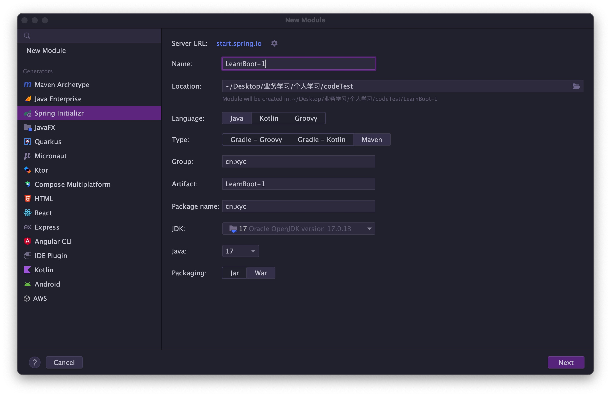
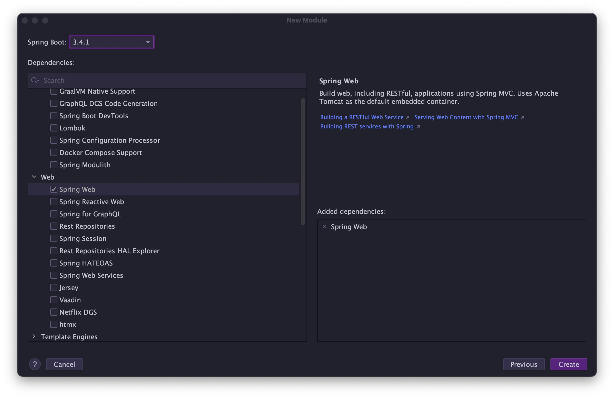

# Spring5：学习笔记

[课程地址](https://www.bilibili.com/video/BV1P44y1N7QG/?p=120)

## SpringBoot

### 37. Boot 骨架项目

如果是 linux 环境，用以下命令即可获取 spring boot 的骨架 pom.xml

```shell
curl -G https://start.spring.io/pom.xml -d dependencies=web,mysql,mybatis -o pom.xml
```

也可以使用 Postman 等工具实现

若想获取更多用法，请参考

```shell
curl https://start.spring.io
```

### 38. Boot War项目

#### 搭建步骤

**步骤1**：创建模块，区别在于打包方式选择 war



接下来勾选 Spring Web 支持



> 上面有只有JDK17版本，创建失败

**步骤2**：编写控制器

```java
@Controller
public class MyController {

    @RequestMapping("/hello")
    public String abc() {
        System.out.println("进入了控制器");
        return "hello";
    }
}
```

**步骤3**：编写 jsp 视图，新建 webapp 目录和一个 hello.jsp 文件，注意文件名与控制器方法返回的视图逻辑名一致

```
src
	|- main
		|- java
		|- resources
		|- webapp
			|- hello.jsp
```

**步骤4**：配置视图路径，打开 application.properties 文件

```properties
spring.mvc.view.prefix=/
spring.mvc.view.suffix=.jsp
```

> 将来 prefix + 控制器方法返回值 + suffix 即为视图完整路径

#### 测试

**方式1：**如果用 mvn 插件 `mvn spring-boot:run` 或 main 方法测试

必须添加如下依赖，因为此时用的还是内嵌 tomcat，而内嵌 tomcat 默认不带 jasper（用来解析 jsp）

```xml
<dependency>
    <groupId>org.apache.tomcat.embed</groupId>
    <artifactId>tomcat-embed-jasper</artifactId>
    <scope>provided</scope>
</dependency>
```

**方式2：**也可以使用 Idea 配置 tomcat 来测试，此时用的是**外置 tomcat**

骨架生成的代码中，多了一个 ServletInitializer，它的作用就是配置外置 Tomcat 使用的，在外置 Tomcat 启动后，去调用它创建和运行 SpringApplication

> 对于 jar 项目，若要支持 jsp，也可以在加入 jasper 依赖的前提下，把 jsp 文件置入 `META-INF/resources` 

### 39. Boot 启动过程

#### 阶段一：SpringApplication 构造

```java
// main方法中执行SpringApplication.run方法，启动SpringBoot程序
SpringApplication.run(A39_1.class, args);

// 最终调用构造方法，class：org.springframework.boot.SpringApplication
(new SpringApplication(primarySources)).run(args);
```

> SpringApplication构造方法源码如下 :
>
> ```java
> public SpringApplication(ResourceLoader resourceLoader, Class<?>... primarySources) {
>     this.sources = new LinkedHashSet();
>     this.bannerMode = Mode.CONSOLE;
>     this.logStartupInfo = true;
>     this.addCommandLineProperties = true;
>     this.addConversionService = true;
>     this.headless = true;
>     this.registerShutdownHook = true;
>     this.additionalProfiles = Collections.emptySet();
>     this.isCustomEnvironment = false;
>     this.lazyInitialization = false;
>     this.applicationContextFactory = ApplicationContextFactory.DEFAULT;
>     this.applicationStartup = ApplicationStartup.DEFAULT;
>     this.resourceLoader = resourceLoader;
>     Assert.notNull(primarySources, "PrimarySources must not be null");
>     this.primarySources = new LinkedHashSet(Arrays.asList(primarySources));
>     this.webApplicationType = WebApplicationType.deduceFromClasspath();
>     this.bootstrapRegistryInitializers = this.getBootstrapRegistryInitializersFromSpringFactories();
>     this.setInitializers(this.getSpringFactoriesInstances(ApplicationContextInitializer.class));
>     this.setListeners(this.getSpringFactoriesInstances(ApplicationListener.class));
>     this.mainApplicationClass = this.deduceMainApplicationClass();
> }
> ```

**构造分析**

##### 1）记录 BeanDefinition 源

```java
System.out.println("1. 演示获取 Bean Definition 源");
SpringApplication spring = new SpringApplication(A39_1.class);
// 添加其他源来实现添加BeanDefinition
spring.setSources(Collections.singleton("classpath:b01.xml"));

// 运行Spirng容器
ConfigurableApplicationContext context = spring.run(args);

for (String name : context.getBeanDefinitionNames()) {
    System.out.println("beanName: " + name + " 来源：" + context.getBeanFactory().getBeanDefinition(name).getResourceDescription());
}
context.close();

// 关键输出：
beanName: a39_1 来源：null
beanName: bean1 来源：class path resource [b01.xml]
beanName: bean2 来源：cn.xyc.a39.A39_1
beanName: servletWebServerFactory 来源：cn.xyc.a39.A39_1
```

> cn.xyc.a39.A39_1 中的其他代码
>
> ```java
> static class Bean1 {}
> 
> static class Bean2 {}
> 
> static class Bean3 {}
> 
> @Bean
> public Bean2 bean2() {
>     return new Bean2();
> }
> 
> @Bean
> public TomcatServletWebServerFactory servletWebServerFactory() {
>     return new TomcatServletWebServerFactory();
> }
> ```
>
> classpath:b01.xml 文件内容
>
> ```xml
> <?xml version="1.0" encoding="UTF-8"?>
> <beans xmlns="http://www.springframework.org/schema/beans"
>        xmlns:xsi="http://www.w3.org/2001/XMLSchema-instance"
>        xsi:schemaLocation="http://www.springframework.org/schema/beans http://www.springframework.org/schema/beans/spring-beans.xsd">
> 
>     <bean id="bean1" class="cn.xyc.a39.A39_1.Bean1"/>
> 
> </beans>
> ```

##### 2）推断应用类型

```java
System.out.println("2. 演示推断应用类型");
Method deduceFromClasspath = WebApplicationType.class.getDeclaredMethod("deduceFromClasspath");
deduceFromClasspath.setAccessible(true);
System.out.println("\t应用类型为:"+deduceFromClasspath.invoke(null));
// 输出：
// 2. 演示推断应用类型
//	应用类型为:SERVLET
```

> 源码如下：
>
> ```java
> this.webApplicationType = WebApplicationType.deduceFromClasspath();
> 
> // 方法：WebApplicationType.deduceFromClasspath();
> static WebApplicationType deduceFromClasspath() {
>     if (ClassUtils.isPresent("org.springframework.web.reactive.DispatcherHandler", (ClassLoader)null) && !ClassUtils.isPresent("org.springframework.web.servlet.DispatcherServlet", (ClassLoader)null) && !ClassUtils.isPresent("org.glassfish.jersey.servlet.ServletContainer", (ClassLoader)null)) {
>         // 类型1：
>         return REACTIVE;
>     } else {
>         String[] var0 = SERVLET_INDICATOR_CLASSES;
>         int var1 = var0.length;
> 
>         for(int var2 = 0; var2 < var1; ++var2) {
>             String className = var0[var2];
>             if (!ClassUtils.isPresent(className, (ClassLoader)null)) {
>                 // 类型2
>                 return NONE;
>             }
>         }
> 
>         // 类型3
>         return SERVLET;
>     }
> }
> ```

##### 3）添加 ApplicationContext 初始化器

```java
System.out.println("3. 演示 ApplicationContext 初始化器");
spring.addInitializers(new ApplicationContextInitializer() {
    @Override
    public void initialize(ConfigurableApplicationContext applicationContext) {
        // applicationContext 刚刚创建还没有初始化完成的refresh
        if (applicationContext instanceof GenericApplicationContext) {
            GenericApplicationContext gac = (GenericApplicationContext) applicationContext;
            gac.registerBean("bean3", Bean3.class);
            // 注册bean3对象，后续会被输出
        }
    }
});

ConfigurableApplicationContext context = spring.run(args);
// 1.run方法内部会创建 ApplicationContext
// 1-2之间处理：调用初始化器 对 ApplicationContext 做扩展
// 2.ApplicationContext.refresh，让ApplicationContext初始化完成
```

> 源码如下，从配置文件中读取进行初始化操作
>
> ```java
> // private List<ApplicationContextInitializer<?>> initializers;
> this.setInitializers(this.getSpringFactoriesInstances(ApplicationContextInitializer.class));
> ```

##### 4）记录监听器

```java
System.out.println("4. 演示监听器与事件");
spring.addListeners(new ApplicationListener<ApplicationEvent>() {
    @Override
    public void onApplicationEvent(ApplicationEvent event) {
        System.out.println("\t事件为:" + event.getClass());
    }
});
// 简化：spring.addListeners(event -> System.out.println("\t事件为:" + event.getClass()));

// 输出：
事件为:class org.springframework.boot.context.event.ApplicationContextInitializedEvent
事件为:class org.springframework.boot.context.event.ApplicationPreparedEvent
事件为:class org.springframework.boot.web.servlet.context.ServletWebServerInitializedEvent
事件为:class org.springframework.context.event.ContextRefreshedEvent
事件为:class org.springframework.boot.context.event.ApplicationStartedEvent
事件为:class org.springframework.boot.availability.AvailabilityChangeEvent
事件为:class org.springframework.boot.context.event.ApplicationReadyEvent
事件为:class org.springframework.boot.availability.AvailabilityChangeEvent
事件为:class org.springframework.boot.availability.AvailabilityChangeEvent
事件为:class org.springframework.context.event.ContextClosedEvent
```

> 源码如下，从配置文件中读取进行初始化操作
>
> ```java
> // private List<ApplicationListener<?>> listeners;
> this.setListeners(this.getSpringFactoriesInstances(ApplicationListener.class));
> ```

##### 5）推断主启动类

```java
System.out.println("5. 演示主类推断");
Method deduceMainApplicationClass = SpringApplication.class.getDeclaredMethod("deduceMainApplicationClass");
deduceMainApplicationClass.setAccessible(true);
System.out.println("\t主类是："+deduceMainApplicationClass.invoke(spring));

// 输出
5. 演示主类推断
	主类是：class cn.xyc.a39.A39_1
```

> ```java
> // 见源码：
> this.mainApplicationClass = this.deduceMainApplicationClass();
> ```

#### 阶段二：执行 run 方法

`org.springframework.boot.SpringApplication#run(java.lang.String...)`

##### 1）创建事件发布器

**得到 SpringApplicationRunListeners，名字取得不好，实际是事件发布器**，这里总共会发布7个事件

> 发布 application starting 事件1️⃣
>
> 对应源码：
>
> ```java
> SpringApplicationRunListeners listeners = this.getRunListeners(args);
> // 发布 application starting 事件1️⃣
> listeners.starting(bootstrapContext, this.mainApplicationClass);
> ```

```java
public class A39_2 {
    public static void main(String[] args) throws Exception{

        // 添加 app 监听器
        SpringApplication app = new SpringApplication();
        app.addListeners(e -> System.out.println("监听事件：" + e.getClass()));

        // 获取事件发送器实现类名
        List<String> names = SpringFactoriesLoader.loadFactoryNames(SpringApplicationRunListener.class, A39_2.class.getClassLoader());
        for (String name : names) {
            System.out.println("事件发送器实现类名:" + name);
            Class<?> clazz = Class.forName(name);
            Constructor<?> constructor = clazz.getConstructor(SpringApplication.class, String[].class);
            SpringApplicationRunListener publisher = (SpringApplicationRunListener) constructor.newInstance(app, args);

            DefaultBootstrapContext bootstrapContext = new DefaultBootstrapContext();
            GenericApplicationContext context = new GenericApplicationContext();
            // 发布以下事件
            // 发布 spring boot 开始启动事件
            publisher.starting(bootstrapContext);
            // 发布环境信息准备完毕事件
            publisher.environmentPrepared(bootstrapContext, new StandardEnvironment());
            // 在 spring 容器创建，并调用初始化器之后，发送此事件
            publisher.contextPrepared(context);
            // 所有 bean definition 加载完毕后，发送此事件
            publisher.contextLoaded(context);
            context.refresh();
            // spring 容器初始化完成(refresh 方法调用完毕)，发布事件
            publisher.started(context);
            // 发布 spring boot 启动完毕事件
            publisher.running(context);
            // spring boot 启动出错，发送事件
            publisher.failed(context, new Exception("出错了"));
        }

        /*
            学到了什么
            a. 如何读取 spring.factories 中的配置
            b. run 方法内获取事件发布器 (得到 SpringApplicationRunListeners) 的过程, 对应步骤中
                1.获取事件发布器
                发布 application starting 事件1️⃣
                发布 application environment 已准备事件2️⃣
                发布 application context 已初始化事件3️⃣
                发布 application prepared 事件4️⃣
                发布 application started 事件5️⃣
                发布 application ready 事件6️⃣
                这其中有异常，发布 application failed 事件7️⃣
         */
    }
}

// 输出如下：关注boot.context.event.xxx
监听事件：class org.springframework.boot.context.event.ApplicationStartingEvent
监听事件：class org.springframework.boot.context.event.ApplicationEnvironmentPreparedEvent
监听事件：class org.springframework.boot.context.event.ApplicationContextInitializedEvent
监听事件：class org.springframework.boot.context.event.ApplicationPreparedEvent
监听事件：class org.springframework.context.event.ContextRefreshedEvent
监听事件：class org.springframework.boot.context.event.ApplicationStartedEvent
监听事件：class org.springframework.boot.availability.AvailabilityChangeEvent
监听事件：class org.springframework.boot.context.event.ApplicationReadyEvent
监听事件：class org.springframework.boot.availability.AvailabilityChangeEvent
监听事件：class org.springframework.boot.context.event.ApplicationFailedEvent
```

> Spring事件发布器：org.springframework.boot.SpringApplicationRunListener
>
> 对应实现：org.springframework.boot.context.event.EventPublishingRunListener
>
> springboot的配置文件中
>
> ```properties
> # Run Listeners
> org.springframework.boot.SpringApplicationRunListener=\
> org.springframework.boot.context.event.EventPublishingRunListener
> ```

##### 2）封装启动 args

> 对应源码
>
> ```java
> ApplicationArguments applicationArguments = new DefaultApplicationArguments(args);
> ```

```java
System.out.println(">>>>>>>>>>>>>>>>>>>>>>>> 2. 封装启动 args");
// 在12）中被使用
DefaultApplicationArguments arguments = new DefaultApplicationArguments(args);
```

##### 3）准备 Environment 添加命令行参数（*）

> 对应源码
>
> ```java
> ConfigurableEnvironment environment = this.prepareEnvironment(listeners, bootstrapContext, applicationArguments);
> 
> // 方法org.springframework.boot.SpringApplication#prepareEnvironment
> ConfigurableEnvironment environment = this.getOrCreateEnvironment();
> // 添加命令行参数 applicationArguments.getSourceArgs()
> this.configureEnvironment((ConfigurableEnvironment)environment, applicationArguments.getSourceArgs());
> ```

```java
package org.springframework.boot;

import java.io.IOException;

import org.springframework.core.env.PropertySource;
import org.springframework.core.env.SimpleCommandLinePropertySource;
import org.springframework.core.io.ClassPathResource;
import org.springframework.core.io.support.ResourcePropertySource;

/**
 * @author xiaochao
 * @date 2025/1/11 19:03
 */
public class Step3 {
    public static void main(String[] args) throws IOException {
        // 环境对象，对配置信息的抽象，比如：系统环境变量, properties, yaml
        ApplicationEnvironment env = new ApplicationEnvironment();
        // 解析配置文件添加属性（注意在 3）中是没有添加的）
        env.getPropertySources().addLast(new ResourcePropertySource(new ClassPathResource("application.properties")));
        // 从命令行中添加属性，这个是在这步中加的
        env.getPropertySources().addFirst(new SimpleCommandLinePropertySource(args));
        for (PropertySource<?> ps : env.getPropertySources()) {
            System.out.println(ps);
            // 输出结果：
            // 来源1：系统属性 PropertiesPropertySource {name='systemProperties'}
            // 来源2：系统环境变量 SystemEnvironmentPropertySource {name='systemEnvironment'}
        }
        // 有优先级，systemProperties > systemEnvironment
        System.out.println(env.getProperty("JAVA_HOME"));
        // 默认输出：/Library/Java/JavaVirtualMachines/jdk1.8.0_311.jdk/Contents/Home
        // 如果在运行时新增参数 -DJAVA_HOME=abc，则会输出 abc 了

        // 通过env.getPropertySources().addXXXX()，可以添加自定义的 PropertySource
        System.out.println(env.getProperty("server.port"));
    }
}
```

> 注意上述类的路径

##### 4）ConfigurationPropertySources 处理（*）

> 发布 application environment 已准备事件2️⃣
>
> 对应源码：
>
> ```java
> // 接着方法prepareEnvironment
> ConfigurationPropertySources.attach((Environment)environment);
> // 发布 application environment 已准备事件2️⃣
> listeners.environmentPrepared(bootstrapContext, (ConfigurableEnvironment)environment);
> 
> // 方法ConfigurationPropertySources.attach(env);
> public static void attach(Environment environment) {
>     Assert.isInstanceOf(ConfigurableEnvironment.class, environment);
>     MutablePropertySources sources = ((ConfigurableEnvironment)environment).getPropertySources();
>     PropertySource<?> attached = getAttached(sources);
>     if (attached != null && attached.getSource() != sources) {
>         sources.remove("configurationProperties");
>         attached = null;
>     }
> 
>     if (attached == null) {
>         // 加了SpringConfigurationPropertySources
>         sources.addFirst(new ConfigurationPropertySourcesPropertySource("configurationProperties", new SpringConfigurationPropertySources(sources)));
>     }
> }
> ```

```java
package org.springframework.boot;

import java.io.IOException;

import org.springframework.boot.context.properties.source.ConfigurationPropertySources;
import org.springframework.core.env.PropertySource;
import org.springframework.core.io.ClassPathResource;
import org.springframework.core.io.support.ResourcePropertySource;

/**
 * @author xiaochao
 * @date 2025/1/11 19:03
 */
public class Step4 {

    public static void main(String[] args) throws IOException, NoSuchFieldException {
        ApplicationEnvironment env = new ApplicationEnvironment();
        env.getPropertySources().addLast(
            new ResourcePropertySource("step4", new ClassPathResource("step4.properties"))
        );
        // 4）ConfigurationPropertySources 处理（*）
        ConfigurationPropertySources.attach(env);
        // 执行完成后：ConfigurationPropertySourcesPropertySource {name='configurationProperties'}
        // 名称不一样也可以进行解析了，如果不加的话，名称对不上的话是无法解析的
        for (PropertySource<?> ps : env.getPropertySources()) {
            System.out.println(ps);
        }

        // user.first-name=George
        System.out.println(env.getProperty("user.first-name"));
        // user.middle_name=Walker
        System.out.println(env.getProperty("user.middle-name"));
        // user.lastName=Bush
        System.out.println(env.getProperty("user.last-name"));
    }
}
```

##### 5）EnvironmentPostProcessor处理（*）

> 对应源码
>
> ```java
> // Environment已经准备好了，发布 application environment 已准备事件
> listeners.environmentPrepared(bootstrapContext, (ConfigurableEnvironment)environment);
> // 监听这个事件，进行EnvironmentPostProcessor
> ```

通过 EnvironmentPostProcessor（通过EnvironmentPostProcessorApplicationListener实现） 进行 env 后处理（*）

> application.properties，由 StandardConfigDataLocationResolver 解析
>
> 这里才真正解析了application.properties

```java
SpringApplication app = new SpringApplication();
ApplicationEnvironment env = new ApplicationEnvironment();

System.out.println(">>>>>>>>>>>>>>>>>>>>>>>>> 增强前");
for (PropertySource<?> ps : env.getPropertySources()) {
    System.out.println(ps);
}

ConfigDataEnvironmentPostProcessor postProcessor1 =
    new ConfigDataEnvironmentPostProcessor(new DeferredLogs(), new DefaultBootstrapContext());
postProcessor1.postProcessEnvironment(env, app);
System.out.println(">>>>>>>>>>>>>>>>>>>>>>>>> 增强后");
for (PropertySource<?> ps : env.getPropertySources()) {
    System.out.println(ps);
}
// 对比增强前，多了：
// OriginTrackedMapPropertySource {name='Config resource 'class path resource [application.properties]' via location 'optional:classpath:/''}
System.out.println(env.getProperty("server.port"));

RandomValuePropertySourceEnvironmentPostProcessor postProcessor2 =
    new RandomValuePropertySourceEnvironmentPostProcessor(new DeferredLog());
postProcessor2.postProcessEnvironment(env, app);
System.out.println(">>>>>>>>>>>>>>>>>>>>>>>>> 增强后");
for (PropertySource<?> ps : env.getPropertySources()) {
    System.out.println(ps);
}
// 对比增强前，多了：
// RandomValuePropertySource {name='random'}
System.out.println(env.getProperty("random.int"));
System.out.println(env.getProperty("random.int"));
System.out.println(env.getProperty("random.int"));
System.out.println(env.getProperty("random.uuid"));
System.out.println(env.getProperty("random.uuid"));
System.out.println(env.getProperty("random.uuid"));
```

实际使用中，可以看到在SpringBoot的配置文件（spring.factories）下有如下EnvironmentPostProcessor：

```properties
# Environment Post Processors
org.springframework.boot.env.EnvironmentPostProcessor=\
org.springframework.boot.cloud.CloudFoundryVcapEnvironmentPostProcessor,\
org.springframework.boot.context.config.ConfigDataEnvironmentPostProcessor,\
org.springframework.boot.env.RandomValuePropertySourceEnvironmentPostProcessor,\
org.springframework.boot.env.SpringApplicationJsonEnvironmentPostProcessor,\
org.springframework.boot.env.SystemEnvironmentPropertySourceEnvironmentPostProcessor,\
org.springframework.boot.reactor.DebugAgentEnvironmentPostProcessor
```

上述EnvironmentPostProcessor可以通过如下代码看到

```java
List<String> names =
    SpringFactoriesLoader.loadFactoryNames(EnvironmentPostProcessor.class, Step5.class.getClassLoader());
for (String name : names) {
    System.out.println(name);
}
```

再看监听器：EnvironmentPostProcessorApplicationListener，通过这个监听器，调用上述的后处理器

```java
SpringApplication app = new SpringApplication();
// 手动创建EnvironmentPostProcessorApplicationListener
app.addListeners(new EnvironmentPostProcessorApplicationListener());

// 创建监听器，后续手动发布事件
EventPublishingRunListener publisher = new EventPublishingRunListener(app, args);
ApplicationEnvironment env = new ApplicationEnvironment();
System.out.println(">>>>>>>>>>>>>>>>>>>>>>>>> 增强前");
for (PropertySource<?> ps : env.getPropertySources()) {
    System.out.println(ps);
}
// 发布事件，发布后，上面的监听器就会监听到执行对应的方法
publisher.environmentPrepared(new DefaultBootstrapContext(), env);
System.out.println(">>>>>>>>>>>>>>>>>>>>>>>>> 增强后");
for (PropertySource<?> ps : env.getPropertySources()) {
    System.out.println(ps);
}
```

##### 6）绑定 spring.main 到 SpringApplication 对象（*）

> 对应源码
>
> ```java
> // 接着方法prepareEnvironment内部
> this.bindToSpringApplication((ConfigurableEnvironment)environment);
> 
> // 方法bindToSpringApplication
> protected void bindToSpringApplication(ConfigurableEnvironment environment) {
>     try {
>         Binder.get(environment).bind("spring.main", Bindable.ofInstance(this));
>     } catch (Exception var3) {
>         throw new IllegalStateException("Cannot bind to SpringApplication", var3);
>     }
> }
> ```

```java
package org.springframework.boot;

import java.io.IOException;

import org.springframework.boot.SpringApplication;
import org.springframework.boot.context.properties.ConfigurationProperties;
import org.springframework.boot.context.properties.bind.BindResult;
import org.springframework.boot.context.properties.bind.Bindable;
import org.springframework.boot.context.properties.bind.Binder;
import org.springframework.core.io.ClassPathResource;
import org.springframework.core.io.support.ResourcePropertySource;

import lombok.Data;

/**
 * @author xiaochao
 * @date 2025/1/11 19:04
 */
public class Step6 {

    /**
     * 绑定 spring.main 前缀的 key value 至 SpringApplication, 请通过 debug 查看
     *
     * @param args
     *
     * @throws IOException
     */
    public static void main(String[] args) throws IOException {
        SpringApplication application = new SpringApplication();
        ApplicationEnvironment env = new ApplicationEnvironment();

        // 对象绑定的基础使用：属性绑定，通过Binder
        // 加载配置文件
        env.getPropertySources()
            .addLast(new ResourcePropertySource("step4", new ClassPathResource("step4.properties")));
		// 绑定方式1
        User user = Binder.get(env).bind("user", User.class).get();
        System.out.println(user);

		// 绑定方式2
        User user2 = new User();
        Binder.get(env).bind("user", Bindable.ofInstance(user2));
        System.out.println(user2);

        // 绑定 spring.main 前缀的 key value 至 SpringApplication
        env.getPropertySources()
            .addLast(new ResourcePropertySource("step6", new ClassPathResource("step6.properties")));
        
        System.out.println(application);
        Binder.get(env).bind("spring.main", Bindable.ofInstance(application));
        System.out.println(application);
    }

    // @ConfigurationProperties
    @Data
    static class User {
        private String firstName;
        private String middleName;
        private String lastName;
    }
}
```

> step6.properties如下：
>
> ```properties
> spring.main.banner-mode=off
> spring.main.lazy-initialization=true
> ```

##### 7）打印 banner（*）

> 对应源码
>
> ```java
> Banner printedBanner = this.printBanner(environment);
> ```

```java
package org.springframework.boot;

import java.util.Collections;
import java.util.Map;

import org.springframework.core.env.MapPropertySource;
import org.springframework.core.io.DefaultResourceLoader;

/**
 * @author xiaochao
 * @date 2025/1/11 19:04
 */
public class Step7 {
    public static void main(String[] args) {
        ApplicationEnvironment env = new ApplicationEnvironment();
        SpringApplicationBannerPrinter printer =
            new SpringApplicationBannerPrinter(new DefaultResourceLoader(), new SpringBootBanner());
        // 测试文字 banner
//        env.getPropertySources().addLast(
//            new MapPropertySource("custom", Collections.singletonMap("spring.banner.location", "banner1.txt")));
        // 测试图片 banner
//        env.getPropertySources().addLast(
//            new MapPropertySource("custom", Collections.singletonMap("spring.banner.image.location", "banner2.png")));
        // 版本号的获取
        System.out.println(SpringBootVersion.getVersion());
        // 环境变量，main所在的类，输出目的
        printer.print(env, Step7.class, System.out);
    }
}
```

##### 8）创建容器

> 对应源码
>
> ```java
> context = this.createApplicationContext();
> ```

```java
System.out.println(">>>>>>>>>>>>>>>>>>>>>>>> 8. 创建容器");
// 得到了Spring容器
GenericApplicationContext context = createApplicationContext(WebApplicationType.SERVLET);

private static GenericApplicationContext createApplicationContext(WebApplicationType type) {
    GenericApplicationContext context = null;
    switch (type) {
        case SERVLET:
            context = new AnnotationConfigServletWebServerApplicationContext();
        case REACTIVE :
            context = new AnnotationConfigReactiveWebServerApplicationContext();
        case NONE :
            context = new AnnotationConfigApplicationContext();
    }
    return context;
}
```

##### 9）准备容器

> 发布 application context 已初始化事件3️⃣
>
> 对应源码
>
> ```java
> this.prepareContext(bootstrapContext, context, environment, listeners, applicationArguments, printedBanner);
> 
> // prepareContext方法内
> this.applyInitializers(context);
> // 发布 application context 已初始化事件3️⃣
> listeners.contextPrepared(context);
> ```

```java
SpringApplication app = new SpringApplication();
app.addInitializers(new ApplicationContextInitializer<ConfigurableApplicationContext>() {
    @Override
    public void initialize(ConfigurableApplicationContext applicationContext) {
        // 等到容器创建完成后才会被执行
        System.out.println("执行初始化器增强...");
    }
});

System.out.println(">>>>>>>>>>>>>>>>>>>>>>>> 9. 准备容器");
for (ApplicationContextInitializer initializer : app.getInitializers()) {
    // 开始回调初始化器
    initializer.initialize(context);
}

// 输出：
>>>>>>>>>>>>>>>>>>>>>>>> 9. 准备容器
执行初始化器增强...
```

##### 10）加载 bean 定义

> 发布 application prepared 事件4️⃣
>
> 对应源码
>
> ```java
> // 接着prepareContext方法内
> Set<Object> sources = this.getAllSources();
> Assert.notEmpty(sources, "Sources must not be empty");
> this.load(context, sources.toArray(new Object[0]));
> // 发布 application prepared 事件4️⃣
> listeners.contextLoaded(context);
> ```

```java
System.out.println(">>>>>>>>>>>>>>>>>>>>>>>> 10. 加载 bean 定义");
DefaultListableBeanFactory beanFactory = context.getDefaultListableBeanFactory();
// BeanDefinition加载方式1，注解
AnnotatedBeanDefinitionReader reader1 = new AnnotatedBeanDefinitionReader(beanFactory);
reader1.register(Config.class);
// BeanDefinition加载方式2，xml
XmlBeanDefinitionReader reader2 = new XmlBeanDefinitionReader(beanFactory);
reader2.loadBeanDefinitions(new ClassPathResource("b03.xml"));
//  BeanDefinition加载方式3，类路径扫描
ClassPathBeanDefinitionScanner scanner = new ClassPathBeanDefinitionScanner(beanFactory);
scanner.scan("com.itheima.a39.sub");

for (String name : context.getBeanDefinitionNames()) {
    System.out.println("name:" + name + " 来源：" + beanFactory.getBeanDefinition(name).getResourceDescription());
}

// 关注输出：
name:a39_3.Config 来源：null
name:bean4 来源：class path resource [b03.xml]
name:bean7 来源：file [/Users/zhuchengchao/Desktop/业务学习/个人学习/codeTest/Spring5/target/classes/cn/xyc/a39/sub/Bean7.class]
name:bean5 来源：cn.xyc.a39.A39_3$Config
name:servletWebServerFactory 来源：cn.xyc.a39.A39_3$Config
```

> cn.xyc.a39.A39_3中有如下内容
>
> ```java
> static class Bean4 {}
> 
> static class Bean5 {}
> 
> @Configuration
> static class Config {
>     @Bean
>     public Bean5 bean5() {
>         return new Bean5();
>     }
> 
>     @Bean
>     public ServletWebServerFactory servletWebServerFactory() {
>         return new TomcatServletWebServerFactory();
>     }
> }
> ```
>
> b03.xml
>
> ```xml
> <?xml version="1.0" encoding="UTF-8"?>
> <beans xmlns="http://www.springframework.org/schema/beans"
>        xmlns:xsi="http://www.w3.org/2001/XMLSchema-instance"
>        xsi:schemaLocation="http://www.springframework.org/schema/beans http://www.springframework.org/schema/beans/spring-beans.xsd">
> 
>     <bean id="bean4" class="cn.xyc.a39.A39_3.Bean4"/>
> 
> </beans>
> ```
>
> bean7：cn.xyc.a39.sub.Bean7
>
> ```java
> @Component
> public class Bean7 {
> }
> ```

##### 11）refresh 容器

> 发布 application started 事件5️⃣
>
> 对应源码
>
> ```java
> this.refreshContext(context);
> // ...
> // 发布 application started 事件5️⃣
> listeners.started(context);
> 
> // refreshContext方法
> private void refreshContext(ConfigurableApplicationContext context) {
>     if (this.registerShutdownHook) {
>         shutdownHook.registerApplicationContext(context);
>     }
> 
>     this.refresh(context);
> }
> ```

```java
System.out.println(">>>>>>>>>>>>>>>>>>>>>>>> 11. refresh 容器");
context.refresh();
```

##### 12）执行 runner

> 发布 application ready 事件6️⃣
>
> 这其中有异常，发布 application failed 事件7️⃣
>
> 对应源码
>
> ```java
> this.callRunners(context, applicationArguments);
> 
> // callRunners方法
> try {
>  // 发布 application ready 事件6️⃣
>  listeners.running(context);
>  return context;
> } catch (Throwable var9) {
>  // 如果有异常，异常处理
>  this.handleRunFailure(context, var9, (SpringApplicationRunListeners)null);
>  throw new IllegalStateException(var9);
> }
> 
> // 方法handleRunFailure内部
> // 发布 application failed 事件7️⃣
> listeners.failed(context, exception);
> ```

```java
System.out.println(">>>>>>>>>>>>>>>>>>>>>>>> 12. 执行 runner");
// SpringBoot启动的最后阶段被回调，进行一些业务逻辑，比如预加载数据等
for (CommandLineRunner runner : context.getBeansOfType(CommandLineRunner.class).values()) {
    runner.run(args);
}

for (ApplicationRunner runner : context.getBeansOfType(ApplicationRunner.class).values()) {
    // 步骤2）中被封装
    runner.run(arguments);
}

// 输出如下：这里注意：// 运行时请添加运行参数 --server.port=8080 debug
>>>>>>>>>>>>>>>>>>>>>>>> 12. 执行 runner
执行commandLineRunner()...[--server.port=8080, debug]
执行applicationRunner()...[--server.port=8080, debug]
OptionNames：[server.port]
OptionValues[8080]
NonOptionArgs[debug]
```

> 在cn.xyc.a39.A39_3.Config添加两个方法
>
> ```java
> @Configuration
> static class Config {
>     // ...
>     
>     @Bean
>     public CommandLineRunner commandLineRunner() {
>         return new CommandLineRunner() {
>             @Override
>             public void run(String... args) throws Exception {
>                 System.out.println("执行commandLineRunner()..." + Arrays.toString(args));
>             }
>         };
>     }
> 
>     @Bean
>     public ApplicationRunner applicationRunner() {
>         return new ApplicationRunner() {
>             // args的参数在步骤2）中被封装
>             @Override
>             public void run(ApplicationArguments args) throws Exception {
>                 System.out.println("执行applicationRunner()..." + Arrays.toString(args.getSourceArgs()));
>                 System.out.println("OptionNames：" + args.getOptionNames());
>                 System.out.println("OptionValues" + args.getOptionValues("server.port"));
>                 System.out.println("NonOptionArgs" + args.getNonOptionArgs());
>             }
>         };
>     }
> }
> ```

#### 演示：启动过程

**cn.xyc.a39.A39_1** 对应 SpringApplication 构造

**cn.xyc.a39.A39_2** 对应第1步，并演示 7 个事件

**cn.xyc.a39.A39_3** 对应第2、8到12步

**org.springframework.boot.Step3** 对应第3步

**org.springframework.boot.Step4** 对应第4步

**org.springframework.boot.Step5** 对应第5步

**org.springframework.boot.Step6** 对应第6步

**org.springframework.boot.Step7** 对应第7步

#### 收获

SpringApplication 构造方法中所做的操作

1. 可以有多种源用来加载 bean 定义
2. 应用类型推断
3. 添加容器初始化器
4. 添加监听器
5. 演示主类推断

如何读取 spring.factories 中的配置

1. 从配置中获取重要的事件发布器：SpringApplicationRunListeners

2. 容器的创建、初始化器增强、加载 bean 定义等

3. CommandLineRunner、ApplicationRunner 的作用

4. 环境对象
   1. 命令行 PropertySource

   2. ConfigurationPropertySources 规范环境键名称

   3. EnvironmentPostProcessor 后处理增强
      
      > 由 EventPublishingRunListener 通过监听事件2️⃣来调用
      
   4. 绑定 spring.main 前缀的 key value 至 SpringApplication

5. Banner

### 40 Tomcat 内嵌容器

Tomcat 基本结构

```
Server
└───Service
    ├───Connector (协议, 端口)
    └───Engine
        └───Host(虚拟主机 localhost)
            ├───Context1 (应用1, 可以设置虚拟路径, / 即 url 起始路径; 项目磁盘路径, 即 docBase )
            │   │   index.html
            │   └───WEB-INF
            │       │   web.xml (servlet, filter, listener) 3.0
            │       ├───classes (servlet, controller, service ...)
            │       ├───jsp
            │       └───lib (第三方 jar 包)
            └───Context2 (应用2)
                │   index.html
                └───WEB-INF
                        web.xml
```

#### Tomcat 内嵌容器

```java
public static void main(String[] args) throws LifecycleException, IOException {
    // 1.创建 Tomcat 对象
    Tomcat tomcat = new Tomcat();
    tomcat.setBaseDir("tomcat");

    // 2.创建项目文件夹, 即 docBase 文件夹
    File docBase = Files.createTempDirectory("boot.").toFile();
    docBase.deleteOnExit();

    // 3.创建 Tomcat 项目, 在 Tomcat 中称为 Context
    Context context = tomcat.addContext("", docBase.getAbsolutePath());

    // 4.编程添加 Servlet
    context.addServletContainerInitializer(new ServletContainerInitializer() {
        @Override
        public void onStartup(Set<Class<?>> c, ServletContext ctx) throws ServletException {
            HelloServlet helloServlet = new HelloServlet();
            ctx.addServlet("aaa", helloServlet).addMapping("/hello");
        }
    }, Collections.emptySet());

    // 5.启动 Tomcat
    tomcat.start();

    // 6.创建连接器, 设置监听端口
    Connector connector = new Connector(new Http11Nio2Protocol());
    connector.setPort(8080);
    tomcat.setConnector(connector);
}

public class HelloServlet extends HttpServlet {
    @Override
    protected void doGet(HttpServletRequest req, HttpServletResponse resp) throws ServletException, IOException {
        resp.setContentType("text/html;charset=utf-8");
        resp.getWriter().print(("<h3>hello</h3>"));
    }
}
```

#### 集成 Spring 容器

```java
// 创建Spring容器
WebApplicationContext springContext = getApplicationContext();

// 4.编程添加 Servlet
context.addServletContainerInitializer(new ServletContainerInitializer() {
    @Override
    public void onStartup(Set<Class<?>> c, ServletContext ctx) throws ServletException {
        /*DispatcherServlet dispatcherServlet = springContext.getBean(DispatcherServlet.class);
		ctx.addServlet("dispatcherServlet", dispatcherServlet).addMapping("/");*/
        // ⬇️通过 ServletRegistrationBean 添加 DispatcherServlet 等
        for (ServletRegistrationBean registrationBean : 
             springContext.getBeansOfType(ServletRegistrationBean.class).values()) {
            // 等效上面的：ctx.addServlet...
            registrationBean.onStartup(ctx);
        }
    }
}, Collections.emptySet());

/**
 * 创建spring容器
 *
 * @return
 */
public static WebApplicationContext getApplicationContext() {
    // AnnotationConfigServletWebServerApplicationContext，这类已经是支持了内嵌的tomcat，这边不用这个类
    // 没有支持内嵌tomcat的
    AnnotationConfigWebApplicationContext context = new AnnotationConfigWebApplicationContext();
    context.register(Config.class);
    context.refresh();
    return context;
}

@Configuration
static class Config {
    @Bean
    public DispatcherServletRegistrationBean registrationBean(DispatcherServlet dispatcherServlet) {
        return new DispatcherServletRegistrationBean(dispatcherServlet, "/");
    }

    /**
     * 这个例子中必须为 DispatcherServlet 提供 AnnotationConfigWebApplicationContext, 否则会选择 XmlWebApplicationContext 实现
     *
     * @param applicationContext
     *
     * @return
     */
    @Bean
    public DispatcherServlet dispatcherServlet(WebApplicationContext applicationContext) {
        return new DispatcherServlet(applicationContext);
    }

    @Bean
    public RequestMappingHandlerAdapter requestMappingHandlerAdapter() {
        RequestMappingHandlerAdapter handlerAdapter = new RequestMappingHandlerAdapter();
        handlerAdapter.setMessageConverters(Collections.singletonList(new MappingJackson2HttpMessageConverter()));
        return handlerAdapter;
    }

    @RestController
    static class MyController {
        @GetMapping("hello2")
        public Map<String, Object> hello() {
            return Collections.singletonMap("hello2", "hello2, spring!");
        }
    }
}
```

### 41. Boot 自动配置

#### 自动配置原理

```java
/**
 * @author xiaochao
 * @date 2025/2/15 18:19
 */
public class A41_1 {

    public static void main(String[] args) {

        GenericApplicationContext context = new GenericApplicationContext();
        // 类冲突解决-2：是否允许bean定义被覆盖，默认是true，springboot中是false
        context.getDefaultListableBeanFactory().setAllowBeanDefinitionOverriding(false);
        context.registerBean("config", Config.class);
        // 解析注解的后处理器
        context.registerBean(ConfigurationClassPostProcessor.class);
        context.refresh();

        for (String name : context.getBeanDefinitionNames()) {
            System.out.println(name);
        }
        System.out.println(">>>>>>>>>>>>>>>>");
        System.out.println(context.getBean(Bean1.class));
        // 类冲突解决-3
        // .setAllowBeanDefinitionOverriding(true);
        // MyImportSelector implements ImportSelector,输出 A41_1.Bean1(name=本项目的)
        // MyImportSelector implements DeferredImportSelector，输出 A41_1.Bean1(name=第三方)
    }

    // 本项目的配置类
    @Configuration
    // @Import({AutoConfiguration1.class, AutoConfiguration2.class}) // 1.0 直接导入
    @Import(MyImportSelector.class) // 2.0 通过单独的配置类导入
    static class Config {
        @Bean
        public Bean1 bean1() {
            // 类冲突解决-1：当第三方和本项目中有一样的类型的bean时，默认本项目生效，
            // 因为@Import先被解析，再解析本项目的@Bean，后注册的会覆盖掉新注册的，
            // 类冲突解决-2：可以设置是否允许覆盖setAllowBeanDefinitionOverriding
            // 类冲突解决-3：也可以修改解析顺序，配置类MyImportSelector不直接实现ImportSelector，而是实现DeferredImportSelector
            return new Bean1("本项目的");
        }
    }

    // 专门引入第三方配置类的工具类
    static class MyImportSelector implements DeferredImportSelector/*推迟导入，第三方导入优先级变低*/ /*ImportSelector*/ {
        @Override
        public String[] selectImports(AnnotationMetadata importingClassMetadata) {
            // return new String[] {AutoConfiguration1.class.getName(), AutoConfiguration2.class.getName()};
            // 3.0 配置文件的方式，在 工程的META-INF下创建名为 spring.properties 的文件
            List<String> names = SpringFactoriesLoader.loadFactoryNames(MyImportSelector.class, null);
            return names.toArray(new String[0]);
            
            /*// 其他:所有实现了 EnableAutoConfiguration 的类，都会被加载
            List<String> names = SpringFactoriesLoader.loadFactoryNames(EnableAutoConfiguration.class, null);
            names.forEach(System.out::println);
            return names.toArray(new String[0]);*/
        }
    }

    // 第三方的配置类
    @Configuration
    static class AutoConfiguration1 {
        @Bean
        @ConditionalOnMissingBean // 类冲突解决-4,本项目没有时才导入
        public Bean1 bean1() {
            return new Bean1("第三方");
        }
    }

    // 第三方的配置类
    @Configuration
    static class AutoConfiguration2 {
        @Bean
        public Bean2 bean2() {
            return new Bean2();
        }
    }

    @Data
    @AllArgsConstructor
    @NoArgsConstructor
    static class Bean1 {
        private String name;
    }

    static class Bean2 {
    }
}

```

配置文件：`classpath：resources/META-INF/spring.factories`

```properties
cn.xyc.a41.A41_1$MyImportSelector=\
  cn.xyc.a41.A41_1.AutoConfiguration1,\
  cn.xyc.a41.A41_1.AutoConfiguration2
```

#### AOP 自动配置

AopAutoConfiguration，Spring Boot 是利用了自动配置类来了 aop 相关配置

AOP 自动配置类为 `org.springframework.boot.autoconfigure.aop.AopAutoConfiguration`

可以通过 `spring.aop.auto=false` 禁用 aop 自动配置

```java
@Configuration(
    proxyBeanMethods = false
)
// 条件配置：配置文件中存在spring.aop.auto=true生效AopAutoConfiguration || matchIfMissing=true表示没有键值也生效
@ConditionalOnProperty(
    prefix = "spring.aop",
    name = {"auto"},
    havingValue = "true",
    matchIfMissing = true
)
public class AopAutoConfiguration {
```

AOP 自动配置的本质是通过 `@EnableAspectJAutoProxy` 来开启了自动代理，如果在引导类上自己添加了 `@EnableAspectJAutoProxy` 那么以自己添加的为准

```java
@Configuration(
    proxyBeanMethods = false
)
// SpringBoot默认加入了AOP功能，都会有Advice，因此加载AspectJAutoProxyingConfiguration
@ConditionalOnClass({Advice.class})
static class AspectJAutoProxyingConfiguration {
    AspectJAutoProxyingConfiguration() {
    }

    @Configuration(
        proxyBeanMethods = false
    )
    // 通过这个开启自动代理，且proxyTargetClass = true
    @EnableAspectJAutoProxy(
        proxyTargetClass = true
    )
    // 配置文件中存在spring.aop.proxy-target-class=ture || 没有这个条件，这边满足这个条件
    @ConditionalOnProperty(
        prefix = "spring.aop",
        name = {"proxy-target-class"},
        havingValue = "true",
        matchIfMissing = true
    )
    static class CglibAutoProxyConfiguration {
        CglibAutoProxyConfiguration() {
        }
    }

    @Configuration(
        proxyBeanMethods = false
    )
    @EnableAspectJAutoProxy(
        proxyTargetClass = false
    )
    // 配置文件中存在spring.aop.proxy-target-class=false
    @ConditionalOnProperty(
        prefix = "spring.aop",
        name = {"proxy-target-class"},
        havingValue = "false"
    )
    static class JdkDynamicAutoProxyConfiguration {
        JdkDynamicAutoProxyConfiguration() {
        }
    }
}
```

`@EnableAspectJAutoProxy` 的本质是向容器中添加了 `AnnotationAwareAspectJAutoProxyCreator` 这个 bean 后处理器，它能够找到容器中所有切面，并为匹配切点的目标类创建代理，创建代理的工作一般是在 bean 的初始化阶段完成的

```java
@Target({ElementType.TYPE})
@Retention(RetentionPolicy.RUNTIME)
@Documented
// 导入AspectJAutoProxyRegistrar，进入后可以发现最终加入了AnnotationAwareAspectJAutoProxyCreator
@Import({AspectJAutoProxyRegistrar.class})
public @interface EnableAspectJAutoProxy {
    boolean proxyTargetClass() default false;

    boolean exposeProxy() default false;
}
```

> 测试代码
>
> ```java
> package cn.xyc.a41;
> 
> import org.springframework.boot.autoconfigure.aop.AopAutoConfiguration;
> import org.springframework.context.annotation.AnnotationConfigUtils;
> import org.springframework.context.annotation.Configuration;
> import org.springframework.context.annotation.DeferredImportSelector;
> import org.springframework.context.annotation.Import;
> import org.springframework.context.support.GenericApplicationContext;
> import org.springframework.core.env.SimpleCommandLinePropertySource;
> import org.springframework.core.env.StandardEnvironment;
> import org.springframework.core.type.AnnotationMetadata;
> 
> /**
>  * @author xiaochao
>  * @date 2025/2/15 19:06
>  */
> public class TestAopAuto {
> 
>     public static void main(String[] args) {
>         GenericApplicationContext context = new GenericApplicationContext();
>         // 注册一些常用的后处理器
>         AnnotationConfigUtils.registerAnnotationConfigProcessors(context.getDefaultListableBeanFactory());
>         context.registerBean(Config.class);
>         // 加变量进去，使得AopAutoConfiguration失效[@ConditionalOnProperty(
>         //    prefix = "spring.aop",
>         //    name = {"auto"},
>         //    havingValue = "true",
>         //    matchIfMissing = true
>         //)]
>         StandardEnvironment env = new StandardEnvironment();
>         env.getPropertySources().addLast(new SimpleCommandLinePropertySource("--spring.aop.auto=false"));
>         context.setEnvironment(env);
>         context.refresh();
>         for (String name : context.getBeanDefinitionNames()) {
>             System.out.println(name);
>         }
>     }
> 
>     @Configuration
>     @Import(MyImportSelector.class)
>     static class Config {
> 
>     }
> 
>     static class MyImportSelector implements DeferredImportSelector {
>         @Override
>         public String[] selectImports(AnnotationMetadata importingClassMetadata) {
>             // AOP的自动配置类注入
>             return new String[]{AopAutoConfiguration.class.getName()};
>             // 有如下：
>             //org.springframework.boot.autoconfigure.aop.AopAutoConfiguration$AspectJAutoProxyingConfiguration$CglibAutoProxyConfiguration
>             //org.springframework.aop.config.internalAutoProxyCreator
>             //org.springframework.boot.autoconfigure.aop.AopAutoConfiguration$AspectJAutoProxyingConfiguration
>             //org.springframework.boot.autoconfigure.aop.AopAutoConfiguration
>         }
>     }
> }
> ```

#### DataSource相关自动配置

```java
public class TestDataSourceAuto {

    public static void main(String[] args) {
        GenericApplicationContext context = new GenericApplicationContext();
        StandardEnvironment env = new StandardEnvironment();
        env.getPropertySources().addLast(new SimpleCommandLinePropertySource(
            "--spring.datasource.url=jdbc:mysql://localhost:3306/test",
            "--spring.datasource.username=root",
            "--spring.datasource.password=root"
        ));
        context.setEnvironment(env);
        AnnotationConfigUtils.registerAnnotationConfigProcessors(context.getDefaultListableBeanFactory());
        context.registerBean(Config.class);

        String packageName = TestDataSourceAuto.class.getPackage().getName();
        System.out.println("当前包名:" + packageName);
        AutoConfigurationPackages.register(context.getDefaultListableBeanFactory(),
            packageName);

        context.refresh();
        for (String name : context.getBeanDefinitionNames()) {
            String resourceDescription = context.getBeanDefinition(name).getResourceDescription();
            if (resourceDescription != null)
                System.out.println(name + " 来源:" + resourceDescription);
        }

        DataSourceProperties bean = context.getBean(DataSourceProperties.class);
        System.out.println(bean.getUrl());
        System.out.println(bean.getUsername());
        System.out.println(bean.getPassword());
    }

    @Configuration
    @Import(MyImportSelector.class)
    static class Config {

    }

    static class MyImportSelector implements DeferredImportSelector {
        @Override
        public String[] selectImports(AnnotationMetadata importingClassMetadata) {
            return new String[]{
                DataSourceAutoConfiguration.class.getName(),
                MybatisAutoConfiguration.class.getName(),
                DataSourceTransactionManagerAutoConfiguration.class.getName(),
                TransactionAutoConfiguration.class.getName()
            };
        }
    }
}
```

**DataSourceAutoConfiguration**

对应的自动配置类为：`org.springframework.boot.autoconfigure.jdbc.DataSourceAutoConfiguration`

它内部采用了条件装配，通过检查容器的 bean，以及类路径下的 class，来决定该 @Bean 是否生效

```java
@Configuration(
    proxyBeanMethods = false
)
@ConditionalOnClass({DataSource.class, EmbeddedDatabaseType.class})
@ConditionalOnMissingBean(
    type = {"io.r2dbc.spi.ConnectionFactory"}
)
// 加入DataSourceProperties这个Bean，绑定环境变量中的一些键值信息，前缀为【prefix = "spring.datasource"】
@EnableConfigurationProperties({DataSourceProperties.class}) 
@Import({DataSourcePoolMetadataProvidersConfiguration.class, DataSourceInitializationConfiguration.InitializationSpecificCredentialsDataSourceInitializationConfiguration.class, DataSourceInitializationConfiguration.SharedCredentialsDataSourceInitializationConfiguration.class})
public class DataSourceAutoConfiguration {
```

简单说明一下，Spring Boot 支持两大类数据源：

* EmbeddedDatabase - 内嵌数据库连接池

  ```java
  @Configuration(
      proxyBeanMethods = false
  )
  @Conditional({EmbeddedDatabaseCondition.class})
  @ConditionalOnMissingBean({DataSource.class, XADataSource.class})
  @Import({EmbeddedDataSourceConfiguration.class})
  protected static class EmbeddedDatabaseConfiguration {
      protected EmbeddedDatabaseConfiguration() {
      }
  }
  ```

* PooledDataSource - 非内嵌数据库连接池

  ```java
  @Configuration(
      proxyBeanMethods = false
  )
  @Conditional({PooledDataSourceCondition.class})
  @ConditionalOnMissingBean({DataSource.class, XADataSource.class})
  // 导入数据源配置DataSourceConfiguration
  @Import({DataSourceConfiguration.Hikari.class, DataSourceConfiguration.Tomcat.class, DataSourceConfiguration.Dbcp2.class, DataSourceConfiguration.OracleUcp.class, DataSourceConfiguration.Generic.class, DataSourceJmxConfiguration.class})
  protected static class PooledDataSourceConfiguration {
      protected PooledDataSourceConfiguration() {
      }
  }
  ```

PooledDataSource 又支持如下数据源

* hikari 提供的 HikariDataSource
* tomcat-jdbc 提供的 DataSource
* dbcp2 提供的 BasicDataSource
* oracle 提供的 PoolDataSourceImpl

如果知道数据源的实现类类型，即指定了 `spring.datasource.type`，理论上可以支持所有数据源，但这样做的一个最大问题是无法订制每种数据源的详细配置（如最大、最小连接数等）

```java
// 类DataSourceConfiguration.Hikari.class
@Configuration(
    proxyBeanMethods = false
)
@ConditionalOnClass({HikariDataSource.class})
@ConditionalOnMissingBean({DataSource.class})
// 配置了spring.datasource.type=com.zaxxer.hikari.HikariDataSource || 没有配置
@ConditionalOnProperty(
    name = {"spring.datasource.type"},
    havingValue = "com.zaxxer.hikari.HikariDataSource",
    matchIfMissing = true
)
static class Hikari {
    Hikari() {
    }

    @Bean
    @ConfigurationProperties(
        prefix = "spring.datasource.hikari"
    )
    HikariDataSource dataSource(DataSourceProperties properties) {
        // 创建了HikariDataSource
        HikariDataSource dataSource = (HikariDataSource)DataSourceConfiguration.createDataSource(properties, HikariDataSource.class);
        if (StringUtils.hasText(properties.getName())) {
            dataSource.setPoolName(properties.getName());
        }

        return dataSource;
    }
}
```

> 演示代码：DataSourceAutoConfiguration、MybatisAutoConfiguration、DataSourceTransactionManagerAutoConfiguration、TransactionAutoConfiguration 同时配置
>
> ```java
> public class TestDataSourceAuto {
> 
>     public static void main(String[] args) {
>         GenericApplicationContext context = new GenericApplicationContext();
>         StandardEnvironment env = new StandardEnvironment();
>         env.getPropertySources().addLast(new SimpleCommandLinePropertySource(
>             "--spring.datasource.url=jdbc:mysql://localhost:3306/test",
>             "--spring.datasource.username=root",
>             "--spring.datasource.password=root"
>         ));
>         context.setEnvironment(env);
>         AnnotationConfigUtils.registerAnnotationConfigProcessors(context.getDefaultListableBeanFactory());
>         context.registerBean(Config.class);
> 
> //        String packageName = TestDataSourceAuto.class.getPackageName();
> //        System.out.println("当前包名:" + packageName);
> //        AutoConfigurationPackages.register(context.getDefaultListableBeanFactory(),
> //            packageName);
> 
>         context.refresh();
>         for (String name : context.getBeanDefinitionNames()) {
>             String resourceDescription = context.getBeanDefinition(name).getResourceDescription();
>             if (resourceDescription != null)
>                 System.out.println(name + " 来源:" + resourceDescription);
>         }
> 
>         DataSourceProperties bean = context.getBean(DataSourceProperties.class);
>         System.out.println(bean.getUrl());
>         System.out.println(bean.getUsername());
>         System.out.println(bean.getPassword());
>     }
> 
>     @Configuration
>     @Import(MyImportSelector.class)
>     static class Config {
> 
>     }
> 
>     static class MyImportSelector implements DeferredImportSelector {
>         @Override
>         public String[] selectImports(AnnotationMetadata importingClassMetadata) {
>             return new String[]{
>                 DataSourceAutoConfiguration.class.getName(),
>                 MybatisAutoConfiguration.class.getName(),
>                 DataSourceTransactionManagerAutoConfiguration.class.getName(),
>                 TransactionAutoConfiguration.class.getName()
>             };
>         }
>     }
> }
> ```

**MybatisAutoConfiguration**

MyBatis 自动配置类为 `org.mybatis.spring.boot.autoconfigure.MybatisAutoConfiguration`

```java
@Configuration
// 类路径下存在：SqlSessionFactory.class, SqlSessionFactoryBean.class
@ConditionalOnClass({SqlSessionFactory.class, SqlSessionFactoryBean.class})
// 容器中仅存在DataSource
@ConditionalOnSingleCandidate(DataSource.class)
// 创建MybatisProperties属性对象，进行参数绑定，前缀为【mybatis.】
@EnableConfigurationProperties({MybatisProperties.class})
// 控制多个配置类之间的解析顺序
@AutoConfigureAfter({DataSourceAutoConfiguration.class, MybatisLanguageDriverAutoConfiguration.class})
public class MybatisAutoConfiguration implements InitializingBean {
}
```

它主要配置了两个 bean
* SqlSessionFactory - MyBatis 核心对象，用来创建 SqlSession

  ```java
  @Bean
  @ConditionalOnMissingBean
  public SqlSessionFactory sqlSessionFactory(DataSource dataSource) throws Exception {
  ```

* SqlSessionTemplate - SqlSession 的实现，此实现会与当前线程绑定

  ```java
  @Bean
  @ConditionalOnMissingBean
  public SqlSessionTemplate sqlSessionTemplate(SqlSessionFactory sqlSessionFactory) {
  ```

* 用 ImportBeanDefinitionRegistrar 的方式扫描所有标注了 @Mapper 注解的接口

* 用 AutoConfigurationPackages 来确定扫描的包

  ```java
  // 容器初始化前加包名
  String packageName = TestDataSourceAuto.class.getPackage().getName();
  System.out.println("当前包名:" + packageName);
  AutoConfigurationPackages.register(context.getDefaultListableBeanFactory(),
      packageName);
  // 容器初始化
  context.refresh();
  ```

还有一个相关的 bean：MybatisProperties，它会读取配置文件中带 `mybatis.` 前缀的配置项进行定制配置

@MapperScan 注解的作用与 MybatisAutoConfiguration 类似，会注册 MapperScannerConfigurer 有如下区别

* @MapperScan 扫描具体包（当然也可以配置关注哪个注解）
* @MapperScan 如果不指定扫描具体包，则会把引导类范围内，所有接口当做 Mapper 接口
* MybatisAutoConfiguration 关注的是所有标注 @Mapper 注解的接口，会忽略掉非 @Mapper 标注的接口

这里有同学有疑问，之前介绍的都是将具体类交给 Spring 管理，怎么到了 MyBatis 这儿，接口就可以被管理呢？

* 其实并非将接口交给 Spring 管理，而是每个接口会对应一个 MapperFactoryBean，是后者被 Spring 所管理，接口只是作为 MapperFactoryBean 的一个属性来配置

**TransactionAutoConfiguration**

事务自动配置类有两个：
* `org.springframework.boot.autoconfigure.jdbc.DataSourceTransactionManagerAutoConfiguration`
* `org.springframework.boot.autoconfigure.transaction.TransactionAutoConfiguration`

前者配置了 DataSourceTransactionManager 用来执行事务的提交、回滚操作

后者功能上对标 @EnableTransactionManagement，包含以下三个 bean
* BeanFactoryTransactionAttributeSourceAdvisor 事务切面类，包含通知和切点
* TransactionInterceptor 事务通知类，由它在目标方法调用前后加入事务操作
* AnnotationTransactionAttributeSource 会解析 @Transactional 及事务属性，也包含了切点功能

如果自己配置了 DataSourceTransactionManager 或是在引导类加了 @EnableTransactionManagement，则以自己配置的为准

#### MVC相关自动配置

```java
/**
 * @author xiaochao
 * @date 2025/2/16 16:49
 */
public class TestMvcAuto {

    public static void main(String[] args) {
        AnnotationConfigServletWebServerApplicationContext context = new AnnotationConfigServletWebServerApplicationContext();
        context.registerBean(Config.class);
        context.refresh();
        for (String name : context.getBeanDefinitionNames()) {
            String source = context.getBeanDefinition(name).getResourceDescription();
            if (source != null) {
                System.out.println(name + " 来源:" + source);
            }
        }
        context.close();

    }

    @Configuration
    @Import(MyImportSelector.class)
    static class Config {

    }

    static class MyImportSelector implements DeferredImportSelector {
        @Override
        public String[] selectImports(AnnotationMetadata importingClassMetadata) {
            return new String[]{
                ServletWebServerFactoryAutoConfiguration.class.getName(),
                DispatcherServletAutoConfiguration.class.getName(),
                WebMvcAutoConfiguration.class.getName(),
                ErrorMvcAutoConfiguration.class.getName()
            };
        }
    }
}
```

**ServletWebServerFactoryAutoConfiguration**

提供 ServletWebServerFactory

```java
@Configuration(
    proxyBeanMethods = false
)
@AutoConfigureOrder(Integer.MIN_VALUE)
@ConditionalOnClass({ServletRequest.class})
@ConditionalOnWebApplication(
    type = Type.SERVLET
)
@EnableConfigurationProperties({ServerProperties.class})
// 导入：ServletWebServerFactoryConfiguration.EmbeddedTomcat.class，在该类下导入了ServletWebServerFactory
@Import({BeanPostProcessorsRegistrar.class, ServletWebServerFactoryConfiguration.EmbeddedTomcat.class, ServletWebServerFactoryConfiguration.EmbeddedJetty.class, ServletWebServerFactoryConfiguration.EmbeddedUndertow.class})
public class ServletWebServerFactoryAutoConfiguration {
```

**DispatcherServletAutoConfiguration**

提供 DispatcherServlet

```java
@Bean(
    name = {"dispatcherServlet"}
)
public DispatcherServlet dispatcherServlet(WebMvcProperties webMvcProperties) {
    DispatcherServlet dispatcherServlet = new DispatcherServlet();
    dispatcherServlet.setDispatchOptionsRequest(webMvcProperties.isDispatchOptionsRequest());
    dispatcherServlet.setDispatchTraceRequest(webMvcProperties.isDispatchTraceRequest());
    dispatcherServlet.setThrowExceptionIfNoHandlerFound(webMvcProperties.isThrowExceptionIfNoHandlerFound());
    dispatcherServlet.setPublishEvents(webMvcProperties.isPublishRequestHandledEvents());
    dispatcherServlet.setEnableLoggingRequestDetails(webMvcProperties.isLogRequestDetails());
    return dispatcherServlet;
}
```

提供 DispatcherServletRegistrationBean

```java
@Configuration(
    proxyBeanMethods = false
)
@Conditional({DispatcherServletRegistrationCondition.class})
@ConditionalOnClass({ServletRegistration.class})
@EnableConfigurationProperties({WebMvcProperties.class})
@Import({DispatcherServletConfiguration.class})
protected static class DispatcherServletRegistrationConfiguration {
```

**WebMvcAutoConfiguration**

配置 DispatcherServlet 的各项组件，提供的 bean 见过的有
* 多项 HandlerMapping
* 多项 HandlerAdapter
* HandlerExceptionResolver

**ErrorMvcAutoConfiguration**

提供的 bean 有 BasicErrorController

**MultipartAutoConfiguration**

它提供了 org.springframework.web.multipart.support.StandardServletMultipartResolver

该 bean 用来解析 multipart/form-data 格式的数据

**HttpEncodingAutoConfiguration**

POST 请求参数如果有中文，无需特殊设置，这是因为 Spring Boot 已经配置了 org.springframework.boot.web.servlet.filter.OrderedCharacterEncodingFilter

对应配置 server.servlet.encoding.charset=UTF-8，默认就是 UTF-8

当然，它只影响非 json 格式的数据

#### 自定义自动配置类

假设已有第三方的两个自动配置类

```java
@Configuration // ⬅️第三方的配置类
static class AutoConfiguration1 {
    @Bean
    public Bean1 bean1() {
        return new Bean1();
    }
}

@Configuration // ⬅️第三方的配置类
static class AutoConfiguration2 {
    @Bean
    public Bean2 bean2() {
        return new Bean2();
    }
}
```

提供一个配置文件 META-INF/spring.factories，key 为导入器类名，值为多个自动配置类名，用逗号分隔

```properties
cn.xyc.a41.A41_1$MyImportSelector=\
  cn.xyc.a41.A41_1.AutoConfiguration1,\
  cn.xyc.a41.A41_1.AutoConfiguration2
```

如果要被SpringBoot的读取到的话，修改上述配置文件

```properties
org.springframework.boot.autoconfigure.EnableAutoConfiguration=\
  cn.xyc.a41.A41_1.AutoConfiguration1,\
  cn.xyc.a41.A41_1.AutoConfiguration2
```

引入自动配置

```java
@Configuration 
// @Import(MyImportSelector.class)
@EnableAutoConfiguration
static class Config { }

static class MyImportSelector implements DeferredImportSelector {
    // 该方法从 META-INF/spring.factories 读取自动配置类名，返回的 String[] 即为要导入的配置类
    public String[] selectImports(AnnotationMetadata importingClassMetadata) {
        return SpringFactoriesLoader
            .loadFactoryNames(MyImportSelector.class, null).toArray(new String[0]);
    }
}
```

**收获**

1. 自动配置类本质上就是一个配置类而已，只是用 META-INF/spring.factories 管理，与应用配置类解耦
2. @Enable 打头的注解本质是利用了 @Import
3. @Import 配合 DeferredImportSelector 即可实现导入，selectImports 方法的返回值即为要导入的配置类名
4. DeferredImportSelector 的导入会在最后执行，为的是让其它配置优先解析

### 42. 条件装配底层

条件装配的底层是本质上是 @Conditional 与 Condition，这两个注解。引入自动配置类时，期望满足一定条件才能被 Spring 管理，不满足则不管理，怎么做呢？

比如条件是【类路径下必须有 dataSource】这个 bean ，怎么做呢？

首先编写条件判断类，它实现 Condition 接口，编写条件判断逻辑

```java
static class MyCondition1 implements Condition { // 存在 Druid 依赖
    @Override
    public boolean matches(ConditionContext context, AnnotatedTypeMetadata metadata) {
        return ClassUtils.isPresent("com.alibaba.druid.pool.DruidDataSource", null);
    }
}
```

其次，在要导入的自动配置类上添加 `@Conditional(MyCondition1.class)`，将来此类被导入时就会做条件检查

```java
@Configuration // 第三方的配置类
@Conditional(MyCondition1.class)
static class AutoConfiguration1 {
    @Bean
    public Bean1 bean1() {
        return new Bean1();
    }
}
```

分别测试加入和去除 druid 依赖，观察 bean1 是否存在于容器

```xml
<dependency>
    <groupId>com.alibaba</groupId>
    <artifactId>druid</artifactId>
    <version>1.1.17</version>
</dependency>
```

收获：学习一种特殊的 if - else

优化下上述代码，如下：

```java
/**
 * @author xiaochao
 * @date 2025/2/16 17:29
 */
public class A42_2 {

    public static void main(String[] args) throws IOException {
        GenericApplicationContext context = new GenericApplicationContext();
        context.registerBean("config", Config.class);
        context.registerBean(ConfigurationClassPostProcessor.class);
        context.refresh();

        for (String name : context.getBeanDefinitionNames()) {
            System.out.println(name);
        }
    }

    @Configuration // 本项目的配置类
    @Import(MyImportSelector.class)
    static class Config {
    }

    static class MyImportSelector implements DeferredImportSelector {
        @Override
        public String[] selectImports(AnnotationMetadata importingClassMetadata) {
            return new String[]{AutoConfiguration.class.getName()};
        }
    }

    static class MyCondition implements Condition {
        @Override
        public boolean matches(ConditionContext context, AnnotatedTypeMetadata metadata) {
            Map<String, Object> attributes = metadata.getAnnotationAttributes(ConditionalOnClass.class.getName());
            String className = attributes.get("className").toString();
            boolean exists = (boolean) attributes.get("exists");
            boolean present = ClassUtils.isPresent(className, null);
            return exists ? present : !present;
        }
    }

    @Retention(RetentionPolicy.RUNTIME)
    @Target({ElementType.METHOD, ElementType.TYPE})
    @Conditional(MyCondition.class)
    @interface ConditionalOnClass {
        /**
         * true 判断存在 false 判断不存在
         * @return
         */
        boolean exists();

        /**
         * 要判断的类名
         * @return
         */
        String className();
    }

    @Configuration // 第三方的配置类
    @ConditionalOnClass(exists = true, className = "com.alibaba.druid.pool.DruidDataSource")
    static class AutoConfiguration {
        @Bean
        public Bean1 bean1() {
            return new Bean1();
        }
    }

    static class Bean1 {
    }

}
```
