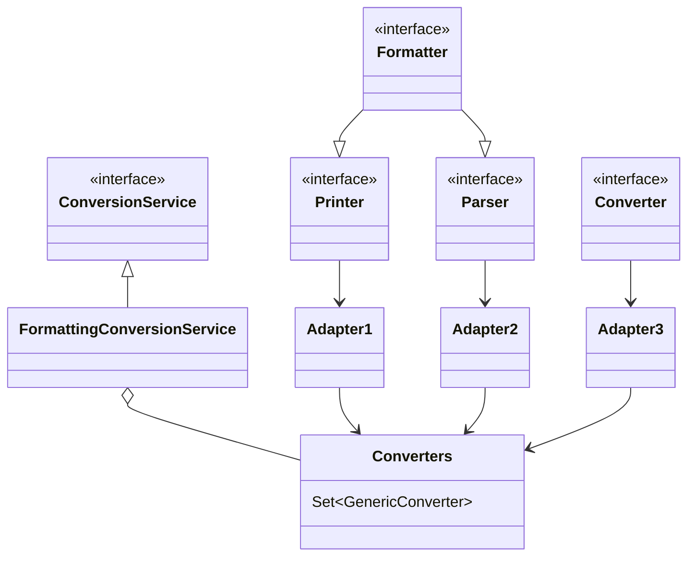
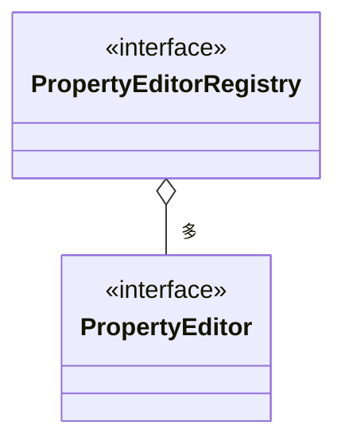
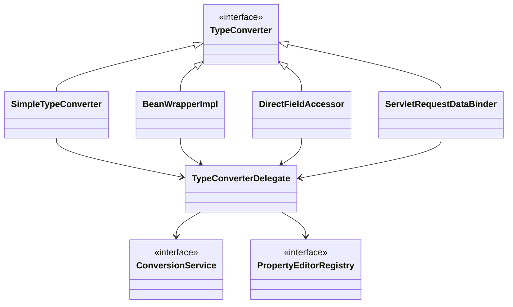
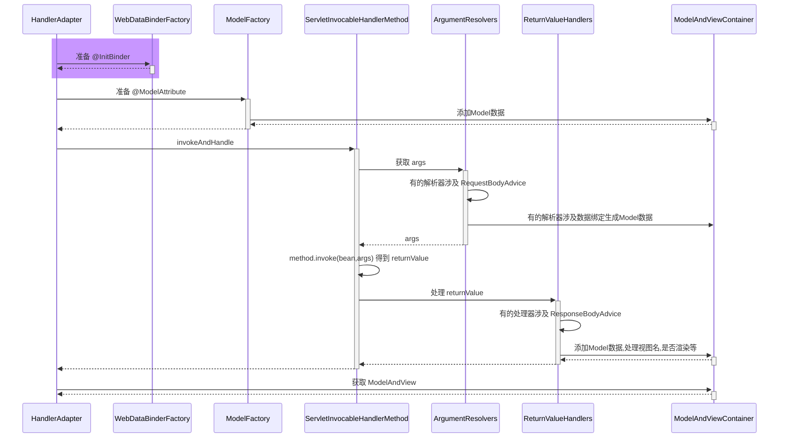
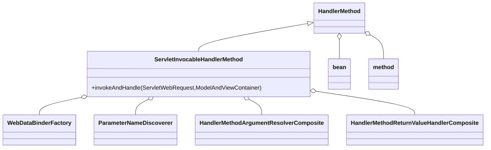
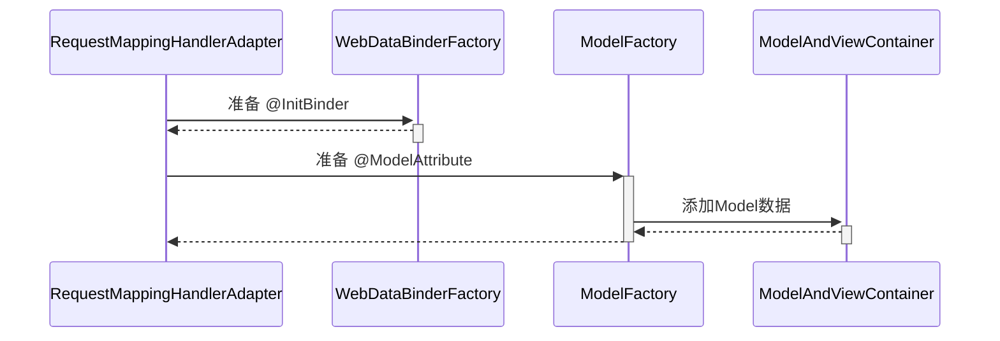
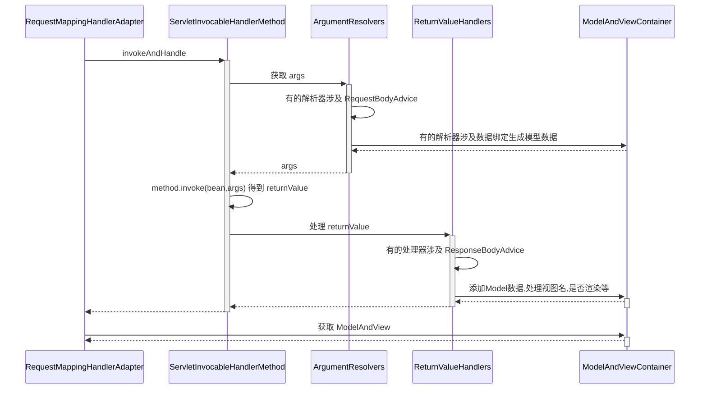
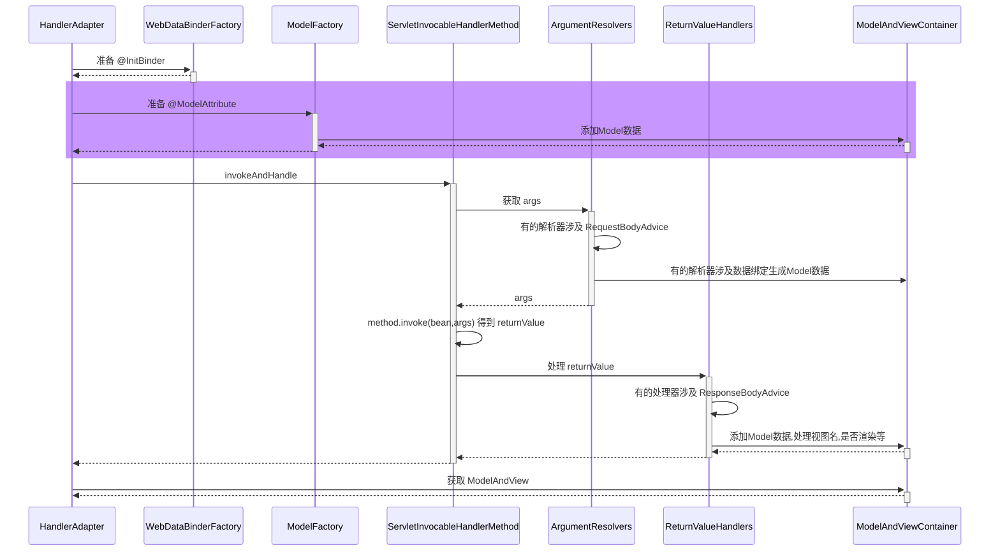
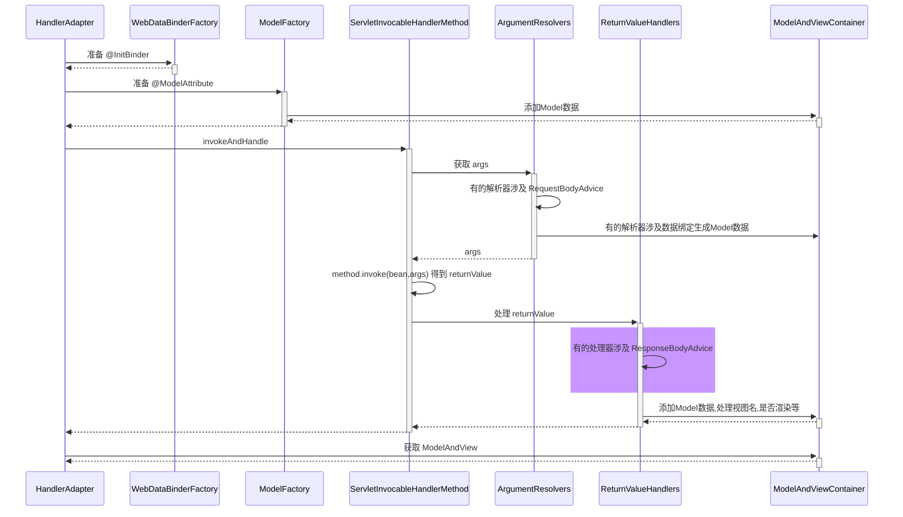

# Spring5：学习笔记

> 最为应用的依赖容器Spring在工作中可谓用的十分频繁，之前学的很浅，最近有空就抽个周末的时间每天学习一点点，一下是原学习视频地址链接及代码链接：
>
> * [学习视频地址](https://www.bilibili.com/video/BV1P44y1N7QG)
> * [代码地址]()

## WEB

### 20. RequestMappingHandlerMapping 与 RequestMappingHandlerAdapter

RequestMappingHandlerMapping 与 RequestMappingHandlerAdapter 俩是一对，分别用来

* 处理 @RequestMapping 映射
* 调用控制器方法、并处理方法参数与方法返回值

#### DispatcherServlet 初始化

```java
public class A20 {

    private static final Logger log = LoggerFactory.getLogger(A20.class);

    public static void main(String[] args) throws Exception {
        AnnotationConfigServletWebServerApplicationContext context =
            new AnnotationConfigServletWebServerApplicationContext(WebConfig.class);

        // 作用：解析 @RequestMapping 以及派生注解，生成路径与控制器方法的映射关系, 在初始化时就生成
        RequestMappingHandlerMapping handlerMapping = context.getBean(RequestMappingHandlerMapping.class);
        // 获取映射结果
        Map<RequestMappingInfo, HandlerMethod> handlerMethods = handlerMapping.getHandlerMethods();
        handlerMethods.forEach((k, v) -> {
            System.out.println(k + "=" + v);
        });
        System.out.println(">>>>>>>>>>>>>>>>>>>>>");
        // 请求来了，获取控制器方法  返回处理器执行链对象
        // MockHttpServletRequest request = new MockHttpServletRequest("GET", "/test1");
        // MockHttpServletRequest request = new MockHttpServletRequest("POST", "/test2");
        // MockHttpServletRequest request = new MockHttpServletRequest("PUT", "/test3");
        MockHttpServletRequest request = new MockHttpServletRequest("GET", "/test4");
        request.setParameter("name", "张三");
        request.addHeader("token", "某个令牌");
        HandlerExecutionChain chain = handlerMapping.getHandler(request);
        System.out.println(chain);
        System.out.println(">>>>>>>>>>>>>>>>>>>>>");

        MockHttpServletResponse response = new MockHttpServletResponse();
        // HandlerAdapter 作用: 调用控制器方法
        MyRequestMappingHandlerAdapter handlerAdapter = context.getBean(MyRequestMappingHandlerAdapter.class);
        handlerAdapter.invokeHandlerMethod(request, response, (HandlerMethod)chain.getHandler());

        // 检查响应
        byte[] content = response.getContentAsByteArray();
        System.out.println(new String(content, StandardCharsets.UTF_8));

        /*System.out.println(">>>>>>>>>>>>>>>>>>>>> 所有参数解析器");
        for (HandlerMethodArgumentResolver resolver : handlerAdapter.getArgumentResolvers()) {
            System.out.println(resolver);
        }

        System.out.println(">>>>>>>>>>>>>>>>>>>>> 所有返回值解析器");
        for (HandlerMethodReturnValueHandler handler : handlerAdapter.getReturnValueHandlers()) {
            System.out.println(handler);
        }*/

        context.close();
    }
}

/**
 * 配置类
 * @author xiaochao
 * @date 2024/11/17 14:15
 */
@Configuration
@ComponentScan
@PropertySource("classpath:application.properties")
@EnableConfigurationProperties({WebMvcProperties.class, ServerProperties.class})
public class WebConfig {

    // ⬅️内嵌 web 容器工厂
    @Bean
    public TomcatServletWebServerFactory tomcatServletWebServerFactory(ServerProperties serverProperties) {
        return new TomcatServletWebServerFactory(serverProperties.getPort());
    }

    // ⬅️创建 DispatcherServlet
    @Bean
    public DispatcherServlet dispatcherServlet() {
        return new DispatcherServlet();
    }

    // ⬅️注册 DispatcherServlet, Spring MVC 的入口
    @Bean
    public DispatcherServletRegistrationBean dispatcherServletRegistrationBean(
        DispatcherServlet dispatcherServlet, WebMvcProperties webMvcProperties) {
        DispatcherServletRegistrationBean registrationBean =
            new DispatcherServletRegistrationBean(dispatcherServlet, "/");
        // tomcat启动时就初始化DispatcherServlet
        int loadOnStartup = webMvcProperties.getServlet().getLoadOnStartup();
        registrationBean.setLoadOnStartup(loadOnStartup);
        return registrationBean;
    }

    // 如果用 DispatcherServlet 初始化时默认添加的组件, 并不会作为 bean, 给测试带来困扰
    // ⬅️1. 加入RequestMappingHandlerMapping
    @Bean
    public RequestMappingHandlerMapping requestMappingHandlerMapping() {
        return new RequestMappingHandlerMapping();
    }

    // ⬅️2. 继续加入RequestMappingHandlerAdapter, 会替换掉 DispatcherServlet 默认的 4 个 HandlerAdapter
    @Bean
    public MyRequestMappingHandlerAdapter requestMappingHandlerAdapter() {
        TokenArgumentResolver tokenArgumentResolver = new TokenArgumentResolver();
        YmlReturnValueHandler ymlReturnValueHandler = new YmlReturnValueHandler();
        MyRequestMappingHandlerAdapter handlerAdapter = new MyRequestMappingHandlerAdapter();
        handlerAdapter.setCustomArgumentResolvers(Collections.singletonList(tokenArgumentResolver));
        handlerAdapter.setCustomReturnValueHandlers(Collections.singletonList(ymlReturnValueHandler));
        return handlerAdapter;
        // return new MyRequestMappingHandlerAdapter();
    }
}

/**
 * 控制器类
 */
@Controller
public class Controller1 {

    private static final Logger log = LoggerFactory.getLogger(Controller1.class);

    @GetMapping("/test1")
    public ModelAndView test1() throws Exception {
        log.debug("test1()");
        return null;
    }

    @PostMapping("/test2")
    public ModelAndView test2(@RequestParam("name") String name) {
        log.debug("test2({})", name);
        return null;
    }

    @PutMapping("/test3")
    public ModelAndView test3(@Token String token) {
        log.debug("test3({})", token);
        return null;
    }

    @RequestMapping("/test4")
    // @ResponseBody
    @Yml
    public User test4() {
        log.debug("test4");
        return new User("张三", 18);
    }

    @Data
    public static class User {
        private String name;
        private int age;

        public User(String name, int age) {
            this.name = name;
            this.age = age;
        }
    }

    public static void main(String[] args) {
        String str = new Yaml().dump(new User("张三", 18));
        System.out.println(str);
    }
}
```

**收获**

1）DispatcherServlet 是在第一次被访问时执行初始化, 也可以通过配置修改为 Tomcat 启动后就初始化

2）在初始化时会从 Spring 容器中找一些 Web 需要的组件, 如 HandlerMapping、HandlerAdapter 等，并逐一调用它们的初始化

3）RequestMappingHandlerMapping 初始化时，会收集所有 @RequestMapping 映射信息，封装为 Map，其中

* key 是 RequestMappingInfo 类型，包括请求路径、请求方法等信息
* value 是 HandlerMethod 类型，包括控制器方法对象、控制器对象
* 有了这个 Map，就可以在请求到达时，快速完成映射，找到 HandlerMethod 并与匹配的拦截器一起返回给 DispatcherServlet

3）RequestMappingHandlerAdapter 初始化时，会准备 HandlerMethod 调用时需要的各个组件，如：

* HandlerMethodArgumentResolver 解析控制器方法参数
* HandlerMethodReturnValueHandler 处理控制器方法返回值

#### 自定义参数与返回值处理器

**参数解析器**

```java
package cn.xyc.a20;

import java.lang.annotation.ElementType;
import java.lang.annotation.Retention;
import java.lang.annotation.RetentionPolicy;
import java.lang.annotation.Target;

/**
 * 例如经常需要用到请求头中的 token 信息, 用下面注解来标注由哪个参数来获取它
 * token=令牌
 * @author xiaochao
 * @date 2024/11/17 15:19
 */
@Target(ElementType.PARAMETER)
@Retention(RetentionPolicy.RUNTIME)
public @interface Token {
}

package cn.xyc.a20;

import org.springframework.core.MethodParameter;
import org.springframework.web.bind.support.WebDataBinderFactory;
import org.springframework.web.context.request.NativeWebRequest;
import org.springframework.web.method.support.HandlerMethodArgumentResolver;
import org.springframework.web.method.support.ModelAndViewContainer;

/**
 * @author xiaochao
 * @date 2024/11/17 15:20
 */
public class TokenArgumentResolver implements HandlerMethodArgumentResolver {
    @Override
    public boolean supportsParameter(MethodParameter parameter) {
        Token token = parameter.getParameterAnnotation(Token.class);
        return token != null;
    }

    @Override
    public Object resolveArgument(MethodParameter parameter, ModelAndViewContainer mavContainer,
        NativeWebRequest webRequest, WebDataBinderFactory binderFactory) throws Exception {
        return webRequest.getHeader("token");
    }
}
```

**返回值处理器**

```java
package cn.xyc.a20;

import java.lang.annotation.ElementType;
import java.lang.annotation.Retention;
import java.lang.annotation.RetentionPolicy;
import java.lang.annotation.Target;

/**
 * @author xiaochao
 * @date 2024/11/17 15:26
 */
@Target(ElementType.METHOD)
@Retention(RetentionPolicy.RUNTIME)
public @interface Yml {
}

package cn.xyc.a20;

import javax.servlet.http.HttpServletResponse;

import org.springframework.core.MethodParameter;
import org.springframework.web.context.request.NativeWebRequest;
import org.springframework.web.method.support.HandlerMethodReturnValueHandler;
import org.springframework.web.method.support.ModelAndViewContainer;
import org.yaml.snakeyaml.Yaml;

/**
 * @author xiaochao
 * @date 2024/11/17 15:26
 */
public class YmlReturnValueHandler implements HandlerMethodReturnValueHandler {
    @Override
    public boolean supportsReturnType(MethodParameter returnType) {
        Yml yml = returnType.getMethodAnnotation(Yml.class);
        return yml != null;
    }

    @Override
    public void handleReturnValue(Object returnValue, MethodParameter returnType, ModelAndViewContainer mavContainer,
        NativeWebRequest webRequest) throws Exception {
        // 1. 转换返回结果为 yaml 字符串
        String str = new Yaml().dump(returnValue);

        // 2. 将 yaml 字符串写入响应
        HttpServletResponse response = webRequest.getNativeResponse(HttpServletResponse.class);
        response.setContentType("text/plain;charset=utf-8");
        response.getWriter().print(str);

        // 3. 设置请求已经处理完毕
        mavContainer.setRequestHandled(true);
    }
}
```

**收获**：体会参数解析器的作用、体会返回值处理器的作用

### 21. 参数解析器

```java
/**
 * 配置类
 * @author xiaochao
 * @date 2024/11/23 11:53
 */
@Configuration
public class WebConfig {
}

/**
 * 目标: 解析控制器方法的参数值
 * <p>
 * 常见的参数处理器如下: 略
 *
 * @author xiaochao
 * @date 2024/11/17 15:46
 */
public class A21 {

    public static void main(String[] args) throws Exception {
        AnnotationConfigApplicationContext context = new AnnotationConfigApplicationContext(WebConfig.class);
        ConfigurableListableBeanFactory beanFactory = context.getBeanFactory();
        // 准备测试 Request
        HttpServletRequest request = mockRequest();

        // 要点1. 控制器方法被封装为 HandlerMethod
        HandlerMethod handlerMethod = new HandlerMethod(new Controller(),
            Controller.class.getMethod("test", String.class, String.class, int.class, String.class, MultipartFile.class,
                int.class, String.class, String.class, String.class, HttpServletRequest.class, User.class, User.class,
                User.class));

        // 要点2. 准备对象绑定与类型转换
        DefaultDataBinderFactory factory = new ServletRequestDataBinderFactory(null, null);

        // 要点3. 准备 ModelAndViewContainer 用来存储中间 Model 结果
        ModelAndViewContainer container = new ModelAndViewContainer();

        // 要点4. 解析每个参数值
        for (MethodParameter parameter : handlerMethod.getMethodParameters()) {
            // 注解获取
            String annotations =
                Arrays.stream(parameter.getParameterAnnotations()).map(a -> a.annotationType().getSimpleName())
                    .collect(Collectors.joining());
            String annotationsStr = annotations.length() > 0 ? " @" + annotations + " " : " ";
            // 参数名称解析器
            parameter.initParameterNameDiscovery(new DefaultParameterNameDiscoverer());

            /*// RequestParamMethodArgumentResolver中，param2中：false表示必须有@RequestParam注解才会解析；true表示省略了注解也会去解析
            RequestParamMethodArgumentResolver resolver = new RequestParamMethodArgumentResolver(beanFactory, true);*/
            // 多个解析器组合
            HandlerMethodArgumentResolverComposite composite = new HandlerMethodArgumentResolverComposite();
            composite.addResolvers(
                // @RequestParam解析器，param2中：false表示必须有@RequestParam注解才会解析；true表示省略了注解也会去解析
                new RequestParamMethodArgumentResolver(beanFactory, false),
                // @PathVariable解析器
                new PathVariableMethodArgumentResolver(),
                // @RequestHeader解析器
                new RequestHeaderMethodArgumentResolver(beanFactory),
                // @CookieValue解析器
                new ServletCookieValueMethodArgumentResolver(beanFactory),
                // 解析${} #{}
                new ExpressionValueMethodArgumentResolver(beanFactory),
                // 解析HttpServletRequest，根据参数类型解析
                new ServletRequestMethodArgumentResolver(),
                // @ModelAttribute解析器，false：必须有 @ModelAttribute
                new ServletModelAttributeMethodProcessor(false),
                // @RequestBody解析器
                new RequestResponseBodyMethodProcessor(Arrays.asList(new MappingJackson2HttpMessageConverter())),
                // @ModelAttribute解析器，true：省略 @ModelAttribute，注意：和RequestResponseBodyMethodProcessor的位置
                new ServletModelAttributeMethodProcessor(true),
                // @RequestParam解析器，param2中：true表示省略了注解也会去解析
                new RequestParamMethodArgumentResolver(beanFactory, true)
            );

            Object v = null;
            if (composite.supportsParameter(parameter)) {
                // 支持此参数
                v = composite.resolveArgument(parameter, container, new ServletWebRequest(request), factory);
            }
            System.out.println(
                "[" + parameter.getParameterIndex() + "] " + annotationsStr+ parameter.getParameterType().getSimpleName()
                    + "  " + parameter.getParameterName() + "->" + (v != null ? v + "  [" + v.getClass() + "]" : ""));
            // System.out.println("模型数据为：" + container.getModel());
        }
    }

    static class Controller {
        public void test(@RequestParam("name1") String name1, // name1=张三
            String name2,                        // name2=李四
            @RequestParam("age") int age,        // age=18
            @RequestParam(name="home", defaultValue="${JAVA_HOME}") String home1,  // spring获取数据
            @RequestParam("file") MultipartFile file,   // 上传文件
            @PathVariable("id") int id,                 //  /test/124   /test/{id}
            @RequestHeader("Content-Type") String header,
            @CookieValue("token") String token,
            @Value("${JAVA_HOME}") String home2,        // spring 获取数据  ${} #{}
            HttpServletRequest request,                 // request, response, session ...
            @ModelAttribute("modelName") User user1,    // name=zhang&age=18
            User user2,                                 // name=zhang&age=18
            @RequestBody User user3                     // json
        ) {
            // 空方法
        }
    }

    private static HttpServletRequest mockRequest() {
        MockHttpServletRequest request = new MockHttpServletRequest();
        request.setParameter("name1", "zhangsan");
        request.setParameter("name2", "lisi");
        request.addPart(new MockPart("file", "abc", "hello".getBytes(StandardCharsets.UTF_8)));
        Map<String, String> map = new AntPathMatcher().extractUriTemplateVariables("/test/{id}", "/test/123");
        // System.out.println(map);
        request.setAttribute(HandlerMapping.URI_TEMPLATE_VARIABLES_ATTRIBUTE, map);
        request.setContentType("application/json");
        request.setCookies(new Cookie("token", "123456"));
        request.setParameter("name", "张三");
        request.setParameter("age", "18");
        String content = "{\n" + "\t\"name\": \"李四\",\n" + "\t\"age\": 20\n" + "}";
        request.setContent(content.getBytes(StandardCharsets.UTF_8));

        return new StandardServletMultipartResolver().resolveMultipart(request);
    }

    @Data
    static class User {
        private String name;
        private int age;

        @Override
        public String toString() {
            return "User{" + "name='" + name + '\'' + ", age=" + age + '}';
        }
    }
}
```

输出：

```
[0]  @RequestParam String  name1->zhangsan  [class java.lang.String]
[1]  String  name2->lisi  [class java.lang.String]
[2]  @RequestParam int  age->18  [class java.lang.Integer]
[3]  @RequestParam String  home1->/Library/Java/JavaVirtualMachines/jdk1.8.0_311.jdk/Contents/Home  [class java.lang.String]
[4]  @RequestParam MultipartFile  file->org.springframework.web.multipart.support.StandardMultipartHttpServletRequest$StandardMultipartFile@6dd7b5a3  [class org.springframework.web.multipart.support.StandardMultipartHttpServletRequest$StandardMultipartFile]
[5]  @PathVariable int  id->123  [class java.lang.Integer]
[6]  @RequestHeader String  header->application/json  [class java.lang.String]
[7]  @CookieValue String  token->123456  [class java.lang.String]
[8]  @Value String  home2->/Library/Java/JavaVirtualMachines/jdk1.8.0_311.jdk/Contents/Home  [class java.lang.String]
[9]  HttpServletRequest  request->org.springframework.web.multipart.support.StandardMultipartHttpServletRequest@5f20155b  [class org.springframework.web.multipart.support.StandardMultipartHttpServletRequest]
[10]  @ModelAttribute User  user1->User{name='张三', age=18}  [class cn.xyc.a21.A21$User]
[11]  User  user2->User{name='张三', age=18}  [class cn.xyc.a21.A21$User]
[12]  @RequestBody User  user3->User{name='李四', age=20}  [class cn.xyc.a21.A21$User]
```

**收获**

初步了解 RequestMappingHandlerAdapter 的调用过程
1. 控制器方法被封装为 HandlerMethod
2. 准备对象绑定与类型转换
3. 准备 ModelAndViewContainer 用来存储中间 Model 结果
4. 解析每个参数值

解析参数依赖的就是各种参数解析器，它们都有两个重要方法
* supportsParameter 判断是否支持方法参数
* resolveArgument 解析方法参数

常见参数的解析
* @RequestParam
* 省略 @RequestParam
* @RequestParam(defaultValue)
* MultipartFile
* @PathVariable
* @RequestHeader
* @CookieValue
* @Value
* HttpServletRequest 等
* @ModelAttribute
* 省略 @ModelAttribute
* @RequestBody

组合模式在 Spring 中的体现

@RequestParam， @CookieValue 等注解中的参数名、默认值，都可以写成活的，即从 ${ } #{ }中获取

### 22. 参数名解析

不在Idea的src目录下新建类

```java
public class Bean1 {
    public void foo(String name, int age) {
    }
}
```

通过命令行编译 Bean1.java文件：`javac ./Bean1.java`，生成的Bean1.class文件如下：

```java
//
// Source code recreated from a .class file by IntelliJ IDEA
// (powered by FernFlower decompiler)
//

public class Bean1 {
    public Bean1() {
    }

    public void foo(String var1, int var2) {
    }
}
```

可以看到参数名丢失了

#### 编译带上参数名（方式1）

通过命令行编译 Bean1.java文件：`javac -parameters ./Bean1.java`，生成的Bean1.class文件如下：

```java
//
// Source code recreated from a .class file by IntelliJ IDEA
// (powered by FernFlower decompiler)
//

public class Bean1 {
    public Bean1() {
    }

    public void foo(String name, int age) {
    }
}
```

可以看到是有参数名的，通过反编译命令`javap -c -v ./Bean1.class`查看如下

```java
zhuchengchao@xiaochaodeMBP codeTest % javap -c -v ./Bean1.class 
Classfile /Users/zhuchengchao/Desktop/业务学习/个人学习/codeTest/Bean1.class
  Last modified 2024-11-23; size 301 bytes
  MD5 checksum e2d16d91f5fceaac9067ad7815242f41
  Compiled from "Bean1.java"
public class Bean1
  minor version: 0
  major version: 52
  flags: ACC_PUBLIC, ACC_SUPER
Constant pool:
   #1 = Methodref          #3.#15         // java/lang/Object."<init>":()V
   #2 = Class              #16            // Bean1
   #3 = Class              #17            // java/lang/Object
   #4 = Utf8               <init>
   #5 = Utf8               ()V
   #6 = Utf8               Code
   #7 = Utf8               LineNumberTable
   #8 = Utf8               foo
   #9 = Utf8               (Ljava/lang/String;I)V
  #10 = Utf8               MethodParameters
  #11 = Utf8               name
  #12 = Utf8               age
  #13 = Utf8               SourceFile
  #14 = Utf8               Bean1.java
  #15 = NameAndType        #4:#5          // "<init>":()V
  #16 = Utf8               Bean1
  #17 = Utf8               java/lang/Object
{
  public Bean1();
    descriptor: ()V
    flags: ACC_PUBLIC
    Code:
      stack=1, locals=1, args_size=1
         0: aload_0
         1: invokespecial #1                  // Method java/lang/Object."<init>":()V
         4: return
      LineNumberTable:
        line 1: 0

  public void foo(java.lang.String, int);
    descriptor: (Ljava/lang/String;I)V
    flags: ACC_PUBLIC
    Code:
      stack=0, locals=3, args_size=3
         0: return
      LineNumberTable:
        line 4: 0
    MethodParameters:
      Name                           Flags
      name
      age
}
SourceFile: "Bean1.java"
```

在MethodParameters中记录了变量名称，**可以通过反射获取到**

#### 编译带上参数名（方式2）

通过命令行编译 Bean1.java文件：`javac -g ./Bean1.java`，生成的Bean1.class文件如下：

```java
zhuchengchao@xiaochaodeMBP codeTest % javap -c -v ./Bean1.class
Classfile /Users/zhuchengchao/Desktop/业务学习/个人学习/codeTest/Bean1.class
  Last modified 2024-11-23; size 386 bytes
  MD5 checksum 1706b200492325113207bea2bbe43de6
  Compiled from "Bean1.java"
public class Bean1
  minor version: 0
  major version: 52
  flags: ACC_PUBLIC, ACC_SUPER
Constant pool:
   #1 = Methodref          #3.#19         // java/lang/Object."<init>":()V
   #2 = Class              #20            // Bean1
   #3 = Class              #21            // java/lang/Object
   #4 = Utf8               <init>
   #5 = Utf8               ()V
   #6 = Utf8               Code
   #7 = Utf8               LineNumberTable
   #8 = Utf8               LocalVariableTable
   #9 = Utf8               this
  #10 = Utf8               LBean1;
  #11 = Utf8               foo
  #12 = Utf8               (Ljava/lang/String;I)V
  #13 = Utf8               name
  #14 = Utf8               Ljava/lang/String;
  #15 = Utf8               age
  #16 = Utf8               I
  #17 = Utf8               SourceFile
  #18 = Utf8               Bean1.java
  #19 = NameAndType        #4:#5          // "<init>":()V
  #20 = Utf8               Bean1
  #21 = Utf8               java/lang/Object
{
  public Bean1();
    descriptor: ()V
    flags: ACC_PUBLIC
    Code:
      stack=1, locals=1, args_size=1
         0: aload_0
         1: invokespecial #1                  // Method java/lang/Object."<init>":()V
         4: return
      LineNumberTable:
        line 1: 0
      LocalVariableTable:
        Start  Length  Slot  Name   Signature
            0       5     0  this   LBean1;

  public void foo(java.lang.String, int);
    descriptor: (Ljava/lang/String;I)V
    flags: ACC_PUBLIC
    Code:
      stack=0, locals=3, args_size=3
         0: return
      LineNumberTable:
        line 4: 0
      LocalVariableTable:
        Start  Length  Slot  Name   Signature
            0       1     0  this   LBean1;
            0       1     1  name   Ljava/lang/String;
            0       1     2   age   I
}
SourceFile: "Bean1.java"

```

变量信息在LocalVariableTable中，**反射获取不到，但是可以通过ASM获取到**

#### 两种方式获取参数名

> 需要把上述的目录添加到工程目录下（麻烦，没弄）

```java
/**
 * 目标: 如何获取方法参数名, 注意把 a22 目录添加至模块的类路径
 *         1. a22 不在 src 是避免 idea 自动编译它下面的类
 *         2. spring boot 在编译时会加 -parameters
 *         3. 大部分 IDE 编译时都会加 -g
 *
 * @author xiaochao
 * @date 2024/11/23 15:27
 */
public class A22 {

    public static void main(String[] args) throws NoSuchMethodException, ClassNotFoundException {
        // 1. 反射获取参数名
        Method foo = Bean1.class.getMethod("foo", String.class, int.class);
        /*for (Parameter parameter : foo.getParameters()) {
            System.out.println(parameter.getName());
        }*/

        // 2. 基于 LocalVariableTable 本地变量表
        LocalVariableTableParameterNameDiscoverer discoverer = new LocalVariableTableParameterNameDiscoverer();
        String[] parameterNames = discoverer.getParameterNames(foo);
        System.out.println(Arrays.toString(parameterNames));

        /*
            学到了什么
                a. 如果编译时添加了 -parameters 可以生成参数表, 反射时就可以拿到参数名
                b. 如果编译时添加了 -g 可以生成调试信息, 但分为两种情况
                    1. 普通类, 会包含局部变量表, 用 asm 可以拿到参数名
                    2. 接口, 不会包含局部变量表, 无法获得参数名 (这也是 MyBatis 在实现 Mapper 接口时为何要提供 @Param 注解来辅助获得参数名)
         */
    }
}
```

#### 总结

如果编译时添加了 -parameters 可以生成参数表（MethodParameters），**反射时就可以拿到参数名**

如果编译时添加了 -g 可以生成调试信息，但分为两种情况
* 普通类，会包含局部变量表（LocalVariableTable），用 asm 可以拿到参数名
* 接口，不会包含局部变量表，无法获得参数名（这也是 MyBatis 在实现 Mapper 接口时为何要提供 @Param 注解来辅助获得参数名）

### 23. 对象绑定与类型转换

#### 底层转换接口

**底层第一套转换接口与实现**



Printer 把其它类型转为 String

Parser 把 String 转为其它类型

Formatter 综合 Printer 与 Parser 功能

Converter 把类型 S 转为类型 T

Printer、Parser、Converter 经过适配转换成 GenericConverter 放入 Converters 集合

FormattingConversionService 利用其它们实现转换

**底层第二套转换接口**



PropertyEditor 把 String 与其它类型相互转换

PropertyEditorRegistry 可以注册多个 PropertyEditor 对象

与第一套接口直接可以通过 FormatterPropertyEditorAdapter 来进行适配

#### 高层接口与实现



它们都实现了 TypeConverter 这个高层转换接口，在转换时，会用到 TypeConverter Delegate 委派ConversionService 与 PropertyEditorRegistry 真正执行转换（Facade 门面模式）
* 首先看是否有自定义转换器， @InitBinder 添加的即属于这种 (用了适配器模式把 Formatter 转为需要的 PropertyEditor)
* 再看有没有 ConversionService 转换
* 再利用默认的 PropertyEditor 转换
* 最后有一些特殊处理

SimpleTypeConverter 仅做类型转换

BeanWrapperImpl 为 bean 的属性赋值，当需要时做类型转换，走 Property

DirectFieldAccessor 为 bean 的属性赋值，当需要时做类型转换，走 Field

ServletRequestDataBinder 为 bean 的属性执行绑定，当需要时做类型转换，根据 directFieldAccess 选择走 Property 还是 Field，具备校验与获取校验结果功能

#### 类型转换与数据绑定

**SimpleTypeConverter用法**

```java
package cn.xyc.a23;

import java.util.Date;

import org.springframework.beans.SimpleTypeConverter;

/**
 * SimpleTypeConverter：仅做类型转换
 *
 * @author xiaochao
 * @date 2024/11/23 16:12
 */
public class TestSimpleConverter {

    public static void main(String[] args) {
        // 仅有类型转换的功能
        SimpleTypeConverter typeConverter = new SimpleTypeConverter();
        Integer number = typeConverter.convertIfNecessary("13", int.class);
        System.out.println(number);
        Date date = typeConverter.convertIfNecessary("1999/03/04", Date.class);
        System.out.println(date);
    }
}
```

**BeanWrapperImpl 测试**

```java
package cn.xyc.a23;

import java.util.Date;

import org.springframework.beans.BeanWrapperImpl;

/**
 * BeanWrapperImpl 测试：为 bean 的属性赋值，当需要时做类型转换，走 Property
 * @author xiaochao
 * @date 2024/11/23 16:14
 */
public class TestBeanWrapper {

    public static void main(String[] args) {
        // 利用反射原理, 为 bean 的属性赋值
        MyBean target = new MyBean();
        BeanWrapperImpl wrapper = new BeanWrapperImpl(target);
        wrapper.setPropertyValue("a", "10");
        wrapper.setPropertyValue("b", "hello");
        wrapper.setPropertyValue("c", "1999/03/04");
        System.out.println(target);
    }

    @Data
    static class MyBean {
        private int a;
        private String b;
        private Date c;

        @Override
        public String toString() {
            return "MyBean{" +
                "a=" + a +
                ", b='" + b + '\'' +
                ", c=" + c +
                '}';
        }
    }
}
```

**测试DirectFieldAccessor**

```java
package cn.xyc.a23;

import java.util.Date;

import org.springframework.beans.DirectFieldAccessor;

/**
 * 测试DirectFieldAccessor：为 bean 的属性赋值，当需要时做类型转换，走 Field
 *
 * @author xiaochao
 * @date 2024/11/23 16:16
 */
public class TestFieldAccessor {

    public static void main(String[] args) {
        // 利用反射原理, 为 bean 的属性赋值
        MyBean target = new MyBean();
        DirectFieldAccessor accessor = new DirectFieldAccessor(target);
        accessor.setPropertyValue("a", "10");
        accessor.setPropertyValue("b", "hello");
        accessor.setPropertyValue("c", "1999/03/04");
        System.out.println(target);
    }

    static class MyBean {
        private int a;
        private String b;
        private Date c;
        
        @Override
        public String toString() {
            return "MyBean{" +
                "a=" + a +
                ", b='" + b + '\'' +
                ", c=" + c +
                '}';
        }
    }

}
```

**测试DataBinder**

```java
package cn.xyc.a23;

import java.util.Date;

import org.springframework.beans.MutablePropertyValues;
import org.springframework.validation.DataBinder;

/**
 * 测试DataBinder
 *
 * @author xiaochao
 * @date 2024/11/23 16:17
 */
public class TestDataBinder {
    public static void main(String[] args) {
        // 执行数据绑定
        MyBean target = new MyBean();
        DataBinder dataBinder = new DataBinder(target);
        // 根据 directFieldAccess 选择走 Property 还是 Field，具备校验与获取校验结果功能
        dataBinder.initDirectFieldAccess();
        MutablePropertyValues pvs = new MutablePropertyValues();
        pvs.add("a", "10");
        pvs.add("b", "hello");
        pvs.add("c", "1999/03/04");
        dataBinder.bind(pvs);
        System.out.println(target);
    }

    static class MyBean {
        private int a;
        private String b;
        private Date c;

        @Override
        public String toString() {
            return "MyBean{" +
                "a=" + a +
                ", b='" + b + '\'' +
                ", c=" + c +
                '}';
        }
    }
}
```

**测试web环境下的ServletRequestDataBinder**

```java
package cn.xyc.a23;

import java.util.Date;

import org.springframework.mock.web.MockHttpServletRequest;
import org.springframework.web.bind.ServletRequestDataBinder;
import org.springframework.web.bind.ServletRequestParameterPropertyValues;

import lombok.Data;

/**
 * 测试web环境下的ServletRequestDataBinder：为 bean 的属性执行绑定，当需要时做类型转换，根据 directFieldAccess 选择走 Property 还是 Field，具备校验与获取校验结果功能
 *
 * @author xiaochao
 * @date 2024/11/23 16:27
 */
public class TestServletDataBinder {

    public static void main(String[] args) {
        // web 环境下数据绑定
        MyBean target = new MyBean();
        ServletRequestDataBinder dataBinder = new ServletRequestDataBinder(target);
        MockHttpServletRequest request = new MockHttpServletRequest();
        request.setParameter("a", "10");
        request.setParameter("b", "hello");
        request.setParameter("c", "1999/03/04");

        dataBinder.bind(new ServletRequestParameterPropertyValues(request));

        System.out.println(target);
    }

    @Data
    static class MyBean {
        private int a;
        private String b;
        private Date c;

        @Override
        public String toString() {
            return "MyBean{" +
                "a=" + a +
                ", b='" + b + '\'' +
                ", c=" + c +
                '}';
        }
    }
}
```

**收获**：基本的类型转换与数据绑定用法

* SimpleTypeConverter
* BeanWrapperImpl
* DirectFieldAccessor
* ServletRequestDataBinder

#### 数据绑定工厂

**ServletRequestDataBinderFactory用法**

```java
/**
 * 测试：cn.xyc.a23.TestServletDataBinderFactory
 *
 * @author xiaochao
 * @date 2024/11/23 16:29
 */
public class TestServletDataBinderFactory {

    public static void main(String[] args) throws Exception {

        MockHttpServletRequest request = new MockHttpServletRequest();
        request.setParameter("birthday", "1999|01|02");
        request.setParameter("address.name", "西安");

        User target = new User();
        // "1. 用工厂, 无转换功能"
        /*ServletRequestDataBinderFactory factory = new ServletRequestDataBinderFactory(null, null);*/

        // "2. 用 @InitBinder 转换"  通过：PropertyEditorRegistry PropertyEditor
        /*InvocableHandlerMethod method =
            new InvocableHandlerMethod(new MyController(), MyController.class.getMethod("aaa", WebDataBinder.class));
        ServletRequestDataBinderFactory factory = new ServletRequestDataBinderFactory(Arrays.asList(method), null);*/

        // "3. 用 ConversionService 转换"    ConversionService Formatter
        /*FormattingConversionService service = new FormattingConversionService();
        service.addFormatter(new MyDateFormatter("用 ConversionService 方式扩展转换功能"));
        ConfigurableWebBindingInitializer initializer = new ConfigurableWebBindingInitializer();
        initializer.setConversionService(service);
        ServletRequestDataBinderFactory factory = new ServletRequestDataBinderFactory(null, initializer);*/

        // "4. 同时加了 @InitBinder 和 ConversionService" 时 先用@InitBinder转换
        /*InvocableHandlerMethod method =
            new InvocableHandlerMethod(new MyController(), MyController.class.getMethod("aaa", WebDataBinder.class));
        FormattingConversionService service = new FormattingConversionService();
        service.addFormatter(new MyDateFormatter("用 ConversionService 方式扩展转换功能"));
        ConfigurableWebBindingInitializer initializer = new ConfigurableWebBindingInitializer();
        initializer.setConversionService(service);
        ServletRequestDataBinderFactory factory = new ServletRequestDataBinderFactory(Arrays.asList(method), initializer);*/

        // "5. 使用默认 ConversionService 转换" 配合使用注解 @DateTimeFormat(pattern = "yyyy|MM|dd")
        DefaultFormattingConversionService service = new DefaultFormattingConversionService();
        // SpringBoot可使用
        // ApplicationConversionService service = new ApplicationConversionService();
        ConfigurableWebBindingInitializer initializer = new ConfigurableWebBindingInitializer();
        initializer.setConversionService(service);
        ServletRequestDataBinderFactory factory = new ServletRequestDataBinderFactory(null, initializer);

        WebDataBinder dataBinder = factory.createBinder(new ServletWebRequest(request), target, "user");
        dataBinder.bind(new ServletRequestParameterPropertyValues(request));
        System.out.println(target);
    }

    static class MyController {
        @InitBinder
        public void aaa(WebDataBinder dataBinder) {
            // 扩展 dataBinder 的转换器
            dataBinder.addCustomFormatter(new MyDateFormatter("用 @InitBinder 方式扩展的"));
        }
    }

    @Data
    public static class User {
        @DateTimeFormat(pattern = "yyyy|MM|dd")  // 方式5
        private Date birthday;
        private Address address;

        @Override
        public String toString() {
            return "User{" + "birthday=" + birthday + ", address=" + address + '}';
        }
    }

    @Data
    public static class Address {
        private String name;

        @Override
        public String toString() {
            return "Address{" + "name='" + name + '\'' + '}';
        }
    }
}
```

> 类：MyDateFormatter：cn.xyc.a23.MyDateFormatter
>
> ```java
> public class MyDateFormatter implements Formatter<Date> {
> 
>     private static final Logger log = LoggerFactory.getLogger(MyDateFormatter.class);
> 
>     private final String desc;
> 
>     public MyDateFormatter(String desc) {
>         this.desc = desc;
>     }
> 
>     @Override
>     public String print(Date date, Locale locale) {
>         SimpleDateFormat sdf = new SimpleDateFormat("yyyy|MM|dd");
>         return sdf.format(date);
>     }
> 
>     @Override
>     public Date parse(String text, Locale locale) throws ParseException {
>         log.debug(">>>>>> 进入了: {}", desc);
>         SimpleDateFormat sdf = new SimpleDateFormat("yyyy|MM|dd");
>         return sdf.parse(text);
>     }
> }
> ```

**收获**

ServletRequestDataBinderFactory 的用法和扩展点

1. 可以解析控制器的 @InitBinder 标注方法作为扩展点，添加自定义转换器
   * 控制器私有范围
2. 可以通过 ConfigurableWebBindingInitializer 配置 ConversionService 作为扩展点，添加自定义转换器
   * 公共范围
3. 同时加了 @InitBinder 和 ConversionService 的转换优先级
   1. 优先采用 @InitBinder 的转换器
   2. 其次使用 ConversionService 的转换器
   3. 使用默认转换器
   4. 特殊处理（例如有参构造）

#### 获取泛型参数

```java
/**
 * cn.xyc.a23.sub.TestGenericType
 * @author xiaochao
 * @date 2024/11/23 17:22
 */
public class TestGenericType {
    public static void main(String[] args) {

        // 小技巧
        // 1. java api
        System.out.println(">>>>>>>>>>>>>>>>>>>>>>>");
        // cn.xyc.a23.sub.TeacherDao
        Type type = TeacherDao.class.getGenericSuperclass();
        System.out.println(type);
        
        if (type instanceof ParameterizedType) {
            ParameterizedType parameterizedType = (ParameterizedType)type;
            System.out.println(parameterizedType.getActualTypeArguments()[0]);
        }

        // 2. spring api 1
        System.out.println(">>>>>>>>>>>>>>>>>>>>>>>");
        Class<?> t = GenericTypeResolver.resolveTypeArgument(TeacherDao.class, BaseDao.class);
        System.out.println(t);

        // 3. spring api 2
        System.out.println(">>>>>>>>>>>>>>>>>>>>>>>");
        System.out.println(ResolvableType.forClass(TeacherDao.class).getSuperType().getGeneric().resolve());
    }
}
```

**收获**

java api 获取泛型参数

spring api 获取泛型参数

### 24. @ControllerAdvice 之 @InitBinder

**准备 @InitBinder** 在整个 HandlerAdapter 调用过程中所处的位置



RequestMappingHandlerAdapter 在图中缩写为 HandlerAdapter

HandlerMethodArgumentResolverComposite 在图中缩写为 ArgumentResolvers

HandlerMethodReturnValueHandlerComposite 在图中缩写为 ReturnValueHandlers

```java
/**
 * cn.xyc.a24.A24
 * @author xiaochao
 * @date 2024/11/23 18:45
 */
public class A24 {

    private static final Logger log = LoggerFactory.getLogger(A24.class);

    public static void main(String[] args) throws Exception {
        /*
            @InitBinder 的来源有两个
            1. @ControllerAdvice 中 @InitBinder 标注的方法，由 RequestMappingHandlerAdapter 在初始化时解析并记录
            2. @Controller 中 @InitBinder 标注的方法，由 RequestMappingHandlerAdapter 会在控制器方法首次执行时解析并记录
         */

        AnnotationConfigApplicationContext context =
            new AnnotationConfigApplicationContext(WebConfig.class);

        RequestMappingHandlerAdapter handlerAdapter = new RequestMappingHandlerAdapter();
        handlerAdapter.setApplicationContext(context);
        handlerAdapter.afterPropertiesSet();

        log.debug("1. 刚开始...");
        showBindMethods(handlerAdapter);

        Method getDataBinderFactory = RequestMappingHandlerAdapter.class.getDeclaredMethod("getDataBinderFactory", HandlerMethod.class);
        getDataBinderFactory.setAccessible(true);

        log.debug("2. 模拟调用 Controller1 的 foo 方法时 ...");
        getDataBinderFactory.invoke(handlerAdapter, new HandlerMethod(new WebConfig.Controller1(), WebConfig.Controller1.class.getMethod("foo")));
        showBindMethods(handlerAdapter);

        log.debug("3. 模拟调用 Controller2 的 bar 方法时 ...");
        getDataBinderFactory.invoke(handlerAdapter, new HandlerMethod(new WebConfig.Controller2(), WebConfig.Controller2.class.getMethod("bar")));
        showBindMethods(handlerAdapter);

        context.close();

        /*
            学到了什么
                a. Method 对象的获取利用了缓存来进行加速
                b. 绑定器工厂的扩展点(advice 之一), 通过 @InitBinder 扩展类型转换器
         */
    }

    @SuppressWarnings("all")
    private static void showBindMethods(RequestMappingHandlerAdapter handlerAdapter) throws NoSuchFieldException, IllegalAccessException {
        Field initBinderAdviceCache = RequestMappingHandlerAdapter.class.getDeclaredField("initBinderAdviceCache");
        initBinderAdviceCache.setAccessible(true);
        Map<ControllerAdviceBean, Set<Method>> globalMap = (Map<ControllerAdviceBean, Set<Method>>) initBinderAdviceCache.get(handlerAdapter);
        log.debug("全局的 @InitBinder 方法 {}",
            globalMap.values().stream()
                .flatMap(ms -> ms.stream().map(m -> m.getName()))
                .collect(Collectors.toList())
        );

        Field initBinderCache = RequestMappingHandlerAdapter.class.getDeclaredField("initBinderCache");
        initBinderCache.setAccessible(true);
        Map<Class<?>, Set<Method>> controllerMap = (Map<Class<?>, Set<Method>>) initBinderCache.get(handlerAdapter);
        log.debug("控制器的 @InitBinder 方法 {}",
            controllerMap.entrySet().stream()
                .flatMap(e -> e.getValue().stream().map(v -> e.getKey().getSimpleName() + "." + v.getName()))
                .collect(Collectors.toList())
        );
    }
}

/**
 * 配置类：cn.xyc.a24.WebConfig
 * @author xiaochao
 * @date 2024/11/23 18:47
 */
@Configuration
public class WebConfig {

    @ControllerAdvice
    static class MyControllerAdvice {
        @InitBinder
        public void binder3(WebDataBinder webDataBinder) {
            webDataBinder.addCustomFormatter(new MyDateFormatter("binder3 转换器"));
        }
    }

    @Controller
    static class Controller1 {
        @InitBinder
        public void binder1(WebDataBinder webDataBinder) {
            webDataBinder.addCustomFormatter(new MyDateFormatter("binder1 转换器"));
        }

        public void foo() {
        }
    }

    @Controller
    static class Controller2 {
        @InitBinder
        public void binder21(WebDataBinder webDataBinder) {
            webDataBinder.addCustomFormatter(new MyDateFormatter("binder21 转换器"));
        }

        @InitBinder
        public void binder22(WebDataBinder webDataBinder) {
            webDataBinder.addCustomFormatter(new MyDateFormatter("binder22 转换器"));
        }

        public void bar() {
        }
    }
}
```

**收获**

RequestMappingHandlerAdapter 初始化时会解析 @ControllerAdvice 中的 @InitBinder 方法

RequestMappingHandlerAdapter 会以类为单位，在该类首次使用时，解析此类的 @InitBinder 方法

以上两种 @InitBinder 的解析结果都会缓存来避免重复解析

控制器方法调用时，会综合利用本类的 @InitBinder 方法和 @ControllerAdvice 中的 @InitBinder 方法创建绑定工厂

### 25. 控制器方法执行流程

#### 执行流程-1



HandlerMethod 需要

* bean 即是哪个 Controller
* method 即是 Controller 中的哪个方法

ServletInvocableHandlerMethod 需要

* WebDataBinderFactory 负责对象绑定、类型转换
* ParameterNameDiscoverer 负责参数名解析
* HandlerMethodArgumentResolverComposite 负责解析参数
* HandlerMethodReturnValueHandlerComposite 负责处理返回值

#### 执行流程-2



#### 执行流程-3



#### 演示代码

见26中的代码

### 26. @ControllerAdvice 之 @ModelAttribute

```java
/**
 * 配置类：cn.xyc.a26.WebConfig
 * @author xiaochao
 * @date 2024/11/23 18:55
 */
@Configuration
public class WebConfig {

    @ControllerAdvice
    static class MyControllerAdvice {
        @ModelAttribute("a")
        public String aa() {
            return "aa";
        }
    }

    @Controller
    static class Controller1 {
        @ModelAttribute("b")
        public String aa() {
            return "bb";
        }

        @ResponseStatus(HttpStatus.OK)
        public ModelAndView foo(@ModelAttribute("u") User user) {
            System.out.println("foo");
            return null;
        }
    }

    @Data
    static class User {
        private String name;
        
        @Override
        public String toString() {
            return "User{" +
                "name='" + name + '\'' +
                '}';
        }
    }
}

/**
 * @author xiaochao
 * @date 2024/11/23 18:55
 */
public class A26 {

    public static void main(String[] args) throws Exception {

        AnnotationConfigApplicationContext context = new AnnotationConfigApplicationContext(WebConfig.class);

        RequestMappingHandlerAdapter adapter = new RequestMappingHandlerAdapter();
        adapter.setApplicationContext(context);
        adapter.afterPropertiesSet();

        MockHttpServletRequest request = new MockHttpServletRequest();
        request.setParameter("name", "张三");
        /*
            现在可以通过 ServletInvocableHandlerMethod 把这些整合在一起, 并完成控制器方法的调用, 如下
         */
        ServletInvocableHandlerMethod handlerMethod = new ServletInvocableHandlerMethod(new WebConfig.Controller1(),
            WebConfig.Controller1.class.getMethod("foo", WebConfig.User.class));
        // WebDataBinderFactory 负责对象绑定、类型转换
        ServletRequestDataBinderFactory factory =
            new ServletRequestDataBinderFactory(null, null);
        handlerMethod.setDataBinderFactory(factory);
        // ParameterNameDiscoverer 负责参数名解析
        handlerMethod.setParameterNameDiscoverer(new DefaultParameterNameDiscoverer());
        // HandlerMethodArgumentResolverComposite 负责解析参数
        handlerMethod.setHandlerMethodArgumentResolvers(getArgumentResolvers(context));

        ModelAndViewContainer container = new ModelAndViewContainer();
        // 获取模型工厂方法
        Method getModelFactory =
            RequestMappingHandlerAdapter.class.getDeclaredMethod("getModelFactory", HandlerMethod.class,
                WebDataBinderFactory.class);
        getModelFactory.setAccessible(true);
        ModelFactory modelFactory = (ModelFactory)getModelFactory.invoke(adapter, handlerMethod, factory);
        // 初始化模型数据
        modelFactory.initModel(new ServletWebRequest(request), container, handlerMethod);

        handlerMethod.invokeAndHandle(new ServletWebRequest(request), container);
        System.out.println(container.getModel());
        // 输出：{a=aa, b=bb, u=User{name='张三'}, org.springframework.validation.BindingResult.u=org.springframework.validation.BeanPropertyBindingResult: 0 errors}

        context.close();

        /*
            学到了什么
                a. 控制器方法是如何调用的
                b. 模型数据如何产生
                c. advice 之二, @ModelAttribute 补充模型数据
         */
    }

    public static HandlerMethodArgumentResolverComposite getArgumentResolvers(
        AnnotationConfigApplicationContext context) {
        HandlerMethodArgumentResolverComposite composite = new HandlerMethodArgumentResolverComposite();
        composite.addResolvers(new RequestParamMethodArgumentResolver(context.getDefaultListableBeanFactory(), false),
            new PathVariableMethodArgumentResolver(),
            new RequestHeaderMethodArgumentResolver(context.getDefaultListableBeanFactory()),
            new ServletCookieValueMethodArgumentResolver(context.getDefaultListableBeanFactory()),
            new ExpressionValueMethodArgumentResolver(context.getDefaultListableBeanFactory()),
            new ServletRequestMethodArgumentResolver(), new ServletModelAttributeMethodProcessor(false),
            new RequestResponseBodyMethodProcessor(Arrays.asList(new MappingJackson2HttpMessageConverter())),
            new ServletModelAttributeMethodProcessor(true),
            new RequestParamMethodArgumentResolver(context.getDefaultListableBeanFactory(), true));
        return composite;
    }

}
```

**准备 @ModelAttribute** 在整个 HandlerAdapter 调用过程中所处的位置



**收获**

RequestMappingHandlerAdapter 初始化时会解析 @ControllerAdvice 中的 @ModelAttribute 方法

RequestMappingHandlerAdapter 会以类为单位，在该类首次使用时，解析此类的 @ModelAttribute 方法

以上两种 @ModelAttribute 的解析结果都会缓存来避免重复解析

控制器方法调用时，会综合利用本类的 @ModelAttribute 方法和 @ControllerAdvice 中的 @ModelAttribute 方法创建模型工厂

### 27. 返回值处理器

```java
/**
 * cn.xyc.a27.A27
 * @author xiaochao
 * @date 2024/11/23 19:19
 */
public class A27 {

    private static final Logger log = LoggerFactory.getLogger(A27.class);

    public static void main(String[] args) throws Exception {
        AnnotationConfigApplicationContext context =
            new AnnotationConfigApplicationContext(WebConfig.class);

        // 1. 测试返回值类型为 ModelAndView (ModelAndViewMethodReturnValueHandler)
        // test1(context);

        // 2. 测试返回值类型为 String 时, 把它当做视图名 (ViewNameMethodReturnValueHandler)
        // test2(context);

        // 3. 测试返回值添加了 @ModelAttribute 注解时, 此时需找到默认视图名(ServletModelAttributeMethodProcessor)
        // test3(context);

        // 4. 测试返回值不加 @ModelAttribute 注解且返回非简单类型时, 此时需找到默认视图名（ServletModelAttributeMethodProcessor）
        // test4(context);

        // 5. 测试返回值类型为 ResponseEntity 时, 此时不走视图流程(HttpEntityMethodProcessor)
        // test5(context);

        // 6. 测试返回值类型为 HttpHeaders 时, 此时不走视图流程(HttpHeadersReturnValueHandler)
        // test6(context);

        // 7. 测试返回值添加了 @ResponseBody 注解时, 此时不走视图流程(RequestResponseBodyMethodProcessor)
        test7(context);

        /*
            学到了什么
                a. 每个返回值处理器能干啥
                    1) 看是否支持某种返回值
                    2) 返回值或作为模型、或作为视图名、或作为响应体 ...
                b. 组合模式在 Spring 中的体现 + 1
         */

        context.close();
    }

    private static void test7(AnnotationConfigApplicationContext context) throws Exception {
        Method method = Controller.class.getMethod("test7");
        Controller controller = new Controller();
        Object returnValue = method.invoke(controller); // 获取返回值

        HandlerMethod methodHandle = new HandlerMethod(controller, method);

        ModelAndViewContainer container = new ModelAndViewContainer();
        HandlerMethodReturnValueHandlerComposite composite = getReturnValueHandler();
        MockHttpServletRequest request = new MockHttpServletRequest();
        MockHttpServletResponse response = new MockHttpServletResponse();
        ServletWebRequest webRequest = new ServletWebRequest(request, response);
        if (composite.supportsReturnType(methodHandle.getReturnType())) { // 检查是否支持此类型的返回值
            composite.handleReturnValue(returnValue, methodHandle.getReturnType(), container, webRequest);
            System.out.println(container.getModel());
            System.out.println(container.getViewName());
            if (!container.isRequestHandled()) {
                renderView(context, container, webRequest); // 渲染视图
            } else {
                for (String name : response.getHeaderNames()) {
                    System.out.println(name + "=" + response.getHeader(name));
                }
                System.out.println(new String(response.getContentAsByteArray(), StandardCharsets.UTF_8));
            }
        }
    }

    private static void test6(AnnotationConfigApplicationContext context) throws Exception {
        Method method = Controller.class.getMethod("test6");
        Controller controller = new Controller();
        Object returnValue = method.invoke(controller); // 获取返回值

        HandlerMethod methodHandle = new HandlerMethod(controller, method);

        ModelAndViewContainer container = new ModelAndViewContainer();
        HandlerMethodReturnValueHandlerComposite composite = getReturnValueHandler();
        MockHttpServletRequest request = new MockHttpServletRequest();
        MockHttpServletResponse response = new MockHttpServletResponse();
        ServletWebRequest webRequest = new ServletWebRequest(request, response);
        if (composite.supportsReturnType(methodHandle.getReturnType())) { // 检查是否支持此类型的返回值
            composite.handleReturnValue(returnValue, methodHandle.getReturnType(), container, webRequest);
            System.out.println(container.getModel());
            System.out.println(container.getViewName());
            if (!container.isRequestHandled()) {
                renderView(context, container, webRequest); // 渲染视图
            } else {
                for (String name : response.getHeaderNames()) {
                    System.out.println(name + "=" + response.getHeader(name));
                }
                System.out.println(new String(response.getContentAsByteArray(), StandardCharsets.UTF_8));
            }
        }
    }

    private static void test5(AnnotationConfigApplicationContext context) throws Exception {
        Method method = Controller.class.getMethod("test5");
        Controller controller = new Controller();
        Object returnValue = method.invoke(controller); // 获取返回值

        HandlerMethod methodHandle = new HandlerMethod(controller, method);

        ModelAndViewContainer container = new ModelAndViewContainer();
        HandlerMethodReturnValueHandlerComposite composite = getReturnValueHandler();
        MockHttpServletRequest request = new MockHttpServletRequest();
        MockHttpServletResponse response = new MockHttpServletResponse();
        ServletWebRequest webRequest = new ServletWebRequest(request, response);
        if (composite.supportsReturnType(methodHandle.getReturnType())) { // 检查是否支持此类型的返回值
            composite.handleReturnValue(returnValue, methodHandle.getReturnType(), container, webRequest);
            System.out.println(container.getModel());
            System.out.println(container.getViewName());
            if (!container.isRequestHandled()) {
                renderView(context, container, webRequest); // 渲染视图
            } else {
                System.out.println(new String(response.getContentAsByteArray(), StandardCharsets.UTF_8));
            }
        }
    }

    private static void test4(AnnotationConfigApplicationContext context) throws Exception {
        Method method = Controller.class.getMethod("test4");
        Controller controller = new Controller();
        Object returnValue = method.invoke(controller); // 获取返回值

        HandlerMethod methodHandle = new HandlerMethod(controller, method);

        ModelAndViewContainer container = new ModelAndViewContainer();
        HandlerMethodReturnValueHandlerComposite composite = getReturnValueHandler();
        MockHttpServletRequest request = new MockHttpServletRequest();
        request.setRequestURI("/test4");
        UrlPathHelper.defaultInstance.resolveAndCacheLookupPath(request);
        ServletWebRequest webRequest = new ServletWebRequest(request, new MockHttpServletResponse());
        if (composite.supportsReturnType(methodHandle.getReturnType())) { // 检查是否支持此类型的返回值
            composite.handleReturnValue(returnValue, methodHandle.getReturnType(), container, webRequest);
            System.out.println(container.getModel());
            System.out.println(container.getViewName());
            renderView(context, container, webRequest); // 渲染视图
        }
    }

    private static void test3(AnnotationConfigApplicationContext context) throws Exception {
        Method method = Controller.class.getMethod("test3");
        Controller controller = new Controller();
        Object returnValue = method.invoke(controller); // 获取返回值

        HandlerMethod methodHandle = new HandlerMethod(controller, method);

        ModelAndViewContainer container = new ModelAndViewContainer();
        HandlerMethodReturnValueHandlerComposite composite = getReturnValueHandler();
        MockHttpServletRequest request = new MockHttpServletRequest();
        request.setRequestURI("/test3");
        UrlPathHelper.defaultInstance.resolveAndCacheLookupPath(request);
        ServletWebRequest webRequest = new ServletWebRequest(request, new MockHttpServletResponse());
        if (composite.supportsReturnType(methodHandle.getReturnType())) { // 检查是否支持此类型的返回值
            composite.handleReturnValue(returnValue, methodHandle.getReturnType(), container, webRequest);
            System.out.println(container.getModel());
            System.out.println(container.getViewName());
            renderView(context, container, webRequest); // 渲染视图
        }
    }

    private static void test2(AnnotationConfigApplicationContext context) throws Exception {
        Method method = Controller.class.getMethod("test2");
        Controller controller = new Controller();
        Object returnValue = method.invoke(controller); // 获取返回值

        HandlerMethod methodHandle = new HandlerMethod(controller, method);

        ModelAndViewContainer container = new ModelAndViewContainer();
        HandlerMethodReturnValueHandlerComposite composite = getReturnValueHandler();
        ServletWebRequest webRequest = new ServletWebRequest(new MockHttpServletRequest(), new MockHttpServletResponse());
        if (composite.supportsReturnType(methodHandle.getReturnType())) { // 检查是否支持此类型的返回值
            composite.handleReturnValue(returnValue, methodHandle.getReturnType(), container, webRequest);
            System.out.println(container.getModel());
            System.out.println(container.getViewName());
            renderView(context, container, webRequest); // 渲染视图
        }
    }

    private static void test1(AnnotationConfigApplicationContext context) throws Exception {
        Method method = Controller.class.getMethod("test1");
        Controller controller = new Controller();
        Object returnValue = method.invoke(controller); // 获取返回值

        HandlerMethod methodHandle = new HandlerMethod(controller, method);

        ModelAndViewContainer container = new ModelAndViewContainer();
        HandlerMethodReturnValueHandlerComposite composite = getReturnValueHandler();
        ServletWebRequest webRequest = new ServletWebRequest(new MockHttpServletRequest(), new MockHttpServletResponse());
        if (composite.supportsReturnType(methodHandle.getReturnType())) { // 检查是否支持此类型的返回值
            composite.handleReturnValue(returnValue, methodHandle.getReturnType(), container, webRequest);
            System.out.println(container.getModel());
            System.out.println(container.getViewName());
            renderView(context, container, webRequest); // 渲染视图
        }
    }

    public static HandlerMethodReturnValueHandlerComposite getReturnValueHandler() {
        HandlerMethodReturnValueHandlerComposite composite = new HandlerMethodReturnValueHandlerComposite();
        composite.addHandler(new ModelAndViewMethodReturnValueHandler());
        composite.addHandler(new ViewNameMethodReturnValueHandler());
        // false表示必须有@ModelAttribute注解
        composite.addHandler(new ServletModelAttributeMethodProcessor(false));
        composite.addHandler(new HttpEntityMethodProcessor(Arrays.asList(new MappingJackson2HttpMessageConverter())));
        composite.addHandler(new HttpHeadersReturnValueHandler());
        composite.addHandler(new RequestResponseBodyMethodProcessor(Arrays.asList(new MappingJackson2HttpMessageConverter())));
        // true，处理不带@ModelAttribute注解的
        composite.addHandler(new ServletModelAttributeMethodProcessor(true));
        return composite;
    }

    static class Controller {
        private static final Logger log = LoggerFactory.getLogger(Controller.class);

        public ModelAndView test1() {
            log.debug("test1()");
            ModelAndView mav = new ModelAndView("view1");
            mav.addObject("name", "张三");
            return mav;
        }

        public String test2() {
            log.debug("test2()");
            return "view2";
        }

        @ModelAttribute
        // @RequestMapping("/test3")  没有解析@RequestMapping，在test3中手动添加视图名
        public User test3() {
            log.debug("test3()");
            return new User("李四", 20);
        }

        public User test4() {
            log.debug("test4()");
            return new User("王五", 30);
        }

        public HttpEntity<User> test5() {
            log.debug("test5()");
            return new HttpEntity<>(new User("赵六", 40));
        }

        public HttpHeaders test6() {
            log.debug("test6()");
            HttpHeaders headers = new HttpHeaders();
            headers.add("Content-Type", "text/html");
            return headers;
        }

        @ResponseBody
        public User test7() {
            log.debug("test7()");
            return new User("钱七", 50);
        }
    }

    // 必须用 public 修饰, 否则 freemarker 渲染其 name, age 属性时失败
    @Data
    public static class User {
        private String name;
        private int age;

        public User(String name, int age) {
            this.name = name;
            this.age = age;
        }

        @Override
        public String toString() {
            return "User{" +
                "name='" + name + '\'' +
                ", age=" + age +
                '}';
        }
    }

    /**
     * 为了方便使用FreeMarker渲染下视图
     * @param context
     * @param container
     * @param webRequest
     * @throws Exception
     */
    @SuppressWarnings("all")
    private static void renderView(AnnotationConfigApplicationContext context, ModelAndViewContainer container,
        ServletWebRequest webRequest) throws Exception {
        log.debug(">>>>>> 渲染视图");
        FreeMarkerViewResolver resolver = context.getBean(FreeMarkerViewResolver.class);
        String viewName = container.getViewName() != null ? container.getViewName() :
            new DefaultRequestToViewNameTranslator().getViewName(webRequest.getRequest());
        log.debug("没有获取到视图名, 采用默认视图名: {}", viewName);
        // 每次渲染时, 会产生新的视图对象, 它并非被 Spring 所管理, 但确实借助了 Spring 容器来执行初始化
        View view = resolver.resolveViewName(viewName, Locale.getDefault());
        view.render(container.getModel(), webRequest.getRequest(), webRequest.getResponse());
        System.out.println(new String(((MockHttpServletResponse)webRequest.getResponse()).getContentAsByteArray(),
            StandardCharsets.UTF_8));
    }
}
```

> FreeMarkerViewResolver 相关内容略。

**收获**

常见的返回值处理器
* ModelAndView，分别获取其模型和视图名，放入 ModelAndViewContainer
* 返回值类型为 String 时，把它当做视图名，放入 ModelAndViewContainer
* 返回值添加了 @ModelAttribute 注解时，将返回值作为模型，放入 ModelAndViewContainer
  * 此时需找到默认视图名
* 返回值省略 @ModelAttribute 注解且返回非简单类型时，将返回值作为模型，放入 ModelAndViewContainer
  * 此时需找到默认视图名
* 返回值类型为 ResponseEntity 时
  * 此时走 MessageConverter，并设置 ModelAndViewContainer.requestHandled 为 true
* 返回值类型为 HttpHeaders 时
  * 会设置 ModelAndViewContainer.requestHandled 为 true
* 返回值添加了 @ResponseBody 注解时
  * 此时走 MessageConverter，并设置 ModelAndViewContainer.requestHandled 为 true

组合模式在 Spring 中的体现 + 1

### 28. MessageConverter

```java
/**
 * cn.xyc.a28.A28
 * @author xiaochao
 * @date 2024/11/23 22:28
 */
public class A28 {

    public static void main(String[] args) throws Exception {
        test1();
        test2();
        test3();
        test4();

        /*
            学到了什么
                a. MessageConverter 的作用, @ResponseBody 是返回值处理器解析的, 但具体转换工作是 MessageConverter 做的
                b. 如何选择 MediaType
                    - 首先看 @RequestMapping 上有没有指定
                    - 其次看 request 的 Accept 头有没有指定
                    - 最后按 MessageConverter 的顺序, 谁能谁先转换
         */

    }

    private static void test4() throws Exception {
        MockHttpServletRequest request = new MockHttpServletRequest();
        MockHttpServletResponse response = new MockHttpServletResponse();
        ServletWebRequest webRequest = new ServletWebRequest(request, response);

        request.addHeader("Accept", "application/xml");
        response.setContentType("application/json");

        RequestResponseBodyMethodProcessor processor = new RequestResponseBodyMethodProcessor(
            Arrays.asList(new MappingJackson2HttpMessageConverter(), new MappingJackson2XmlHttpMessageConverter()));
        processor.handleReturnValue(new User("张三", 18), new MethodParameter(A28.class.getMethod("user"), -1),
            new ModelAndViewContainer(), webRequest);
        System.out.println(new String(response.getContentAsByteArray(), StandardCharsets.UTF_8));
    }

    @ResponseBody
    // @RequestMapping(produces = "application/json")
    public User user() {
        return null;
    }

    private static void test3() throws IOException {
        String userJson = "{\n" + "\t\"name\": \"李四\",\n" + "\t\"age\": 20\n" + "}";
        MockHttpInputMessage message = new MockHttpInputMessage(userJson.getBytes(StandardCharsets.UTF_8));
        MappingJackson2HttpMessageConverter converter = new MappingJackson2HttpMessageConverter();
        if (converter.canRead(User.class, MediaType.APPLICATION_JSON)) {
            Object read = converter.read(User.class, message);
            System.out.println(read);
        }
    }

    private static void test2() throws IOException {
        MockHttpOutputMessage message = new MockHttpOutputMessage();
        MappingJackson2XmlHttpMessageConverter converter = new MappingJackson2XmlHttpMessageConverter();
        if (converter.canWrite(User.class, MediaType.APPLICATION_XML)) {
            converter.write(new User("李四", 20), MediaType.APPLICATION_XML, message);
            System.out.println(message.getBodyAsString());
        }
    }

    public static void test1() throws IOException {
        MockHttpOutputMessage message = new MockHttpOutputMessage();
        MappingJackson2HttpMessageConverter converter = new MappingJackson2HttpMessageConverter();
        if (converter.canWrite(User.class, MediaType.APPLICATION_JSON)) {
            converter.write(new User("张三", 18), MediaType.APPLICATION_JSON, message);
            System.out.println(message.getBodyAsString());
        }
    }

    @Data
    public static class User {
        private String name;
        private int age;

        @JsonCreator
        public User(@JsonProperty("name") String name, @JsonProperty("age") int age) {
            this.name = name;
            this.age = age;
        }

        @Override
        public String toString() {
            return "User{" + "name='" + name + '\'' + ", age=" + age + '}';
        }
    }
}
```

**收获**

MessageConverter 的作用
* @ResponseBody 是返回值处理器解析的
* 但具体转换工作是 MessageConverter 做的

如何选择 MediaType
* 首先看 @RequestMapping 上有没有指定
* 其次看 request 的 Accept 头有没有指定
* 最后按 MessageConverter 的顺序, 谁能谁先转换

### 29. @ControllerAdvice 之 ResponseBodyAdvice

```java
/**
 * cn.xyc.a29.A29
 * @author xiaochao
 * @date 2024/11/23 22:38
 */
public class A29 {

    // {"name":"王五","age":18}
    // {"code":xx, "msg":xx, data: {"name":"王五","age":18} }
    public static void main(String[] args) throws Exception {
        AnnotationConfigApplicationContext context = new AnnotationConfigApplicationContext(WebConfig.class);

        ServletInvocableHandlerMethod handlerMethod =
            new ServletInvocableHandlerMethod(context.getBean(WebConfig.MyController.class),
                WebConfig.MyController.class.getMethod("user"));
        handlerMethod.setDataBinderFactory(new ServletRequestDataBinderFactory(Collections.emptyList(), null));
        handlerMethod.setParameterNameDiscoverer(new DefaultParameterNameDiscoverer());
        handlerMethod.setHandlerMethodArgumentResolvers(getArgumentResolvers(context));
        handlerMethod.setHandlerMethodReturnValueHandlers(getReturnValueHandlers(context));

        MockHttpServletRequest request = new MockHttpServletRequest();
        MockHttpServletResponse response = new MockHttpServletResponse();
        ModelAndViewContainer container = new ModelAndViewContainer();
        handlerMethod.invokeAndHandle(new ServletWebRequest(request, response), container);

        System.out.println(new String(response.getContentAsByteArray(), StandardCharsets.UTF_8));

        /*
            学到了什么
                a. advice 之三, ResponseBodyAdvice 返回响应体前包装
         */
    }

    public static HandlerMethodArgumentResolverComposite getArgumentResolvers(
        AnnotationConfigApplicationContext context) {
        HandlerMethodArgumentResolverComposite composite = new HandlerMethodArgumentResolverComposite();
        composite.addResolvers(new RequestParamMethodArgumentResolver(context.getDefaultListableBeanFactory(), false),
            new PathVariableMethodArgumentResolver(),
            new RequestHeaderMethodArgumentResolver(context.getDefaultListableBeanFactory()),
            new ServletCookieValueMethodArgumentResolver(context.getDefaultListableBeanFactory()),
            new ExpressionValueMethodArgumentResolver(context.getDefaultListableBeanFactory()),
            new ServletRequestMethodArgumentResolver(), new ServletModelAttributeMethodProcessor(false),
            new RequestResponseBodyMethodProcessor(Arrays.asList(new MappingJackson2HttpMessageConverter())),
            new ServletModelAttributeMethodProcessor(true),
            new RequestParamMethodArgumentResolver(context.getDefaultListableBeanFactory(), true));
        return composite;
    }

    public static HandlerMethodReturnValueHandlerComposite getReturnValueHandlers(
        AnnotationConfigApplicationContext context) {
        // 添加 advice
        List<ControllerAdviceBean> annotatedBeans = ControllerAdviceBean.findAnnotatedBeans(context);
        List<Object> collect =
            annotatedBeans.stream().filter(b -> ResponseBodyAdvice.class.isAssignableFrom(b.getBeanType()))
                .collect(Collectors.toList());

        HandlerMethodReturnValueHandlerComposite composite = new HandlerMethodReturnValueHandlerComposite();
        composite.addHandler(new ModelAndViewMethodReturnValueHandler());
        composite.addHandler(new ViewNameMethodReturnValueHandler());
        composite.addHandler(new ServletModelAttributeMethodProcessor(false));
        composite.addHandler(new HttpEntityMethodProcessor(Arrays.asList(new MappingJackson2HttpMessageConverter())));
        composite.addHandler(new HttpHeadersReturnValueHandler());
        composite.addHandler(
            new RequestResponseBodyMethodProcessor(Arrays.asList(new MappingJackson2HttpMessageConverter()), collect));
        composite.addHandler(new ServletModelAttributeMethodProcessor(true));
        return composite;
    }
}

/**
 * 配置类
 * @author xiaochao
 * @date 2024/11/23 22:38
 */
@Configuration
public class WebConfig {

    @ControllerAdvice
    static class MyControllerAdvice implements ResponseBodyAdvice<Object> {

        /**
         * 满足条件才转换
         */
        public boolean supports(MethodParameter returnType, Class<? extends HttpMessageConverter<?>> converterType) {
            if (returnType.getMethodAnnotation(ResponseBody.class) != null /*方法上包含@ResponseBody注解*/
                || AnnotationUtils.findAnnotation(returnType.getContainingClass(), ResponseBody.class)
                != null /*类上包含注解，解决@RestController*/) {
                // returnType.getContainingClass().isAnnotationPresent(ResponseBody.class) /*类上包含ResponseBody注解注解*/ ) {
                return true;
            }
            return false;
        }

        /**
         * 将 User 或其它类型统一为 Result 类型
         *
         * @param body                  相应对象
         * @param returnType
         * @param selectedContentType
         * @param selectedConverterType
         * @param request
         * @param response
         *
         * @return
         */
        public Object beforeBodyWrite(Object body, MethodParameter returnType, MediaType selectedContentType,
            Class<? extends HttpMessageConverter<?>> selectedConverterType, ServerHttpRequest request,
            ServerHttpResponse response) {

            if (body instanceof Result) {
                return body;
            }
            return Result.ok(body);
        }
    }

    @Controller
    // @RestController = @Controller + @ResponseBody
    public static class MyController {

        @ResponseBody
        public User user() {
            return new User("王五", 18);
        }
    }

    @Data
    public static class User {
        private String name;
        private int age;

        public User(String name, int age) {
            this.name = name;
            this.age = age;
        }
    }
}

/**
 * 转换类
 * @author xiaochao
 * @date 2024/11/23 22:37
 */
@Data
@JsonInclude(JsonInclude.Include.NON_NULL)
public class Result {
    private int code;
    private String msg;
    private Object data;

    @JsonCreator
    private Result(@JsonProperty("code") int code, @JsonProperty("data") Object data) {
        this.code = code;
        this.data = data;
    }

    private Result(int code, String msg) {
        this.code = code;
        this.msg = msg;
    }

    public static Result ok() {
        return new Result(200, null);
    }

    public static Result ok(Object data) {
        return new Result(200, data);
    }

    public static Result error(String msg) {
        return new Result(500, "服务器内部错误:" + msg);
    }

}
```

**ResponseBodyAdvice 增强** 在整个 HandlerAdapter 调用过程中所处的位置



**收获**：ResponseBodyAdvice 返回响应体前包装

### 30. 异常解析器

```java
/**
 * cn.xyc.a30.A30
 * @author xiaochao
 * @date 2024/11/24 11:08
 */
public class A30 {

    public static void main(String[] args) throws NoSuchMethodException {
        ExceptionHandlerExceptionResolver resolver = new ExceptionHandlerExceptionResolver();
        resolver.setMessageConverters(Collections.singletonList(new MappingJackson2HttpMessageConverter()));
        resolver.afterPropertiesSet();

        MockHttpServletRequest request = new MockHttpServletRequest();
        MockHttpServletResponse response = new MockHttpServletResponse();
        // 1.测试 json
        HandlerMethod handlerMethod1 = new HandlerMethod(new Controller1(), Controller1.class.getMethod("foo"));
        Exception e1 = new ArithmeticException("被零除");
        resolver.resolveException(request, response, handlerMethod1, e1);
        System.out.println(new String(response.getContentAsByteArray(), StandardCharsets.UTF_8));
        // {"error":"被零除"}

        // 2.测试 mav
        response = new MockHttpServletResponse();
        HandlerMethod handlerMethod2 = new HandlerMethod(new Controller2(), Controller2.class.getMethod("foo"));
        Exception e2 = new ArithmeticException("被零除");
        ModelAndView mav = resolver.resolveException(request, response, handlerMethod2, e2);
        System.out.println(mav.getModel()); // {error=被零除}
        System.out.println(mav.getViewName()); // test2

        // 3.测试嵌套异常
        response = new MockHttpServletResponse();
        HandlerMethod handlerMethod3 = new HandlerMethod(new Controller3(), Controller3.class.getMethod("foo"));
        Exception e3 = new Exception("e1", new RuntimeException("e2", new IOException("e3")));
        resolver.resolveException(request, response, handlerMethod3, e3);
        System.out.println(new String(response.getContentAsByteArray(), StandardCharsets.UTF_8));
        // {"error":"e3"}

        // 4.测试异常处理方法参数解析
        response = new MockHttpServletResponse();
        HandlerMethod handlerMethod4 = new HandlerMethod(new Controller4(), Controller4.class.getMethod("foo"));
        Exception e4 = new Exception("e4");
        resolver.resolveException(request, response, handlerMethod4, e4);
        System.out.println(new String(response.getContentAsByteArray(), StandardCharsets.UTF_8));
        // {"error":"e4"}
        /*
            学到了什么
                a. ExceptionHandlerExceptionResolver 能够重用参数解析器、返回值处理器，实现组件重用
                b. 能够支持嵌套异常
         */
    }

    static class Controller1 {
        public void foo() {
        }

        @ExceptionHandler
        @ResponseBody
        public Map<String, Object> handle(ArithmeticException e) {
            return Collections.singletonMap("error", e.getMessage());
        }
    }

    static class Controller2 {
        public void foo() {
        }

        @ExceptionHandler
        public ModelAndView handle(ArithmeticException e) {
            return new ModelAndView("test2", Collections.singletonMap("error", e.getMessage()));
        }
    }

    static class Controller3 {
        public void foo() {
        }

        @ExceptionHandler
        @ResponseBody
        public Map<String, Object> handle(IOException e3) {
            return Collections.singletonMap("error", e3.getMessage());
        }
    }

    static class Controller4 {
        public void foo() {
        }

        @ExceptionHandler
        @ResponseBody
        public Map<String, Object> handler(Exception e, HttpServletRequest request) {
            System.out.println(request);
            return Collections.singletonMap("error", e.getMessage());
        }
    }
}
```

**收获**：ExceptionHandlerExceptionResolver 能够重用参数解析器、返回值处理器，实现组件重用、能够支持嵌套异常

### 31. @ControllerAdvice 之 @ExceptionHandler

```java
/**
 * cn.xyc.a31.WebConfig
 * @author xiaochao
 * @date 2024/11/24 11:16
 */
@Configuration
public class WebConfig {

    @ControllerAdvice
    static class MyControllerAdvice {
        @ExceptionHandler
        @ResponseBody
        public Map<String, Object> handle(Exception e) {
            return Collections.singletonMap("error", e.getMessage());
        }
    }

    @Bean
    public ExceptionHandlerExceptionResolver resolver() {
        ExceptionHandlerExceptionResolver resolver = new ExceptionHandlerExceptionResolver();
        resolver.setMessageConverters(Collections.singletonList(new MappingJackson2HttpMessageConverter()));
        return resolver;
    }
}

/**
 * cn.xyc.a31.A31
 * @author xiaochao
 * @date 2024/11/24 11:17
 */
public class A31 {

    public static void main(String[] args) throws NoSuchMethodException {
        MockHttpServletRequest request = new MockHttpServletRequest();
        MockHttpServletResponse response = new MockHttpServletResponse();

        AnnotationConfigApplicationContext context = new AnnotationConfigApplicationContext(WebConfig.class);
        ExceptionHandlerExceptionResolver resolver = context.getBean(ExceptionHandlerExceptionResolver.class);

        HandlerMethod handlerMethod = new HandlerMethod(new Controller5(), Controller5.class.getMethod("foo"));
        Exception e = new Exception("e5");
        resolver.resolveException(request, response, handlerMethod, e);
        System.out.println(new String(response.getContentAsByteArray(), StandardCharsets.UTF_8));
        // {"error":"e5"}
    }

    static class Controller5 {
        public void foo() {
        }
    }
}
```

**收获**

ExceptionHandlerExceptionResolver 初始化时会解析 @ControllerAdvice 中的 @ExceptionHandler 方法

ExceptionHandlerExceptionResolver 会以类为单位，在该类首次处理异常时，解析此类的 @ExceptionHandler 方法

以上两种 @ExceptionHandler 的解析结果都会缓存来避免重复解析

### 32. Tomcat 异常处理

我们知道 @ExceptionHandler 只能处理发生在 mvc 流程中的异常，例如控制器内、拦截器内，那么如果是 Filter 出现了异常，如何进行处理呢？

在 Spring Boot 中，是这么实现的：
1. 因为内嵌了 Tomcat 容器，因此可以配置 Tomcat 的错误页面，Filter 与 错误页面之间是通过请求转发跳转的，可以在这里做手脚
2. 先通过 ErrorPageRegistrarBeanPostProcessor 这个后处理器配置错误页面地址，默认为 `/error` 也可以通过 `${server.error.path}` 进行配置
3. 当 Filter 发生异常时，不会走 Spring 流程，但会走 Tomcat 的错误处理，于是就希望转发至 `/error` 这个地址（当然，如果没有 @ExceptionHandler，那么最终也会走到 Tomcat 的错误处理）
4. Spring Boot 又提供了一个 BasicErrorController，它就是一个标准 @Controller，@RequestMapping 配置为 `/error`，所以处理异常的职责就又回到了 Spring
5. 异常信息由于会被 Tomcat 放入 request 作用域，因此 BasicErrorController 里也能获取到
6. 具体异常信息会由 DefaultErrorAttributes 封装好
7. BasicErrorController 通过 Accept 头判断需要生成哪种 MediaType 的响应
   * 如果要的不是 text/html，走 MessageConverter 流程
   * 如果需要 text/html，走 mvc 流程，此时又分两种情况
     * 配置了 ErrorViewResolver，根据状态码去找 View
     * 没配置或没找到，用 BeanNameViewResolver 根据一个固定为 error 的名字找到 View，即所谓的 WhitelabelErrorView

> 评价：一个错误处理搞得这么复杂，就问恶心不？

#### 错误页处理

关键代码

```java
@Bean // ⬅️修改了 Tomcat 服务器默认错误地址, 出错时使用请求转发方式跳转
public ErrorPageRegistrar errorPageRegistrar() {
    return webServerFactory -> webServerFactory.addErrorPages(new ErrorPage("/error"));
}

@Bean // ⬅️TomcatServletWebServerFactory 初始化前用它增强, 注册所有 ErrorPageRegistrar
public ErrorPageRegistrarBeanPostProcessor errorPageRegistrarBeanPostProcessor() {
    return new ErrorPageRegistrarBeanPostProcessor();
}
```

收获：Tomcat 的错误页处理手段

#### BasicErrorController

```java
@Bean // ⬅️ErrorProperties 封装环境键值, ErrorAttributes 控制有哪些错误信息
public BasicErrorController basicErrorController() {
    ErrorProperties errorProperties = new ErrorProperties();
    errorProperties.setIncludeException(true);
    return new BasicErrorController(new DefaultErrorAttributes(), errorProperties);
}

@Bean // ⬅️名称为 error 的视图, 作为 BasicErrorController 的 text/html 响应结果
public View error() {
    return new View() {
        @Override
        public void render(
            Map<String, ?> model, 
            HttpServletRequest request, 
            HttpServletResponse response
        ) throws Exception {
            System.out.println(model);
            response.setContentType("text/html;charset=utf-8");
            response.getWriter().print("""
                    <h3>服务器内部错误</h3>
                    """);
        }
    };
}

@Bean // ⬅️收集容器中所有 View 对象, bean 的名字作为视图名
public ViewResolver viewResolver() {
    return new BeanNameViewResolver();
}
```

**收获**：Spring Boot 中 BasicErrorController 如何工作

### 33. BeanNameUrlHandlerMapping 与 SimpleControllerHandlerAdapter

#### 基本使用

```java
/**
 * cn.xyc.a33.WebConfig
 * @author xiaochao
 * @date 2024/11/24 12:25
 */
@Configuration
public class WebConfig {

    @Bean // ⬅️内嵌 web 容器工厂
    public TomcatServletWebServerFactory servletWebServerFactory() {
        return new TomcatServletWebServerFactory(8080);
    }

    @Bean // ⬅️创建 DispatcherServlet
    public DispatcherServlet dispatcherServlet() {
        return new DispatcherServlet();
    }

    @Bean // ⬅️注册 DispatcherServlet, Spring MVC 的入口
    public DispatcherServletRegistrationBean servletRegistrationBean(DispatcherServlet dispatcherServlet) {
        return new DispatcherServletRegistrationBean(dispatcherServlet, "/");
    }

    // /c1  -->  /c1  请求映射bean名字
    // /c2  -->  /c2
    @Bean
    public BeanNameUrlHandlerMapping beanNameUrlHandlerMapping() {
        return new BeanNameUrlHandlerMapping();
    }

    @Bean
    public SimpleControllerHandlerAdapter simpleControllerHandlerAdapter() {
        return new SimpleControllerHandlerAdapter();
    }

    @Component("/c1")
    public static class Controller1 implements Controller {
        @Override
        public ModelAndView handleRequest(HttpServletRequest request, HttpServletResponse response) throws Exception {
            response.getWriter().print("this is c1");
            return null;
        }
    }

    @Component("/c2")
    public static class Controller2 implements Controller {
        @Override
        public ModelAndView handleRequest(HttpServletRequest request, HttpServletResponse response) throws Exception {
            response.getWriter().print("this is c2");
            return null;
        }
    }

    @Bean("/c3")
    public Controller controller3() {
        return (request, response) -> {
            response.getWriter().print("this is c3");
            return null;
        };
    }

}

/**
 * @author xiaochao
 * @date 2024/11/24 12:32
 */
public class A33 {
    public static void main(String[] args) {
        AnnotationConfigServletWebServerApplicationContext context
            = new AnnotationConfigServletWebServerApplicationContext(WebConfig.class);

        /*
            学到了什么
                a. BeanNameUrlHandlerMapping, 以 / 开头的 bean 的名字会被当作映射路径
                b. 这些 bean 本身当作 handler, 要求实现 Controller 接口
                c. SimpleControllerHandlerAdapter, 调用 handler

            对比
                a. RequestMappingHandlerAdapter, 以 @RequestMapping 作为映射路径
                b. 控制器的具体方法会被当作 handler
                c. RequestMappingHandlerAdapter, 调用 handler
         */
    }
}
```

**收获**

1. BeanNameUrlHandlerMapping，以 / 开头的 bean 的名字会被当作映射路径
2. 这些 bean 本身当作 handler，要求实现 Controller 接口
3. SimpleControllerHandlerAdapter，调用 handler

#### 模拟实现这组映射器和适配器

```java
/**
 * cn.xyc.a33.my.WebConfig
 * @author xiaochao
 * @date 2024/11/24 12:25
 */
@Configuration
public class WebConfig {

    @Bean // ⬅️内嵌 web 容器工厂
    public TomcatServletWebServerFactory servletWebServerFactory() {
        return new TomcatServletWebServerFactory(8080);
    }

    @Bean // ⬅️创建 DispatcherServlet
    public DispatcherServlet dispatcherServlet() {
        return new DispatcherServlet();
    }

    @Bean // ⬅️注册 DispatcherServlet, Spring MVC 的入口
    public DispatcherServletRegistrationBean servletRegistrationBean(DispatcherServlet dispatcherServlet) {
        return new DispatcherServletRegistrationBean(dispatcherServlet, "/");
    }

    /**
     * 自定义处理器映射器
     */
    @Component
    static class MyHandlerMapping implements HandlerMapping {

        @Override
        public HandlerExecutionChain getHandler(HttpServletRequest request) throws Exception {
            String key = request.getRequestURI();
            Controller controller = collect.get(key);
            if (controller == null) {
                return null;
            }
            return new HandlerExecutionChain(controller);
        }

        @Autowired
        private ApplicationContext context;
        private Map<String, Controller> collect;

        @PostConstruct
        public void init() {
            collect =
                context.getBeansOfType(Controller.class).entrySet().stream().filter(e -> e.getKey().startsWith("/"))
                    .collect(Collectors.toMap(e -> e.getKey(), e -> e.getValue()));
            System.out.println(collect);
        }
    }

    /**
     * 自定义处理器适配器
     */
    @Component
    static class MyHandlerAdapter implements HandlerAdapter {

        @Override
        public boolean supports(Object handler) {
            return handler instanceof Controller;
        }

        @Override
        public ModelAndView handle(HttpServletRequest request, HttpServletResponse response, Object handler)
            throws Exception {

            if (handler instanceof Controller) {
                Controller controller = (Controller)handler;
                controller.handleRequest(request, response);
            }
            return null;
        }

        @Override
        public long getLastModified(HttpServletRequest request, Object handler) {
            return -1;
        }
    }
    
    @Component("/c1")
    public static class Controller1 implements Controller {
        @Override
        public ModelAndView handleRequest(HttpServletRequest request, HttpServletResponse response) throws Exception {
            response.getWriter().print("this is c1");
            return null;
        }
    }

    @Component("c2")  // 注意这里去掉了/
    public static class Controller2 implements Controller {
        @Override
        public ModelAndView handleRequest(HttpServletRequest request, HttpServletResponse response) throws Exception {
            response.getWriter().print("this is c2");
            return null;
        }
    }

    @Bean("/c3")
    public Controller controller3() {
        return (request, response) -> {
            response.getWriter().print("this is c3");
            return null;
        };
    }

}
```

### 34. RouterFunctionMapping 与 HandlerFunctionAdapter

```java
/**
 * cn.xyc.a34.WebConfig
 * @author xiaochao
 * @date 2024/11/30 11:25
 */
public class WebConfig {

    @Bean // ⬅️内嵌 web 容器工厂
    public TomcatServletWebServerFactory servletWebServerFactory() {
        return new TomcatServletWebServerFactory(8080);
    }

    @Bean // ⬅️创建 DispatcherServlet
    public DispatcherServlet dispatcherServlet() {
        return new DispatcherServlet();
    }

    @Bean // ⬅️注册 DispatcherServlet, Spring MVC 的入口
    public DispatcherServletRegistrationBean servletRegistrationBean(DispatcherServlet dispatcherServlet) {
        return new DispatcherServletRegistrationBean(dispatcherServlet, "/");
    }

    @Bean
    public RouterFunctionMapping routerFunctionMapping() {
        return new RouterFunctionMapping();
    }

    @Bean
    public HandlerFunctionAdapter handlerFunctionAdapter() {
        return new HandlerFunctionAdapter();
    }

    @Bean
    public RouterFunction<ServerResponse> r1() {
        // return route(GET("/r1"), request -> ok().body("this is r1"));
        /*public static RequestPredicate GET(String pattern) {
            return method(HttpMethod.GET).and(path(pattern));
        }*/
        
        return route(GET("/r1"), new HandlerFunction<ServerResponse>() {
            @Override
            public ServerResponse handle(ServerRequest request) throws Exception {
                return ok().body("this is r1");
            }
        });
    }

    @Bean
    public RouterFunction<ServerResponse> r2() {
        return route(GET("/r2"), request -> ok().body("this is r2"));
    }

}

/**
 * @author xiaochao
 * @date 2024/11/30 11:35
 */
public class A34 {

    public static void main(String[] args) {
        AnnotationConfigServletWebServerApplicationContext context =
            new AnnotationConfigServletWebServerApplicationContext(WebConfig.class);
        /*
            学到了什么
            函数式控制器
                a. RouterFunctionMapping, 通过 RequestPredicate 映射
                b. handler 要实现 HandlerFunction 接口
                c. HandlerFunctionAdapter, 调用 handler

            对比
                a. RequestMappingHandlerMapping, 以 @RequestMapping 作为映射路径
                b. 控制器的具体方法会被当作 handler
                c. RequestMappingHandlerAdapter, 调用 handler
         */
    }

}
```

**收获**

1. RouterFunctionMapping，通过 RequestPredicate 条件映射
2. handler 要实现 HandlerFunction 接口
3. HandlerFunctionAdapter，调用 handler

### 35. SimpleUrlHandlerMapping 与 HttpRequestHandlerAdapter

#### 基本使用

```java
/**
 * cn.xyc.a35.WebConfig
 * @author xiaochao
 * @date 2024/11/30 11:39
 */
public class WebConfig {

    @Bean // ⬅️内嵌 web 容器工厂
    public TomcatServletWebServerFactory servletWebServerFactory() {
        return new TomcatServletWebServerFactory(8080);
    }

    @Bean // ⬅️创建 DispatcherServlet
    public DispatcherServlet dispatcherServlet() {
        return new DispatcherServlet();
    }

    @Bean // ⬅️注册 DispatcherServlet, Spring MVC 的入口
    public DispatcherServletRegistrationBean servletRegistrationBean(DispatcherServlet dispatcherServlet) {
        return new DispatcherServletRegistrationBean(dispatcherServlet, "/");
    }

    @Bean
    public SimpleUrlHandlerMapping simpleUrlHandlerMapping(ApplicationContext context) {
        SimpleUrlHandlerMapping handlerMapping = new SimpleUrlHandlerMapping();
        // 需要手动放入映射关系，没有实现InitializingBean，因此在这里处理
        Map<String, ResourceHttpRequestHandler> map = context.getBeansOfType(ResourceHttpRequestHandler.class);
        handlerMapping.setUrlMap(map);
        return handlerMapping;
    }

    @Bean
    public HttpRequestHandlerAdapter httpRequestHandlerAdapter() {
        return new HttpRequestHandlerAdapter();
    }

    /**
     * 静态资源处理
     * @return
     */
    @Bean("/**")
    public ResourceHttpRequestHandler handler1() {
        ResourceHttpRequestHandler handler = new ResourceHttpRequestHandler();
        // 映射resources下的static/静态资源
        handler.setLocations(Collections.singletonList(new ClassPathResource("static/")));
        return handler;
    }

    /**
     * 静态资源处理
     * @return
     */
    @Bean("/img/**")
    public ResourceHttpRequestHandler handler2() {
        ResourceHttpRequestHandler handler = new ResourceHttpRequestHandler();
        // 映射resources下的images/静态资源
        handler.setLocations(Collections.singletonList(new ClassPathResource("images/")));
        return handler;
    }
}

```

**收获**

1. SimpleUrlHandlerMapping 不会在初始化时收集映射信息，需要手动收集
2. SimpleUrlHandlerMapping 映射路径
3. ResourceHttpRequestHandler 作为静态资源 handler
4. HttpRequestHandlerAdapter， 调用此 handler

#### 静态资源解析优化

```java
@Bean("/**")
public ResourceHttpRequestHandler handler1() {
    ResourceHttpRequestHandler handler = new ResourceHttpRequestHandler();
    // 映射resources下的static/静态资源
    handler.setLocations(Collections.singletonList(new ClassPathResource("static/")));
    // ResourceHttpRequestHandler实现了InitializingBean，默认在afterPropertiesSet
    // 方法中添加了资源解析器：this.resourceResolvers.add(new PathResourceResolver());
    handler.setResourceResolvers(Arrays.asList(
        // 缓存解析器，缓存优化
        new CachingResourceResolver(new ConcurrentMapCache("cache1")),
        // 压缩解析器（要自己在初始化的时候去压缩下），压缩优化
        new EncodedResourceResolver(),
        // 原始资源解析
        new PathResourceResolver()
    ));
    return handler;
}
```

**收获**

1. 责任链模式体现
2. 压缩文件需要手动生成

> ```java
> @PostConstruct
> @SuppressWarnings("all")
> public void initGzip() throws IOException {
>     ClassPathResource resource = new ClassPathResource("static");
>     File files = resource.getFile();
>     for (File file : files.listFiles()) {
>         FileInputStream fileInputStream = new FileInputStream(file);
>         GZIPOutputStream gzipOutputStream =
>             new GZIPOutputStream(new FileOutputStream(file.getAbsoluteFile() + ".gz"));
>         try {
>             byte[] bytes = new byte[8 * 1024];
>             int len;
>             while ((len = fileInputStream.read(bytes)) != -1) {
>                 gzipOutputStream.write(bytes, 0, len);
>             }
>         } finally {
>             gzipOutputStream.close();
>             fileInputStream.close();
>         }
>     }
> }
> ```

#### 欢迎页

##### 关键代码

```java
@Bean
public WelcomePageHandlerMapping welcomePageHandlerMapping(ApplicationContext context) {
    Resource resource = context.getResource("classpath:static/index.html");
    return new WelcomePageHandlerMapping(null, context, resource, "/**");
}

@Bean
public SimpleControllerHandlerAdapter simpleControllerHandlerAdapter() {
    return new SimpleControllerHandlerAdapter();
}
```

**收获**

1. 欢迎页支持静态欢迎页与动态欢迎页
2. WelcomePageHandlerMapping 映射欢迎页（即只映射 '/'）
   * 它内置的 handler（处理器） ParameterizableViewController 作用是不执行逻辑，仅根据视图名找视图
   * 视图名固定为 forward:index.html
3. SimpleControllerHandlerAdapter, 调用 handler
   * 转发至 /index.html
   * 处理 /index.html 又会走上面的静态资源处理流程

#### 映射器（xxxHandlerMapping）与适配器（xxxHandlerAdapter）小结

HandlerMapping 负责建立请求与控制器之间的映射关系
* RequestMappingHandlerMapping ：与 @RequestMapping 匹配
* WelcomePageHandlerMapping：/
* BeanNameUrlHandlerMapping：与 bean 的名字匹配 以 / 开头
* RouterFunctionMapping：函数式 RequestPredicate, HandlerFunction
* SimpleUrlHandlerMapping：静态资源 通配符 `/**`、 `/img/**`
* 之间也会有顺序问题，boot 中默认顺序如上

HandlerAdapter 负责实现对各种各样的 handler 的适配调用
* RequestMappingHandlerAdapter 处理：@RequestMapping 方法
  * 参数解析器、返回值处理器体现了组合模式
* SimpleControllerHandlerAdapter 处理：Controller 接口
* HandlerFunctionAdapter 处理：HandlerFunction 函数式接口
* HttpRequestHandlerAdapter 处理：HttpRequestHandler 接口 (静态资源处理)
* 这也是典型适配器模式体现

### 36. mvc 处理流程

当浏览器发送一个请求 `http://localhost:8080/hello` 后，请求到达服务器，其处理流程是：

**1：**服务器提供了 DispatcherServlet，它使用的是标准 Servlet 技术

* 路径：默认映射路径为 `/`，即会匹配到所有请求 URL，可作为请求的统一入口，也被称之为**前控制器**
  * jsp 不会匹配到 DispatcherServlet
  * 其它有路径的 Servlet 匹配优先级也高于 DispatcherServlet
* 创建：在 Boot 中，由 DispatcherServletAutoConfiguration 这个自动配置类提供 DispatcherServlet 的 bean
* 初始化：DispatcherServlet 初始化时会优先到容器里寻找各种组件，作为它的成员变量
  * HandlerMapping，初始化时记录映射关系
  * HandlerAdapter，初始化时准备参数解析器、返回值处理器、消息转换器
  * HandlerExceptionResolver，初始化时准备参数解析器、返回值处理器、消息转换器
  * ViewResolver，初始化视图解析器

**2：**DispatcherServlet 会利用 RequestMappingHandlerMapping 查找控制器方法

* 例如根据 /hello 路径找到 @RequestMapping("/hello") 对应的控制器方法

* 控制器方法会被封装为 HandlerMethod 对象，并结合匹配到的拦截器一起返回给 DispatcherServlet 

* HandlerMethod 和拦截器合在一起称为 HandlerExecutionChain（调用链）对象

**3：**DispatcherServlet 接下来会：

1. 调用拦截器的 preHandle 方法
2. RequestMappingHandlerAdapter 调用 handle 方法，准备数据绑定工厂、模型工厂、ModelAndViewContainer、将 HandlerMethod 完善为 ServletInvocableHandlerMethod
   * @ControllerAdvice 全局增强点1️⃣：补充模型数据
   * @ControllerAdvice 全局增强点2️⃣：补充自定义类型转换器
   * 使用 HandlerMethodArgumentResolver 准备参数
     * @ControllerAdvice 全局增强点3️⃣：RequestBody 增强
   * 调用 ServletInvocableHandlerMethod 
   * 使用 HandlerMethodReturnValueHandler 处理返回值
     * @ControllerAdvice 全局增强点4️⃣：ResponseBody 增强
   * 根据 ModelAndViewContainer 获取 ModelAndView
     * 如果返回的 ModelAndView 为 null，不走第 4 步视图解析及渲染流程
       * 例如，标注了@ResponseBody的控制器方法，调用了 HttpMessageConverter 来将结果转换为 JSON，这时 ModelAndView 就为 null
     * 如果返回的 ModelAndView 不为 null，会在第 4 步走视图解析及渲染流程
3. 调用拦截器的 postHandle 方法
4. 处理异常或视图渲染
   * 如果 1~3 出现异常，走 ExceptionHandlerExceptionResolver 处理异常流程
     * @ControllerAdvice 全局增强点5️⃣：@ExceptionHandler 异常处理
   * 正常，走视图解析及渲染流程
5. 调用拦截器的 afterCompletion 方法

