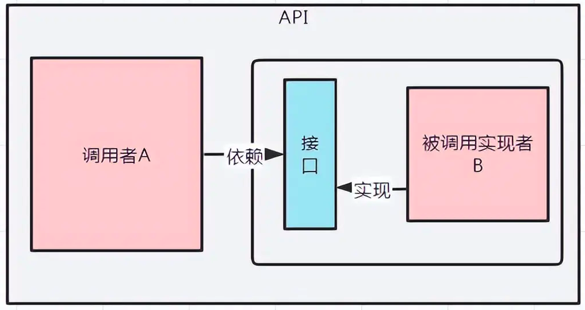
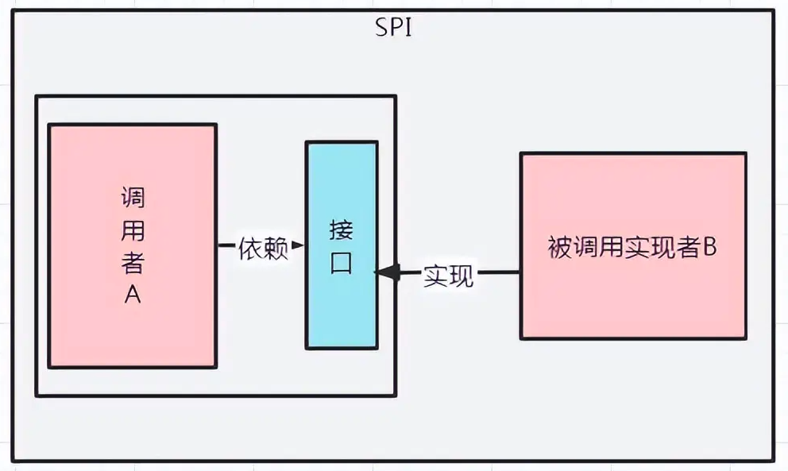
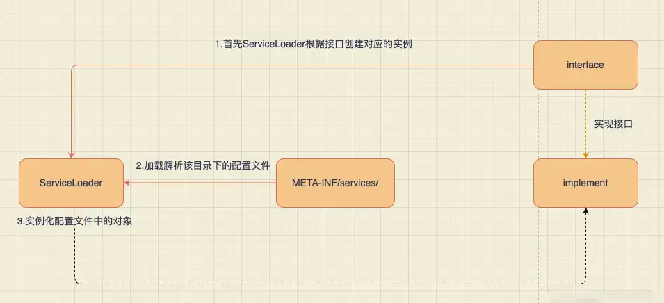
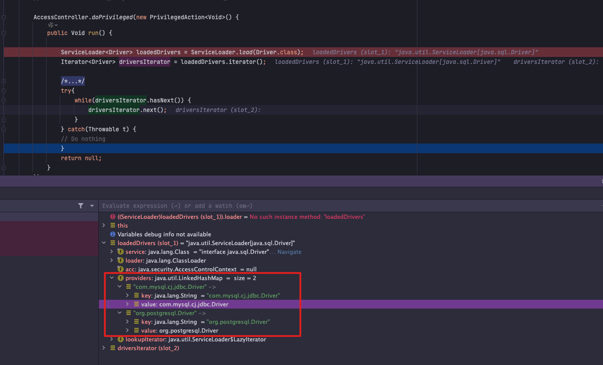
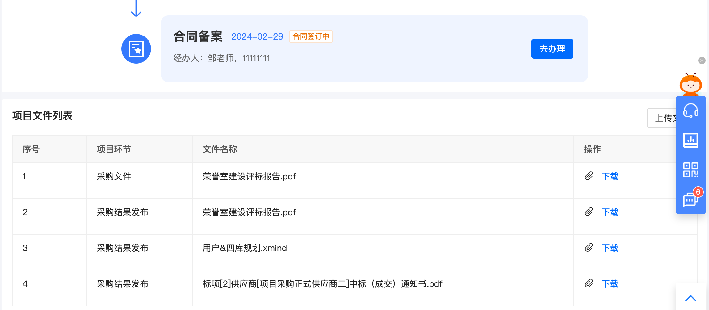
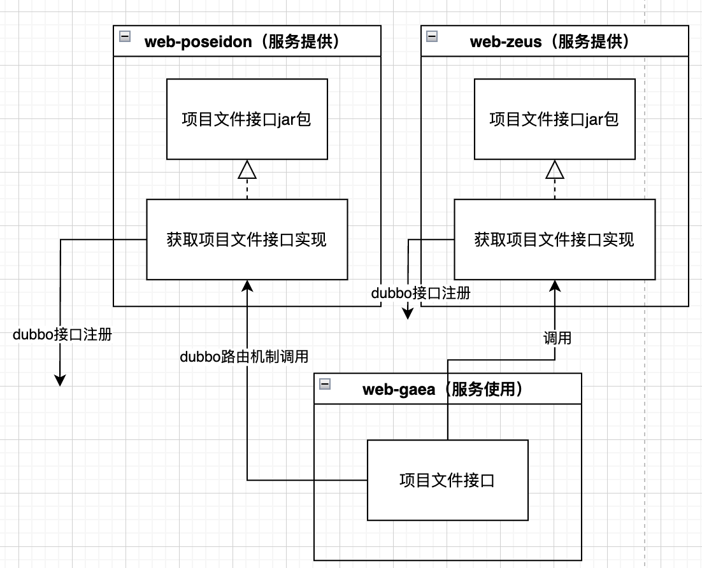
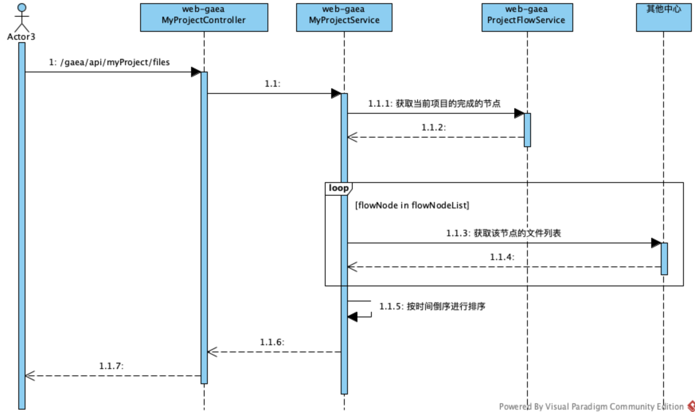
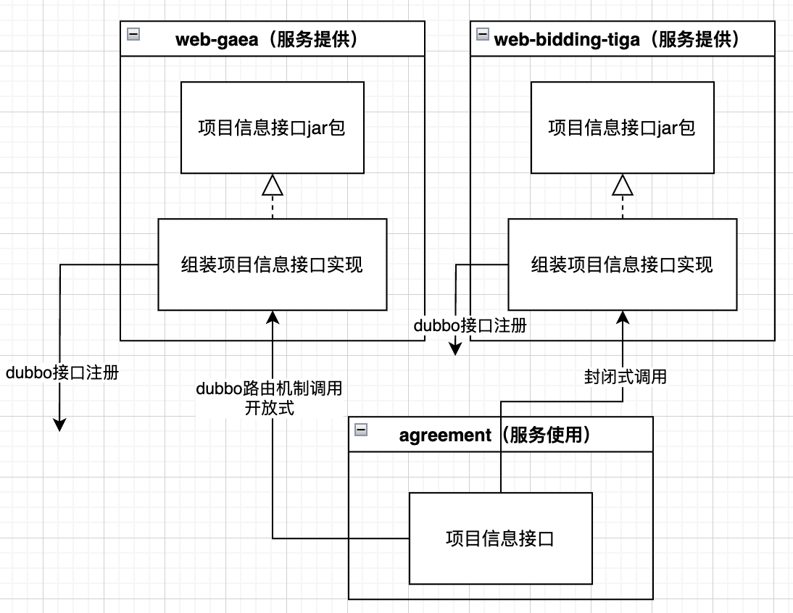

# Java常用机制 - SPI机制详解

## SPI机制

### 概念

SPI 全称：Service Provider Interface，服务提供者的接口

SPI（Service Provider Interface），是JDK内置的一种**服务提供发现机制**，可以用来启用框架扩展和替换组件，主要是被框架的开发人员使用，比如 java.sql.Driver 接口，其他不同厂商可以针对同一接口做出不同的实现，MySQL和PostgreSQL都有不同的实现提供给用户，而Java的SPI机制可以为某个接口寻找服务实现。Java中SPI机制主要思想是将装配的控制权移到程序之外，在模块化设计中这个机制尤其重要，其核心思想就是**解耦**。

SPI说白了就是一种扩展机制，SPI的目的是**通过读取规定配置信息，通过反射的方式创建接口实现类**，有了SPI机制，就为框架的灵活扩展提供了可能，而不必将框架的一些实现类写死在代码里面。

**为什们要使用SPI:**

在面向对象编程中，基于开闭原则和解耦的需要，一般建议用接口进行模块之间通信编程，通常情况下调用方模块是不会感知到被调用方模块的内部具体实现。

为了实现在模块装配的时候不用在程序里面动态指明，这就需要一种服务发现机制。Java SPI 就是提供了这样一个机制：为某个接口寻找服务实现的机制。这有点类似 IoC 的思想，将装配的控制权移交到了程序之外。

> 场景：如何寻找一个接口的所有实现类
>
> - **Spring环境：**可以依赖注入一个集合，那么会扫描Spring容器中该接口的所有实现类。
> - **侵入代码：**可以维护一个枚举类或者一个map来存储接口所有的实现类。
>
> 但是对于框架来说，既不能和Spring强耦合，也无法侵入代码未卜先知声明所有的子类。所以就有了SPI：`Service Provider Interface`，是一种服务发现机制。

**重新理解spi机制：**

SPI是专门提供给服务提供者或者扩展框架功能的开发者去使用的一个接口。

SPI 将服务接口和具体的服务实现分离开来，将服务调用方和服务实现者**解耦**，能够提升程序的扩展性、可维护性。修改或者替换服务实现并不需要修改调用方。

**SPI整体机制图如下：**


### SPI 对比 API

SPI可以和我们常用的API对比着理解。

API（Application Programming Interface）字面意思：“应用程序编程接口” 。API是一组规则和定义，允许一个软件应用与另一个软件应用、库或操作系统进行交互。它定义了如何进行数据传输、请求服务或执行特定功能的协议和工具。API为开发人员提供了一种标准化的方式来访问和使用预先构建的功能，而无需了解这些功能内部的复杂实现细节。

| **名称** | 目的                                               | **使用者**                                                   | **举例**                                      | 位置                                 |
| -------- | -------------------------------------------------- | ------------------------------------------------------------ | --------------------------------------------- | ------------------------------------ |
| SPI      | 支持可插拔的架构，便于组件和服务的替换与扩展。     | 主要由服务提供者（如库、框架开发者）实现，但也需要应用开发者配置以启用特定的服务实现。(这里说的配置一般就是引入jar或者maven、gradle的坐标即可) | Java中，JDBC驱动的加载就是一个典型的SPI应用。 | SPI - “接口”位于“调用方”所在的“包”中 |
| API      | 简化开发过程，提高效率，促进不同系统间的互操作性。 | 通常由应用开发者使用，以集成外部服务或内部模块。             | 语音识别 API、文件上传 API等                  | API - “接口”位于“实现方”所在的“包”中 |

**API图示：**



**SPI图示：**



### SPI使用示例

**1）**新建工程 SPI-Interface，定义接口：

```java
package cn.xc.search;

import java.util.List;

/**
 * @author xiaochao
 * @date 2024/12/16 20:08
 */
public interface Search {
    public List<String> searchDoc(String keyword);
}
```

对其进行打包：`mvn clean install -o`

**2）**新建工程 SPI-Implatements-1，并导入 SPI-Interface 的jar包，进行实现

```java
package cn.xc.search;

import java.util.List;

/**
 * 文件搜索
 *
 * @author xiaochao
 * @date 2024/12/16 20:09
 */
public class FileSearch implements Search {
    @Override
    public List<String> searchDoc(String keyword) {
        System.out.println("文件搜索 "+keyword);
        return null;
    }
}
```

在resources文件下新建文件：META-INF/services/cn.xc.search.Search，文件内容中为上述实现类：`cn.xc.search.FileSearch`

对其进行打包：`mvn clean install -o`

**3）**新建工程 SPI-Implatements-2，并导入 SPI-Interface 的jar包，进行实现

```java
package cn.xc.search;

import java.util.List;

/**
 * @author xiaochao
 * @date 2024/12/16 19:53
 */
public class DatabaseSearch implements Search {
    @Override
    public List<String> searchDoc(String keyword) {
        System.out.println("数据搜索 "+keyword);
        return null;
    }
}
```

对其进行打包：`mvn clean install -o`

**4）**新建工程 SPI-USE，并导入 SPI-Implatements-1、SPI-Implatements-2 的jar包，进行加载实现使用

```java
package cn.xc;

import java.util.Iterator;
import java.util.ServiceLoader;

import cn.xc.search.Search;

/**
 * @author xiaochao
 * @date 2024/12/16 20:19
 */
public class TestCase {

    public static void main(String[] args) {
        ServiceLoader<Search> s = ServiceLoader.load(Search.class);
        Iterator<Search> iterator = s.iterator();
        while (iterator.hasNext()) {
            Search search = iterator.next();
            search.searchDoc("hello world");
        }
    }
}
```

> 更生动的例子：[图文并茂带你理解Java的SPI机制](https://blog.csdn.net/qq_37883866/article/details/139000021)

### 实现原理

从加载出发：`ServiceLoader<Search> s = ServiceLoader.load(Search.class);`

到类：java.util.ServiceLoader中：

```java
public static <S> ServiceLoader<S> load(Class<S> service) {
	// 获取当前线程的加载器
    ClassLoader cl = Thread.currentThread().getContextClassLoader();
    return ServiceLoader.load(service, cl);
}

public static <S> ServiceLoader<S> load(Class<S> service,
                                        ClassLoader loader)
{
    // 调用私有构造
    return new ServiceLoader<>(service, loader);
}


private ServiceLoader(Class<S> svc, ClassLoader cl) {
    service = Objects.requireNonNull(svc, "Service interface cannot be null");
    loader = (cl == null) ? ClassLoader.getSystemClassLoader() : cl;
    acc = (System.getSecurityManager() != null) ? AccessController.getContext() : null;
    // 调用load方法
    reload();
}

public void reload() {
    providers.clear();
    // 构造私有类java.util.ServiceLoader.LazyIterator
    lookupIterator = new LazyIterator(service, loader);
}

// 构造类：LazyIterator，没有立即加载SPI具体的服务
private LazyIterator(Class<S> service, ClassLoader loader) {
            this.service = service;
            this.loader = loader;
        }
```

当我们调用调用迭代器循环时，

```java
// s.iterator() 获取迭代器：private LazyIterator lookupIterator;
Iterator<Search> iterator = s.iterator();
while (iterator.hasNext()) {
    Search search = iterator.next();
    search.searchDoc("hello world");
}
```

会触发迭代器，在ServiceLoader中，迭代器是由Iterable接口的iterator()方法提供的。

```java
// s.iterator()方法，获取迭代器，迭代器为private LazyIterator lookupIterator;
public Iterator<S> iterator() {
    return new Iterator<S>() {
		// private LinkedHashMap<String,S> providers = new LinkedHashMap<>();
        // 第一次调用时 providers 是空集合 
        Iterator<Map.Entry<String,S>> knownProviders
            = providers.entrySet().iterator();
		
        public boolean hasNext() {
			// knownProviders为空
            if (knownProviders.hasNext())
                return true;
			// 会调用 lookupIterator 也就是 LazyIterator 的实例
            // 1）调用LazyIterator.hasNext()方法
            return lookupIterator.hasNext();
        }

        public S next() {
			// knownProviders为空
            if (knownProviders.hasNext())
                return knownProviders.next().getValue();
            // 会调用 lookupIterator 也就是 LazyIterator 的实例
            // 2）调用LazyIterator.next()方法
            return lookupIterator.next();
        }

        public void remove() {
            throw new UnsupportedOperationException();
        }

    };
}

// 1）调用LazyIterator.hasNext()方法
// java.util.ServiceLoader.LazyIterator#hasNext
public boolean hasNext() {
    if (acc == null) {
        // 走hasNextService
        return hasNextService();
    } else {
        PrivilegedAction<Boolean> action = new PrivilegedAction<Boolean>() {
            public Boolean run() { return hasNextService(); }
        };
        return AccessController.doPrivileged(action, acc);
    }
}

// 调用hasNextService(); 主要是为了填充nextName，
private boolean hasNextService() {
    if (nextName != null) {
        return true;
    }
    if (configs == null) {
        try {
            // 获取到：META-INF/services/下，名为service.getName()的文件
            String fullName = PREFIX + service.getName();
            if (loader == null)
                configs = ClassLoader.getSystemResources(fullName);
            else
                configs = loader.getResources(fullName);
        } catch (IOException x) {
            fail(service, "Error locating configuration files", x);
        }
    }
    while ((pending == null) || !pending.hasNext()) {
        if (!configs.hasMoreElements()) {
            return false;
        }
        // 解析服务实现者提供的配置文件，获取到实现类
        pending = parse(service, configs.nextElement());
    }
    // 实现类名填充
    nextName = pending.next();
    return true;
}


// 2）调用LazyIterator.next()方法
// java.util.ServiceLoader.LazyIterator#next
public S next() {
    if (acc == null) {
        return nextService();
    } else {
        PrivilegedAction<S> action = new PrivilegedAction<S>() {
            public S run() { return nextService(); }
        };
        return AccessController.doPrivileged(action, acc);
    }
}

private S nextService() {
    if (!hasNextService())
        throw new NoSuchElementException();
    // 在上一个hasNextService已经填充了
    String cn = nextName;
    nextName = null;
    Class<?> c = null;
    try {
        // 最终还是利用Java的反射机制 完成类的加载
        c = Class.forName(cn, false, loader);
    } catch (ClassNotFoundException x) {
        fail(service,
             "Provider " + cn + " not found");
    }
    // 判断下 加载的 Class 的类型 是否实现了 给定的 SPI接口
    if (!service.isAssignableFrom(c)) {
        fail(service,
             "Provider " + cn  + " not a subtype");
    }
    try {
        // 通过反射实例化 SPI的实现类 并且转换成 SPI接口类型
        S p = service.cast(c.newInstance());
        // 保存到  LinkedHashMap<String,S> providers 缓存中
        providers.put(cn, p);
        return p;
    } catch (Throwable x) {
        fail(service,
             "Provider " + cn + " could not be instantiated",
             x);
    }
    throw new Error();          // This cannot happen
}
```

> 

### SPI机制的缺陷

通过上面的解析，可以发现，我们使用SPI机制的缺陷：

- 不能按需加载，需要遍历所有的实现，并实例化，然后在循环中才能找到我们需要的实现。如果不想用某些实现类，或者某些类实例化很耗时，它也被载入并实例化了，这就造成了浪费。
- 获取某个实现类的方式不够灵活，只能通过 Iterator 形式获取，不能根据某个参数来获取对应的实现类。
- 多个并发多线程使用 ServiceLoader 类的实例是不安全的。【斟酌下】

## SPI机制应用

### JDBC DriverManager

> JDBC驱动的加载就是SPI的一个经典应用。各个数据库厂商提供自己的JDBC驱动实现，应用程序无需直接引用具体驱动的实现类，只需将驱动JAR包放入类路径，Java SPI机制会自动发现并加载合适的驱动。

首先在java中定义了接口`java.sql.Driver`，并没有具体的实现，具体的实现都是由不同厂商来提供的。

#### mysql实现

在mysql的jar包`mysql-connector-java-6.0.6.jar`中，可以找到`META-INF/services`目录，该目录下会有一个名字为`java.sql.Driver`的文件，文件内容是`com.mysql.cj.jdbc.Driver`，这里面的内容就是针对Java中定义的接口的实现。

#### postgresql实现

同样在postgresql的jar包`postgresql-42.0.0.jar`中，也可以找到同样的配置文件，文件内容是`org.postgresql.Driver`，这是postgresql对Java的`java.sql.Driver`的实现。

#### 使用方法

上面说了，现在使用SPI扩展来加载具体的驱动，我们在Java中写连接数据库的代码的时候，不需要再使用`Class.forName("com.mysql.jdbc.Driver")`来加载驱动了，而是直接使用如下代码：`Connection conn = DriverManager.getConnection(url,username,password);`

进一步分析，类Connection中有静态代码块

```java
/**
 * Load the initial JDBC drivers by checking the System property
 * jdbc.properties and then use the {@code ServiceLoader} mechanism
 */
static {
    // 加载驱动
    loadInitialDrivers();
    println("JDBC DriverManager initialized");
}

private static void loadInitialDrivers() {
    String drivers;
    try {
        drivers = AccessController.doPrivileged(new PrivilegedAction<String>() {
            public String run() {
                return System.getProperty("jdbc.drivers");
            }
        });
    } catch (Exception ex) {
        drivers = null;
    }
    // If the driver is packaged as a Service Provider, load it.
    // Get all the drivers through the classloader
    // exposed as a java.sql.Driver.class service.
    // ServiceLoader.load() replaces the sun.misc.Providers()
    AccessController.doPrivileged(new PrivilegedAction<Void>() {
        public Void run() {
            // 使用SPI来获取驱动的实现,load方法封装了接口类型和类加载器，并初始化了一个迭代器
            ServiceLoader<Driver> loadedDrivers = ServiceLoader.load(Driver.class);
            // 获取迭代器
            Iterator<Driver> driversIterator = loadedDrivers.iterator();
            /* Load these drivers, so that they can be instantiated.
             * It may be the case that the driver class may not be there
             * i.e. there may be a packaged driver with the service class
             * as implementation of java.sql.Driver but the actual class
             * may be missing. In that case a java.util.ServiceConfigurationError
             * will be thrown at runtime by the VM trying to locate
             * and load the service.
             *
             * Adding a try catch block to catch those runtime errors
             * if driver not available in classpath but it's
             * packaged as service and that service is there in classpath.
             */
            try{
                // 遍历使用SPI获取到的具体实现，实例化各个实现类。
                // 会搜索classpath下以及jar包中所有的META-INF/services目录下的java.sql.Driver文件，并找到文件中的实现类的名字，此时并没有实例化具体的实现类
                while(driversIterator.hasNext()) {
                    // 就会根据驱动名字具体实例化各个实现类了。现在驱动就被找到并实例化了。(见下方Debug)
                    driversIterator.next();
                }
            } catch(Throwable t) {
            // Do nothing
            }
            return null;
        }
    });
    println("DriverManager.initialize: jdbc.drivers = " + drivers);
    if (drivers == null || drivers.equals("")) {
        return;
    }
    String[] driversList = drivers.split(":");
    println("number of Drivers:" + driversList.length);
    for (String aDriver : driversList) {
        try {
            println("DriverManager.Initialize: loading " + aDriver);
            Class.forName(aDriver, true,
                    ClassLoader.getSystemClassLoader());
        } catch (Exception ex) {
            println("DriverManager.Initialize: load failed: " + ex);
        }
    }
}
```

> 通过SPI方式加载sql驱动：
>
> 
>

### Spring中SPI机制

在springboot的自动装配过程中，最终会加载`META-INF/spring.factories`文件，而加载的过程是由`SpringFactoriesLoader`加载的；从CLASSPATH下的每个Jar包中搜寻所有`META-INF/spring.factories`配置文件，然后将解析properties文件，找到指定名称的配置后返回。需要注意的是，其实这里不仅仅是会去ClassPath路径下查找，会扫描所有路径下的Jar包，只不过这个文件只会在Classpath下的jar包中。

```java
public static final String FACTORIES_RESOURCE_LOCATION = "META-INF/spring.factories";
// spring.factories文件的格式为：key=value1,value2,value3
// 从所有的jar包中找到META-INF/spring.factories文件
// 然后从文件中解析出key=factoryClass类名称的所有value值
public static List<String> loadFactoryNames(Class<?> factoryClass, ClassLoader classLoader) {
    String factoryClassName = factoryClass.getName();
    // 取得资源文件的URL
    Enumeration<URL> urls = (classLoader != null ? classLoader.getResources(FACTORIES_RESOURCE_LOCATION) : ClassLoader.getSystemResources(FACTORIES_RESOURCE_LOCATION));
    List<String> result = new ArrayList<String>();
    // 遍历所有的URL
    while (urls.hasMoreElements()) {
        URL url = urls.nextElement();
        // 根据资源文件URL解析properties文件，得到对应的一组@Configuration类
        Properties properties = PropertiesLoaderUtils.loadProperties(new UrlResource(url));
        String factoryClassNames = properties.getProperty(factoryClassName);
        // 组装数据，并返回
        result.addAll(Arrays.asList(StringUtils.commaDelimitedListToStringArray(factoryClassNames)));
    }
    return result;
}

```

### Dubbo

Apache Dubbo是一个高性能的RPC框架，它大量使用SPI机制来实现其插件体系，允许用户轻松替换或扩展序列化、负载均衡、集群容错等核心组件。

[Dubbo源码剖析-SPI机制(超详细深度剖析篇)](https://blog.csdn.net/weixin_55721317/article/details/141960672)

[Dubbo源码解析-——SPI机制](https://blog.csdn.net/ZXMSH/article/details/129225966)

## 实际使用

SPI作用：

* 插件化：SPI 提供了一种在运行时动态发现并加载服务实现的方法，这使得系统可以在不知道具体实现的情况下使用各种不同的插件。
* 扩展性：通过 SPI 可以轻松地添加新的服务实现而不必修改现有的代码。
* 灵活性：SPI 允许在部署时选择不同的服务实现，这样可以根据环境的不同选择最合适的实现。

实际场景中有些实现借助了SPI的思想

### 项目文件列表获取

场景：在项目流程节点页中，获取项目关联的所有文件



实现方式：项目中心定义获取节点文件列表的接口(co.gov.zcy.gaea.interfaces.api.MyProjectFileApi#listProjectFiles)，具体实现由各个节点自己实现；



在获取文件时，通过动态调用dubbo的方式，获取到各个中心的文件，进行展示。

> 通过 `version` 和 `group` 来实现特定的服务路由，这里更多是 Dubbo 中的 **服务暴露与路由机制**，而不是传统意义上的 **SPI**



### 框架协议数据获取

> 也是通过通过动态调用dubbo的方式实现

场景：框架协议一阶段在项目采购执行，二阶段在协议侧执行；因此在完成一阶段后需要把数据同步到协议中心，进行二阶段交易；协议侧定义了相应的接口，我们通过实现协议定义的接口，并暴露实现的dubbo接口，供协议调用；

开放式场景调用项目侧实现的接口；封闭式的场景调用结果侧实现的接口。



## 参考文档

[Java常用机制 - SPI机制详解](https://pdai.tech/md/java/advanced/java-advanced-spi.html)

[SPI机制 ](https://www.cnblogs.com/shijianchuzhenzhi/p/18150751)

[全网最全SPI机制讲解](https://www.jianshu.com/p/ec592c70fcb3)

[图文并茂带你理解Java的SPI机制](https://blog.csdn.net/qq_37883866/article/details/139000021)

[Dubbo源码剖析-SPI机制(超详细深度剖析篇)](https://blog.csdn.net/weixin_55721317/article/details/141960672)

[Dubbo源码解析-——SPI机制](https://blog.csdn.net/ZXMSH/article/details/129225966)
