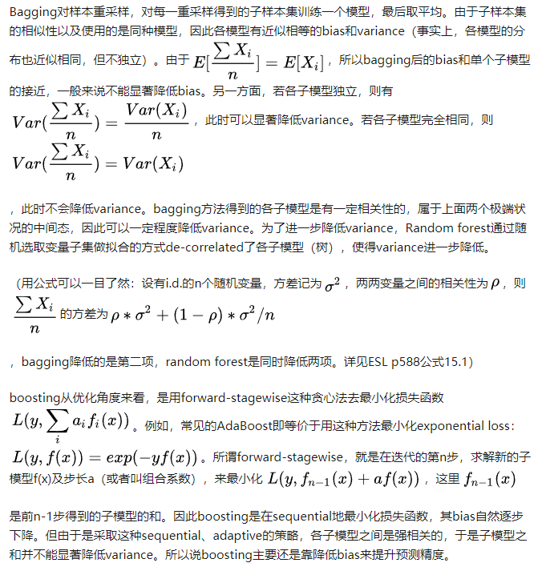

# 机器学习：集成学习

> 集成学习(Ensemble Learning)的**思想**是将若干个学习器(分类|回归)组合之后产生一个新的学习器，**如何产生“好而不同”的个体学习器，是集成学习研究的核心**。

## 基本概念

* 集成学习(Ensemble Learning)的**思想**是将若干个学习器(分类|回归)组合之后产生一个新的学习器，**如何产生“好而不同”的个体学习器，是集成学习研究的核心**；
* 一般性用于集成的学习器都为**弱学习器**，即学习器的预测精度不需要太高但是应该好于随机预测的结果；
* 集成学习**算法的成功**在于保证了弱分类器的多样性(Diversity)，即学习器之间具有**差异性**
  * 弱分类器间存在一定的差异性，会导致分类的边界不同，即会存在错误；但当多个弱分类器合并后，就可以得到更加合理的边界，能减少错误率，实现更好的效果；
  * 对于数据集过大/过小，可以进行划分/有放回抽样的操作产生不同的数据子集，然后使用数据子集训练不同的学习器，最后合并成一个大的学习器
  * 若数据划分边界过于复杂，使用线性模式很难描述，可以训练多个模型，后将模型进行合并；
  * 对于多个异构的特征集的时候，很难进行融合，那么可以考虑每个数据集构建一个学习器模型，然后将多个模型融合
* 常见的集成算法有：
  * Bagging
  * Boosting
  * Stacking

* 按照集成方式划分：
  * 串行集成方法：通过串行的方法生成基础模型(如AdaBoost)；串行集成的**基本动机**是利用基础模型之间的依赖，给被错分的样本一个较大的权重来提升性能；
  * 并行集成方法：并行的生成基础模型(若Random Forest)；并行集成的**基本动机**是利用基础模型的独立性，通过平均能较大的降低误差

## Bagging

* Bagging方法又叫自举汇聚法(Bootstrap Aggregating) ，思想是：在原始数据集上通过**有放回的抽样**的方式，重新选择出S个新数据集来分别训练S个分类器的集成技术。也就是说这些模型的训练数据中允许存在重复数据；
  * Bagging方式是有放回的抽样，并且每个子集的样本数量必须和原始样本**数量一致**，但是子集中**允许存在重复数据**
*  Bagging方法训练出来的模型在预测新样本分类的时候，会使用**多数投票**或者**求均值**的方式来统计最终的分类结果；
* Bagging方法的弱学习器可以是基本的算法模型，例如：Linear、Ridge、Lasso、Logistic、Softmax、ID3、C4.5、CART、SVM、KNN、... ...

### 随机森林

在Bagging策略的基础上进行修改后的一种算法：

* 从样本集中用Bootstrap采样选出n个样本；
* 从所有属性中随机选择K个属性，根据决策树的生成方式创建一颗决策树；
* 重复上述两个步骤，创建m棵决策树；
* 这m棵决策树就构成了随机森林，在后续的预测中采用多事投票/求均值的方式来统计最终分类的结果

* 常见的Random Forest变种算法如下：
  * Extra Tree
  * Totally Random Trees Embedding(TRTE)
  * Isolation Forest

#### Extra Tree

Extra Tree是RF的一个变种，原理基本和RF一样，区别如下 ：

* **Extra Tree每个子决策树都采用原始数据进行训练**；而RF会随机采用来训练子决策树；
* **Extra Tree会随机的选择一个特征值来划分决策树**；而RF在选择划分特征点的时候就按照传统的决策树生成的方式，基于信息增益、信息增益率、基尼系数、均方差等原则进行选择

Extra Tree因为是随机选择特征值的划分点，这样会导致决策树的规模一般大于RF所生成的决策树，也就是说**Extra Tree模型的方差相对于RF进一步减少**；在某些情况下，**Extra Tree的泛化能力比RF的强**。

#### TRTE

TRTE，Totally Random Trees Embedding

* TRTE是一种非监督的数据转化方式；**将低维的数据集映射到高维**，从而让映射到高维的数据更好的应用于分类回归模型；
* TRTE算法的转换过程类似RF算法的方法，建立T个决策树来拟合数据。当决策树构建完成后，数据集里的每个数据在T个决策树中叶子节点的位置就定下来了，**将位置信息转换为向量**就完成了特征转换操作；
* 举个例子：
  * 若有3棵决策树，每颗决策树有5个叶子节点；先有一个数据x，划分到了第一棵决策树的第3个叶子节点，第二棵树的第1个叶子节点；第三棵树的第5个叶子节点，那么x最终的映射特征编码为：(0,0,1,0,0,  1,0,0,0,0  0,0,0,0,1)

#### Isolation Forest

IForest是一种**异常点检测算法**，使用类似RF的方式来检测异常点；IForest算法和RF算法的区别在于：

* 在随机采用过程中，一般只需少量数据即可；
* 在进行决策树构建过程中，IForest算法会随机选择一个划分特征，对划分特征随机选择一个划分阈值；
* IForest算法构建的决策树深度一般较小

> 区别原因：IForest的目的是进行异常点检测，因此只要能够区分异常点即可，不需要大量数据；另外在异常点检测过程中，一般不需要太大规模的决策树

**计算方式：**

* 将测试样本x拟合到T棵决策树上，计算每棵树上该样本的叶子节点深度$h_t(x)$，从而计算出平均深度$h(x)$;
* 使用下列公式计算样本点x的异常值概率，p(x,m)取值范围[0,1]，越接近1，则是异常点的概率越大：

$$
p(x,m)=2^{-\frac{h(x)}{c(m)}}
$$

$$
c(m)=2ln (m-1)+\xi-2\frac{m-1}{m};m-为样本个数，\xi-欧拉常数
$$

#### 总结

* 可以并行训练，对于大规模样本的训练具有速度的优势 ；
* 在生成决策树时，采用随机选择特征划分，因此在特征维度较大时，仍具有较高的训练性能；
* 由于是随机抽样，训练出来的模型方差小，泛化能力强；
* 实现简单；
* 对于部分特征的却是不敏感

## Boosting

* Boosting(提高)指的是：通过算法集合，将弱学习器转换为强学习器。

* Boosting每一步产生**弱预测模型**(如决策树)，并加权累加到总模型中；
  
  * 若每一步的弱预测模型的生成都是依据损失函数的梯度方式的，那么就称为梯度提升(Gradient boosting)； 
* Boosting的意义：如果一个问题存在弱预测模型，那么可以通过提升技术的办法得到一个强预测模型； 
* 常见的Boosting算法有：
  * Adaboost
  * Gradient Boosting(GBT/GBDT/GBRT)

* boosting算法的工作机制：

  * 先从初始训练集中训练出一个基学习器：
  * 在根据基学习器的表现，对训练样本进行调整，使得在基学习器判断错误的样本在后续收到更多的关注度；
  * 基于调整后的样本分布来训练下一个弱学习器；
  * 重复上述步骤，直至弱学习器的数目到达设定值，最终将所有的学习器进行加权结合成为一个强学习器。

  如下图所示：

### Adaboost

#### 算法原理

* Adaptive Boosting是一种迭代算法。

  > 每轮迭代中会在训练集上产生一个新的学习器，然后使用该学习器对所有样本进行预测，以评估每个样本的重要性(Informative)。换句话来讲就是，算法会为每个样本赋予一个权重，每次用训练好的学习器标注/预测各个样本，如果某个样本点被预测的越正确，则将其权重降低；否则提高样本的权重。权重越高的样本在下一个迭代训练中所占的比重就越大，也就是说越难区分的样本在训练过程中会变得越重要； 

* 整个迭代过程直到错误率足够小或者达到一定的迭代次数为止 

#### 计算流程

Adaptive Boosting算法将基分类器的线性组合作为强分类器，同时给分类误差率较小的基本分类器以大的权值，给分类误差率较大的基分类器以小的权重值；构建的线性组合为： 
$$
f(x)=\sum_{m=1}^{M}{\alpha_mG_m(x)}
$$
最终强学习器是在线性组合的基础上进行Sign函数转换：
$$
G(x)=sign(f(x))=sign[\sum_{m=1}^{M}{\alpha_mG_m(x)}]
$$
其损失函数为：
$$
loss=\frac{1}{n}\sum_{i=1}^{n}{I(G(x_i) \neq y_i)}
$$
由函数的关系可得，该损失函数有上界：
$$
loss=\frac{1}{n}\sum_{i=1}^{n}{I(G(x_i) \neq y_i)} \leq \frac{1}{n}\sum_{i=1}^{n}{e^{-y_if(x)}}
$$
计算第K-1轮和k轮的学习器分别为：
$$
f_{k-1}(x)=\sum_{j=1}^{k-1}{\alpha_jG_j(x)}
$$

$$
f_{k}(x)=\sum_{j=1}^{k-1}{\alpha_jG_j(x)}=f_{k-1}(x)+\alpha_kG_k(x)
$$

损失函数如下：
$$
loss(\alpha_m,G_m(x))=\frac{1}{n}\sum_{i=1}^{n}{e^{-y_if(x)}}=\frac{1}{n}\sum_{i=1}^{n}{e^{-y_i(f_{k-1}(x)+\alpha_kG_k(x))}}
$$

$$
=\frac{1}{n}\sum_{i=1}^{n}{e^{-y_if_{k-1}(x)}e^{-y_i\alpha_kG_k(x)}}
$$

由于其中$e^{-y_if_{k-1}(x)$的值在K轮前已经求得，因此令该值为$\omega_{mi}$，经过变换后，上式为：
$$
=\frac{1}{n}\sum_{i=1}^{n}{\omega_{mi} e^{-y_i\alpha_kG_k(x)}}
$$
因此使上式达到最小的$\alpha_m$和$G_m$就是AdaBoost算法的最终求解值。

> G这个分类器在训练过程中，是为了让误差率最小，所以可以认为G越小其实就是误差率越小
> $$
> G_m^*(x)=\frac{1}{n}\sum_{i=1}^{n}{\omega_{mi}I(y_i\neq G_m(x_i))}
> $$
>
> $$
> \varepsilon=P(G_m(x)\neq y)=\frac{1}{n}\sum_{i=1}^{n}{\omega_{mi}I(y_i\neq G_m(x_i))}
> $$
>
> 对于$\alpha_m$而言，通过求导然后令导数为0，可得公式：
> $$
> \alpha_m^*=\frac{1}{2}ln {(\frac{1-\varepsilon_m}{\varepsilon_m})}
> $$

#### Adaboost算法构建过程

1. 假定训练集数据如下：

$$
T={(x_1,y_1), (x_2,y_2),...,(x_n,y_n)}
$$

2. 初始化训练数据的权重分布：

$$
D_1=(w_{11},w_{12},...,w_{1i},...,w_{1n}),w_{1i}=\frac{1}{n},i=1,2,...,n
$$

3. 使用具有权值分布$D_m$的训练数据集学习，得到基本分类器：

$$
G_m(x):x取-1或1
$$

4. 计算$G_m(x)$在训练集上的分类误差：

$$
\varepsilon_m=\sum_{i=1}^{n}P(G_m(x_i)\neq y_i)=\sum_{i=1}^{n}{\omega_{mi}I(y_i\neq G_m(x_i))}
$$

5. 计算模型$G_m(x)$的权重系数：

$$
\alpha_m^*=\frac{1}{2}ln {(\frac{1-\varepsilon_m}{\varepsilon_m})}
$$

6. 重新对计算权重：

$$
D_{m+1}=(w_{m+1,1}, w_{m+1,2}, ...,w_{m+1,n})
$$

$$
其中：w_{m+1,i}=\frac{w_{m,i}}{Z_m}e^{-\alpha_my_iG_m(x_i)}
$$

$$
其其中：Z_m=\sum_{i=1}^{n}{e^{-\alpha_my_iG_m(x_i)}}
$$

7. 构建基本分类器的线性组合：

$$
f(x)=\sum_{m=1}^{M}{\alpha_mG_m(x)}
$$

8. 得到最终分类器

$$
G(x)=sign(f(x))=sign[\sum_{m=1}^{M}{\alpha_mG_m(x)}]
$$

#### 总结

* 可处理连续值和离散值；
* 模型的鲁棒性较强；
* 解释强，结构简单；

* 但是，**对异常样本敏感**，异常样本可能会在迭代的过程中获得较高的权重值，最终影响模型效果

### GBDT

GBDT(Gradient Boosting Decision Tree)，也是Boosting算法中的一种，和Adaboost的区别如下：

* AdaBoost算法是利用前一轮的弱学习器的误差来更新样本权重值，然后一轮一轮的迭代

* GBDT也是迭代，但是GBDT要求弱学习器**必须是CART模型**，而且GBDT在模型训练的时候，是**要求模型预测的样本损失尽可能的小**

$$
初始时：f_{t-1}(x),Loss(y,f_{t-1}(x))
$$

$$
经过训练：f_{t}(x),Loss(y,f_{t-1}(x)+h_t(x))
$$

> 直观理解上：
>
> 　GBDT的思想可以用一个通俗的例子解释，假如有个人30岁，在第一次预测结果为20岁，发现损失为10岁，这次我们预测结果为6岁，发现差距还有4岁，第三轮预测结果为3岁去拟合剩下的差距，差距就只有一岁了。如果我们的迭代轮数还没有完，可以继续迭代下面，每一轮迭代，拟合的岁数误差都会减小

GBDT由三部分构成：

* DT(Regression Decistion Tree)：由多棵决策树构成，所有树的结果累加起来就是最终结果

  > 和随机森林区别如下：
  >
  > 随机森林的子树之间是没有关系的；而GBDT在构建子树时，使用的是之前子树构建结果后形成的残差作为输入数据，因此子树之间是有关系的

* GB(Gradient Boosting)

* Shrinking

#### GBDT算法原理

* 给定输入向量X和输出变量Y组成若干训练样本$(X_1,Y_1),(X_2,Y_2),...,(X_m,Y_m)$，目标是找到近似函数F(X)，使得损失函数L(Y,F(X))的损失值最小；
* L损失函数一般采用最小二乘损失函数或者是绝对值损失函数：

$$
L(Y, F(X))=\frac{1}{2}(Y-F(X)^2),L(Y, F(X))=|Y-F(X|
$$

* 最优解为：

$$
F^*(X)=argmin_FL(Y, F(X))
$$

$$
其中F(X)为一组最优基函数f_i(X)的加权和
$$

$$
F(X)=\sum_{i=0}^{T}{f_i(X)}
$$

$$
防止每个学习器能力过强，可能导致过拟合，可给定一个缩放系数v
$$

$$
F(X)=v\sum_{i=0}^{T}{f_i(X)}
$$

* 通过迭代的思想，在计算$F_t(X)$时，$F_{t-1}(X)$这时已经是之前迭代计算出的最优解，即如下所示：

$$
F_t(X)=F_{t-1}(X)+argmin_f\sum_{i=1}^{m}{L(y_i, F_{t-1}(x_i)+f_t(x_i))}
$$

* 此时需要计算弱学习器$f_t$，来最小化本轮的损失，如下：

$$
argmin_f\sum_{i=1}^{m}{L(y_i, F_{t-1}(x_i)+f_t(x_i))}
$$

$$
当使用MSE时：argmin_f\sum_{i=1}^{m}{\frac{1}{2}(y_i-F_{t-1}(x_i)-f_t(x_i))^2}
$$

* 出于对于一般的损失函数而言，优化起来不是很容易；针对这一问题，Freidman提出了梯度提升树算法，这是采用梯度下降的方法来近似计算最优基函数，关键是利用损失函数的负梯度作为提升树算法中残差的近似值：

$$
第t轮第i个样本的损失函数的负梯度为：-[\frac{∂L(y_i,F(x_i))}{∂F(x_i)}]_{F(x_i)=F_{t-1}(x_i)}
$$

$$
=y_i-F(x_i),令其为\alpha_{ti}
$$

> 有如下发现，损失函数的一阶负梯度的值正好等于残差

* 利用$(x_i, \alpha_{ti})$，可以拟合出一棵CART树，得到了第t棵树，对应的叶子节点的区域$R_{tj},j=1,2,3,...J$，其中J为叶子节点个数
* 针对每一个叶子节点中的样本，求出损失函数，使之最小，即拟合叶子节点最好的输出值

$$
\alpha_{tj}=argmin_c\sum_{x_i∈R_{tj}}{L(y_i,F_{t-1}(x_i)+c)}
$$

* 得到本轮决策树的拟合函数如下：

$$
h_t(x)=\sum_{j=1}^{J}{c_{tj}I(x∈R_{tj})}
$$

* 从而本轮最终得到的强学习器的表达式如下：

$$
F_t(x)=F_{t-1}(x)+\sum_{j=1}^{J}{c_{tj}I(x∈R_{tj})}
$$

> 对于上述流程理解的还不是十分的透彻，部分内容摘录自一下博文中：
>
> https://www.cnblogs.com/pinard/p/6140514.html

#### GBDT回归算法和分类算法区别

* 两者唯一的区别就是选择了不同的损失函数

* 在回归算法中，一般选择均方差作为损失函数；在分类算法中一般选择对数函数作为损失函数

  * 二分类：

  $$
  L(y,f(x))=ln (1+e^{-y \times f(x)}),y取-1/1
  $$

  * 多分类：

  $$
  L(y,f(x))=-\sum_{k=1}^{K}{y_klog(p_k(x))}
  $$

#### 总结

* 可以处理连续值和离散值；
* 在相对少的调参情况下，模型的预测结果也会不错；
* 鲁棒性较强
* 但是，由于弱学习器之间存在关联关系，难以并行的进行训练

> Bagging和Boosting的区别：
>
> 1. 样本选择：Bagging是有放回的随机采样；Boosting是采用所有的训练样本，只是在迭代过程中更改样本的权重信息；
> 2. 预测函数：Bagging所有预测模型的权重相等；Boosting对于误差小的模型有更大的权重；
> 3. 并行计算：Bagging可以通过并行生成各个模型；Boosting由于下一个模型依赖于上一个模型，因此只能顺序产生；
> 4. 方差偏差：Bagging减少了模型的方差(variance)；Boosting减少了模型的偏差(bias)
>
> > 参考知乎上大牛的解释：https://www.zhihu.com/question/26760839/answer/40337791
> >
> > 

## Stacking

Stacking是指训练一个模型用于组合(combine)其它模型(基模型/基学习器)的技术。即首先训练出多个不同的模型，然后再以之前训练的各个模型的输出作为输入来新训练一个新的模型，从而得到一个最终的模型。一般情况下使用单层的Logistic回归作为组合模型，其大致结构如下图所示：

## 实际应用

* Bagging&Boosting算法应用在回归模型中
* 随机森林案例一：宫颈癌预测
* Adaboost案例一：Adaboost分类算法
* Adaboost案例二：Adaboost API algorithm参数取值比较

相关代码提交于GitHub，传送门：https://github.com/zhuChengChao/ML-Ensemble

