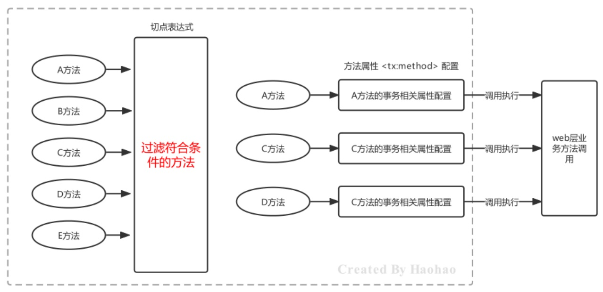

# Spring学习-AOP

课程地址：https://www.bilibili.com/video/BV1rt4y1u7q5

## 01. AOP 简介

### AOP的概念

AOP，Aspect Oriented Programming，面向切面编程，是对面向对象编程OOP的升华。OOP是纵向对一个事物的抽象，一个对象包括静态的属性信息，包括动态的方法信息等。而AOP是横向的对不同事物的抽象，属性与属性、方法与方法、对象与对象都可以组成一个切面，而用这种思维去设计编程的方式叫做面向切面编程


### AOP思想的实现方案

动态代理技术，在运行期间，对目标对象的方法进行增强，代理对象同名方法内可以执行原有逻辑的同时嵌入执行其他增强逻辑或其他对象的方法


### 模拟AOP的基础代码

其实在之前学习BeanPostProcessor时，在BeanPostProcessor的after方法中使用动态代理对Bean进行了增强，实际存储到单例池singleObjects中的不是当前目标对象本身，而是当前目标对象的代理对象Proxy，这样在调用目标对象方法时，实际调用的是代理对象Proxy的同名方法，起到了目标方法前后都进行增强的功能，对该方式进行一下优化，将增强的方法提取出去到一个增强类中，且只对com.itheima.service.impl包下的任何类的任何方法进行增强

```java
//自定义增强类
public class MyAdvice {
    public void beforeAdvice() {
        System.out.println("beforeAdvice ...");
    }
    public void afterAdvice() {
        System.out.println("afterAdvice ...");
    }
}

// 模拟AOP的基础代码
public class MockAopBeanPostProcessor implements BeanPostProcessor, ApplicationContextAware {
    //注入Spring容器对象
    private ApplicationContext applicationContext; 
    
    public Object postProcessAfterInitialization(Object bean, String beanName) throws BeansException {
        //获得Advice对象
        MyAdvice myAdvice = applicationContext.getBean(MyAdvice.class); 
        String packageName = bean.getClass().getPackage().getName();
        if("com.itheima.service.impl".equals(packageName)) {
            //对Bean进行动态代理，返回的是Proxy代理对象
            Object proxyBean = Proxy.newProxyInstance(bean.getClass().getClassLoader(), bean.getClass().getInterfaces(),
                (Object proxy, Method method, Object[] args) - > {
                    myAdvice.beforeAdvice(); //执行Advice的before方法
                    Object result = method.invoke(bean, args); //执行目标
                    myAdvice.afterAdvice(); //执行Advice的after方法
                    return result;
                });
            //返回代理对象
            return proxyBean;
        }
        return bean;
    }
    
    public void setApplicationContext(ApplicationContext applicationContext) throws BeansException {
        this.applicationContext = applicationContext;
    }
}
```

### AOP相关概念


## 02. 基于xml配置的AOP

### xml方式AOP快速入门

前面我们自己编写的AOP基础代码还是存在一些问题的，主要如下：

* 被增强的包名在代码写死了
* 通知对象的方法在代码中写死了

通过配置文件的方式去解决上述问题

* 配置哪些包、哪些类、哪些方法需要被增强
* 配置目标方法要被哪些通知方法所增强，在目标方法执行之前还是之后执行增强

配置方式的设计、配置文件（注解）的解析工作，Spring已经帮我们封装好了

**xml方式配置AOP的步骤：**

1. 导入AOP相关坐标；
2. 准备目标类、准备增强类，并配置给Spring管理；
3. 配置切点表达式（哪些方法被增强）；
4. 配置织入（切点被哪些通知方法增强，是前置增强还是后置增强）

1）导入AOP相关坐标

```xml
<dependency>
    <groupId>org.aspectj</groupId>
    <artifactId>aspectjweaver</artifactId>
    <version>1.9.6</version>
</dependency>
```

spring-context坐标下已经包含spring-aop的包了，所以就不用额外导入了

2）准备目标类、准备增强类，并配置给Spring管理

```java
public interface UserService {
    void show1();
    void show2();
}

public class UserServiceImpl implements UserService {
    public void show1() {
        System.out.println("show1...");
    }
    public void show2() {
        System.out.println("show2...");
    }
}

public class MyAdvice {
    public void beforeAdvice() {
        System.out.println("beforeAdvice");
    }
    public void afterAdvice() {
        System.out.println("afterAdvice");
    }
}
```

```xml
<!--配置目标类,内部的方法是连接点-->
<bean id="userService" class="com.itheima.service.impl.UserServiceImpl"/>
<!--配置通知类,内部的方法是增强方法-->
<bean id=“myAdvice" class="com.itheima.advice.MyAdvice"/>
```

3）配置切点表达式（哪些方法被增强）

4）配置织入（切点被哪些通知方法增强，是前置增强还是后置增强）

```xml
<aop:config>
    <!--配置切点表达式,对哪些方法进行增强-->
    <aop:pointcut id="myPointcut" expression="execution(void  com.itheima.service.impl.UserServiceImpl.show1())"/>
    <!--切面=切点+通知-->
    <aop:aspect ref="myAdvice">
        <!--指定前置通知方法是beforeAdvice-->
        <aop:before method="beforeAdvice" pointcut-ref="myPointcut"/>
        <!--指定后置通知方法是afterAdvice-->
        <aop:after-returning method="afterAdvice" pointcut-ref="myPointcut"/>
    </aop:aspect>
</aop:config>
```

### xml方式AOP配置详解

xml配置AOP的方式还是比较简单的，下面看一下AOP详细配置的细节：

* 切点表达式的配置方式
* 切点表达式的配置语法
* 通知的类型
* AOP的配置的两种方式

#### 切点表达式的配置方式

切点表达式的配置方式有两种，直接将切点表达式配置在通知上，也可以将切点表达式抽取到外面，在通知上进行引用

```xml
<aop:config>
    <!--配置切点表达式,对哪些方法进行增强-->
    <aop:pointcut id="myPointcut" expression="execution(void 
com.itheima.service.impl.UserServiceImpl.show1())"/>
    <!--切面=切点+通知-->
    <aop:aspect ref="myAdvice">
        <!--指定前置通知方法是beforeAdvice-->
        <aop:before method="beforeAdvice" pointcut-ref="myPointcut"/>
        <!--指定后置通知方法是afterAdvice-->
        <aop:after-returning method="afterAdvice" pointcut="execution(void 
com.itheima.service.impl.UserServiceImpl.show1())"/>
    </aop:aspect>
</aop:config>
```

#### 切点表达式的配置语法

切点表达式是配置要对哪些连接点（哪些类的哪些方法）进行通知的增强，语法如下：

`execution([访问修饰符]返回值类型 包名.类名.方法名(参数))`

其中：

* 访问修饰符可以省略不写；
* 返回值类型、某一级包名、类名、方法名 可以使用 * 表示任意；
* 包名与类名之间使用单点 . 表示该包下的类，使用双点 .. 表示该包及其子包下的类；
* 参数列表可以使用两个点 .. 表示任意参数。

切点表达式举几个例子方便理解

```java
//表示访问修饰符为public、无返回值、在com.itheima.aop包下的TargetImpl类的无参方法show
execution(public void com.itheima.aop.TargetImpl.show())
//表述com.itheima.aop包下的TargetImpl类的任意方法
execution(* com.itheima.aop.TargetImpl.*(..))
//表示com.itheima.aop包下的任意类的任意方法
execution(* com.itheima.aop.*.*(..))
//表示com.itheima.aop包及其子包下的任意类的任意方法
execution(* com.itheima.aop..*.*(..))
//表示任意包中的任意类的任意方法
execution(* *..*.*(..))
```

#### 通知的类型

AspectJ的通知由以下五种类型


**环绕通知**

`<aop:around method="around" pointcut-ref="myPointcut"/>`

```java
public void around(ProceedingJoinPoint joinPoint) throws Throwable {
    //环绕前
    System.out.println("环绕前通知");
    //目标方法
    joinPoint.proceed();
    ///环绕后
    System.out.println("环绕后通知");
}
```

**异常通知**：当目标方法抛出异常时，异常通知方法执行，且后置通知和环绕后通知不在执行

`<aop:after-throwing method="afterThrowing" pointcut-ref="myPointcut"/>`

```java
public void afterThrowing(){
	System.out.println("目标方法抛出异常了，后置通知和环绕后通知不在执行");
}
```

**最终通知**：类似异常捕获中的finally，不管目标方法有没有异常，最终都会执行的通知

`<aop:after method="after" pointcut-ref="myPointcut"/>`

```java
public void after(){
	System.out.println("不管目标方法有无异常，我都会执行");
}
```

**通知方法在被调用时，Spring可以为其传递一些必要的参数**


JoinPoint 对象

```java
public void 通知方法名称(JoinPoint joinPoint) {
    //获得目标方法的参数
    System.out.println(joinPoint.getArgs());
    //获得目标对象
    System.out.println(joinPoint.getTarget());
    //获得精确的切点表达式信息
    System.out.println(joinPoint.getStaticPart());
}
```

ProceedingJoinPoint对象

```java
public Object around(ProceedingJoinPoint joinPoint) throws Throwable {
    System.out.println(joinPoint.getArgs()); //获得目标方法的参数
    System.out.println(joinPoint.getTarget()); //获得目标对象
    System.out.println(joinPoint.getStaticPart()); //获得精确的切点表达式信息
    Object result = joinPoint.proceed(); //执行目标方法
    return result; //返回目标方法返回值
}
```

Throwable对象

`<aop:after-throwing method="afterThrowing" pointcut-ref="myPointcut" throwing="th"/>`

```java
public void afterThrowing(JoinPoint joinPoint, Throwable th) {
    //获得异常信息
    System.out.println("异常对象是：" + th + "异常信息是：" + th.getMessage());
}
```

#### AOP的配置的两种方式

AOP的xml有两种配置方式，如下：

* 使用`<advisor>`配置切面
* 使用`<aspect>`配置切面

AOP的另一种配置方式，该方式需要通知类实现Advice的子功能接口，Spring定义了一个Advice接口，实现了该接口的类都可以作为通知类出现

`public interface Advice {}`

Advice的子功能接口


例如：通知类实现了前置通知和后置通知接口

```java
public class Advices implements MethodBeforeAdvice, AfterReturningAdvice {
    public void before(Method method, Object[] objects, Object o) throws Throwable {
        System.out.println("This is before Advice ...");
    }
    public void afterReturning(Object o, Method method, Object[] objects, Object o1) throws
    Throwable {
        System.out.println("This is afterReturn Advice ...");
    }
}
```

切面使用advisor标签配置

```xml
<aop:config>
    <!-- 将通知和切点进行结合 -->
    <aop:advisor advice-ref="advices" pointcut="execution(void 
com.itheima.aop.TargetImpl.show())"/>
</aop:config>
```

又例如：通知类实现了方法拦截器接口

```java
public class MyMethodInterceptor implements MethodInterceptor {
    @Override
    public Object invoke(MethodInvocation methodInvocation) throws Throwable {
        System.out.println("前置逻辑功能...");
        //执行目标方法
        Object invoke = methodInvocation.getMethod().invoke(methodInvocation.getThis(), methodInvocation.getArguments());
        System.out.println("后置逻辑功能...");
        return invoke;
    }
}
```

切面使用advisor标签配置

```xml
<aop:config>
    <!-- 将通知和切点进行结合 -->
    <aop:advisor advice-ref="myMethodInterceptor" pointcut="execution(void 
com.itheima.aop.TargetImpl.show())"/>
</aop:config>
```

**使用aspect和advisor配置区别如下：**

1. 配置语法不同
   
   ```xml
   <!-- 使用advisor配置 -->
   <aop:config>
       <!-- advice-ref:通知Bean的id -->
       <aop:advisor advice-ref="advices" pointcut="execution(void 
   com.itheima.aop.TargetImpl.show())"/>
   </aop:config>
   
   <!-- 使用aspect配置 -->
   <aop:config>
       <!-- ref:通知Bean的id -->
       <aop:aspect ref="advices">
           <aop:before method="before" pointcut="execution(void 
   com.itheima.aop.TargetImpl.show())"/>
       </aop:aspect>
   </aop:config>
   ```
   
2. 通知类的定义要求不同，advisor 需要的通知类需要实现Advice的子功能接口；
   
   ```java
   public class Advices implements MethodBeforeAdvice {
       public void before(Method method, Object[] objects, Object o) throws Throwable {
           System.out.println("This is before Advice ...");
       }
       
       public void afterReturning(Object o, Method method, Object[] objects, Object o1) throws Throwable {
           System.out.println("This is afterReturn Advice ...");
       }
   }
   ```
   
   aspect 不需要通知类实现任何接口，在配置的时候指定哪些方法属于哪种通知类型即可，更加灵活方便
   
   ```java
   public class Advices {
       public void before() {
           System.out.println("This is before Advice ...");
       }
       public void afterReturning() {
           System.out.println("This is afterReturn Advice ...");
       }
   }
   ```
   
3. 可配置的切面数量不同：
   * 一个advisor只能配置一个固定通知和一个切点表达式；
   * 一个aspect可以配置多个通知和多个切点表达式任意组合，粒度更细。
   
4. 使用场景不同：
   * 如果通知类型多、允许随意搭配情况下可以使用aspect进行配置；
   * 如果通知类型单一、且通知类中通知方法一次性都会使用到的情况下可以使用advisor进行配置；
   * 在通知类型已经固定，不用人为指定通知类型时，可以使用advisor进行配置，例如后面要学习的Spring事务控制的配置；

由于实际开发中，自定义aop功能的配置大多使用aspect的配置方式，所以我们后面主要讲解aspect的配置，advisor是为了后面Spring声明式事务控制做铺垫，此处大家了解即可。

### xml方式AOP原理剖析

通过xml方式配置AOP时，我们引入了AOP的命名空间，根据讲解的，要去找spring-aop包下的META-INF，在去找spring.handlers文件


```
http\://www.springframework.org/schema/aop=org.springframework.aop.config.AopNamespaceHandler
```

最终加载的是 AopNamespaceHandler，该Handler的init方法中注册了config标签对应的解析器

```java
this.registerBeanDefinitionParser("config", new ConfigBeanDefinitionParser());
```

以ConfigBeanDefinitionParser作为入口进行源码剖析，最终会注册一个AspectJAwareAdvisorAutoProxyCreator进入到Spring容器中，那该类作用是什么呢？看一下集成体系图


AspectJAwareAdvisorAutoProxyCreator 的上上级父类AbstractAutoProxyCreator中的postProcessAfterInitialization方法

```java
//参数bean：为目标对象
public Object postProcessAfterInitialization(@Nullable Object bean, String beanName) {
    if(bean != null) {
        Object cacheKey = this.getCacheKey(bean.getClass(), beanName);
        if(this.earlyProxyReferences.remove(cacheKey) != bean) {
            //如果需要被增强，则wrapIfNecessary方法最终返回的就是一个Proxy对象
            return this.wrapIfNecessary(bean, beanName, cacheKey);
        }
    }
    return bean;
}
```

通过断点方式观察，当bean是匹配切点表达式时，this.wrapIfNecessary(bean, beanName, cacheKey)返回的是一个JDKDynamicAopProxy


可以在深入一点，对wrapIfNecessary在剖析一下，看看是不是我们熟知的通过JDK的`Proxy.newProxyInstance(ClassLoader loader, Class<?>[] interfaces,InvocationHandler h)` 的方式创建的代理对象呢？经过如下一系列源码跟踪


动态代理的实现的选择，在调用`getProxy()`方法时，我们可选用的AopProxy接口有两个实现类，如上图，这两种都是动态生成代理对象的方式，一种就是基于JDK的，一种是基于Cglib的


> JDK的动态代理代码，之前已经写过了，下面看一下Cglib基于超类的动态代理
>
> ```java
> Target target = new Target(); //目标对象
> Advices advices = new Advices(); //通知对象
> Enhancer enhancer = new Enhancer(); //增强器对象
> enhancer.setSuperclass(Target.class); //增强器设置父类
> //增强器设置回调
> enhancer.setCallback((MethodInterceptor)(o, method, objects, methodProxy) - > {
>     advices.before();
>     Object result = method.invoke(target, objects);
>     advices.afterReturning();
>     return result;
> });
> //创建代理对象
> Target targetProxy = (Target) enhancer.create();
> //测试
> String result = targetProxy.show("haohao");
> ```

## 03. 基于注解配置的AOP

### 注解方式AOP基本使用

Spring的AOP也提供了注解方式配置，使用相应的注解替代之前的xml配置，xml配置AOP时，我们主要配置了三部分：目标类被Spring容器管理、通知类被Spring管理、通知与切点的织入（切面），如下：

```xml
<!--配置目标-->
<bean id="target" class="com.itheima.aop.TargetImpl"></bean>
<!--配置通知-->
<bean id="advices" class="com.itheima.aop.Advices"></bean>
<!--配置aop-->
<aop:config proxy-target-class="true">
    <aop:aspect ref="advices">
        <aop:around method="around" pointcut="execution(* com.itheima.aop.*.*(..))"/>
    </aop:aspect>
</aop:config>
```

目标类被Spring容器管理、通知类被Spring管理

```java
@Component("target")
public class TargetImpl implements Target {
    public void show() {
        System.out.println("show Target running...");
    }
}

@Component
public class AnnoAdvice {
    public void around(ProceedingJoinPoint joinPoint) throws Throwable {
        System.out.println("环绕前通知...");
        joinPoint.proceed();
        System.out.println("环绕后通知...");
    }
}
```

配置aop，其实配置aop主要就是配置通知类中的哪个方法（通知类型）对应的切点表达式是什么


注解@Aspect、@Around需要被Spring解析，所以在Spring核心配置文件中需要配置aspectj的自动代理

`<aop:aspectj-autoproxy/>`

如果核心配置使用的是配置类的话，需要配置注解方式的aop自动代理

```java
@Configuration
@ComponentScan("com.itheima.aop")
@EnableAspectJAutoProxy //第三步
public class ApplicationContextConfig {}
```

### 注解方式AOP配置详解

各种注解方式通知类型

```java
//前置通知
@Before("execution(* com.itheima.aop.*.*(..))")
public void before(JoinPoint joinPoint){}
//后置通知
@AfterReturning("execution(* com.itheima.aop.*.*(..))")
public void AfterReturning(JoinPoint joinPoint){}
//环绕通知
@Around("execution(* com.itheima.aop.*.*(..))")
public void around(ProceedingJoinPoint joinPoint) throws Throwable {}
//异常通知
@AfterThrowing("execution(* com.itheima.aop.*.*(..))")
public void AfterThrowing(JoinPoint joinPoint){}
//最终通知
@After("execution(* com.itheima.aop.*.*(..))")
public void After(JoinPoint joinPoint){}
```

切点表达式的抽取：使用一个空方法，将切点表达式标注在空方法上，其他通知方法引用即可

```java
@Component
@Aspect
public class AnnoAdvice {
    //切点表达式抽取
    @Pointcut("execution(* com.itheima.aop.*.*(..))")
    public void pointcut() {}
    //前置通知
    @Before("pointcut()")
    public void before(JoinPoint joinPoint) {}
    //后置通知
    @AfterReturning("AnnoAdvice.pointcut()")
    public void AfterReturning(JoinPoint joinPoint) {}
    // ... 省略其他代码 ...
}
```

### 注解方式AOP原理剖析

之前在使用xml配置AOP时，是借助的Spring的外部命名空间的加载方式完成的，使用注解配置后，就抛弃了`<aop:config>`标签，而该标签最终加载了名为AspectJAwareAdvisorAutoProxyCreator的BeanPostProcessor ，最终，在该BeanPostProcessor中完成了代理对象的生成。

```xml
<!--开启aop aspectj的自动代理--> 
<aop:aspectj-autoproxy/>
```

同样，从aspectj-autoproxy标签的解析器入手

```java
this.registerBeanDefinitionParser("aspectj-autoproxy", new 
AspectJAutoProxyBeanDefinitionParser());
```

而AspectJAutoProxyBeanDefinitionParser代码内部，最终也是执行了和xml方式AOP一样的代码

```java
registerOrEscalateApcAsRequired(AnnotationAwareAspectJAutoProxyCreator.class, registry, source)
```

如果使用的是核心配置类的话

```java
@Configuration
@ComponentScan("com.itheima.aop")
@EnableAspectJAutoProxy
public class ApplicationContextConfig {
}
```

查看@EnableAspectJAutoProxy源码，使用的也是@Import导入相关解析类

```java
@Target({
    ElementType.TYPE
})
@Retention(RetentionPolicy.RUNTIME)
@Documented
@Import({
    AspectJAutoProxyRegistrar.class
})
public @interface EnableAspectJAutoProxy {
    boolean proxyTargetClass() default false;
    boolean exposeProxy() default false;
}
```

使用@Import导入的AspectJAutoProxyRegistrar源码，一路追踪下去，最终还是注册了AnnotationAwareAspectJAutoProxyCreator 这个类

```java
public void registerBeanDefinitions(AnnotationMetadata importingClassMetadata, BeanDefinitionRegistry registry) {
    AopConfigUtils.registerAspectJAnnotationAutoProxyCreatorIfNecessary(registry);
}

public static BeanDefinition
registerAspectJAnnotationAutoProxyCreatorIfNecessary(BeanDefinitionRegistry registry) {
    return registerAspectJAnnotationAutoProxyCreatorIfNecessary(registry, (Object) null);
}

public static BeanDefinition
registerAspectJAnnotationAutoProxyCreatorIfNecessary(BeanDefinitionRegistry registry, @Nullable Object source) {
    return registerOrEscalateApcAsRequired(AnnotationAwareAspectJAutoProxyCreator.class, registry, source);
}
```


## 04. 基于AOP的声明式事务控制

### Spring事务编程概述

事务是开发中必不可少的东西，使用JDBC开发时，我们使用connnection对事务进行控制，使用MyBatis时，我们使用SqlSession对事务进行控制，缺点显而易见，当我们切换数据库访问技术时，事务控制的方式总会变化，Spring 就将这些技术基础上，提供了统一的控制事务的接口。Spring的事务分为：编程式事务控制 和 声明式事务控制


Spring事务编程相关的类主要有如下三个


虽然编程式事务控制我们不学习，但是编程式事务控制对应的这些类我们需要了解一下，因为我们在通过配置的方式进行声明式事务控制时也会看到这些类的影子

### 搭建测试环境

搭建一个转账的环境，dao层一个转出钱的方法，一个转入钱的方法，service层一个转账业务方法，内部分别调

用dao层转出钱和转入钱的方法，准备工作如下：

* 数据库准备一个账户表tb_account; 
* dao层准备一个AccountMapper，包括incrMoney和decrMoney两个方法；
* service层准备一个transferMoney方法，分别调用incrMoney和decrMoney方法；
* 在applicationContext文件中进行Bean的管理配置；
* 测试正常转账与异常转账

### 基于xml声明式事务控制

结合上面我们学习的AOP的技术，很容易就可以想到，可以使用AOP对Service的方法进行事务的增强。

* 目标类：自定义的AccountServiceImpl，内部的方法是切点
* 切点：service业务类中的所有业务方法
* 通知类：Spring提供的，通知方法已经定义好，只需要配置即可

我们分析：

* 目标类是我们自己定义的；
* 通知类是Spring提供的，需要导入Spring事务的相关的坐标；
* 配置目标类AccountServiceImpl； 
* 使用advisor标签配置切面。

导入Spring事务的相关的坐标，spring-jdbc坐标已经引入的spring-tx坐标

```xml
<dependency>
    <groupId>org.springframework</groupId>
    <artifactId>spring-jdbc</artifactId>
    <version>5.2.13.RELEASE</version>
</dependency>
```


配置目标类AccountServiceImpl

```xml
<bean id="accountService" class="com.itheima.service.impl.AccoutServiceImpl">
    <property name="accountMapper" ref="accountMapper"></property>
</bean>
```

使用advisor标签配置切面

```xml
<aop:config>
    <aop:advisor advice-ref="Spring提供的通知类" pointcut="execution(* 
com.itheima.service.impl.*.*(..))"/>
</aop:config>
```

> 疑问：Spring提供的通知类是谁？是谁？是spring-tx包下的advice标签配置提供的

```xml
xmlns:tx="http://www.springframework.org/schema/tx" 
http://www.springframework.org/schema/tx http://www.springframework.org/schema/tx/spring-tx.xsd

<!--Spring提供的事务通知-->
<tx:advice id="myAdvice" transaction-manager="transactionManager">
    <tx:attributes>
        <tx:method name="transferMoney"/>
    </tx:attributes>
</tx:advice>

<!--平台事务管理器-->
<bean id="transactionManager" 
class="org.springframework.jdbc.datasource.DataSourceTransactionManager">
    <property name="dataSource" ref="dataSource"/>
</bean>

<aop:config>
    <aop:advisor advice-ref="myAdvice" pointcut="execution(* 
com.itheima.service.impl.*.*(..))"/>
</aop:config>
```

对上述配置进行详解一下

首先，平台事务管理器PlatformTransactionManager是Spring提供的封装事务具体操作的规范接口，封装了事务的提交和回滚方法

```java
public interface PlatformTransactionManager extends TransactionManager {
    TransactionStatus getTransaction(@Nullable TransactionDefinition var1) throws
    TransactionException;
    void commit(TransactionStatus var1) throws TransactionException;
    void rollback(TransactionStatus var1) throws TransactionException;
}
```

不同的持久层框架事务操作的方式有可能不同，所以不同的持久层框架有可能会有不同的平台事务管理器实现，例如，MyBatis作为持久层框架时，使用的平台事务管理器实现是DataSourceTransactionManager。

Hibernate作为持久层框架时，使用的平台事务管理器是HibernateTransactionManager。

其次，事务定义信息配置，每个事务有很多特性，例如：隔离级别、只读状态、超时时间等，这些信息在开发时可以通过connection进行指定，而此处要通过配置文件进行配置

```xml
<tx:attributes>
    <tx:method name="方法名称"
				isolation="隔离级别"
				propagation="传播行为"
				read-only="只读状态"
				timeout="超时时间"/>
</tx:attributes>
```

其中，name属性名称指定哪个方法要进行哪些事务的属性配置，**此处需要区分的是切点表达式指定的方法与此处指定的方法的区别？**切点表达式，是过滤哪些方法可以进行事务增强；事务属性信息的name，是指定哪个方法要进行哪些事务属性的配置



方法名在配置时，也可以使用 * 进行模糊匹配，例如：

```xml
<tx:advice id="myAdvice" transaction-manager="transactionManager">
    <tx:attributes>
        <!--精确匹配transferMoney方法-->
        <tx:method name="transferMoney"/>
        <!--模糊匹配以Service结尾的方法-->
        <tx:method name="*Service"/>
        <!--模糊匹配以insert开头的方法-->
        <tx:method name="insert*"/>
        <!--模糊匹配以update开头的方法-->
        <tx:method name="update*"/>
        <!--模糊匹配任意方法，一般放到最后作为保底匹配-->
        <tx:method name="*"/>
    </tx:attributes>
</tx:advice>
```

**isolation属性**：指定事务的隔离级别，事务并发存在三大问题：脏读、不可重复读、幻读/虚读。可以通过设置事务的隔离级别来保证并发问题的出现，常用的是READ_COMMITTED 和 REPEATABLE_READ


**read-only属性**：设置当前的只读状态，如果是查询则设置为true，可以提高查询性能，如果是更新（增删改）操作则设置为false

```xml
<!-- 一般查询相关的业务操作都会设置为只读模式 --> 
<tx:method name="select*" read-only="true"/>
<tx:method name="find*" read-only="true"/>
```

**timeout属性**：设置事务执行的超时时间，单位是秒，如果超过该时间限制但事务还没有完成，则自动回滚事务，不再继续执行。默认值是-1，即没有超时时间限制

```xml
<!-- 设置查询操作的超时时间是3秒 --> 
<tx:method name="select*" read-only="true" timeout="3"/>
```

**propagation属性**：设置事务的传播行为，主要解决是A方法调用B方法时，事务的传播方式问题的，例如：使用单方的事务，还是A和B都使用自己的事务等。事务的传播行为有如下七种属性值可配置


**xml方式声明式事务控制的原理浅析一下**

`<tx:advice>`标签使用的命名空间处理器是TxNamespaceHandler，内部注册的是解析器是TxAdviceBeanDefinitionParser

```java
this.registerBeanDefinitionParser("advice", new TxAdviceBeanDefinitionParser());
```

TxAdviceBeanDefinitionParser中指定了要注册的BeanDefinition

```java
protected Class < ? > getBeanClass(Element element) {
    return TransactionInterceptor.class;
}
```

TxAdviceBeanDefinitionParser二级父类AbstractBeanDefinitionParser的parse方法将TransactionInterceptor以配置的名称注册到了Spring容器中

```java
parserContext.registerComponent(componentDefinition);
```

TransactionInterceptor中的invoke方法会被执行，跟踪invoke方法，最终会看到事务的开启和提交

* 在AbstractPlatformTransactionManager的132行中开启的事务；
* 在TransactionAspectSupport的242行提交了事务。

### 基于注解声明式事务控制

注解就是对xml的替代

```java
@Service("accountService")
public class AccoutServiceImpl implements AccountService {
    @Autowired
    private AccountMapper accountMapper;
    //<tx:method name="*" isolation="REPEATABLE_READ" propagation="REQUIRED“/>
    @Transactional(isolation = Isolation.REPEATABLE_READ, propagation = Propagation.REQUIRED, readOnly = false, timeout = 5)
    public void transferMoney(String decrAccountName, String incrAccountName, int money) {
        accountMapper.decrMoney(decrAccountName, money); //转出钱
        int i = 1 / 0; //模拟某些逻辑产生的异常
        accountMapper.incrMoney(incrAccountName, money); //转入钱
    }
}
```

同样，使用的事务的注解，平台事务管理器仍然需要配置，还需要进行事务注解开关的开启

```xml
<bean id="transactionManager" 
class="org.springframework.jdbc.datasource.DataSourceTransactionManager">
    <property name="dataSource" ref="dataSource"/>
</bean>
<tx:annotation-driven transaction-manager="transactionManager"/>
```

如果使用全注解的话，使用如下配置类的形式代替配置文件

```java
@Configuration
@ComponentScan("com.itheima.service")
@PropertySource("classpath:jdbc.properties")
@MapperScan("com.itheima.mapper")
@EnableTransactionManagement
public class ApplicationContextConfig {
    @Bean
    public PlatformTransactionManager tansactionManager(DataSource dataSource) {
        DataSourceTransactionManager transactionManager = new DataSourceTransactionManager();
        transactionManager.setDataSource(dataSource);
        return transactionManager;
    }
    // ... 省略其他配置 ...
}
```
