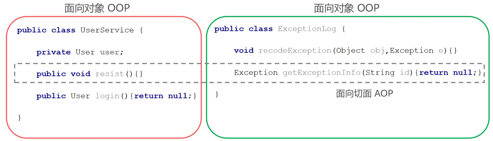
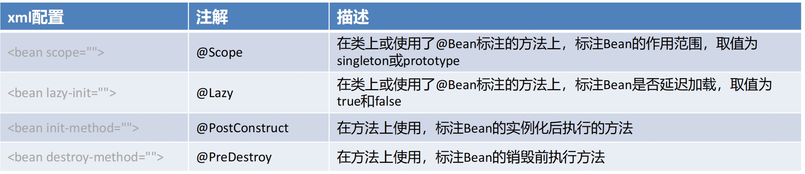

# Spring学习-IOC

课程地址：https://www.bilibili.com/video/BV1rt4y1u7q5

## 01. 传统 JavaWeb 开发的困惑

### 传统JavaWeb开发代码分析

**用户模块**


### 传统JavaWeb开发困惑及解决方案


## 02. IoC、DI和AOP思想提出

### IoC 控制反转思想的提出

实际开发中，对象之间的耦合关系，就类似手表内部的齿轮，每个齿轮都紧密啮合在一起，一旦某个齿轮发生故障，那么整个系统也意味着崩溃。尽可能让对象之间的关系保持松耦合状态是我们期望的。


**IoC思想： Inversion of Control，翻译为“控制反转”或“反转控制”，强调的是原来在程序中创建Bean的权利反转给第三方。**

例如：原来在程序中手动的去 `new UserServiceImpl()`，手动的去 `new UserDaoImpl()`，而根据IoC思想的指导，寻求一个第三方去创建UserServiceImpl对象和UserDaoImpl对象。这样程序与具体对象就失去的直接联系。

谁去充当第三方角色呢？**工厂设计模式**，BeanFactory来充当第三方的角色，来产生Bean实例

BeanFactory怎么知道产生哪些Bean实例呢？可以使用**配置文件**配置Bean的基本信息，BeanFactory根据配置文件来生产Bean实例


例如，用IoC思想去反转UserServiceImpl的创建权，由原来程序中创建反转给通过BeanFactory去创建


### DI 依赖注入思想的提出

上面使用BeanFactory的方式已经实现的"控制反转"，将Bean的创建权交给了BeanFactory，如果我们想将UserDao的创建权也反转给BeanFactory，与此同时UserService内部还需要用到UserDao实例对象，那应该怎样操作呢？

1. 在程序中，通过BeanFactory获得UserService
2. 在程序中，通过BeanFactory获得UserDao
3. 在程序中，将UserDao设置给UserService


该方式是否存在一些问题？UserService存在于BeanFactory中，UserDao也存在于BeanFactory中，**可以在BeanFactory内部进行结合**

将UserDao在BeanFactory内部设置给UserService的过程叫做“**注入**”，而UserService需要依赖UserDao的注入才能正常工作，这个过程叫做“**依赖注入**”


> **面试题：IoC 和 DI 的关系？**
>
> 首先，先回答IoC和DI的是什么：
>
> * IoC： Inversion of Control，控制反转，将Bean的创建权由原来程序反转给第三方
>
> * DI：Dependency Injection，依赖注入，某个Bean的完整创建依赖于其他Bean（或普通参数）的注入
>
> 其次，在回答IoC和DI的关系：
>
> * 第一种观点：IoC强调的是Bean创建权的反转，而DI强调的是Bean的依赖关系，认为不是一回事
>
> * 第二种观点：IoC强调的是Bean创建权的反转，而DI强调的是通过注入的方式反转Bean的创建权，认为DI是IoC的其中一种实现方式

### AOP 面向切面思想的提出

IoC和DI思想主要是解决前面我们的困惑一，困惑二还没有解决


困惑二的解决方案是，借助于IoC思想，将Bean的创建权反转给BeanFactory，而**BeanFactory生产的Bean是目标Bean的代理对象**，这样就可以在代理对象中对目标对象方法进行相应的增强。


AOP（Aspect Oriented Programming）：面向切面编程，是对面向对象编程OOP的升华。

* OOP是纵向对一个事物的抽象，一个对象包括静态的属性信息，包括动态的方法信息等。
* 而AOP是横向的对不同事物的抽象，属性与属性、方法与方法、对象与对象都可以组成一个切面，而用这种思维去设计编程的方式叫做面向切面编程



**三种思想总结**

1. IoC控制反转，是将程序创建Bean的权利反转给第三方；
2. DI依赖注入，某个完整Bean需要依赖于其他Bean（或属性）的注入；
3. AOP面向切面编程，用横向抽取方法（属性、对象等）思想，组装成一个功能性切面。

### 框架概念的出现

上面提出了一些思想来解决遇到的问题，而这些思想的实现就需要通过编码去落地，往往我们把具备一定业务领域解决方案的"工具"称为框架。

**框架的基本特点：**

* 框架（Framework），是基于基础技术之上，从众多业务中抽取出的通用解决方案；
* 框架是一个半成品，使用框架规定的语法开发可以提高开发效率，可以用简单的代码就能完成复杂的基础业务；
* 框架内部使用大量的设计模式、算法、底层代码操作技术，如反射、内省、xml解析、注解解析等；
* 框架一般都具备扩展性；
* 有了框架，我们可以将精力尽可能的投入在纯业务开发上而不用去费心技术实现以及一些辅助业务。

**Java中常用的框架：**不同语言，不同领域都有属于自己的框架，使用框架开发是作为程序员的最基础的底线。Java语言中的框架，可以分为基础框架和服务框架：

* 基础框架：完成基本业务操作的框架，如MyBatis、Spring、SpringMVC、Struts2、Hibernate等 
* 服务框架：特定领域的框架，一般还可以对外提供服务框架，如MQ、ES、Nacos等

### 思想&框架&编码关系


架构师（高级程序员）：把思想落地变为实现的人，例如上面的设计和BeanFactory的编写，即框架的设计和实现者。

程序员：使用框架完成业务的人，其中UserServiceImpl、beans.xml、测试类都是我们编写的。

## 03. Spring框架的诞生

### Spring 框架概述

Spring是一个开源的轻量级Java开发应用框架，可以简化企业级应用开发。Spring解决了开发者在JavaEE开发中遇到的许多常见的问题，提供了功能强大IOC、AOP及Web MVC等功能。是当前企业中Java开发几乎不能缺少的框架之一。Spring的生态及其完善，不管是Spring哪个领域的解决方案都是依附于在Spring Framework基础框架的。

**Spring的官网**：www.spring.io

**Spring 框架的历史**

* Jsp 默默扛下所有；
* MVC+三层架构分工明确，但开发成本及其高；
* EJB 重量级框架出现，走出一个困境，有进入另一个困境；
* Spring 春天来到，随之，SSH风生水起、称霸武林；
* Spring 稳住江湖大哥位置，SSM开始上位；
* Spring 本着“拿来主义”的思维快速发展，生态不断健全；
* SpringBoot 又一里程碑崛起，把“约定大于配置“思想玩儿的炉火纯青；
* SpringCloud 打包了微服务众多解决方案，应对互联网项目更加easy！

**Spring Framework技术栈图示**


### BeanFactory 快速入门

根据下图，分析一下Spring的BeanFactory的开发步骤：


**Spring的BeanFactory的开发步骤**

1）导入Spring的jar包或Maven坐标；

```xml
<!--Spring核心--> 
<dependency>
    <groupId>org.springframework</groupId>
    <artifactId>spring-context</artifactId>
    <version>5.3.7</version>
</dependency>
```

2）定义UserService接口及其UserServiceImpl实现类；

```java
public interface UserService {}
public class UserServiceImpl implements UserService {}
```

3）创建beans.xml配置文件，将UserServiceImpl的信息配置到该xml中；

```xml
<?xml version="1.0" encoding="UTF-8"?>
<beans xmlns="http://www.springframework.org/schema/beans"
       xmlns:xsi="http://www.w3.org/2001/XMLSchema-instance"
       xsi:schemaLocation="http://www.springframework.org/schema/beans http://www.springframework.org/schema/beans/spring-beans.xsd">

    <!--配置UserServiceImpl-->
    <bean id="userService" class="cn.xcy.service.impl.UserServiceImpl">
    </bean>

</beans>
```

4）编写测试代码，创建BeanFactory，加载配置文件，获取UserService实例对象。

```java
public class BeanFactoryTest {
    public static void main(String[] args) {
        //创建BeanFactory
        DefaultListableBeanFactory beanFactory = new DefaultListableBeanFactory();
        //创建读取器
        XmlBeanDefinitionReader reader = new XmlBeanDefinitionReader(beanFactory);
        //加载配置文件
        reader.loadBeanDefinitions("beans.xml");
        //获取Bean实例对象
        UserService userService = (UserService) beanFactory.getBean("userService");
    }
}
```

**BeanFactory 快速入门**

上面使用BeanFactory完成了IoC思想的实现，下面去实现以下DI依赖注入：

1）定义UserDao接口及其UserDaoImpl实现类；

```java
public interface UserDao {}
public class UserDaoImpl implements UserDao {}
```

2——修改UserServiceImpl代码，添加一个`setUserDao(UserDao userDao)`用于接收注入的对象；

```java
public class UserServiceImpl implements UserService {
    public void setUserDao(UserDao userDao) {
        System.out.println(userDao);
    }
}
```

3）修改beans.xml配置文件，在UserDaoImpl的`<bean>`中嵌入`<property>`配置注入；

```xml
<!--配置UserServiceImpl-->
<bean id="userService" class="cn.xcy.service.impl.UserServiceImpl">
    <property name="userDao" ref="userDao"/>
</bean>
<!--配置UserDaoImpl-->
<bean id="userDao" class="cn.xcy.dao.impl.UserDaoImpl"></bean>
```

4）修改测试代码，获得UserService时，setUserService方法执行了注入操作。

### ApplicationContext快速入门

ApplicationContext 称为Spring容器，内部封装了BeanFactory，比BeanFactory功能更丰富更强大，使用ApplicationContext 进行开发时，xml配置文件的名称习惯写成applicationContext.xml

```java
public class ApplicationContextTest {

    public static void main(String[] args) {
        //创建ApplicationContext,加载配置文件，实例化容器
        ApplicationContext applicationContext = new ClassPathXmlApplicationContext("applicationContext.xml");
        //根据beanName获得容器中的Bean实例
        UserService userService = (UserService)applicationContext.getBean("userService");
        System.out.println(userService);
    }
}
```

**BeanFactory与ApplicationContext的关系**

1. BeanFactory是Spring的早期接口，称为Spring的Bean工厂，ApplicationContext是后期更高级接口，称之为 Spring 容器；
2. ApplicationContext在BeanFactory基础上对功能进行了扩展，例如：监听功能、国际化功能等。BeanFactory的API更偏向底层，ApplicationContext的API大多数是对这些底层API的封装；
3. Bean创建的主要逻辑和功能都被封装在BeanFactory中，ApplicationContext不仅继承了BeanFactory，而且ApplicationContext内部还维护着BeanFactory的引用，所以，ApplicationContext与BeanFactory既有继承关系，又有融合关系。
4. Bean的初始化时机不同，原始BeanFactory是在首次调用getBean时才进行Bean的创建，而ApplicationContext则是配置文件加载，容器一创建就将Bean都实例化并初始化好。

ApplicationContext除了继承了BeanFactory外，还继承了ApplicationEventPublisher（事件发布器）、ResouresPatternResolver（资源解析器）、MessageSource（消息资源）等。但是ApplicationContext的核心功能还是BeanFactory


applicationContext内部维护着beanFactory的引用，在学习过程中会查看beanFactory内部维护的属性，断点查看如下图示内容的


验证BeanFactory和ApplicationContext对Bean的初始化时机：在UserDaoImpl的无参构造内打印一句话，验证构造方法的执行时机，略

```java
public class UserDaoImpl implements UserDao {
    
    public UserDaoImpl() {
        System.out.println("UserDaoImpl创建了...");
    }
}
```

* 断点观察，BeanFactory方式时，当调用getBean方法时才会把需要的Bean实例创建，即延迟加载；

* 而ApplicationContext是加载配置文件，容器创建时就将所有的Bean实例都创建好了，存储到一个单例池中，当调用getBean时直接从单例池中获取Bean实例返回

### BeanFactory的继承体系

BeanFactory是核心接口，项目运行过程中肯定有具体实现参与，这个具体实现就是**DefaultListableBeanFactory**，而ApplicationContext内部维护的Beanfactory的实现类也是它


### ApplicationContext的继承体系

只在Spring基础环境下，即只导入spring-context坐标时，此时ApplicationContext的继承体系


只在Spring基础环境下，常用的三个ApplicationContext作用如下：


如果Spring基础环境中加入了其他组件解决方案，如web层解决方案，即导入spring-web坐标

```xml
<dependency>
    <groupId>org.springframework</groupId>
    <artifactId>spring-web</artifactId>
    <version>5.3.7</version>
</dependency>
```

此时ApplicationContext的继承体系


在Spring的web环境下，常用的两个ApplicationContext作用如下：


> web环境下的这两个ApplicationContext，在学习Spring集成web时在进行讲解

## 04. 基于xml的Spring应用

### SpringBean 的配置详解

Spring开发中主要是对Bean的配置，Bean的常用配置一览如下：


#### Bean的基础配置

例如：配置UserDaoImpl由Spring容器负责管理

```xml
<bean id="userDao" class="cn.xcy.dao.impl.UserDaoImpl"></bean>
```

此时存储到Spring容器（singleObjects单例池）中的Bean的beanName是userDao，值是UserDaoImpl对象，可以根据beanName获取Bean实例

```java
applicationContext.getBean("userDao");
```

如果不配置id，则Spring会把当前Bean实例的全限定名作为beanName

```java
applicationContext.getBean("cn.xcy.dao.impl.UserDaoImpl");
```

#### Bean的别名配置

可以为当前Bean指定多个别名，根据别名也可以获得Bean对象

```xml
<bean id="userDao" name="aaa,bbb" class="com.itheima.dao.impl.UserDaoImpl"/>
```

此时多个名称都可以获得UserDaoImpl实例对象

```java
applicationContext.getBean("userDao");
applicationContext.getBean("aaa");
applicationContext.getBean("bbb");
```

#### Bean的范围配置

默认情况下，单纯的Spring环境Bean的作用范围有两个：Singleton和Prototype

* **singleton**：单例，默认值，Spring容器创建的时候，就会进行Bean的实例化，并存储到容器内部的单例池中，每次getBean时都是从单例池中获取相同的Bean实例；
* **prototype**：原型，Spring容器初始化时不会创建Bean实例，当调用getBean时才会实例化Bean，每次getBean都会创建一个新的Bean实例。

当scope设置为singleton时，获得两次对象打印结果是一样的

```xml
<bean id="userDao" class="com.itheima.dao.impl.UserDaoImpl" scope="singleton"/>
```

```java
Object userDao = applicationContext.getBean("userDao");
Object userDao2 = applicationContext.getBean("userDao");
System.out.println(userDao); //com.itheima.dao.impl.UserDaoImpl@631330c
System.out.println(userDao2); //com.itheima.dao.impl.UserDaoImpl@631330c
```

通过断点调试，观察可以发现单例池中存在 userDao 实例


当scope设置为prototype时，获得两次对象打印结果是不一样的

```xml
<bean id="userDao" class="com.itheima.dao.impl.UserDaoImpl" scope="prototype"/>
```

```java
Object userDao = applicationContext.getBean("userDao");
Object userDao2 = applicationContext.getBean("userDao");
System.out.println(userDao); //com.itheima.dao.impl.UserDaoImpl@4d50efb8
System.out.println(userDao2); //com.itheima.dao.impl.UserDaoImpl@7e2d773b
```

通过断点调试，观察可以发现单例池中不存在 userDao 实例，但是userDao的信息已经被存储到beanDefinitionMap中了


#### Bean的延迟加载

当lazy-init设置为true时为延迟加载，也就是当Spring容器创建的时候，不会立即创建Bean实例，等待用到时在创建Bean实例并存储到单例池中去，后续在使用该Bean直接从单例池获取即可，本质上该Bean还是单例的。

```xml
<bean id="userDao" class="com.itheima.dao.impl.UserDaoImpl" lazy-init="true"/>
```

#### Bean的初始化和销毁方法配置

Bean在被实例化后，可以执行指定的初始化方法完成一些初始化的操作，Bean在销毁之前也可以执行指定的销毁方法完成一些操作，初始化方法名称和销毁方法名称通过

```xml
<!--配置UserDaoImpl-->
<bean id="userDao" class="cn.xcy.dao.impl.UserDaoImpl" init-method="init"
      destroy-method="destroy"></bean>
```

```java
public class UserDaoImpl implements UserDao, InitializingBean {

    public UserDaoImpl() {
        System.out.println("UserDaoImpl创建了...");
    }

    public void init() {
        System.out.println("初始化方法...");
    }

    public void destroy() {
        System.out.println("销毁方法...");
    }

    /**
     * 扩展：除此之外，我们还可以通过实现 InitializingBean 接口，完成一些Bean的初始化操作，如下： 
     * @throws Exception
     */
    @Override
    public void afterPropertiesSet() throws Exception {
        // 执行时机早于init-method配置的方法
        System.out.println("InitializingBean...");
    }
}
```

#### Bean的实例化配置

Spring的实例化方式主要如下两种：

* 构造方式实例化：底层通过构造方法对Bean进行实例化
* 工厂方式实例化：底层通过调用自定义的工厂方法对Bean进行实例化

构造方式实例化Bean又分为无参构造方法实例化和有参构造方法实例化，Spring中配置的`<bean>`几乎都是无参构造该方式，此处不在赘述。下面讲解有参构造方法实例化Bean

```java
//有参构造方法
public UserDaoImpl(String name){
}
```

有参构造在实例化Bean时，需要参数的注入，通过`<constructor-arg>`标签，嵌入在`<bean>`标签内部提供构造参数，如下：

```xml
<bean id="userDao" class="com.itheima.dao.impl.UserDaoImpl"> 
    <constructor-arg name="name" value="haohao"/>
</bean>
```

工厂方式实例化Bean，又分为如下三种：**静态工厂方法实例化Bean / 实例工厂方法实例化Bean / 实现FactoryBean规范延迟实例化Bean**

**1）静态工厂方法实例化Bean**

静态工厂方法实例化Bean，其实就是定义一个工厂类，提供一个静态方法用于生产Bean实例，在将该工厂类及其静态方法配置给Spring即可

```java
//工厂类
public class UserDaoFactoryBean {
    //静态工厂方法
    public static UserDao getUserDao(String name) {
        //可以在此编写一些其他逻辑代码
        return new UserDaoImpl();
    }
}
```

```xml
<bean id="userDao" class="com.itheima.factory.UserDaoFactoryBean" factory-method="getUserDao"> 
    <constructor-arg name="name" value="haohao"/>
</bean>
```

> PS：`<constructor-arg>`标签不仅仅是为构造方法传递参数，只要是为了实例化对象而传递的参数都可以通过`<constructor-arg>`标签完成，例如上面通过静态工厂方法实例化Bean所传递的参数也是要通过`<constructor-arg>`进行传递的

测试代码，直接通过ApplicationContext获得userDao即可

```java
ApplicationContext applicationContext = new ClassPathxmlApplicationContext("applicationContext.xml");
Object userDao = applicationContext.getBean("userDao");
System.out.println(userDao);
```


断点调试，UserDaoImpl实例对象会存在于单例池中

**2）实例工厂方法实例化Bean**

实例工厂方法，也就是非静态工厂方法产生Bean实例，与静态工厂方式比较，该方式需要先有工厂对象，在用工厂对象去调用非静态方法，所以在进行配置时，要先配置工厂Bean，在配置目标Bean

```java
//工厂类
public class UserDaoFactoryBean2 {
    //非静态工厂方法
    public UserDao getUserDao(String name) {
        //可以在此编写一些其他逻辑代码
        return new UserDaoImpl();
    }
}
```

```xml
<!-- 配置实例工厂Bean -->
<bean id="userDaoFactoryBean2" class="com.itheima.factory.UserDaoFactoryBean2"/>
<!-- 配置实例工厂Bean的哪个方法作为工厂方法 -->
<bean id="userDao" factory-bean="userDaoFactoryBean2" factory-method="getUserDao">
    <constructor-arg name="name" value="haohao"/>
</bean>
```
测试代码同上，直接通过ApplicationContext获得userDao即可，不在赘述

通过断点观察单例池singletonObjects，发现单例池中既有工厂Bean实例，也有目标Bean实例，且都是在Spring容器创建时，就完成了Bean的实例化

**3）实现FactoryBean规范延迟实例化Bean**

上面不管是静态工厂方式还是非静态工厂方式，都是自定义的工厂方法，Spring提供了FactoryBean的接口规范，FactoryBean接口定义如下：

```java
public interface FactoryBean<T> {
    String OBJECT_TYPE_ATTRIBUTE = “factoryBeanObjectType”;

    // 获得实例对象方法
    T getObject() throws Exception; 
	// 获得实例对象类型方法
    Class<?> getObjectType();

    default boolean isSingleton() {
        return true;
    }
}
```

定义工厂实现FactoryBean

```java
/**
 * @author xiaochao
 * @date 2023/7/29 15:48
 */
public class UserDaoFactoryBean implements FactoryBean<UserDao> {

    @Override
    public UserDao getObject() throws Exception {
        return new UserDaoImpl();
    }

    @Override
    public Class<?> getObjectType() {
        return UserDao.class;
    }
}
```

配置FactoryBean交由Spring管理即可

```xml
<bean id="userDao" class="cn.xcy.dao.impl.UserDaoFactoryBean"></bean>
```

通过Spring容器根据beanName可以正常获得UserDaoImpl

```java
// 创建ApplicationContext,加载配置文件，实例化容器
ApplicationContext applicationContext = new ClassPathXmlApplicationContext("applicationContext.xml");

UserDao userDao = applicationContext.getBean("userDao", UserDao.class);
System.out.println(userDao);
```

通过断点观察发现Spring容器创建时，UserDaoFactoryBean被实例化了，并存储到了单例池singletonObjects中，但是 `getObject()` 方法尚未被执行，UserDaoImpl也没被实例化，当首次用到UserDaoImpl时，才调用`getObject()` ，此工厂方式产生的Bean实例不会存储到单例池singletonObjects中，会存储到 factoryBeanObjectCache 缓存池中，并且后期每次使用到userDao都从该缓存池中返回的是同一个userDao实例。


#### Bean的依赖注入配置

Bean的依赖注入有两种方式：


依赖注入的数据类型有如下三种：

* 普通数据类型，例如：String、int、boolean等，通过value属性指定。
* 引用数据类型，例如：UserDaoImpl、DataSource等，通过ref属性指定。
* 集合数据类型，例如：List、Map、Properties等。

1）注入 `List<T>` 集合 – 普通数据

```java
void setStrList(List<String> strList){
    strList.forEach(str->{
        System.out.println(str);
    });
}
```

```xml
<property name="strList">
    <list>
        <value>haohao</value>
        <value>miaomiao</value>
    </list>
</property>
```

2）注入 `List<T>` 集合 – 引用数据

```java
public void setObjList(List<UserDao> objList){
    objList.forEach(obj->{
        System.out.println(obj);
    });
}
```

```xml
<property name="objList">
    <list>
        <bean class="com.itheima.dao.impl.UserDaoImpl"></bean>
        <bean class="com.itheima.dao.impl.UserDaoImpl"></bean>
        <bean class="com.itheima.dao.impl.UserDaoImpl"></bean>
    </list>
</property>
```

也可以直接引用容器中存在的Bean

```xml
<!--配置UserDao-->
<bean id="userDao" class="com.itheima.dao.impl.UserDaoImpl"/>
<bean id="userDao2" class="com.itheima.dao.impl.UserDaoImpl"/>
<bean id="userDao3" class="com.itheima.dao.impl.UserDaoImpl"/>
<!--配置UserService-->
<bean id="userService" class="com.itheima.service.impl.UserServiceImpl">
    <property name="objList">
        <list>
            <ref bean="userDao"></ref>
            <ref bean="userDao2"></ref>
            <ref bean="userDao3"></ref>
        </list>
    </property>
</bean>
```

3）注入 `Set<T>` 集合

```java
//注入泛型为字符串的Set集合
public void setValueSet(Set<String> valueSet){
    valueSet.forEach(str->{
        System.out.println(str);
    });
}
//注入泛型为对象的Set集合
public void setObjSet(Set<UserDao> objSet){
    objSet.forEach(obj->{
        System.out.println(obj);
    });
}
```

```xml
<!-- 注入泛型为字符串的Set集合 -->
<property name="valueSet">
    <set>
        <value>muzi</value>
        <value>muran</value>
    </set>
</property>
<!-- 注入泛型为对象的Set集合 -->
<property name="objSet">
    <set>
        <ref bean="userDao"></ref>
        <ref bean="userDao2"></ref>
        <ref bean="userDao3"></ref>
    </set>
</property>
```

4）注入 `Map<K,V>` 集合

```java
//注入值为字符串的Map集合
public void setValueMap(Map<String,String> valueMap){
    valueMap.forEach((k,v)->{
        System.out.println(k+"=="+v);
    });
}

//注入值为对象的Map集合
public void setObjMap(Map<String,UserDao> objMap){
    objMap.forEach((k,v)->{
        System.out.println(k+"=="+v);
    });
}
```

```xml
<!--注入值为字符串的Map集合-->
<property name="valueMap">
    <map>
        <entry key="aaa" value="AAA"/>
        <entry key="bbb" value="BBB"/>
        <entry key="ccc" value="CCC"/>
    </map>
</property>

<!--注入值为对象的Map集合-->
<property name="objMap">
    <map>
        <entry key="ud" value-ref="userDao"/>
        <entry key="ud2" value-ref="userDao2"/>
        <entry key="ud3" value-ref="userDao3"/>
    </map>
</property>
```

5）注入 Properties 键值对

```java
//注入Properties
public void setProperties(Properties properties){
    properties.forEach((k,v)->{
        System.out.println(k+"=="+v);
    });
}
```

```xml
<property name="properties">
    <props>
        <prop key="xxx">XXX</prop>
        <prop key="yyy">YYY</prop>
    </props>
</property>
```

> 扩展：自动装配方式
>
> 如果被注入的属性类型是Bean引用的话，那么可以在 `<bean>` 标签中使用 autowire 属性去配置自动注入方式，属性值有两个：
>
> * byName：通过属性名自动装配，即去匹配 setXxx 与 id="xxx"（name="xxx"）是否一致；
> * byType：通过Bean的类型从容器中匹配，匹配出多个相同Bean类型时，报错。
>
> ```xml
> <bean id="userService" class="com.itheima.service.impl.UserServiceImpl" autowire="byType">
> ```

#### Spring的其他配置标签

Spring 的 xml 标签大体上分为两类，一种是默认标签，一种是自定义标签

* 默认标签：就是不用额外导入其他命名空间约束的标签，例如 `<bean>` 标签
* 自定义标签：就是需要额外引入其他命名空间约束，并通过前缀引用的标签，例如 `<context:property-placeholder/>` 标签

Spring的默认标签用到的是Spring的默认命名空间

```xml
<?xml version="1.0" encoding="UTF-8"?>
<beans xmlns="http://www.springframework.org/schema/beans"
       xmlns:xsi="http://www.w3.org/2001/XMLSchema-instance"
       xsi:schemaLocation="http://www.springframework.org/schema/beans http://www.springframework.org/schema/beans/spring-beans.xsd">

</beans>
```

该命名空间约束下的默认标签如下：


`<beans>`标签，除了经常用的做为根标签外，还可以嵌套在根标签内，使用profile属性切换开发环境

```xml
<!-- 配置测试环境下，需要加载的Bean实例 -->
<beans profile="test">
</beans>

<!-- 配置开发环境下，需要加载的Bean实例 --> 
<beans profile="dev">
</beans>
```

可以使用以下两种方式指定被激活的环境：

* 使用命令行动态参数，虚拟机参数位置加载 `-Dspring.profiles.active=test`
* 使用代码的方式设置环境变量 `System.setProperty("spring.profiles.active","test")`

`<import>`标签，用于导入其他配置文件，项目变大后，就会导致一个配置文件内容过多，可以将一个配置文件根据业务某块进行拆分，拆分后，最终通过`<import>`标签导入到一个主配置文件中，项目加载主配置文件就连同`<import>` 导入的文件一并加载了

```xml
<!--导入用户模块配置文件--> 
<import resource="classpath:UserModuleApplicationContext.xml"/>

<!--导入商品模块配置文件--> 
<import resource="classpath:ProductModuleApplicationContext.xml"/>
```

`<alias>` 标签是为某个Bean添加别名，与在`<bean>` 标签上使用name属性添加别名的方式一样，我们为UserServiceImpl指定四个别名：aaa、bbb、xxx、yyy

```xml
<!--配置UserService-->
<bean id="userService" name="aaa,bbb" class="com.itheima.service.impl.UserServiceImpl">
    <property name="userDao" ref="userDao"/>
</bean>

<!--指定别名-->
<alias name="userService" alias="xxx"/>
<alias name="userService" alias="yyy"/>
```

断点调试，在beanFactory中维护着一个名为aliasMap的`Map<String,String>`集合，存储别名和beanName之间的映射关系


Spring的自定义标签需要引入外部的命名空间，并为外部的命名空间指定前缀，使用 `<前缀:标签>` 形式的标签，称之为自定义标签，自定义标签的解析流程也是 Spring xml扩展点方式之一，在《Spring整合其他框架》章节进行详细介绍

```xml
<!--默认标签-->
<bean id="userDao" class="com.itheima.dao.impl.UserDaoImpl"/>

<!--自定义标签-->
<context:property-placeholder/>
<mvc:annotation-driven/>
<dubbo:application name="application"/>
```

### Spring的get方法


```java
//根据beanName获取容器中的Bean实例，需要手动强转
UserService userService = (UserService) applicationContext.getBean("userService");
//根据Bean类型去容器中匹配对应的Bean实例，如存在多个匹配Bean则报错
UserService userService2 = applicationContext.getBean(UserService.class);
//根据beanName获取容器中的Bean实例，指定Bean的Type类型
UserService userService3 = applicationContext.getBean("userService", UserService.class);
```

### Spring配置非自定义Bean

以上在 xml 中配置的Bean都是自己定义的，例如：UserDaoImpl，UserServiceImpl。但是，在实际开发中有些功能类并不是我们自己定义的，而是使用的第三方jar包中的，那么，这些Bean要想让Spring进行管理，也需要对其进行配置

配置非自定义的Bean需要考虑如下两个问题：

* 被配置的Bean的实例化方式是什么？无参构造、有参构造、静态工厂方式还是实例工厂方式；
* 被配置的Bean是否需要注入必要属性

**1）配置 Druid 数据源交由Spring管理**

```xml
<!-- mysql驱动 -->
<dependency>
    <groupId>mysql</groupId>
    <artifactId>mysql-connector-java</artifactId>
    <version>5.1.49</version>
</dependency>
<!-- druid数据源 -->
<dependency>
    <groupId>com.alibaba</groupId>
    <artifactId>druid</artifactId>
    <version>1.1.23</version>
</dependency>
```

配置 DruidDataSource

```xml
<!--配置 DruidDataSource数据源-->
<bean class="com.alibaba.druid.pool.DruidDataSource">
    <!--配置必要属性-->
    <property name="driverClassName" value="com.mysql.jdbc.Driver"/>
    <property name="url" value="jdbc://localhost:3306/mybatis"/>
    <property name="username" value="root"/>
    <property name="password" value="root"/>
</bean>
```

**2）配置Connection交由Spring管理**

Connection 的产生是通过DriverManager的静态方法getConnection获取的，所以我们要用静态工厂方式配置

```xml
<bean class="java.lang.Class" factory-method="forName">
    <constructor-arg name="className" value="com.mysql.jdbc.Driver"/>
</bean>

<bean id="connection" class="java.sql.DriverManager" factory-method="getConnection" 
scope="prototype">
    <constructor-arg name="url" value="jdbc:mysql:///mybatis"/>
    <constructor-arg name="user" value="root"/>
    <constructor-arg name="password" value="root"/>
</bean>
```

**3）配置日期对象交由Spring管理**

产生一个指定日期格式的对象，原始代码按如下：

```java
String currentTimeStr = "2023-08-27 07:20:00";
SimpleDateFormat simpleDateFormat = new SimpleDateFormat("yyyy-MM-dd HH:mm:ss");
Date date = simpleDateFormat.parse(currentTimeStr);
```

可以看成是实例工厂方式，使用Spring配置方式产生Date实例

```xml
<bean id="simpleDateFormat" class="java.text.SimpleDateFormat">
    <constructor-arg name="pattern" value="yyyy-MM-dd HH:mm:ss"/>
</bean>
<bean id="date" factory-bean="simpleDateFormat" factory-method="parse">
    <constructor-arg name="source" value="2023-08-27 07:20:00"/>
</bean>
```

**4）配置MyBatis的SqlSessionFactory交由Spring管理**

导入MyBatis的相关坐标：

```xml
 <dependency>
    <groupId>org.mybatis</groupId>
    <artifactId>mybatis</artifactId>
    <version>3.5.5</version>
</dependency>
<dependency>
    <groupId>mysql</groupId>
    <artifactId>mysql-connector-java</artifactId>
    <version>5.1.49</version>
</dependency>
```

MyBatis原始获得SqlSessionFactory的方式：

```java
//加载mybatis核心配置文件，使用Spring静态工厂方式
InputStream in = Resources.getResourceAsStream(“mybatis - conifg.xml”);
//创建SqlSessionFactoryBuilder对象，使用Spring无参构造方式
SqlSessionFactoryBuilder builder = new SqlSessionFactoryBuilder();
//调用SqlSessionFactoryBuilder的build方法，使用Spring实例工厂方式
SqlSessionFactory sqlSessionFactory = builder.build(in);
```

SqlSessionFactory交由Spring管理配置如下：

```xml
<bean id="inputStream" class="org.apache.ibatis.io.Resources" factory-method="getResourceAsStream">
    <constructor-arg name="resource" value="mybatis-config.xml"/>
</bean>
<!--无参构造方式产生Bean实例-->
<bean id="sqlSessionFactoryBuilder" class="org.apache.ibatis.session.SqlSessionFactoryBuilder"/>
<!--实例工厂方式产生Bean实例-->
<bean id="sqlSessionFactory" factory-bean="sqlSessionFactoryBuilder" factory-method="build">
    <constructor-arg name="inputStream" ref="inputStream"/>
</bean>
```

### Bean 实例化的基本流程

Spring容器在进行初始化时，会将xml配置的`<bean>`的信息封装成一个**BeanDefinition**对象，所有的BeanDefinition存储到一个名为**beanDefinitionMap**的Map集合中去，Spring框架在对该Map进行遍历，使用**反射**创建Bean实例对象，创建好的Bean对象存储在一个名为**singletonObjects**的Map集合中，当调用getBean方法时则最终从该Map集合中取出Bean实例对象返回。


DefaultListableBeanFactory对象内部维护着一个Map用于存储封装好的BeanDefinitionMap

```java
public class DefaultListableBeanFactory extends ... implements ... {
    //存储<bean>标签对应的BeanDefinition对象
    //key:是Bean的beanName，value:是Bean定义对象BeanDefinition
    private final Map<String, BeanDefinition> beanDefinitionMap;
}
```

Spring框架会取出beanDefinitionMap中的每个BeanDefinition信息，反射构造方法或调用指定的工厂方法生成Bean实例对象，所以**只要将BeanDefinition注册到beanDefinitionMap这个Map中，Spring就会进行对应的Bean的实例化操作**

Bean实例及单例池singletonObjects， beanDefinitionMap中的BeanDefinition会被转化成对应的Bean实例对象，存储到单例池singletonObjects中去，在DefaultListableBeanFactory的上四级父类DefaultSingletonBeanRegistry中，维护着singletonObjects，源码如下：

```java
public class DefaultSingletonBeanRegistry extends ... implements ... {
    //存储Bean实例的单例池
    ////key:是Bean的beanName，value:是Bean的实例对象
    private final Map<String, Object> singletonObjects = new ConcurrentHashMap(256);
}
```

Bean 实例化的基本流程

* 加载xml配置文件，解析获取配置中的每个`<bean>`的信息，封装成一个个的BeanDefinition对象; 
* 将BeanDefinition存储在一个名为beanDefinitionMap的`Map<String,BeanDefinition>`中; 
* ApplicationContext底层遍历beanDefinitionMap，创建Bean实例对象; 
* 创建好的Bean实例对象，被存储到一个名为singletonObjects的`Map<String,Object>`中; 
* 当执行`applicationContext.getBean(beanName)`时，从singletonObjects去匹配Bean实例返回。


### Spring的后处理器

Spring的后处理器是Spring对外开发的重要扩展点，允许我们介入到Bean的整个实例化流程中来，以达到动态注册BeanDefinition，动态修改BeanDefinition，以及动态修改Bean的作用。Spring主要有两种后处理器：

* **BeanFactoryPostProcessor**：Bean工厂后处理器，**在BeanDefinitionMap填充完毕，Bean实例化之前执行**；
* **BeanPostProcessor**：Bean后处理器，一般在Bean实例化之后，**填充到单例池singletonObjects之前**执行。

#### BeanFactoryPostProcessor

Bean工厂后处理器 – BeanFactoryPostProcessor

BeanFactoryPostProcessor是一个接口规范，实现了该接口的类只要交由Spring容器管理的话，那么Spring就会回调该接口的方法，用于对BeanDefinition注册和修改的功能。

BeanFactoryPostProcessor 定义如下：


编写BeanFactoryPostProcessor

```java
public class MyBeanFactoryPostProcessor implements BeanFactoryPostProcessor {
    @Override
    public void postProcessBeanFactory(ConfigurableListableBeanFactory beanFactory) throws BeansException {
        System.out.println("MyBeanFactoryPostProcessor执行了...");
    }
}
```

配置BeanFactoryPostProcessor

```xml
<bean class="cn.xcy.processor.MyBeanFactoryPostProcessor"/>
```

postProcessBeanFactory 参数 ConfigurableListableBeanFactory 本质就是 DefaultListableBeanFactory，拿到BeanFactory的引用，自然就可以对beanDefinitionMap中的BeanDefinition进行操作了


例如对UserDaoImpl的BeanDefinition进行修改操作

```java
public class MyBeanFactoryPostProcessor implements BeanFactoryPostProcessor {
    @Override
    public void postProcessBeanFactory(ConfigurableListableBeanFactory beanFactory) throws BeansException {
        System.out.println("MyBeanFactoryPostProcessor执行了...");
        // 获得UserDao定义对象
        BeanDefinition userDaoBD = beanFactory.getBeanDefinition("userDao");
        userDaoBD.setBeanClassName("cn.xcy.dao.impl.UserDaoImpl2"); //修改class
        // userDaoBD.setInitMethodName(methodName); //修改初始化方法
        // userDaoBD.setLazyInit(true); //修改是否懒加载
        //... 省略其他的设置方式 ...
    }
}
```

上面已经对指定的BeanDefinition进行了修改操作，下面对BeanDefiition进行注册操作

```java
public class MyBeanFactoryPostProcessor implements BeanFactoryPostProcessor
{
    @Override
    public void postProcessBeanFactory(ConfigurableListableBeanFactory configurableListableBeanFactory) throws BeansException
    {
        //强转成子类DefaultListableBeanFactory
        if(configurableListableBeanFactory instanceof DefaultListableBeanFactory)
        {
            DefaultListableBeanFactory beanFactory = (DefaultListableBeanFactory)
            configurableListableBeanFactory;
            BeanDefinition beanDefinition = new RootBeanDefinition();
            beanDefinition.setBeanClassName("com.itheima.dao.UserDaoImpl2");
            //进行注册操作
            beanFactory.registerBeanDefinition("userDao2", beanDefinition);
        }
    }
}
```

Spring 提供了一个BeanFactoryPostProcessor的子接口**BeanDefinitionRegistryPostProcessor**专门用于注册BeanDefinition操作

```java
public class MyBeanFactoryPostProcessor2 implements BeanDefinitionRegistryPostProcessor
{
    @Override
    public void postProcessBeanFactory(ConfigurableListableBeanFactory configurableListableBeanFactory) throws BeansException {
        
    }
    
    @Override
    public void postProcessBeanDefinitionRegistry(BeanDefinitionRegistry beanDefinitionRegistry)
    throws BeansException
    {
        BeanDefinition beanDefinition = new RootBeanDefinition();
        beanDefinition.setBeanClassName("com.itheima.dao.UserDaoImpl2");
        beanDefinitionRegistry.registerBeanDefinition("userDao2", beanDefinition);
    }
}
```

> #### 使用Spring的BeanFactoryPostProcessor扩展点完成自定义注解扫描
>
> 要求如下：
>
> * 自定义@MyComponent注解，使用在类上；
> * 使用资料中提供好的包扫描器工具BaseClassScanUtils 完成指定包的类扫描；
> * 自定义BeanFactoryPostProcessor完成注解@MyComponent的解析，解析后最终被Spring管理。
>
> 自定义@MyComponent注解，使用在类上
>
> ```java
> /**
>  * @author xiaochao
>  * @date 2023/7/30 11:08
>  */
> @Target(ElementType.TYPE)
> @Retention(RetentionPolicy.RUNTIME)
> public @interface MyComponent {
> 
>     String value() default "";
> }
> ```
>
> 在类上使用@MyComponent
>
> ```java
> package cn.xcy.dao.bean;
> 
> import cn.xcy.dao.anno.MyComponent;
> 
> /**
>  * @author xiaochao
>  * @date 2023/7/30 11:10
>  */
> @MyComponent("otherBean")
> public class OtherBean {
> }
> ```
>
> 自定义BeanFactoryPostProcessor完成注解解析
>
> ```java
> package cn.xcy.processor;
> 
> import java.util.Map;
> 
> import org.springframework.beans.BeansException;
> import org.springframework.beans.factory.config.BeanDefinition;
> import org.springframework.beans.factory.config.ConfigurableListableBeanFactory;
> import org.springframework.beans.factory.support.BeanDefinitionRegistry;
> import org.springframework.beans.factory.support.BeanDefinitionRegistryPostProcessor;
> import org.springframework.beans.factory.support.RootBeanDefinition;
> 
> import cn.xcy.utils.BaseClassScanUtils;
> 
> /**
>  * @author xiaochao
>  * @date 2023/7/30 11:11
>  */
> public class MyComponentBeanFactoryPostProcessor implements BeanDefinitionRegistryPostProcessor {
> 
>     @Override
>     public void postProcessBeanDefinitionRegistry(BeanDefinitionRegistry registry) throws BeansException {
>         //通过扫描工具去扫描指定包及其子包下的所有类，收集使用@Mycomponent的注解的类
>         Map<String, Class> myComponentAnnotationMap = BaseClassScanUtils.scanMyComponentAnnotation("cn.xcy");
>         //遍历Map，组装BeanDefinition进行注册
>         myComponentAnnotationMap.forEach((beanName, clazz) -> {
>             //获得beanClassName
>             String beanClassName = clazz.getName();
>             //创建BeanDefinition
>             BeanDefinition beanDefinition = new RootBeanDefinition();
>             beanDefinition.setBeanClassName(beanClassName);
>             //注册
>             registry.registerBeanDefinition(beanName, beanDefinition);
>         });
>     }
> 
>     @Override
>     public void postProcessBeanFactory(ConfigurableListableBeanFactory beanFactory) throws BeansException {
>         System.out.println("MyComponentBeanFactoryPostProcessor执行了...");
>     }
> }
> ```
>
> 配置文件+测试代码
>
> ```java
> <bean class="cn.xcy.processor.MyComponentBeanFactoryPostProcessor"/>
> 
> OtherBean otherBaen = applicationContext.getBean("otherBean", OtherBean.class);
> System.out.println(otherBaen);
> ```


#### BeanPostProcessor

Bean后处理器 – BeanPostProcessor

Bean被实例化后，到最终缓存到名为singletonObjects单例池之前，中间会经过Bean的初始化过程，例如：属性的填充、初始方法init的执行等，其中有一个对外进行扩展的点BeanPostProcessor，我们称为Bean后处理。跟上面的Bean工厂后处理器相似，它也是一个接口，实现了该接口并被容器管理的BeanPostProcessor，会在流程节点上被Spring自动调用。

BeanPostProcessor的接口定义如下：

```java
public interface BeanPostProcessor
{
    @Nullable
    default Object postProcessBeforeInitialization(Object bean, String beanName) throws BeansException
    {
        // 在属性注入完毕，init初始化方法执行之前被回调
        return bean;
    }
    
    @Nullable
    default Object postProcessAfterInitialization(Object bean, String beanName) throws BeansException
    {
        //在初始化方法执行之后，被添加到单例池singletonObjects之前被回调
        return bean;
    }
}
```

自定义MyBeanPostProcessor，完成快速入门测试

```java
public class MyBeanPostProcessor implements BeanPostProcessor {
    @Override
    public Object postProcessBeforeInitialization(Object bean, String beanName) throws BeansException {
        /* 参数： bean是当前被实例化的Bean，beanName是当前Bean实例在容器中的名称
           返回值：当前Bean实例对象 */
        System.out.println("BeanPostProcessor的before方法...");
        return bean;
    }

    @Override
    public Object postProcessAfterInitialization(Object bean, String beanName) throws BeansException {
        System.out.println("BeanPostProcessor的after方法...");
        return bean;
    }
}
```

配置MyBeanPostProcessor

```java
<bean id="userDao" class="cn.xcy.dao.impl.UserDaoImpl" init-method="init" destroy-method="destroy"></bean>

<bean class="cn.xcy.processor.MyBeanPostProcessor"/>
```

测试控制台打印结果如下：

```java
UserDaoImpl创建了...
BeanPostProcessor的before方法...
InitializingBean...
初始化方法...
BeanPostProcessor的after方法...
```

> #### 对Bean方法进行执行时间日志增强
>
> **要求如下：**
>
> * Bean的方法执行之前控制台打印当前时间；
> * Bean的方法执行之后控制台打印当前时间。
>
> **分析：** 
>
> * 对方法进行增强主要就是代理设计模式和包装设计模式；
> * 由于Bean方法不确定，所以使用动态代理在运行期间执行增强操作；
> * 在Bean实例创建完毕后，进入到单例池之前，使用Proxy代替真实的目标Bean
>
> 编写BeanPostProcessor，增强逻辑编写在 after方法中
>
> ```java
> public Object postProcessAfterInitialization(Object bean, String beanName) throws BeansException
> {
>     //对Bean进行动态代理，返回的是Proxy代理对象
>     Object proxyBean = Proxy.newProxyInstance(bean.getClass().getClassLoader(), bean.getClass().getInterfaces(),
>         (Object proxy, Method method, Object[] args) - >
>         {
>             long start = System.currentTimeMillis();
>             System.out.println("开始时间：" + new Date(start));
>             //执行目标方法
>             Object result = method.invoke(bean, args);
>             long end = System.currentTimeMillis();
>             System.out.println("结束时间：" + new Date(end));
>             return result;
>         });
>     //返回代理对象
>     return proxyBean;
> }
> ```


### Spring Bean的生命周期

Spring Bean的生命周期是从 Bean 实例化之后，即通过反射创建出对象之后，到Bean成为一个完整对象，最终存储到单例池中，这个过程被称为Spring Bean的生命周期。Spring Bean的生命周期大体上分为三个阶段：

* Bean的实例化阶段：Spring框架会取出BeanDefinition的信息进行判断当前Bean的范围是否是singleton的，是否不是延迟加载的，是否不是FactoryBean等，最终将一个普通的singleton的Bean通过反射进行实例化；
* Bean的初始化阶段：Bean创建之后还仅仅是个"半成品"，还需要对Bean实例的属性进行填充、执行一些Aware接口方法、执行BeanPostProcessor方法、执行InitializingBean接口的初始化方法、执行自定义初始化init方法等。该阶段是Spring最具技术含量和复杂度的阶段，AOP增强功能，后面要学习的Spring的注解功能等、spring高频面试题Bean的循环引用问题都是在这个阶段体现的；
* Bean的完成阶段：经过初始化阶段，Bean就成为了一个完整的Spring Bean，被存储到单例池singletonObjects中去了，即完成了Spring Bean的整个生命周期

由于Bean的初始化阶段的步骤比较复杂，所以着重研究**Bean的初始化阶段**，Spring Bean的初始化过程涉及如下几个过程：

* Bean实例的属性填充
* Aware接口属性注入
* BeanPostProcessor的before()方法回调
* InitializingBean接口的初始化方法回调
* 自定义初始化方法init回调
* BeanPostProcessor的after()方法回调

> PS：通过代码验证上述初始化顺序

#### Bean实例的属性填充

BeanDefinition 中有对当前Bean实体的注入信息通过属性propertyValues进行了存储，例如UserService的属性信息如下:


Spring在进行属性注入时，会分为如下几种情况：

* 注入普通属性，String、int或存储基本类型的集合时，直接通过set方法的反射设置进去；
* 注入单向对象引用属性时，从容器中getBean获取后通过set方法反射设置进去，如果容器中没有，则先创建被注入对象Bean实例（完成整个生命周期）后，在进行注入操作；
* 注入双向对象引用属性时，就比较复杂了，涉及了循环引用（循环依赖）问题，下面会详细阐述解决方案。

多个实体之间相互依赖并形成闭环的情况就叫做"循环依赖"，也叫做"循环引用"


代码验证后，分析出UserService与UserDao实例化与初始化的顺序如下


Spring提供了**三级缓存**存储 **完整Bean实例** 和 **半成品Bean**实例 ，用于解决循环引用问题

在DefaultListableBeanFactory的上四级父类DefaultSingletonBeanRegistry中提供如下三个Map：

```java
public class DefaultSingletonBeanRegistry...
{
    //1、最终存储单例Bean成品的容器，即实例化和初始化都完成的Bean，称之为"一级缓存"
    Map < String, Object > singletonObjects = new ConcurrentHashMap(256);
    //2、早期Bean单例池，缓存半成品对象，且当前对象已经被其他对象引用了，称之为"二级缓存"
    Map < String, Object > earlySingletonObjects = new ConcurrentHashMap(16);
    //3、单例Bean的工厂池，缓存半成品对象，对象未被引用，使用时在通过工厂创建Bean，称之为"三级缓存"
    Map < String, ObjectFactory < ? >> singletonFactories = new HashMap(16);
}
```

UserService和UserDao循环依赖的过程结合上述三级缓存描述一下

* UserService 实例化对象，但尚未初始化，将UserService存储到三级缓存；
* UserService 属性注入，需要UserDao，从缓存中获取，没有UserDao；
* UserDao实例化对象，但尚未初始化，将UserDao存储到到三级缓存；
* UserDao属性注入，需要UserService，从三级缓存获取UserService，UserService从三级缓存移入二级缓存；
* UserDao执行其他生命周期过程，最终成为一个完成Bean，存储到一级缓存，删除二三级缓存；
* UserService 注入UserDao；
* UserService执行其他生命周期过程，最终成为一个完成Bean，存储到一级缓存，删除二三级缓存。

图解如下：


> 三级缓存源码剖析流程：
>
> 

#### 常用的Aware接口

Aware接口是一种框架辅助属性注入的一种思想，其他框架中也可以看到类似的接口。框架具备高度封装性，我们接触到的一般都是业务代码，一个底层功能API不能轻易的获取到，但是这不意味着永远用不到这些对象，如果用到了，就可以使用框架提供的类似Aware的接口，让框架给我们注入该对象。


```java
public class UserServiceImpl implements UserService, BeanFactoryAware, BeanNameAware, ApplicationContextAware {

    private UserDao userDao;

    public void setUserDao(UserDao userDao) {
        // System.out.println(userDao);
        this.userDao = userDao;
    }

    @Override
    public void setApplicationContext(ApplicationContext applicationContext) throws BeansException {
        System.out.println(applicationContext);
    }

    @Override
    public void setBeanFactory(BeanFactory beanFactory) throws BeansException {
        System.out.println(beanFactory);
    }

    @Override
    public void setBeanName(String name) {
        System.out.println(name);
    }
}
```

### Spring IoC 整体流程总结


### Spring xml方式整合第三方框架

xml整合第三方框架有两种整合方案：

* 不需要自定义名空间，不需要使用Spring的配置文件配置第三方框架本身内容，例如：MyBatis； 
* 需要引入第三方框架命名空间，需要使用Spring的配置文件配置第三方框架本身内容，例如：Dubbo

#### Spring整合MyBatis

Spring整合MyBatis，之前已经在Spring中简单的配置了SqlSessionFactory，但是这不是正规的整合方式，MyBatis提供了 `mybatis-spring.jar` 专门用于两大框架的整合。

Spring整合MyBatis的步骤如下：

* 导入MyBatis整合Spring的相关坐标；

* 编写Mapper和Mapper.xml； 
* 配置SqlSessionFactoryBean和MapperScannerConfigurer； 
* 编写测试代码

**1）导入MyBatis整合Spring的相关坐标；**

```xml
<dependency>
    <groupId>mysql</groupId>
    <artifactId>mysql-connector-java</artifactId>
    <version>5.1.49</version>
</dependency>
<dependency>
    <groupId>org.mybatis</groupId>
    <artifactId>mybatis</artifactId>
    <version>3.5.5</version>
</dependency>
<dependency>
    <groupId>org.springframework</groupId>
    <artifactId>spring-jdbc</artifactId>
    <version>5.2.13.RELEASE</version>
</dependency>
<dependency>
    <groupId>org.mybatis</groupId>
    <artifactId>mybatis-spring</artifactId>
    <version>2.0.5</version>
</dependency>
```

**2）配置SqlSessionFactoryBean和MapperScannerConfigurer：**

```xml
<!--配置数据源-->
<bean id="dataSource" class="com.alibaba.druid.pool.DruidDataSource">
    <property name="url" value="jdbc:mysql://localhost:3306/mybatis"></property>
    <property name="username" value="root"></property>
    <property name="password" value="root"></property>
</bean>
<!--配置SqlSessionFactoryBean-->
<bean class="org.mybatis.spring.SqlSessionFactoryBean">
    <property name="dataSource" ref="dataSource"></property>
</bean>
<!--配置Mapper包扫描-->
<bean class="org.mybatis.spring.mapper.MapperScannerConfigurer">
    <property name="basePackage" value="com.itheima.dao"></property>
</bean>
```

**3）编写Mapper和Mapper.xml**

```java
public interface UserMapper {
	List<User> findAll();
}
```

```xml
<?xml version="1.0" encoding="UTF-8" ?>
<!DOCTYPE mapper
PUBLIC "-//mybatis.org//DTD Mapper 3.0//EN"
"http://mybatis.org/dtd/mybatis-3-mapper.dtd">
<mapper namespace="com.itheima.dao.UserMapper">
    <select id="findAll" resultType="com.itheima.pojo.User">
	select * from tb_user
	</select>
</mapper>
```

编写测试代码

```java
ClassPathxmlApplicationContext applicationContext = new ClassPathxmlApplicationContext("applicationContext.xml");
UserMapper userMapper = applicationContext.getBean(UserMapper.class);
List <User> all = userMapper.findAll();
System.out.println(all);
```

**Spring整合MyBatis的原理剖析**

整合包里提供了一个SqlSessionFactoryBean和一个扫描Mapper的配置对象，SqlSessionFactoryBean一旦被实例化，就开始扫描Mapper并通过动态代理产生Mapper的实现类存储到Spring容器中。相关的有如下四个类：

* SqlSessionFactoryBean：需要进行配置，用于提供SqlSessionFactory； 
* MapperScannerConfigurer：需要进行配置，用于扫描指定mapper注册BeanDefinition； 
* MapperFactoryBean：Mapper的FactoryBean，获得指定Mapper时调用getObject方法；
* ClassPathMapperScanner：`definition.setAutowireMode(2)` 修改了自动注入状态，所以MapperFactoryBean中的setSqlSessionFactory会自动注入进去

**SqlSessionFactoryBean**：需要进行配置，用于提供SqlSessionFactory； 

```xml
<!--配置数据源信息-->
<bean id="dataSource" class="com.alibaba.druid.pool.DruidDataSource">
    <property name="driverClassName" value="${jdbc.driver}"></property>
    <property name="url" value="${jdbc.url}"></property>
    <property name="username" value="${jdbc.username}"></property>
    <property name="password" value="${jdbc.password}"></property>
</bean>

<!--配置SqlSessionFactoryBean，作用将SqlSessionFactory存储到spring容器-->
<bean class="org.mybatis.spring.SqlSessionFactoryBean">
    <property name="dataSource" ref="dataSource"></property>
</bean>
```

配置SqlSessionFactoryBean作用是向容器中提供SqlSessionFactory，SqlSessionFactoryBean实现了FactoryBean和InitializingBean两个接口，所以会自动执行`getObject()` 和 `afterPropertiesSet()` 方法

```java
public class SqlSessionFactoryBean implements FactoryBean <SqlSessionFactory>, InitializingBean{
    public void afterPropertiesSet() throws Exception
    {
        //创建SqlSessionFactory对象
        this.sqlSessionFactory = this.buildSqlSessionFactory();
    }
    
    public SqlSessionFactory getObject() throws Exception
    {
        return this.sqlSessionFactory;
    }
}
```

> 更加详细的源码：
>
> ```java
> public class SqlSessionFactoryBean implements FactoryBean < SqlSessionFactory > , InitializingBean, ApplicationListener < ApplicationEvent >
> {
>     private DataSource dataSource;
>     private SqlSessionFactory sqlSessionFactory;
>     
>     public void setDataSource(DataSource dataSource)
>     {
>         if(dataSource instanceof TransactionAwareDataSourceProxy)
>         {
>             this.dataSource = ((TransactionAwareDataSourceProxy) dataSource).getTargetDataSource();
>         }
>         else
>         {
>             this.dataSource = dataSource;
>         }
>     }
>     
>     @Override
>     public void afterPropertiesSet() throws Exception
>     {
>         // ...
>         this.sqlSessionFactory = buildSqlSessionFactory();
>     }
>     
>     protected SqlSessionFactory buildSqlSessionFactory() throws Exception
>     {
>         // ...
>         return this.sqlSessionFactoryBuilder.build(targetConfiguration);
>     }
>     
>     @Override
>     public SqlSessionFactory getObject() throws Exception
>     {
>         if(this.sqlSessionFactory == null)
>         {
>             afterPropertiesSet();
>         }
>         return this.sqlSessionFactory;
>     }
> }
> ```
>

**MapperScannerConfigurer**：需要进行配置，用于扫描指定mapper注册BeanDefinition； 

```xml
<!--MapperScannerConfigurer,作用扫描指定的包，产生Mapper对象存储到Spring容器-->
<bean class="org.mybatis.spring.mapper.MapperScannerConfigurer">
    <property name="basePackage" value="com.itheima.mapper"></property>
</bean>
```

配置MapperScannerConfigurer作用是扫描Mapper，向容器中注册Mapper对应的MapperFactoryBean，MapperScannerConfigurer实现了BeanDefinitionRegistryPostProcessor和InitializingBean两个接口，会在postProcessBeanDefinitionRegistry方法中向容器中注册MapperFactoryBean

```java
class MapperScannerConfigurer implements BeanDefinitionRegistryPostProcessor, InitializingBean {
    
    public void postProcessBeanDefinitionRegistry(BeanDefinitionRegistry registry)
    {
        ClassPathMapperScanner scanner = new ClassPathMapperScanner(registry);
        scanner.scan(StringUtils.tokenizeToStringArray(this.basePackage, ",; \t\n"));
    }
}
```

> 更加详细的源码：
>
> ```java
> public class MapperScannerConfigurer
>     implements BeanDefinitionRegistryPostProcessor, InitializingBean, ApplicationContextAware, BeanNameAware {
>     
>     private String basePackage;
> 
>     @Override
>     public void afterPropertiesSet() throws Exception {
>        notNull(this.basePackage, "Property 'basePackage' is required");
>     }
>     
>     @Override
>     public void postProcessBeanDefinitionRegistry(BeanDefinitionRegistry registry) {
>        if (this.processPropertyPlaceHolders) {
>          processPropertyPlaceHolders();
>        }
>   
>       ClassPathMapperScanner scanner = new ClassPathMapperScanner(registry);
>       // ...
>       // 1. ClassPathMapperScanner.scan方法
>       scanner.scan(
>         StringUtils.tokenizeToStringArray(this.basePackage, ConfigurableApplicationContext.CONFIG_LOCATION_DELIMITERS));
>        // 下面的常量：String CONFIG_LOCATION_DELIMITERS = ",; \t\n";
>     }
> }
> 
> public class ClassPathBeanDefinitionScanner extends ClassPathScanningCandidateComponentProvider {
>     
>      // 1. 上述的scanner.scan(...)
>   public int scan(String... basePackages) {
>     int beanCountAtScanStart = this.registry.getBeanDefinitionCount();
>        // 2. 上述的scanner.scan(...)
>   	doScan(basePackages);  
>   	// Register annotation config processors, if necessary.
>   	if (this.includeAnnotationConfig) {
>       AnnotationConfigUtils.registerAnnotationConfigProcessors(this.registry);
>   	}  
>     return (this.registry.getBeanDefinitionCount() - beanCountAtScanStart);
>   }
> 
>   // 3.子类调用父类的susper.doScan
>   protected Set<BeanDefinitionHolder> doScan(String... basePackages) {
>      	// ...
>   	Set<BeanDefinitionHolder> beanDefinitions = new LinkedHashSet<>();
>   	for (String basePackage : basePackages) {
>   	  Set<BeanDefinition> candidates = findCandidateComponents(basePackage);
>   	  for (BeanDefinition candidate : candidates) {
>   	    // ...
>   		if (checkCandidate(beanName, candidate)) {
>   		  // ...4.注册BeanDefinition，注册Mapper
>           BeanDefinitionHolder definitionHolder = new BeanDefinitionHolder(candidate, beanName);
>   		  definitionHolder = 
>                  AnnotationConfigUtils.applyScopedProxyMode(scopeMetadata, definitionHolder, this.registry);
>   		  beanDefinitions.add(definitionHolder);
>           // 将扫描到的类注册到beanDefinitionMap中，此时beanClass是当前类全限定名
>   		  registerBeanDefinition(definitionHolder, this.registry);
>      		}
>   	  }
>     }
>     // 5. 返回beanDefinitions，再回到子类中
>     return beanDefinitions;
>      }
> }
> 
> public class ClassPathMapperScanner extends ClassPathBeanDefinitionScanner {
> 
>   // 2. 上述的scanner.scan(...)
>       @Override
>     public Set<BeanDefinitionHolder> doScan(String... basePackages) {
>       // 3. 调用父类的ClassPathBeanDefinitionScanner.doScan
>       // 5. 父类调用完成后再返回到这里
>        Set<BeanDefinitionHolder> beanDefinitions = super.doScan(basePackages);
>      
>        if (beanDefinitions.isEmpty()) {
>       LOGGER.warn(() -> "No MyBatis mapper was found in '" + Arrays.toString(basePackages)
>                + "' package. Please check your configuration.");
>        } else {
>       // 6. 获取到Mapper后执行方法
>       processBeanDefinitions(beanDefinitions);
>     }
>   
>     return beanDefinitions;
>   }
> 
>   // 6. 获取到Mapper后执行方法
>      private void processBeanDefinitions(Set<BeanDefinitionHolder> beanDefinitions) {
>     GenericBeanDefinition definition;
>     for (BeanDefinitionHolder holder : beanDefinitions) {
> 	  definition = (GenericBeanDefinition) holder.getBeanDefinition();
>       // ...
>       // 7. 其中private Class<? extends MapperFactoryBean> mapperFactoryBeanClass = MapperFactoryBean.class;  覆盖BeanClass，由mapper接口变成mapperImpl
>       definition.setBeanClass(this.mapperFactoryBeanClass);
> 	  // ...
>       if (!explicitFactoryUsed) {
> 		// 根据类型自动注入：PS：autowireMode取值：1是根据名称自动装配，2是根据类型自动装配
>         definition.setAutowireMode(AbstractBeanDefinition.AUTOWIRE_BY_TYPE);
>       }
>       definition.setLazyInit(lazyInitialization);
>     }
>   }
> }
> 
> // 7. MapperFactoryBean
> public class MapperFactoryBean<T> extends SqlSessionDaoSupport implements FactoryBean<T> {
> 
>   public MapperFactoryBean(Class<T> mapperInterface) {
>         this.mapperInterface = mapperInterface;
>   }
> 
>   public void setSqlSessionFactory(SqlSessionFactory sqlSessionFactory) {
>         this.sqlSessionTemplate = this.createSqlSessionTemplate(sqlSessionFactory);
>   }
> 
>   @Override
>       public T getObject() throws Exception {
>     return getSqlSession().getMapper(this.mapperInterface);
>   }
> }
> ```
> 

#### Spring整合自定义命名空间框架

Spring 整合其他组件时就不像MyBatis这么简单了，例如Dubbo框架在于Spring进行整合时，要使用Dubbo提供的命名空间的扩展方式，自定义了一些Dubbo的标签

```xml
<?xml version="1.0" encoding="UTF-8"?>
<beans
    xmlns="http://www.springframework.org/schema/beans"
    xmlns:xsi="http://www.w3.org/2001/XMLSchema-instance"
    xmlns:dubbo="http://dubbo.apache.org/schema/dubbo"
xsi:schemaLocation="http://www.springframework.org/schema/beans 
http://www.springframework.org/schema/beans/spring-beans.xsd 
http://dubbo.apache.org/schema/dubbo http://dubbo.apache.org/schema/dubbo/dubbo.xsd">
    <!--配置应用名称-->
    <dubbo:application name="dubbo1-consumer"/>
    <!--配置注册中心地址-->
    <dubbo:registry address="zookeeper://localhost:2181"/>
    <!--扫描dubbo的注解-->
    <dubbo:annotation package="com.itheima.controller"/>
    <!--消费者配置-->
    <dubbo:consumer check="false" timeout="1000" retries="0"/>
</beans>
```

为了降低我们此处的学习成本，不在引入Dubbo第三方框架了，以Spring的 context 命名空间去进行讲解，该方式也是命名空间扩展方式。

需求：加载外部properties文件，将键值对存储在Spring容器中

```properties
jdbc.url=jdbc:mysql://localhost:3306/mybatis
jdbc.username=root
jdbc.password=root
```

引入context命名空间，在使用context命名空间的标签，使用SpEL表达式在xml或注解中根据key获得value

```xml
<beans
    xmlns="http://www.springframework.org/schema/beans"
    xmlns:context="http://www.springframework.org/schema/context"
    xmlns:xsi="http://www.w3.org/2001/XMLSchema-instance"
xsi:schemaLocation="http://www.springframework.org/schema/beans 
http://www.springframework.org/schema/beans/spring-beans.xsd
http://www.springframework.org/schema/context 
http://www.springframework.org/schema/context/spring-context.xsd">
    <context:property-placeholder location="classpath:jdbc.properties" />
    <bean id="dataSource" class="com.alibaba.druid.pool.DruidDataSource">
        <property name="url" value="${jdbc.url}"></property>
        <property name="username" value="${jdbc.username}"></property>
        <property name="password" value="${jdbc.password}"></property>
    </bean>
<beans>
```

其实，加载的properties文件中的属性最终通过Spring解析后会被存储到了Spring容器的environment中去，不仅自己定义的属性会进行存储，Spring也会把环境相关的一些属性进行存储


#### 命名空间解析原理

原理剖析解析过程，只能从源头ClassPathXmlApplicationContext入手，经历复杂的源码追踪，找到如下两个点：

1）在创建DefaultNamespaceHandlerResolver时，为处理器映射地址handlerMappingsLocation属性赋值，并加载命名空间处理器到 `Map<String, Object> handlerMappings` 中去


第一点完成后，Map集合handlerMappings就被填充了很多XxxNamespaceHandler，继续往下追代码

2）在DefaultBeanDefinitionDocumentReader的parseBeanDefinitions方法中，发现如下逻辑：

```java
if(delegate.isDefaultNamespace(ele)) {
    // 如果是默认命名空间
    this.parseDefaultElement(ele, delegate);
} else {
    // 否则是自定义命名空间
    delegate.parseCustomElement(ele);
}
```

如果是默认命名空间，则执行parseDefaultElement方法

```java
private void parseDefaultElement(Element ele, BeanDefinitionParserDelegate delegate) {
    if(delegate.nodeNameEquals(ele, "import")) {
        this.importBeanDefinitionResource(ele);
    } else if(delegate.nodeNameEquals(ele, "alias")) {
        this.processAliasRegistration(ele);
    } else if(delegate.nodeNameEquals(ele, "bean")) {
        this.processBeanDefinition(ele, delegate);
    } else if(delegate.nodeNameEquals(ele, "beans")) {
        this.doRegisterBeanDefinitions(ele);
    }
}
```

如果是自定义命名空间，则执行parseCustomElement方法

```java
public BeanDefinition parseCustomElement(Element ele, @Nullable BeanDefinition containingBd) {
    //解析命名空间
    String namespaceUri = this.getNamespaceURI(ele);
    //获得命名空间解析器
    NamespaceHandler handler = this.readerContext.getNamespaceHandlerResolver().resolve(namespaceUri);
    //解析执行的标签
    return handler.parse(ele, new ParserContext(this.readerContext, this, containingBd));
}
```

在执行resovle方法时，就是从`Map<String, Object> handlerMappings`中根据命名空间名称获得对应的处理器对象，此处是ContextNamespaceHandler，最终执行NamespaceHandler的parse方法

ContextNamespaceHandler源码如下，间接实现了NamespaceHandler接口，初始化方法init会被自动调用。由于context命名空间下有多个标签，所以每个标签又单独注册了对应的解析器，注册到了其父类NamespaceHandlerSupport的`Map<String, BeanDefinitionParser> parsers`中去了

```java
public class ContextNamespaceHandler extends NamespaceHandlerSupport {
    public ContextNamespaceHandler() {}
    
    public void init() {
        this.registerBeanDefinitionParser("property-placeholder", new PropertyPlaceholderBeanDefinitionParser());
        this.registerBeanDefinitionParser("property-override", new PropertyOverrideBeanDefinitionParser());
        this.registerBeanDefinitionParser("annotation-config", new AnnotationConfigBeanDefinitionParser());
        this.registerBeanDefinitionParser("component-scan", new ComponentScanBeanDefinitionParser());
        this.registerBeanDefinitionParser("load-time-weaver", new LoadTimeWeaverBeanDefinitionParser());
        this.registerBeanDefinitionParser("spring-configured", new SpringConfiguredBeanDefinitionParser());
        this.registerBeanDefinitionParser("mbean-export", new MBeanExportBeanDefinitionParser());
        this.registerBeanDefinitionParser("mbean-server", new MBeanServerBeanDefinitionParser());
    }
}
```

通过上述分析，我们清楚的了解了**外部命名空间标签的执行流程**，如下：

* 将自定义标签的约束与物理约束文件与网络约束名称的约束以键值对形式存储到一个**spring.schemas**文件里，该文件存储在类加载路径的 META-INF里，Spring会自动加载到; 
* 将自定义命名空间的名称与自定义命名空间的处理器映射关系以键值对形式存在到一个叫**spring.handlers**文件里，该文件存储在类加载路径的 META-INF里，Spring会自动加载到; 
* 准备好NamespaceHandler，如果命名空间只有一个标签，那么直接在parse方法中进行解析即可，一般解析结果就是注册该标签对应的BeanDefinition。如果命名空间里有多个标签，那么可以在init方法中为每个标签都注册一个BeanDefinitionParser，在执行NamespaceHandler的parse方法时在分流给不同的BeanDefinitionParser进行解析(重写doParse方法即可)。

#### 案例：自定义命名空间

设想自己是一名架构师，进行某一个框架与Spring的集成开发，效果是通过一个指示标签，向Spring容器中自动注入一个BeanPostProcessor

```xml
<beans
    xmlns="http://www.springframework.org/schema/beans"
    xmlns:xsi="http://www.w3.org/2001/xmlSchema-instance"
    xmlns:haohao="http://www.itheima.com/haohao"
xsi:schemaLocation="http://www.springframework.org/schema/beans 
http://www.springframework.org/schema/beans/spring-beans.xsd
http://www.itheima.com/haohao 
http://www.itheima.com/haohao/haohao-annotation.xsd">
    <haohao:annotation-driven/>
</beans>
```

**步骤分析：**

1. 确定命名空间名称、schema虚拟路径、标签名称；
2. 编写schema约束文件haohao-annotation.xsd
3. 在类加载路径下创建META目录，编写约束映射文件spring.schemas和处理器映射文件spring.handlers
4. 编写命名空间处理器 HaohaoNamespaceHandler，在init方法中注册HaohaoBeanDefinitionParser
5. 编写标签的解析器 HaohaoBeanDefinitionParser，在parse方法中注册HaohaoBeanPostProcessor
6. 编写HaohaoBeanPostProcessor

**以上五步是框架开发者写的，以下是框架使用者写的**

1. 在applicationContext.xml配置文件中引入命名空间
2. 在applicationContext.xml配置文件中使用自定义的标签

编写schema约束文件haohao-annotation.xsd

```xml
<?xml version="1.0" encoding="UTF-8"?>
<xsd:schema
    xmlns="http://www.itheima.com/haohao"
    xmlns:xsd="http://www.w3.org/2001/XMLSchema"
targetNamespace="http://www.itheima.com/haohao">
    <xsd:element name="annotation-driven"></xsd:element>
</xsd:schema>
```

在类加载路径下创建META目录，编写约束映射文件spring.schemas和处理器映射文件spring.handlers


编写命名空间处理器 HaohaoNamespaceHandler，在init方法中注册HaohaoBeanDefinitionParser

```java
public class HaohaoNamespaceHandler extends NamespaceHandlerSupport {
    @Override
    public void init() {
        this.registerBeanDefinitionParser("annotation-driven", new HaohaoBeanDefinitionParser());
    }
}
```

编写标签的解析器 HaohaoBeanDefinitionParser，在parse方法中注册HaohaoBeanPostProcessor

```java
public class HaohaoBeanDefinitionParser implements BeanDefinitionParser {
    
    public BeanDefinition parse(Element element, ParserContext parserContext) {
        //创建HaohaoBeanPostProcessor的BeanDefinition
        RootBeanDefinition beanDefinition = new RootBeanDefinition();
        beanDefinition.setBeanClass(HaohaoBeanPostProcessor.class);
        //注册HaohaoBeanPostProcessor
        parserContext.getRegistry().registerBeanDefinition("haohaoBeanPostProcessor", beanDefinition);
        return beanDefinition;
    }
}
```

编写HaohaoBeanPostProcessor

```java
public class HaohaoBeanPostProcessor implements BeanPostProcessor {
    @Override
    public Object postProcessBeforeInitialization(Object bean, String beanName) throws
    BeansException {
        System.out.println("自动注入HaohaoBeanPostProcessor成功");
        return bean;
    }
}
```

## 05. 基于注解的Spring应用

### Bean基本注解开发

Spring除了xml配置文件进行配置之外，还可以使用注解方式进行配置，注解方式慢慢成为xml配置的替代方案。我们有了xml开发的经验，学习注解开发就方便了许多，注解开发更加快捷方便。

Spring提供的注解有三个版本：

* 2.0时代，Spring开始出现注解
* 2.5时代，Spring的Bean配置可以使用注解完成
* 3.0时代，Spring其他配置也可以使用注解完成，我们进入全注解时代

基本Bean注解，主要是使用注解的方式替代原有xml的 `<bean>` 标签及其标签属性的配置

```xml
<bean id="" name="" class="" scope="" lazy-init="" init-method="" destroy-method="" 
abstract="" autowire="" factory-bean="" factory-method=""></bean>
```

使用`@Component`注解替代`<bean>`标签


可以通过`@Component`注解的value属性指定当前Bean实例的beanName，也可以省略不写，不写的情况下为当前类名首字母小写

```java
//获取方式：applicationContext.getBean("userDao");
@Component("userDao")
public class UserDaoImpl implements UserDao {}
//获取方式：applicationContext.getBean("userDaoImpl");
@Component
public class UserDaoImpl implements UserDao {}
```

使用注解对需要被Spring实例化的Bean进行标注，但是需要告诉Spring去哪找这些Bean，要配置组件扫描路径

```xml
<?xml version="1.0" encoding="UTF-8"?>
<beans
    xmlns="http://www.springframework.org/schema/beans"
    xmlns:xsi="http://www.w3.org/2001/xmlSchema-instance"
    xmlns:context="http://www.springframework.org/schema/context"
xsi:schemaLocation="
http://www.springframework.org/schema/beans 
http://www.springframework.org/schema/beans/spring-beans.xsd
http://www.springframework.org/schema/context 
http://www.springframework.org/schema/context/spring-context.xsd
">
    <!-- 告知Spring框架去itheima包及其子包下去扫描使用了注解的类 -->
    <context:component-scan base-package="com.itheima"/>
</beans>
```

@Component就单纯一个value属性，那么xml配置 `<bean>` 时那些属性怎么进行配置呢？Spring 是通过注解方式去配置的之前 `<bean>` 标签中的那些属性，例如：@Scope

使用@Component 注解替代`<bean>`标签



使用上述注解完成UserDaoImpl的基本配置

```java
@Component("userDao")
@Scope("singleton")
@Lazy(true)
public class UserDaoImpl implements UserDao {
    @PostConstruct
    public void init() {}
    @PreDestroy
    public void destroy() {}
}
```

由于JavaEE开发是分层的，为了每层Bean标识的注解语义化更加明确，@Component又衍生出如下三个注解：


```java
@Repository("userDao")
public class UserDaoImpl implements UserDao {}
@Service("userService")
public class UserServiceImpl implements UserService {}
@Controller("userService")
public class UserController {}
```

### Bean依赖注入注解开发

Bean依赖注入的注解，主要是使用注解的方式替代xml的 `<property>` 标签完成属性的注入操作

```xml
<bean id="" class="">
    <property name="" value=""/>
    <property name="" ref=""/>
</bean>
```

Spring主要提供如下注解，用于在Bean内部进行属性注入的：


通过@Value 直接注入普通属性

```java
@Value("haohao")
private String username;
@Value("haohao")
public void setUsername(String username) {
    System.out.println(username);
}
```

通过@Value 注入properties文件中的属性

```java
@Value("${jdbc.username}")
private String username;
@Value("${jdbc.username}")
public void setUsername(String username) {
    System.out.println(username);
}
```

加载properties文件

```xml
<context:property-placeholder location="classpath:jdbc.properties"/>
```

@Autowired注解，用于根据类型进行注入

```java
//使用在属性上直接注入
@Autowired
private UserDao userDao;

//使用在方法上直接注入
@Autowired
public void setUserDao(UserDao userDao) {
    System.out.println(userDao);
}
```

当容器中同一类型的Bean实例有多个时，会尝试自动根据名字进行匹配：

```java
// 匹配当前Bean
@Repository("userDao")
public class UserDaoImpl implements UserDao {}

@Repository("userDao2")
public class UserDaoImpl2 implements UserDao {}
```

当容器中同一类型的Bean实例有多个时，且名字与被注入Bean名称不匹配时会报错

@Qualifier配合@Autowired可以完成根据名称注入Bean实例，使用@Qualifier指定名称

```java
@Autowired
@Qualifier("userDao2")
private UserDao userDao;

@Autowired
@Qualifier("userDao2")
public void setUserDao(UserDao userDao) {
    System.out.println(userDao);
}
```

@Resource注解既可以根据类型注入，也可以根据名称注入，无参就是根据类型注入，有参数就是根据名称注入

```java
@Resource
private UserDao userDao;

@Resource(name = "userDao2")
public void setUserDao(UserDao userDao) {
    System.out.println(userDao);
}
```

PS：@Resource注解存在与 javax.annotation 包中，Spring对其进行了解析

### 非自定义Bean注解开发

非自定义Bean不能像自定义Bean一样使用@Component进行管理，非自定义Bean要通过工厂的方式进行实例化，使用@Bean标注方法即可，@Bean的属性为beanName，如不指定为当前工厂方法名称

```java
// 将方法返回值Bean实例以@Bean注解指定的名称存储到Spring容器中
@Bean("dataSource")
public DataSource dataSource() {
    DruidDataSource dataSource = new DruidDataSource();
    dataSource.setDriverClassName("com.mysql.jdbc.Driver");
    dataSource.setUrl("jdbc:mysql://localhost:3306/mybatis");
    dataSource.setUsername("root");
    dataSource.setPassword("root");
    return dataSource;
}
```

PS：工厂方法所在类必须要被Spring管理

如果@Bean工厂方法需要**参数**的话，则有如下几种注入方式：

* 使用@Autowired 根据类型自动进行Bean的匹配，@Autowired可以省略 ； 
* 使用@Qualifier 根据名称进行Bean的匹配；
* 使用@Value 根据名称进行普通数据类型匹配。

```java
@Bean
@Autowired //根据类型匹配参数
public Object objectDemo01(UserDao userDao) {
    System.out.println(userDao);
    return new Object();
}

@Bean
public Object objectDemo02(@Qualifier("userDao") UserDao userDao, @Value("${jdbc.username}") String username) {
    System.out.println(userDao);
    System.out.println(username);
    return new Object();
}
```

### Bean配置类的注解开发

@Component等注解替代了`<bean>`标签，但是像`<import>`、`<context:componentScan>` 等非 `<bean>` 标签怎样去使用注解替代呢？

```xml
<!-- 加载properties文件 -->
<context:property-placeholder location="classpath:jdbc.properties"/>
<!-- 组件扫描 -->
<context:component-scan base-package="com.itheima"/>
<!-- 引入其他xml文件 -->
<import resource="classpath:beans.xml"/>
```

定义一个配置类替代原有的xml配置文件，`<bean>`标签以外的标签，一般都是在配置类上使用注解完成的

@Configuration注解标识的类为配置类，替代原有xml配置文件，该注解第一个作用是标识该类是一个配置类，第二个作用是具备@Component作用

```java
@Configuration
public class ApplicationContextConfig {}
```

@ComponentScan 组件扫描配置，替代原有xml文件中的`<context:component-scan base-package=""/>`

```java
@Configuration
@ComponentScan({
    "com.itheima.service",
    "com.itheima.dao"
})
public class ApplicationContextConfig {}
```

base-package的配置方式：

* 指定一个或多个包名：扫描指定包及其子包下使用注解的类
* 不配置包名：扫描当前@componentScan注解配置类所在包及其子包下的类

@PropertySource 注解用于加载外部properties资源配置，替代原有xml中的 `<context:property-placeholder location=“”/>` 配置

```java
@Configuration
@ComponentScan
@PropertySource({
    "classpath:jdbc.properties",
    "classpath:xxx.properties"
})
public class ApplicationContextConfig {}
```

@Import 用于加载其他配置类，替代原有xml中的`<import resource="classpath:beans.xml"/>`配置

```java
@Configuration
@ComponentScan
@PropertySource("classpath:jdbc.properties")
@Import(OtherConfig.class)
public class ApplicationContextConfig {}
```

### Spring 配置其他注解

扩展：@Primary注解用于标注相同类型的Bean优先被使用权，@Primary 是Spring3.0引入的，与@Component和@Bean一起使用，标注该Bean的优先级更高，则在通过类型获取Bean或通过@Autowired根据类型进行注入时，会选用优先级更高的

```java
@Repository("userDao")
public class UserDaoImpl implements UserDao {}

@Repository("userDao2")
@Primary
public class UserDaoImpl2 implements UserDao {}

@Bean
public UserDao userDao01() {
    return new UserDaoImpl();
}

@Bean
@Primary
public UserDao userDao02() {
    return new UserDaoImpl2();
}
```

扩展：@Profile 注解的作用同在xml配置时学习profile属性，是进行环境切换使用的，`<beans profile="test">`

注解 @Profile 标注在类或方法上，标注当前产生的Bean从属于哪个环境，只有激活了当前环境，被标注的Bean才能被注册到Spring容器里，不指定环境的Bean，任何环境下都能注册到Spring容器里

```java
@Repository("userDao")
@Profile("test")
public class UserDaoImpl implements UserDao {}

@Repository("userDao2")
public class UserDaoImpl2 implements UserDao {}
```

可以使用以下两种方式指定被激活的环境：

* 使用命令行动态参数，虚拟机参数位置加载 `-Dspring.profiles.active=test`
* 使用代码的方式设置环境变量 `System.setProperty("spring.profiles.active","test");`

### Spring注解的解析原理


使用@Component等注解配置完毕后，要配置组件扫描才能使注解生效

* xml配置组件扫描：`<context:component-scan base-package="com.itheima"/>`

* 配置类配置组件扫描：

  ```java
  @Configuration
  @ComponentScan("com.itheima")
  public class AppConfig {
      
  }
  ```

使用xml方式配置组件扫描，而component-scan是一个context命名空间下的自定义标签，所以要找到对应的命名空间处理器NamespaceHandler 和 解析器，查看spring-context包下的spring.handlers文件

```xml
http\://www.springframework.org/schema/context=org.springframework.context.config.ContextNamespaceHandler
```

查看 ContextNamespaceHandler 类

```java
public void init() {
    this.registerBeanDefinitionParser("component-scan", new ComponentScanBeanDefinitionParser());
}
```

将ComponentScanBeanDefinitionParser进行了注册，对其源码进行跟踪，最终将标注的@Component的类，生成对应的BeanDefiition进行了注册

使用配置类配置组件扫描，使用AnnotationConfigApplicationContext容器在进行创建时，内部调用了如下代码，该工具注册了几个Bean后处理器：


### Spring注解方式整合第三方框架

#### 注解方式整合MyBatis

第三方框架整合，依然使用MyBatis作为整合对象，之前我们已经使用xml方式整合了MyBatis，现在使用注解方式无非就是将xml标签替换为注解，将xml配置文件替换为配置类而已，原有xml方式整合配置如下：

```xml
<!--配置数据源-->
<bean id="dataSource" class="com.alibaba.druid.pool.DruidDataSource">
    <property name="url" value="jdbc:mysql://localhost:3306/mybatis"></property>
    <property name="username" value="root"></property>
    <property name="password" value="root"></property>
</bean>
<!--配置SqlSessionFactoryBean-->
<bean class="org.mybatis.spring.SqlSessionFactoryBean">
    <property name="dataSource" ref="dataSource"></property>
</bean>
<!--配置Mapper包扫描-->
<bean class="org.mybatis.spring.mapper.MapperScannerConfigurer">
    <property name="basePackage" value="com.itheima.dao"></property>
</bean>
```

使用@Bean将DataSource和SqlSessionFactoryBean存储到Spring容器中，而MapperScannerConfigurer使用注解@MapperScan进行指明需要扫描的Mapper在哪个包下，使用注解整合MyBatis配置方式如下：

```java
@Configuration
@ComponentScan("com.itheima")
@MapperScan("com.itheima.mapper")
public class ApplicationContextConfig {
    @Bean
    public DataSource dataSource() {
        DruidDataSource dataSource = new DruidDataSource();
        //省略部分代码
        return dataSource;
    }
    
    @Bean
    public SqlSessionFactoryBean sqlSessionFactoryBean(DataSource dataSource) {
        SqlSessionFactoryBean sqlSessionFactoryBean = new SqlSessionFactoryBean();
        sqlSessionFactoryBean.setDataSource(dataSource);
        return sqlSessionFactoryBean;
    }
}
```

注解方式，Spring整合MyBatis的原理，关键在于@MapperScan，@MapperScan不是Spring提供的注解，是MyBatis为了整合Spring，在整合包org.mybatis.spring.annotation中提供的注解，源码如下：

```java
@Retention(RetentionPolicy.RUNTIME)
@Target({
    ElementType.TYPE
})
@Documented
@Import({
    MapperScannerRegistrar.class
})
@Repeatable(MapperScans.class)
public @interface MapperScan {
    String[] value() default {};
    String[] basePackages() default {};
    Class < ? > [] basePackageClasses() default {};
    Class < ? extends Annotation > annotationClass() default Annotation.class;
    // ... ...
}
```

重点关注一下@Import({MapperScannerRegistrar.class})，当@MapperScan被扫描加载时，会解析@Import注解，从而加载指定的类，此处就是加载了MapperScannerRegistrar

MapperScannerRegistrar实现了ImportBeanDefinitionRegistrar接口，Spring会自动调用registerBeanDefinitions方法，该方法中又注册MapperScannerConfigurer类，而MapperScannerConfigurer类作用是扫描Mapper，向容器中注册Mapper对应的MapperFactoryBean，前面讲过，此处不在赘述了：

```java
public class MapperScannerRegistrar implements ImportBeanDefinitionRegistrar, ResourceLoaderAware {
    //默认执行registerBeanDefinitions方法
    void registerBeanDefinitions(AnnotationMetadata annoMeta, AnnotationAttributes annoAttrs, BeanDefinitionRegistry registry, String beanName) {
        BeanDefinitionBuilder builder = BeanDefinitionBuilder.genericBeanDefinition(MapperScannerConfigurer.class);
        //... 省略其他代码 ...
        //注册BeanDefinition
        registry.registerBeanDefinition(beanName, builder.getBeanDefinition());
    }
}
```

#### 注解方式整合其他第三方框架

Spring与MyBatis注解方式整合有个重要的技术点就是@Import，第三方框架与Spring整合xml方式很多是凭借自定义标签完成的，而第三方框架与Spring整合注解方式很多是靠@Import注解完成的。

@Import可以导入如下三种类：

* 普通的配置类
* 实现ImportSelector接口的类
* 实现ImportBeanDefinitionRegistrar接口的类

@Import导入实现了ImportSelector接口的类

```java
@Configuration
@ComponentScan("com.itheima")
@Import({
    MyImportSelector.class
})
public class ApplicationContextConfig {}


public class MyImportSelector implements ImportSelector {
    @Override
    public String[] selectImports(AnnotationMetadata annotationMetadata) {
        //返回要进行注册的Bean的全限定名数组
        return new String[] {
            User2.class.getName()
        };
    }
}
```

ImportSelector接口selectImports方法的参数AnnotationMetadata代表注解的元数据，可以获得当前注解修饰的类的元信息，例如：获得组件扫描的包名

```java
public class MyImportSelector implements ImportSelector {
    @Override
    public String[] selectImports(AnnotationMetadata annotationMetadata) {
        //获得指定类型注解的全部信息
        Map < String, Object > annotationAttributes = annotationMetadata.getAnnotationAttributes(ComponentScan.class.getName());
        //获得全部信息中basePackages信息
        String[] basePackages = (String[]) annotationAttributes.get("basePackages");
        //打印结果是com.itheima
        System.out.println(basePackages[0]);
        return new String[] {
            User2.class.getName()
        };
    }
}
```

@Import导入实现ImportBeanDefinitionRegistrar接口的类，实现了该接口的类的registerBeanDefinitions方法会被自动调用，在该方法内可以注册BeanDefinition

```java
public class MyImportBeanDefinitionRegistrar implements ImportBeanDefinitionRegistrar {
    @Override
    public void registerBeanDefinitions(AnnotationMetadata importingClassMetadata, BeanDefinitionRegistry registry) {
        //使用给定的BeanDefinitionRegistry参数，手动注册BeanDefinition
        BeanDefinition beanDefinition = new RootBeanDefinition();
        beanDefinition.setBeanClassName("com.itheima.pojo.User2");
        registry.registerBeanDefinition("user2", beanDefinition);
    }
}
```
