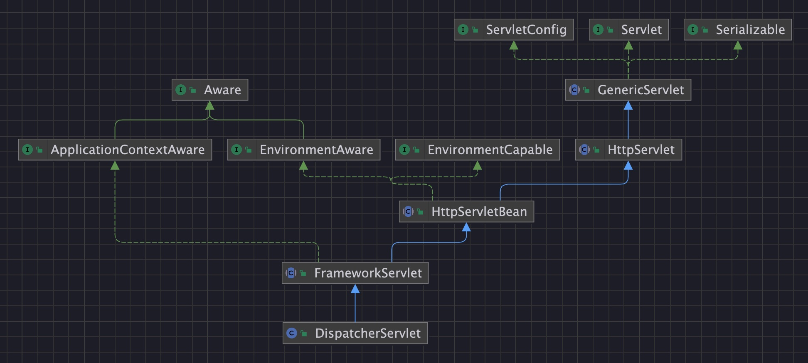

# Spring学习-MVC

课程地址：https://www.bilibili.com/video/BV1rt4y1u7q5

## 01. SpringMVC简介

### SpringMVC概述

SpringMVC是一个基于Spring开发的MVC轻量级框架，Spring3.0后发布的组件，SpringMVC和Spring可以无缝整合，使用**DispatcherServlet**作为前端控制器，且内部提供了处理器映射器、处理器适配器、视图解析器等组件，可以简化JavaBean封装，Json转化、文件上传等操作。


### SpringMVC快速入门


导入Spring整合SpringMVC的坐标

```xml
<dependency> 
    <groupId>org.springframework</groupId> 
    <artifactId>spring-webmvc</artifactId> 
    <version>5.3.7</version>
</dependency>
```

编写一个控制器Controller，配置映射信息

```java
@Controller
public class UserController {
    @RequestMapping("/show")
    public String show() {
        System.out.println("show 执行....");
        //视图跳转到index.jsp
        return "/index.jsp";
    }
}
```

在web.xml中配置SpringMVC的前端控制器ServletDispatcher

```xml
<servlet>
    <servlet-name>DispatcherServlet</servlet-name>
    <servlet-class>org.springframework.web.servlet.DispatcherServlet</servlet-class>
    <!--指定springMVC配置文件位置-->
    <init-param>
        <param-name>contextConfigLocation</param-name>
        <param-value>classpath:spring-mvc.xml</param-value>
    </init-param>
    <!--服务器启动就创建-->
    <load-on-startup>2</load-on-startup>
</servlet>
<servlet-mapping>
    <servlet-name>DispatcherServlet</servlet-name>
    <url-pattern>/</url-pattern>
</servlet-mapping>
```

> webapp/WEB-INF/web.xml

创建springMVC的核心配置文件 spring-mvc.xml，并配置组件扫描web层

```xml
<?xml version="1.0" encoding="UTF-8"?>
<beans
    xmlns="http://www.springframework.org/schema/beans"
    xmlns:xsi="http://www.w3.org/2001/xmlSchema-instance"
    xmlns:mvc="http://www.springframework.org/schema/mvc"
    xmlns:context="http://www.springframework.org/schema/context"
xsi:schemaLocation="
                http://www.springframework.org/schema/beans 
                http://www.springframework.org/schema/beans/spring-beans.xsd
                http://www.springframework.org/schema/context 
                http://www.springframework.org/schema/context/spring-context.xsd
                http://www.springframework.org/schema/mvc 
                http://www.springframework.org/schema/mvc/spring-mvc.xsd">
    <!-- 组件扫描web层 -->
    <context:component-scan base-package="com.itheima.controller"/>
</beans>
```

### Controller中访问容器中的Bean

DispatcherServlet在进行初始化时，加载的spring-mvc.xml配置文件创建的SpringMVC容器，那么web层Controller被扫描进入到了容器中，而之前Spring容器中的Service是否可以获取到呢？下面搭建Spring的web环境进行验证

创建一个applicationContext.xml文件

```xml
<!-- 组件扫描非web层 -->
<context:component-scan base-package="com.itheima">
    <!--排除com.itheima包下使用@Controller注解的类-->
    <context:exclude-filter type="annotation" expression="org.springframework.stereotype.Controller"/>
</context:component-scan>
```

在web.xml中配置ContextLoaderListener

```xml
<!--配置ContextLoaderListener-->
<context-param>
    <param-name>contextConfigLocation</param-name>
    <param-value>classpath:applictionContext.xml</param-value>
</context-param>
<listener>
    <listener-class>org.springframework.web.context.ContextLoaderListener</listener-class>
</listener>
```

编写UserService和UserServiceImpl

```java
public interface UserService {
    public void show();
}

@Service("userService")
public class UserServiceImpl implements UserService {
    @Override
    public void show() {
        System.out.println("UserServiceImpl show running ... ...");
    }
}
```

修改UserController，从Spring容器中匹配Service进行注入

```java
@Controller
public class UserController {
    @Autowired
    private UserService userService;
    @RequestMapping("/show")
    public String show() {
        System.out.println("show 执行....");
        //调用userService的show方法
        userService.show();
        //视图跳转到index.jsp
        return "/index.jsp";
    }
}
```

### SpringMVC关键组件浅析

上面已经完成的快速入门的操作，也在不知不觉中完成的Spring和SpringMVC的整合，我们只需要按照规则去定义Controller和业务方法就可以。但是在这个过程中，肯定是很多核心功能类参与到其中，这些核心功能类，一般称为组件。当请求到达服务器时，是哪个组件接收的请求，是哪个组件帮我们找到的Controller，是哪个组件帮我们调用的方法，又是哪个组件最终解析的视图？


先简单了解一下以上三个重要组件的关系


SpringMVC的默认组件，SpringMVC 在前端控制器 DispatcherServlet加载时，就会进行初始化操作，在进行初始化时，就会加载SpringMVC默认指定的一些组件，这些默认组件配置在 DispatcherServlet.properties 文件中，该文件存在与spring-webmvc-5.3.7.jar包下的 org\springframework\web\servlet\DispatcherServlet.properties

```properties
# 省略其他
org.springframework.web.servlet.HandlerMapping=org.springframework.web.servlet.handler.BeanNameUrlHandlerMapping,\
	org.springframework.web.servlet.mvc.method.annotation.RequestMappingHandlerMapping,\
	org.springframework.web.servlet.function.support.RouterFunctionMapping

org.springframework.web.servlet.HandlerAdapter=org.springframework.web.servlet.mvc.HttpRequestHandlerAdapter,\
	org.springframework.web.servlet.mvc.SimpleControllerHandlerAdapter,\
	org.springframework.web.servlet.mvc.method.annotation.RequestMappingHandlerAdapter,\
	org.springframework.web.servlet.function.support.HandlerFunctionAdapter

org.springframework.web.servlet.ViewResolver=org.springframework.web.servlet.view.InternalResourceViewResolver
# 省略其他
```

这些默认的组件是在DispatcherServlet中进行初始化加载的，在DispatcherServlet中存在集合存储着这些组件，SpringMVC的默认组件会在 DispatcherServlet 中进行维护，但是并没有存储在与SpringMVC的容器中

```java
public class DispatcherServlet extends FrameworkServlet {
    //存储处理器映射器
    private List < HandlerMapping > handlerMappings;
    //存储处理器适配器
    private List < HandlerAdapter > handlerAdapters;
    //存储视图解析器
    private List < ViewResolver > viewResolvers;
    // ... 省略其他代码 ...
}
```

配置组件代替默认组件，如果不想使用默认组件，可以将替代方案使用Spring Bean的方式进行配置，例如，在spring-mvc.xml中配置RequestMappingHandlerMapping

`<bean class="org.springframework.web.servlet.mvc.method.annotation.RequestMappingHandlerMapping"/>`

当我们在Spring容器中配置了HandlerMapping，则就不会在加载默认的HandlerMapping策略了，原理比较简单，DispatcherServlet 在进行HandlerMapping初始化时，先从SpringMVC容器中找是否存在HandlerMapping，如果存在直接取出容器中的HandlerMapping，在存储到 DispatcherServlet 中的handlerMappings集合中去。

## 02. SpringMVC的请求处理

### 请求映射路径的配置

配置映射路径，映射器处理器才能找到Controller的方法资源，目前主流映射路径配置方式就是@RequestMapping


@RequestMapping注解，主要使用在控制器的方法上，用于标识客户端访问资源路径，常用的属性有value、path、method、headers、params等。当@RequestMapping只有一个访问路径需要指定时，使用value属性、path属性或省略value和path，当有多个属性时，value和path不能省略

```java
@RequestMapping(value = "/show") //使用value属性指定一个访问路径
public String show() {}

@RequestMapping(value = {
    "/show",
    "/haohao",
    "/abc"
}) //使用value属性指定多个访问路径
public String show() {}

@RequestMapping(path = "/show") //使用path属性指定一个访问路径
public String show() {}

@RequestMapping(path = {
    "/show",
    "/haohao",
    "/abc"
}) //使用path属性指定多个访问路径
public String show() {}

@RequestMapping("/show") //如果只设置访问路径时，value和path可以省略
public String show() {}

@RequestMapping({
    "/show",
    "/haohao",
    "/abc"
})
public String show() {}
```

当@RequestMapping 需要限定访问方式时，可以通过method属性设置

```java
//请求地址是/show,且请求方式必须是POST才能匹配成功
@RequestMapping(value = "/show",method = RequestMethod.POST)
public String show(){}
```

method的属性值是一个枚举类型，源码如下：

```java
public enum RequestMethod {
    GET,
    HEAD,
    POST,
    PUT,
    PATCH,
    DELETE,
    OPTIONS,
    TRACE;
    private RequestMethod() {}
}
```

@GetMapping，当请求方式是GET时，我们可以使用@GetMapping替代@RequestMapping

```java
@GetMapping("/show")
public String show(){}
```

@PostMapping，当请求方式是POST时，我们可以使用@PostMapping替代@RequestMapping

```java
@PostMapping("/show")
public String show(){}
```

@RequestMapping 在类上使用，@RequestMapping 、@GetMapping、@PostMapping还可以使用在Controller类上，使用在类上后，该类所有方法都公用该@RequestMapping设置的属性，访问路径则为类上的映射地址+方法上的映射地址，例如：

```java
@Controller
@RequestMapping("/xxx")
public class UserController implements ApplicationContextAware, ServletContextAware {
    @GetMapping("/aaa")
    public ModelAndView aaa(HttpServletResponse response) throws IOException,
        ModelAndViewDefiningException {
            return null;
        }
}
```

此时的访问路径为：/xxx/aaa

### 请求数据的接收

接收普通请求数据，当客户端提交的数据是普通键值对形式时，直接使用同名形参接收即可

```java
// username=haohao&age=35

@GetMapping("/show")
public String show(String username, int age) {
    System.out.println(username + "==" + age);
    return "/index.jsp";
}
```

接收普通请求数据，当请求参数的名称与方法参数名不一致时，可以使用@RequestParam注解进行标注

```java
// username=haohao&age=35

@GetMapping("/show")
public String show(@RequestParam(name = "username", required = true) String name, int age) {
    System.out.println(name + "==" + age);
    return "/index.jsp";
}
```

接收数组或集合数据，客户端传递多个同名参数时，可以使用数组接收

```java
// hobbies=eat&hobbies=sleep

@GetMapping("/show")
public String show(String[] hobbies) {
    for(String hobby: hobbies) {
        System.out.println(hobby);
    }
    return "/index.jsp";
}
```

客户端传递多个同名参数时，也可以使用单列集合接收，但是需要使用@RequestParam告知框架传递的参数是要同名设置的，不是对象属性设置的

```java
@GetMapping("/show")
public String show(@RequestParam List < String > hobbies) {
    for(String hobby: hobbies) {
        System.out.println(hobby);
    }
    return "/index.jsp";
}
```

接收数组或集合数据，客户端传递多个不同命参数时，也可以使用Map<String,Object> 进行接收，同样需要用@RequestParam 进行修饰

```java
// username=haohao&age=18

@PostMapping("/show")
public String show(@RequestParam Map < String, Object > params) {
    params.forEach((key, value) - > {
        System.out.println(key + "==" + value);
    });
    return "/index.jsp";
}
```

接收实体JavaBean属性数据，单个JavaBean数据：提交的参数名称只要与Java的属性名一致，就可以进行自动封装

```java
// username=haohao&age=35&hobbies=eat&hobbies=sleep

public class User {
    private String username;
    private Integer age;
    private String[] hobbies;
    private Date birthday;
    private Address address;
    //... 省略get和set方法 ... 
}

@GetMapping("/show")
public String show(User user) {
    System.out.println(user);
    return "/index.jsp";
}
```

接收实体JavaBean属性数据，嵌套JavaBean数据：提交的参数名称用 . 去描述嵌套对象的属性关系即可

```java
// username=haohao&address.city=tianjin&address.area=jinghai
```

接收Json数据格式数据，Json数据都是以请求体的方式提交的，且不是原始的键值对格式的，所以我们要使用@RequestBody注解整体接收该数据。

```json
{
	"username": "haohao",
	"age": 18,
	"hobbies": ["eat", "sleep"],
	"birthday": "1986-01-01",
	"address": {
		"city": "tj",
		"area": "binhai"
	}
}
```

```java
@PostMapping("/show6")
public String show6(@RequestBody String body) {
    System.out.println(body);
    return "/index.jsp";
}
```

使用Json工具（ jackson ）将Json格式的字符串转化为JavaBean进行操作

```xml
<dependency>
    <groupId>com.fasterxml.jackson.core</groupId>
    <artifactId>jackson-databind</artifactId>
    <version>2.9.0</version>
</dependency>
```

```java
@PostMapping("/show")
public String show(@RequestBody String body) throws IOException {
    System.out.println(body);
    //获得ObjectMapper
    ObjectMapper objectMapper = new ObjectMapper();
    //将json格式字符串转化成指定的User
    User user = objectMapper.readValue(body, User.class);
    System.out.println(user);
    return "/index.jsp";
}
```

配置RequestMappingHandlerAdapter，指定消息转换器，就不用手动转换json格式字符串了

```xml
<bean 
class="org.springframework.web.servlet.mvc.method.annotation.RequestMappingHandlerAdapter">
    <property name="messageConverters">
        <list>
            <bean 
class="org.springframework.http.converter.json.MappingJackson2HttpMessageConverter"/>
        </list>
    </property>
</bean>
```

```java
@PostMapping("/show")
public String show(@RequestBody User user) {
    System.out.println(user);
    return "/index.jsp";
}
```

接收Json数据格式数据，使用Map接收json格式字符串

```java
@PostMapping("/show")
public String show(@RequestBody Map map) {
    System.out.println(map);
    return "/index.jsp";
}
```

接收Restful风格数据

什么是Rest风格？

Rest（Representational State Transfer）表象化状态转变（表述性状态转变），在2000年被提出，基于HTTP、URI、xml、JSON等标准和协议，支持轻量级、跨平台、跨语言的架构设计。是Web服务的一种新网络应用程序的设计风格和开发方式。

Restful风格的请求，常见的规则有如下三点：

* 用URI表示某个模块资源，资源名称为名词；

  

* 用请求方式表示模块具体业务动作，例如：GET表示查询、POST表示插入、PUT表示更新、DELETE表示删除

  

* 用HTTP响应状态码表示结果，国内常用的响应包括三部分：状态码、状态信息、响应数据

  ```json
  {
  	"code": 200,
  	"message": "成功",
  	"data": {
  		"username": "haohao",
  		"age": 18
  	}
  } 
  
  {
  	"code": 300,
  	"message": "执行错误",
  	"data": "",
  }
  ```

接收Restful风格数据，Restful请求数据一般会在URL地址上携带，可以使用注解 @PathVariable(占位符参数名称)

```java
// http://localhost/user/100

@PostMapping("/user/{id}")
public String findUserById(@PathVariable("id") Integer id) {
    System.out.println(id);
    return "/index.jsp";
}
```

请求URL资源地址包含多个参数情况

```java
// http://localhost/user/haohao/18

@PostMapping("/user/{username}/{age}")
public String findUserByUsernameAndAge(@PathVariable("username") String username, @PathVariable("age") Integer age) {
    System.out.println(username + "==" + age);
    return "/index.jsp";
}
```

接收文件上传的数据，文件上传的表单需要一定的要求，如下：

* 表单的提交方式必须是POST
* 表单的enctype属性必须是multipart/form-data
* 文件上传项需要有name属性

```xml
<form action="" enctype="multipart/form-data" method="post" > \
    <input type="file" name="myFile">
</form>
```

服务器端，由于映射器适配器需要文件上传解析器，而该解析器默认未被注册，所以手动注册

```xml
<!--配置文件上传解析器，注意：id的名字是固定写法-->
<bean id="multipartResolver" 
class="org.springframework.web.multipart.commons.CommonsMultipartResolver">
    <property name="defaultEncoding" value="UTF-8"/>
    <!--文件的编码格式 默认是ISO8859-1-->
    <property name="maxUploadSizePerFile" value="1048576"/>
    <!--上传的每个文件限制的大小 单位字节-->
    <property name="maxUploadSize" value="3145728"/>
    <!--上传文件的总大小-->
    <property name="maxInMemorySize" value="1048576"/>
    <!--上传文件的缓存大小-->
</bean>
```

而CommonsMultipartResolver底层使用的Apache的是Common-fileuplad等工具API进行的文件上传

```xml
<dependency>
    <groupId>commons-fileupload</groupId>
    <artifactId>commons-fileupload</artifactId>
    <version>1.4</version>
</dependency>
```

使用MultipartFile类型接收上传文件

```java
@PostMapping("/fileUpload")
public String fileUpload(@RequestBody MultipartFile myFile) throws IOException {
    System.out.println(myFile);
    //获得上传的文件的流对象
    InputStream inputStream = myFile.getInputStream();
    //使用commons-io存储到C:\haohao\abc.txt位置
    FileOutputStream outputStream = new
    FileOutputStream("C:\\Users\\haohao\\" + myFile.getOriginalFilename());
    IOUtils.copy(inputStream, outputStream);
    //关闭资源
    inputStream.close();
    outputStream.close();
    return "/index.jsp";
}
```

接收Http请求头数据，接收指定名称的请求头

```java
@GetMapping("/headers")
public String headers(@RequestHeader("Accept-Encoding") String acceptEncoding) {
    System.out.println("Accept-Encoding:" + acceptEncoding);
    return "/index.jsp";
}
```

接收所有的请求头信息

```java
@GetMapping("/headersMap")
public String headersMap(@RequestHeader Map < String, String > map) {
    map.forEach((k, v) - > {
        System.out.println(k + ":" + v);
    });
    return "/index.jsp";
}
```

获得客户端携带的Cookie数据

```java
@GetMapping("/cookies")
public String cookies(@CookieValue(value = "JSESSIONID", defaultValue = "") String jsessionid) {
    System.out.println(jsessionid);
    return "/index.jsp";
}
```

获得转发Request域中数据，在进行资源之间转发时，有时需要将一些参数存储到request域中携带给下一个资源

```java
@GetMapping("/request1")
public String request1(HttpServletRequest request) {
    //存储数据
    request.setAttribute("username", "haohao");
    return "/request2";
}
@GetMapping("/request2")
public String request2(@RequestAttribute("username") String username) {
    System.out.println(username);
    return "/index.jsp";
}
```

请求参数乱码的解决方案，Spring已经提供好的CharacterEncodingFilter来进行编码过滤

```xml
<!--配置全局的编码过滤器-->
<filter>
    <filter-name>CharacterEncodingFilter</filter-name>
    <filter-class>org.springframework.web.filter.CharacterEncodingFilter</filter-class>
    <init-param>
        <param-name>encoding</param-name>
        <param-value>UTF-8</param-value>
    </init-param>
</filter>
<filter-mapping>
    <filter-name>CharacterEncodingFilter</filter-name>
    <url-pattern>/*</url-pattern>
</filter-mapping>
```

### Javaweb常用对象获取

获得Javaweb常见原生对象，有时在我们的Controller方法中需要用到Javaweb的原生对象，例如：Request、Response等，我们只需要将需要的对象以形参的形式写在方法上，SpringMVC框架在调用Controller方法时，会自动传递实参：

```java
@GetMapping("/javawebObject")
public String javawebObject(HttpServletRequest request, HttpServletResponse response, HttpSession session) {
    System.out.println(request);
    System.out.println(response);
    System.out.println(session);
    return "/index.jsp";
}
```

### 请求静态资源

静态资源请求失效的原因，当DispatcherServlet的映射路径配置为 / 的时候，那么就覆盖的Tomcat容器默认的缺省Servlet，在Tomcat的config目录下有一个web.xml 是对所有的web项目的全局配置，其中有如下配置：

```xml
<servlet>
    <servlet-name>default</servlet-name>
    <servlet-class>org.apache.catalina.servlets.DefaultServlet</servlet-class>
    <load-on-startup>1</load-on-startup>
</servlet>
<servlet-mapping>
    <servlet-name>default</servlet-name>
    <url-pattern>/</url-pattern>
</servlet-mapping>
```

url-pattern配置为 / 的Servlet我们称其为缺省的Servlet，作用是当其他Servlet都匹配不成功时，就找缺省的Servlet，静态资源由于没有匹配成功的Servlet，所以会找缺省的DefaultServlet，该DefaultServlet具备二次去匹配静态资源的功能。但是我们配置DispatcherServlet后就将其覆盖掉了，而DispatcherServlet会将请求的静态资源的名称当成Controller的映射路径去匹配，即静态资源访问不成功了！

静态资源请求的三种解决方案：

第一种方案，可以再次激活Tomcat的DefaultServlet，Servlet的url-pattern的匹配优先级是：精确匹配>目录匹配>扩展名匹配>缺省匹配，所以可以指定某个目录下或某个扩展名的资源使用DefaultServlet进行解析：

```xml
<servlet-mapping>
    <servlet-name>default</servlet-name>
    <url-pattern>/img/*</url-pattern>
</servlet-mapping>
<servlet-mapping>
    <servlet-name>default</servlet-name>
    <url-pattern>*.html</url-pattern>
</servlet-mapping>
```

第二种方式，在spring-mvc.xml中去配置静态资源映射，匹配映射路径的请求到指定的位置去匹配资源

```xml
<!-- mapping是映射资源路径，location是对应资源所在的位置 -->
<mvc:resources mapping="/img/*" location="/img/"/>
<mvc:resources mapping="/css/*" location="/css/"/>
<mvc:resources mapping="/css/*" location="/js/"/>
<mvc:resources mapping="/html/*" location="/html/"/>
```

第三种方式，在spring-mvc.xml中去配置< mvc:default-servlet-handler >，该方式是注册了一个DefaultServletHttpRequestHandler 处理器，静态资源的访问都由该处理器去处理，这也是开发中使用最多的

`<mvc:default-servlet-handler/>`

### 注解驱动 `<mvc:annotation-driven>` 标签

静态资源配置的第二第三种方式我们可以正常访问静态资源了，但是Controller又无法访问了，报错404，即找不到对应的资源

> HTTP状态 404 - 未找到

第二种方式是通过SpringMVC去解析mvc命名空间下的resources标签完成的静态资源解析，第三种方式式通过SpringMVC去解析mvc命名空间下的default-servlet-handler标签完成的静态资源解析，根据前面所学习的自定义命名空间的解析的知识，可以发现不管是以上哪种方式，最终都会注册SimpleUrlHandlerMapping

```java
public BeanDefinition parse(Element element, ParserContext context) {
    //创建SimpleUrlHandlerMapping类型的BeanDefinition
    RootBeanDefinition handlerMappingDef = new RootBeanDefinition(SimpleUrlHandlerMapping.class);
    //注册SimpleUrlHandlerMapping的BeanDefinition
    context.getRegistry().registerBeanDefinition(beanName, handlerMappingDef);
}
```

又结合组件浅析知识点，一旦SpringMVC容器中存在 HandlerMapping 类型的组件时，前端控制器DispatcherServlet在进行初始化时，就会从容器中获得HandlerMapping ，不在加载 dispatcherServlet.properties中默认处理器映射器策略，那也就意味着RequestMappingHandlerMapping不会被加载到了。

手动将RequestMappingHandlerMapping也注册到SpringMVC容器中就可以了，这样DispatcherServlet在进行初始化时，就会从容器中同时获得RequestMappingHandlerMapping存储到DispatcherServlet中名为handlerMappings的List集合中，对@RequestMapping 注解进行解析。

`<bean class="org.springframework.web.servlet.mvc.method.annotation.RequestMappingHandlerMapping"/>`

根据上面的讲解，可以总结一下，要想使用@RequestMapping正常映射到资源方法，同时静态资源还能正常访问，还可以将请求json格式字符串和JavaBean之间自由转换，我们就需要在spring-mvc.xml中尽心如下配置：

```xml
<!-- 显示配置RequestMappingHandlerMapping -->
<bean class="org.springframework.web.servlet.mvc.method.annotation.RequestMappingHandlerMapping"/>
<!-- 显示配置RequestMappingHandlerAdapter -->
<bean class="org.springframework.web.servlet.mvc.method.annotation.RequestMappingHandlerAdapter">
    <property name="messageConverters">
        <list>
            <bean class="org.springframework.http.converter.json.MappingJackson2HttpMessageConverter"/>
        </list>
    </property>
</bean>
<!--配置DefaultServletHttpRequestHandler-->
<mvc:default-servlet-handler/>
```

这么复杂繁琐的配置，是不是看上去有点头大？Spring是个"暖男"，将上述配置浓缩成了一个简单的配置标签，那就是mvc的注解驱动，该标签内部会帮我们注册RequestMappingHandlerMapping、注册RequestMappingHandlerAdapter并注入Json消息转换器等，上述配置就可以简化成如下：

```xml
<mvc:annotation-driven/>
<!--配置DefaultServletHttpRequestHandler-->
<mvc:default-servlet-handler/>
```

PS：<mvc:annotation-driven> 标签在不同的版本中，帮我们注册的组件不同，Spring 3.0.X 版本注册是DefaultAnnotationHandlerMapping 和 AnnotationMethodHandlerAdapter，由于框架的发展，从Spring 3.1.X 开始注册组件变为 RequestMappingHandlerMapping和RequestMappingHandlerAdapter

## 03. SpringMVC的响应处理

### 传统同步业务数据响应

Spring的接收请求的部分我们讲完了，下面在看一下Spring怎么给客户端响应数据，响应数据主要分为两大部分：

* 传统同步方式：准备好模型数据，再跳转到执行页面进行展示，此方式使用越来越少了，基于历史原因，一些旧项目还在使用；
* 前后端分离异步方式：前端使用Ajax技术+Restful风格与服务端进行Json格式为主的数据交互，目前市场上几乎都是此种方式了。

传统同步业务在数据响应时，SpringMVC又涉及如下四种形式：

* 请求资源转发；
* 请求资源重定向；
* 响应模型数据；
* 直接回写数据给客户端；


响应模型数据，响应模型数据本质也是转发，在转发时可以准备模型数据

```java
@GetMapping("/forward5")
public ModelAndView forward5(ModelAndView modelAndView) {
    //准备JavaBean模型数据
    User user = new User();
    user.setUsername("haohao");
    //设置模型
    modelAndView.addObject("user", user);
    //设置视图
    modelAndView.setViewName("/index.jsp");
    return modelAndView;
}
```

直接回写数据，直接通过方法的返回值返回给客户端的字符串，但是SpringMVC默认的方法返回值是视图，可以通过@ResponseBody 注解显示的告知此处的返回值不要进行视图处理，是要以响应体的方式处理的

```java
@GetMapping("/response2")
@ResponseBody
public String response2() throws IOException {
    return "Hello haohao!";
}
```

### 前后端分离异步业务数据响应

其实此处的回写数据，跟上面回写数据给客户端的语法方式一样，只不过有如下一些区别：

* 同步方式回写数据，是将数据响应给浏览器进行页面展示的，而异步方式回写数据一般是回写给Ajax引擎的，即谁访问服务器端，服务器端就将数据响应给谁
* 同步方式回写的数据，一般就是一些无特定格式的字符串，而异步方式回写的数据大多是Json格式字符串

回写普通数据使用@ResponseBody标注方法，直接返回字符串即可，此处不在说明；

回写Json格式的字符串，即将直接拼接Json格式的字符串或使用工具将JavaBean转换成Json格式的字符串回写

```java
@GetMapping("/response3")
@ResponseBody
public String response3(HttpServletResponse response) {
    return "{\"username\":\"haohao\",\"age\":18}";
}

@GetMapping("/response4")
@ResponseBody
public String response4() throws JsonProcessingException {
    //创建JavaBean
    User user = new User();
    user.setUsername("haohao");
    user.setAge(18);
    //使用Jackson转换成json格式的字符串
    String json = new ObjectMapper().writeValueAsString(user);
    return json;
}
```

在讲解SringMVC接收请求数据时，客户端提交的Json格式的字符串，也是使用Jackson进行的手动转换成JavaBean，可以当我们使用了@RequestBody时，直接用JavaBean就接收了Json格式的数据，原理其实就是SpringMVC底层帮我们做了转换，此处@ResponseBody也可以将JavaBean自动给我们转换成Json格式字符串回响应

```java
@GetMapping("/response5")
@ResponseBody
public User response5() throws JsonProcessingException {
    //创建JavaBean
    User user = new User();
    user.setUsername("haohao");
    user.setAge(18);
    //直接返回User对象
    return user;
}
```

@ResponseBody注解使用优化，在进行前后端分离开发时，Controller的每个方法都是直接回写数据的，所以每个方法上都得写@ResponseBody，可以将@ResponseBody写到Controller上，那么该Controller中的所有方法都具备了返回响应体数据的功能了

```java
@Controller
@ResponseBody
public class UserController {
    @GetMapping("/response7")
    public ResultInfo response7() {
        //省略其他代码
        return info;
    }
    
    @GetMapping("/response5")
    public User response5() throws JsonProcessingException {
        //省略其他代码
        return user;
    }
    // ... 省略其他方法 ...
}
```

进一步优化，可以使用@RestController替代@Controller和@ResponseBody，@RestController内部具备的这两个注解的功能

```java
@RestController
public class UserController {
    @GetMapping("/response7")
    public ResultInfo response7() {
        //省略其他代码
        return info;
    }
    
    @GetMapping("/response5")
    public User response5() throws JsonProcessingException {
        //省略其他代码
        return user;
    }
    // ... 省略其他方法 ...
}
```

## 04. SpringMVC的拦截器

### 拦截器 Interceptor 简介

SpringMVC的拦截器Interceptor规范，主要是对Controller资源访问时进行拦截操作的技术，当然拦截后可以进行权限控制，功能增强等都是可以的。拦截器有点类似 Javaweb 开发中的Filter，拦截器与Filter的区别如下图：


由上图，对Filter 和 Interceptor 做个对比：


实现了HandlerInterceptor接口，且被Spring管理的Bean都是拦截器，接口定义如下：

```java
public interface HandlerInterceptor {
    
    default boolean preHandle(HttpServletRequest request, HttpServletResponse response, Object handler) throws Exception {
        return true;
    }
    
    default void postHandle(HttpServletRequest request, HttpServletResponse response, Object handler, @Nullable ModelAndView modelAndView) throws Exception {}
    
    default void afterCompletion(HttpServletRequest request, HttpServletResponse response, Object handler, @Nullable Exception ex) throws Exception {}
}
```

HandlerInterceptor接口方法的作用及其参数、返回值详解如下：


### 拦截器快速入门

编写MyInterceptor01实现HandlerInterceptor接口：

```java
public class MyInterceptor01 implements HandlerInterceptor {
    @Override
    public boolean preHandle(HttpServletRequest request, HttpServletResponse response, Object handler) throws Exception {
        System.out.println("Controller方法执行之前...");
        return true; //放行
    }
    @Override
    public void postHandle(HttpServletRequest request, HttpServletResponse response, Object handler, ModelAndView modelAndView) throws Exception {
        System.out.println("Controller方法执行之后...");
    }
    @Override
    public void afterCompletion(HttpServletRequest request, HttpServletResponse response, Object handler, Exception ex) throws Exception {
        System.out.println("渲染视图结束，整个流程完毕...");
    }
}
```

配置Interceptor

```xml
<!--配置拦截器-->
<mvc:interceptors>
    <mvc:interceptor>
        <!--配置对哪些资源进行拦截操作-->
        <mvc:mapping path="/**"/>
        <bean class="com.itheima.interceptor.MyInterceptor01"></bean>
    </mvc:interceptor>
</mvc:interceptors>
```

### 拦截器执行顺序

拦截器三个方法的执行顺序

当每个拦截器都是放行状态时，三个方法的执行顺序如下：


拦截器三个方法的执行顺序

当Interceptor1和Interceptor2处于放行，Interceptor3处于不放行时，三个方法的执行顺序如下：


拦截器执行顺序取决于 interceptor 的配置顺序

```xml
<mvc:interceptors>
    <mvc:interceptor>
        <mvc:mapping path="/target"/>
        <bean class="com.itheima.interceptor.MyInterceptor02"></bean>
    </mvc:interceptor>
    <mvc:interceptor>
        <mvc:mapping path="/*"/>
        <bean class="com.itheima.interceptor.MyInterceptor01"></bean>
    </mvc:interceptor>
</mvc:interceptors>
```

### 拦截器执行原理

请求到来时先会使用组件HandlerMapping去匹配Controller的方法（Handler）和符合拦截路径的Interceptor，Handler和多个Interceptor被封装成一个HandlerExecutionChain的对象

HandlerExecutionChain 定义如下：

```java
public class HandlerExecutionChain {
    //映射的Controller的方法
    private final Object handler;
    //当前Handler匹配的拦截器集合
    private final List < HandlerInterceptor > interceptorList;
    // ... 省略其他代码 ...
}
```

在DispatcherServlet的doDispatch方法中执行拦截器

```java
protected void doDispatch(HttpServletRequest request, HttpServletResponse response) {
    //根据请求信息获得HandlerExecutionChain
    HandlerExecutionChain mappedHandler = this.getHandler(request);
    //获得处理器适配器
    HandlerAdapter ha = this.getHandlerAdapter(mappedHandler.getHandler());
    //执行Interceptor的前置方法，前置方法如果返回false，则该流程结束
    if(!mappedHandler.applyPreHandle(request, response)) {
        return;
    }
    //执行handler，一般是HandlerMethod
    ModelAndView mv = ha.handle(processedRequest, response, mappedHandler.getHandler());
    //执行后置方法
    mappedHandler.applyPostHandle(processedRequest, response, mv);
    //执行最终方法
    this.triggerAfterCompletion(processedRequest, response, mappedHandler, e);
}
```

跟踪 HandlerExecutionChain的applyPreHandle方法源码：

```java
boolean applyPreHandle(HttpServletRequest request, HttpServletResponse response) throws
Exception {
    //对interceptorList进行遍历,正向遍历,与此同时使用interceptorIndex进行计数
    for(int i = 0; i < this.interceptorList.size(); this.interceptorIndex = i++) {
        //取出每一个Interceptor对象
        HandlerInterceptor interceptor = (HandlerInterceptor) this.interceptorList.get(i);
        //调用Interceptor的preHandle方法，如果返回false，则直接执行Interceptor的最终方法
        if(!interceptor.preHandle(request, response, this.handler)) {
            //执行Interceptor的最终方法
            this.triggerAfterCompletion(request, response, (Exception) null);
            return false;
        }
    }
    return true;
}
```

跟踪 HandlerExecutionChain的applyPostHandle方法源码：

```java
void applyPostHandle(HttpServletRequest request, HttpServletResponse response, @Nullable ModelAndView mv) throws Exception {
    //对interceptorList进行遍历，逆向遍历
    for(int i = this.interceptorList.size() - 1; i >= 0; --i) {
        //取出每一个Interceptor
        HandlerInterceptor interceptor = (HandlerInterceptor) this.interceptorList.get(i);
        //执行Interceptor的postHandle方法
        interceptor.postHandle(request, response, this.handler, mv);
    }
}
```

跟踪HandlerExecutionChain的triggerAfterCompletion方法源码：

```java
void triggerAfterCompletion(HttpServletRequest request, HttpServletResponse response, @Nullable Exception ex) {
    //逆向遍历interceptorList，遍历的个数为执行的applyPreHandle次数-1
    for(int i = this.interceptorIndex; i >= 0; --i) {
        //取出每一个Interceptor
        HandlerInterceptor interceptor = (HandlerInterceptor) this.interceptorList.get(i);
        try {
            //执行Interceptor的afterCompletion方法
            interceptor.afterCompletion(request, response, this.handler, ex);
        } catch (Throwable var7) {
            logger.error("HandlerInterceptor.afterCompletion threw exception", var7);
        }
    }
}
```


## 05. SpringMVC的全注解开发

### spring-mvc.xml中组件转化为注解形式

跟之前全注解开发思路一致， xml配置文件使用核心配置类替代，xml中的标签使用对应的注解替代

```xml
<context:component-scan base-package="com.itheima.controller"/>
<!--注解驱动-->
<mvc:annotation-driven/>
<!--配置文件上传解析器-->
<bean id="multipartResolver" 
class="org.springframework.web.multipart.commons.CommonsMultipartResolver"/>
<!--配置拦截器-->
<mvc:interceptors>
    <mvc:interceptor>
        <mvc:mapping path="/*"/>
        <bean class="com.itheima.interceptor.MyInterceptor01"></bean>
    </mvc:interceptor>
</mvc:interceptors>
<!--配置DefaultServletHttpRequestHandler-->
<mvc:default-servlet-handler/>
```

组件扫描，可以通过@ComponentScan注解完成；

文件上传解析器multipartResolver可以通过非自定义Bean的注解配置方式，即@Bean注解完成

```java
@Configuration
@ComponentScan("com.itheima.controller")
public class SpringMVCConfig {
    @Bean
    public CommonsMultipartResolver multipartResolver() {
        CommonsMultipartResolver multipartResolver = new CommonsMultipartResolver();
        multipartResolver.setDefaultEncoding("UTF-8");
        multipartResolver.setMaxUploadSize(3145728);
        multipartResolver.setMaxUploadSizePerFile(1048576);
        multipartResolver.setMaxInMemorySize(1048576);
        return multipartResolver;
    }
}
```

`<mvc:annotation-driven>`、`<mvc:default-servlet-handler/>` 和 `<mvc:interceptor >` 怎么办呢？SpringMVC 提供了一个注解@EnableWebMvc，我们看一下源码，内部通过@Import 导入了DelegatingWebMvcConfiguration类

```java
@Retention(RetentionPolicy.RUNTIME)
@Target({
    ElementType.TYPE
})
@Documented
@Import({
    DelegatingWebMvcConfiguration.class
})
public @interface EnableWebMvc {}


@Configuration(proxyBeanMethods = false)
public class DelegatingWebMvcConfiguration extends WebMvcConfigurationSupport {
    private final WebMvcConfigurerComposite configurers = new WebMvcConfigurerComposite();
    //从容器中注入WebMvcConfigurer类型的Bean
    @Autowired(required = false)
    public void setConfigurers(List < WebMvcConfigurer > configurers) {
        if(!CollectionUtils.isEmpty(configurers)) {
            this.configurers.addWebMvcConfigurers(configurers);
        }
    }
    //省略其他代码
}
```

> 在DelegatingWebMvcConfiguration父类WebMvcConfigurationSupport中，向Spring容器中通过@Bean注入了默认的RequestMappingHandlerMapping、RequestMappingHandlerAdapter、....

WebMvcConfigurer类型的Bean会被注入进来，然后被自动调用，所以可以实现WebMvcConfigurer接口，完成一些解析器、默认Servlet等的指定，WebMvcConfigurer接口定义如下：

```java
public interface WebMvcConfigurer {
    //配置默认Servet处理器
    default void configureDefaultServletHandling(DefaultServletHandlerConfigurer configurer) {}
    //添加拦截器
    default void addInterceptors(InterceptorRegistry registry) {}
    //添加资源处理器
    default void addResourceHandlers(ResourceHandlerRegistry registry) {}
    //添加视图控制器
    default void addViewControllers(ViewControllerRegistry registry) {}
    //配置视图解析器
    default void configureViewResolvers(ViewResolverRegistry registry) {}
    //添加参数解析器
    default void addArgumentResolvers(List < HandlerMethodArgumentResolver > resolvers) {}
    //... 省略其他代码 ...
}
```

创建MyWebMvcConfigurer实现WebMvcConfigurer接口，实现addInterceptors 和configureDefaultServletHandling方法

```java
@Component
public class MyWebMvcConfigurer implements WebMvcConfigurer {
    @Override
    public void configureDefaultServletHandling(DefaultServletHandlerConfigurer configurer) {
        //开启DefaultServlet，可以处理静态资源了
        configurer.enable();
    }
    
    @Override
    public void addInterceptors(InterceptorRegistry registry) {
        //创建拦截器对象，进行注册
        //Interceptor的执行顺序也取决于添加顺序
        registry.addInterceptor(new MyInterceptor01()).addPathPatterns("/*");
    }
}
```

最后，在SpringMVC核心配置类上添加@EnableWebMvc注解

```java
@Configuration
@ComponentScan("com.itheima.controller")
@EnableWebMvc
public class SpringMVCConfig {
    @Bean
    public CommonsMultipartResolver multipartResolver() {
        CommonsMultipartResolver multipartResolver = new CommonsMultipartResolver();
        multipartResolver.setDefaultEncoding("UTF-8");
        multipartResolver.setMaxUploadSize(3145728);
        multipartResolver.setMaxUploadSizePerFile(1048576);
        multipartResolver.setMaxInMemorySize(1048576);
        return multipartResolver;
    }
}
```

### DispatcherServlet加载核心配置类

DispatcherServlet在进行SpringMVC配置文件加载时，使用的是以下方式：

```xml
<!--配置springMVC前端控制器-->
<servlet>
    <servlet-name>DispatcherServlet</servlet-name>
    <servlet-class>org.springframework.web.servlet.DispatcherServlet</servlet-class>
    <!--指定springMVC配置文件位置-->
    <init-param>
        <param-name>contextConfigLocation</param-name>
        <param-value>classpath:spring-mvc.xml</param-value>
    </init-param>
    <!--服务器启动就创建-->
    <load-on-startup>2</load-on-startup>
</servlet>
<servlet-mapping>
    <servlet-name>DispatcherServlet</servlet-name>
    <url-pattern>/</url-pattern>
</servlet-mapping>
```

现在是使用SpringMVCConfig核心配置类提替代的spring-mvc.xml，怎么加载呢？参照Spring的ContextLoaderListener加载核心配置类的做法，定义了一个AnnotationConfigWebApplicationContext，通过

代码注册核心配置类

```java
public class MyAnnotationConfigWebApplicationContext extends
AnnotationConfigWebApplicationContext {
    public MyAnnotationConfigWebApplicationContext() {
        //注册核心配置类
        super.register(SpringMVCConfig.class);
    }
}
```

```xml
<!--指定springMVC的applicationContext全限定名 -->
<init-param>
    <param-name>contextClass</param-name>
    <param-value>com.itheima.config.MyAnnotationConfigWebApplicationContext</param-value>
</init-param>
```

### 消除web.xml

目前，几乎消除了配置文件，但是web工程的入口还是使用的web.xml进行配置的，如下

```xml
<!--配置springMVC前端控制器-->
<servlet>
    <servlet-name>DispatcherServlet</servlet-name>
    <servlet-class>org.springframework.web.servlet.DispatcherServlet</servlet-class>
    <!--指定springMVC的applicationContext全限定名 -->
    <init-param>
        <param-name>contextClass</param-name>
        <param-value>com.itheima.config.MyAnnotationConfigWebApplicationContext</param-value>
    </init-param>
    <!--服务器启动就创建-->
    <load-on-startup>2</load-on-startup>
</servlet>
<servlet-mapping>
    <servlet-name>DispatcherServlet</servlet-name>
    <url-pattern>/</url-pattern>
</servlet-mapping>
```

Servlet3.0环境中，web容器提供了javax.servlet.ServletContainerInitializer接口，实现了该接口后，在对应的类加载路径的META-INF/services 目录创建一个名为javax.servlet.ServletContainerInitializer的文件，文件内容指定具体的ServletContainerInitializer实现类，那么，当web容器启动时就会运行这个初始化器做一些组件内的初始化工作；

基于这个特性，Spring就定义了一个SpringServletContainerInitializer实现了ServletContainerInitializer接口; 

而SpringServletContainerInitializer会查找实现了WebApplicationInitializer的类，Spring又提供了一个WebApplicationInitializer的基础实现类AbstractAnnotationConfigDispatcherServletInitializer，当我们编写类继承AbstractAnnotationConfigDispatcherServletInitializer时，容器就会自动发现我们自己的类，在该类中我们就可以配置Spring和SpringMVC的入口了。

按照下面的配置就可以完全省略web.xml

```java
public class MyAnnotationConfigDispatcherServletInitializer extends AbstractAnnotationConfigDispatcherServletInitializer {
    //返回的带有@Configuration注解的类用来配置ContextLoaderListener
    protected Class < ? > [] getRootConfigClasses() {
        System.out.println("加载核心配置类创建ContextLoaderListener");
        return new Class[] {
            ApplicationContextConfig.class
        };
    }
    //返回的带有@Configuration注解的类用来配置DispatcherServlet
    protected Class < ? > [] getServletConfigClasses() {
        System.out.println("加载核心配置类创建DispatcherServlet");
        return new Class[] {
            SpringMVCConfig.class
        };
    }
    //将一个或多个路径映射到DispatcherServlet上
    protected String[] getServletMappings() {
        return new String[] {
            "/"
        };
    }
}
```

## 06. SpringMVC的组件原理剖析

### 前端控制器初始化

前端控制器DispatcherServlet是SpringMVC的入口，也是SpringMVC的大脑，主流程的工作都是在此完成的，梳理一下DispatcherServlet 代码。DispatcherServlet 本质是个Servlet，当配置了 load-on-startup 时，会在服务器启动时就执行创建和执行初始化init方法，每次请求都会执行service方法

DispatcherServlet 的初始化主要做了两件事：

* 获得了一个 SpringMVC 的 ApplicationContext 容器；
* 注册了 SpringMVC的九大组件



SpringMVC 的ApplicationContext容器创建时机，Servlet 规范的 init(ServletConfig config) 方法经过子类重写，最终会调用 FrameworkServlet 抽象类的initWebApplicationContext() 方法，该方法中最终获得 一个根Spring容器（Spring产生的），一个子Spring容器（SpringMVC产生的）

HttpServletBean 的初始化方法

```java
public final void init() throws ServletException {
    this.initServletBean();
}
```

FrameworkServlet的initServletBean方法

```java
protected final void initServletBean() throws ServletException {
    //初始化ApplicationContext
    this.webApplicationContext = this.initWebApplicationContext(); 
    //模板设计模式，供子类覆盖实现，但是子类DispatcherServlet没做使用
    this.initFrameworkServlet(); 
}
```

在initWebApplicationContext方法中体现的父子容器的逻辑关系

```java
//初始化ApplicationContext是一个及其关键的代码
protected WebApplicationContext initWebApplicationContext() {
    //获得根容器，其实就是通过ContextLoaderListener创建的ApplicationContext
    //如果配置了ContextLoaderListener则获得根容器，没配置获得的是null
    WebApplicationContext rootContext = WebApplicationContextUtils.getWebApplicationContext(this.getServletContext());
    //定义SpringMVC产生的ApplicationContext子容器
    WebApplicationContext wac = null;
    if(wac == null) {
        //==>创建SpringMVC的子容器，创建同时将Spring的创建的rootContext传递了过去
        wac = this.createWebApplicationContext(rootContext);
    }
    //将SpringMVC产生的ApplicationContext子容器存储到ServletContext域中
    //key名是：org.springframework.web.servlet.FrameworkServlet.CONTEXT.DispatcherServlet
    if(this.publishContext) {
        String attrName = this.getServletContextAttributeName();
        this.getServletContext().setAttribute(attrName, wac);
    }
}
```

跟进创建子容器的源码

```java
protected WebApplicationContext createWebApplicationContext(@Nullable ApplicationContext parent) {
    //实例化子容器ApplicationContext
    ConfigurableWebApplicationContext wac = (ConfigurableWebApplicationContext) BeanUtils.instantiateClass(contextClass);
    //设置传递过来的ContextLoaderListener的rootContext为父容器
    wac.setParent(parent);
    //获得web.xml配置的classpath:spring-mvc.xml
    String configLocation = this.getContextConfigLocation();
    if(configLocation != null) {
        //为子容器设置配置加载路径
        wac.setConfigLocation(configLocation);
    }
    //初始化子容器(就是加载spring-mvc.xml配置的Bean)
    this.configureAndRefreshWebApplicationContext(wac);
    return wac;
}
```

子容器中的parent维护着父容器的引用


父容器和子容器概念和关系：

* 父容器：Spring 通过ContextLoaderListener为入口产生的applicationContext容器，内部主要维护的是applicationContext.xml（或相应配置类）配置的Bean信息；
* 子容器：SpringMVC通过DispatcherServlet的init() 方法产生的applicationContext容器，内部主要维护的是spring-mvc.xml（或相应配置类）配置的Bean信息，且内部还通过parent属性维护这父容器的引用。
* Bean的检索顺序：根据上面子父容器的概念，可以知道Controller存在与子容器中，而Controller中要注入Service时，会先从子容器本身去匹配，匹配不成功时在去父容器中去匹配，于是最终从父容器中匹配到的UserService，这样子父容器就可以进行联通了。但是父容器只能从自己容器中进行匹配，不能从子容器中进行匹配。

注册 SpringMVC的 九大组件，在初始化容器initWebApplicationContext方法中执行了onRefresh方法，进而执行了初始化策略initStrategies方法，注册了九个解析器组件

```java
//DispatcherServlet初始化SpringMVC九大组件
protected void initStrategies(ApplicationContext context) {
    this.initMultipartResolver(context); //1、初始化文件上传解析器
    this.initLocaleResolver(context); //2、初始化国际化解析器
    this.initThemeResolver(context); //3、初始化模板解析器
    this.initHandlerMappings(context); //4、初始化处理器映射器
    this.initHandlerAdapters(context); //5、初始化处理器适配器
    this.initHandlerExceptionResolvers(context); //6、初始化处理器异常解析器
    this.initRequestToViewNameTranslator(context); //7、初始化请求视图转换器
    this.initViewResolvers(context); //8、初始化视图解析器
    this.initFlashMapManager(context); //9、初始化lashMapManager策略组件
}
```

以 this.initHandlerMappings(context) 为例，进一步看一下初始化处理器映射器的细节：

```java
//定义List容器存储HandlerMapping
private List < HandlerMapping > handlerMappings;
//初始化HandlerMapping的方法
private void initHandlerMappings(ApplicationContext context) {
    this.handlerMappings = null; //初始化集合为null
    //detectAllHandlerMappings默认为true，代表是否从所有容器中(父子容器)检测HandlerMapping
    if(this.detectAllHandlerMappings) {
        //从Spring容器中去匹配HandlerMapping
        Map < String, HandlerMapping > matchingBeans = BeanFactoryUtils.beansOfTypeIncludingAncestors(context, HandlerMapping.class, true, false);
        //如果从容器中获取的HandlerMapping不为null就加入到事先定义好的handlerMappings容器中
        if(!matchingBeans.isEmpty()) {
            this.handlerMappings = new ArrayList(matchingBeans.values());
            AnnotationAwareOrderComparator.sort(this.handlerMappings);
        }
        //如果从容器中没有获得HandlerMapping，意味着handlerMappings集合是空的
        if(this.handlerMappings == null) {
            //加载默认的HandlerMapping，就是加载DispatcherServlet.properties文件中的键值对
            this.handlerMappings = this.getDefaultStrategies(context, HandlerMapping.class);
        }
    }
}
```


### 前端控制器执行主流程

