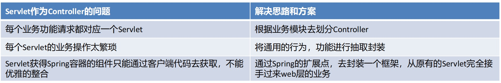

# Spring学习-WEB

课程地址：https://www.bilibili.com/video/BV1rt4y1u7q5

## 01. Spring整合web环境

###  JavaWeb三大组件及环境特点

在Java语言范畴内，web层框架都是基于Javaweb基础组件完成的，所以有必要复习一下Javaweb组件的特点


### Spring整合web环境的思路及实现

在进行Java开发时要遵循三层架构+MVC，Spring操作最核心的就是Spring容器，web层需要注入Service，service层需要注入Dao（Mapper），web层使用Servlet技术充当的话，需要在Servlet中获得Spring容器

```java
AnnotationConfigApplicationContext applicationContext = new AnnotationConfigApplicationContext(ApplicationContextConfig.class);
AccountService accountService = (AccountService) applicationContext.getBean("accountService");
accountService.transferMoney("tom", "lucy", 100);
```

web层代码如果都去编写创建AnnotationConfigApplicationContext的代码，那么配置类重复被加载了，Spring容器也重复被创建了，不能每次想从容器中获得一个Bean都得先创建一次容器，这样肯定是不允许。

所以，我们现在的诉求很简单，如下：

* ApplicationContext创建一次，配置类加载一次; 
* 最好web服务器启动时，就执行第1步操作，后续直接从容器中获取Bean使用即可; 
* ApplicationContext的引用需要在web层任何位置都可以获取到。

针对以上诉求我们给出解决思路，如下：

* 在ServletContextListener的contextInitialized方法中执行ApplicationContext的创建；或在Servlet的init方法中执行ApplicationContext的创建，并给Servlet的load-on-startup属性一个数字值，确保服务器启动Servlet就创建; 
* 将创建好的ApplicationContext存储到ServletContext域中，这样整个web层任何位置就都可以获取到了

**代码如下：**

* 在ServletContextListener的contextInitialized方法中执行ApplicationContext的创建，将创建好的ApplicationContext存储到ServletContext域中。

```java
package com.itheima.listener;

import org.springframework.context.ApplicationContext;
import org.springframework.context.support.ClassPathXmlApplicationContext;

import javax.servlet.ServletContext;
import javax.servlet.ServletContextEvent;
import javax.servlet.ServletContextListener;

public class ContextLoaderListener implements ServletContextListener {

    private String CONTEXT_CONFIG_LOCATION = "contextConfigLocation";

    @Override
    public void contextInitialized(ServletContextEvent sce) {
        System.out.println("ContextLoaderListener init ...");
        ServletContext servletContext = sce.getServletContext();
        //0、获取contextConfigLocation配置文件的名称
        String contextConfigLocation = servletContext.getInitParameter(CONTEXT_CONFIG_LOCATION);
        //解析出配置文件名称
        contextConfigLocation = contextConfigLocation.substring("classpath:".length());
        //1、创建Spring容器
        ApplicationContext app = new ClassPathXmlApplicationContext(contextConfigLocation);
        //2、将容器存储到servletContext域中
        servletContext.setAttribute("applicationContext",app);

    }
}
```

* 在web层获取Spring容器

```java
@WebServlet(urlPatterns = "/accountServlet")
public class AccountServlet extends HttpServlet {

    protected void doGet(HttpServletRequest request, HttpServletResponse response) throws ServletException, IOException {
        ServletContext servletContext = request.getServletContext();
        ApplicationContext app = (ApplicationContext) servletContext.getAttribute("applicationContext");
        AccountService accountService = app.getBean(AccountService.class);
        accountService.transferMoney("tom","lucy",500);
    }
}
```

* 配置Listener，web工程对应的路径：webapp/WEB-INF/web.xml

```xml
<?xml version="1.0" encoding="UTF-8"?>
<web-app xmlns="http://xmlns.jcp.org/xml/ns/javaee"
         xmlns:xsi="http://www.w3.org/2001/XMLSchema-instance"
         xsi:schemaLocation="http://xmlns.jcp.org/xml/ns/javaee http://xmlns.jcp.org/xml/ns/javaee/web-app_3_1.xsd"
         version="3.1">

    <!--定义全局参数-->
    <context-param>
        <param-name>contextConfigLocation</param-name>
        <param-value>classpath:applicationContext.xml</param-value>
    </context-param>
    <!--配置Listener-->
    <listener>
        <listener-class>com.itheima.listener.ContextLoaderListener</listener-class>
    </listener>

</web-app>
```

> 获取容器方式工具：
>
> ```java
> package com.itheima;
> 
> import org.springframework.context.ApplicationContext;
> 
> import javax.servlet.ServletContext;
> 
> public class WebApplicationContextUtils {
> 
>      public static ApplicationContext getWebApplicationContext(ServletContext servletContext){
>        ApplicationContext applicationContext = (ApplicationContext) servletContext.getAttribute("applicationContext");
>        return applicationContext;
>      }
> }
> ```

### Spring的web开发组件spring-web

到此，就将一开始的诉求都解决了，当然我们能想到的Spring 框架自然也会想到，Spring其实已经为我们定义好了一个ContextLoaderListener，使用方式跟我们上面自己定义的大体一样，但是功能要比我们强百倍，所以，遵循Spring "拿来主义" 的精神，我们直接使用Spring提供的就可以了，开发如下：

先导入Spring-web的坐标：

```xml
<dependency>
    <groupId>org.springframework</groupId>
    <artifactId>spring-web</artifactId>
    <version>5.3.7</version>
</dependency>
```

在web.xml中去配置ContextLoaderListener，并指定配置文件的位置

```xml
<context-param>
    <param-name>contextConfigLocation</param-name>
    <param-value>classpath:applicationContext.xml</param-value>
</context-param>
<listener>
    <listener-class>org.springframework.web.context.ContextLoaderListener</listener-class>
</listener>
```

在Servlet中直接使用

```java
@WebServlet("/accountServlet")
public class AccountServlet extends HttpServlet {
    protected void doGet(HttpServletRequest request, HttpServletResponse response) throws
    ServletException, IOException {
        ServletContext servletContext = request.getServletContext();
        ApplicationContext applicationContext = WebApplicationContextUtils.getWebApplicationContext(servletContext);
        AccountService accountService = applicationContext.getBean(AccountService.class);
        accountService.transferMoney("tom", "lucy", 500);
    }
}
```

> 上述WebApplicationContextUtils是spring提供的工具类了，不是自己写的了

如果核心配置类使用的是注解形式的，那么Spring容器是AnnotationConfigWebApplicationContext，如下配置方式

```java
public class MyAnnotationConfigWebApplicationContext extends
AnnotationConfigWebApplicationContext {
    public MyAnnotationConfigWebApplicationContext() {
        //注册核心配置类
        super.register(ApplicationContextConfig.class);
    }
}
```

```xml
<context-param>
    <param-name>contextClass</param-name>
    <param-value>com.itheima.web.MyAnnotationConfigWebApplicationContext</param-value>
</context-param>
<listener>
    <listener-class>org.springframework.web.context.ContextLoaderListener</listener-class>
</listener>
```

## 02. web层MVC框架思想与设计思路

Java程序员在开发一般都是MVC+三层架构，MVC是web开发模式，传统的Javaweb技术栈实现的MVC如下


原始Javaweb开发中，Servlet充当Controller的角色，Jsp充当View角色，JavaBean充当模型角色，后期Ajax异步流行后，在加上现在前后端分离开发模式成熟后，View就被原始Html+Vue替代。原始Javaweb开发中，Service充当Controller有很多弊端，显而易见的有如下几个：



负责共有行为的Servlet称之为前端控制器，负责业务行为的JavaBean称之为控制器Controller


