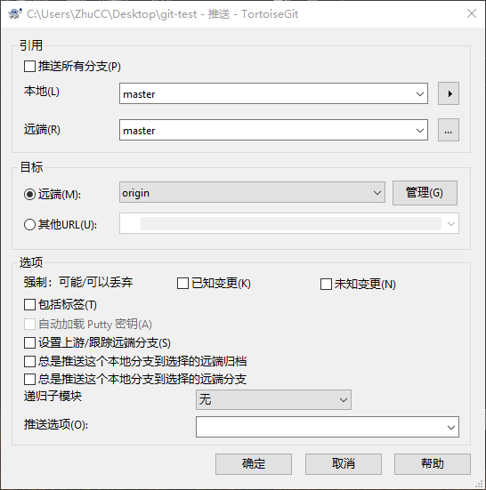

# 搭建一个本地私人Git仓库

> 事情的起因是，最近买了个新笔记本，然后和实验室的台式机需要进行学习笔记的同步，但感觉通过U盘的方式太low了，于是乎为进行数据同步，充分利用实验室的服务器搭建了个本地私人仓库。

## 1. 安装流程

当然首先保证服务器上与PC机上都已经安装了可用的Git

1. 在PC机创建一个git仓库，该仓库做作为后续同步的仓库了，如：

   在PC机创建了`C:\Users\ZhuCC\Desktop\git-test`

   进入文件夹中，打开 `git bash` 输入 `git init` 初始化该仓库，如下

   ```bash
   ZhuCC@DESKTOP-3AB85C8 MINGW64 ~/Desktop/git-test
   $ git init
   Initialized empty Git repository in C:/Users/ZhuCC/Desktop/git-test/.git/
   (base)
   ```

   > 然后在该文件夹中随意放入一些文件，后续看看同步效果
   >
   > ```bash
   > - git-test
   > 	- 1.txt  # 写个 1
   > 	- 2.txt  # 写个 2
   > 	- 3.txt  # 写个 3
   > ```
   >
   > 然后把这些文件同步一下：
   >
   > ```bash
   > ZhuCC@DESKTOP-3AB85C8 MINGW64 ~/Desktop/git-test (master)
   > $ git add *
   > (base)
   > ZhuCC@DESKTOP-3AB85C8 MINGW64 ~/Desktop/git-test (master)
   > $ git commit -m "first"
   > [master (root-commit) e1cb987] first
   >  3 files changed, 3 insertions(+)
   >  create mode 100644 1.txt
   >  create mode 100644 2.txt
   >  create mode 100644 3.txt
   > (base)
   > ```

2. 进入服务器中，先输入命令`ssh-keygen -t rsa -C`创建一个服务器非对称秘钥

   ```bash
   (base) zzq@ubuntu-C246-WU4:~$ ssh-keygen -t rsa
   Generating public/private rsa key pair.
   Enter file in which to save the key (/home/zzq/.ssh/id_rsa):   # 回车确定文件就建立在次
   Created directory '/home/zzq/.ssh'.
   Enter passphrase (empty for no passphrase):   # 直接回车，不需要passphrase
   Enter same passphrase again: 
   Your identification has been saved in /home/zzq/.ssh/id_rsa.
   Your public key has been saved in /home/zzq/.ssh/id_rsa.pub.
   The key fingerprint is:
   SHA256:73+kgj3czGdjTcgKaabdCmiHE4PmIqJygH6zpYaiPwo 
   zzq@ubuntu-C246-WU4
   The key's randomart image is:
   +---[RSA 2048]----+
   |                 |
   |                 |
   |                 |
   |     .           |
   |.   o o S  . . . |
   |o  o   = .=   + .|
   |E.o ..= oO.* + o |
   |*+o=o. ooo* B * .|
   |B+++o     o=.= . |
   +----[SHA256]-----+
   ```

3. 进入`.ssh`文件，创建 `authorized_keys`文件，并复制PC机上的公钥到该文件中

   ```bash
   (base) zzq@ubuntu-C246-WU4:~$ cd .ssh/
   (base) zzq@ubuntu-C246-WU4:~/.ssh$ vim authorized_keys
   # 然后PC机的公钥复制进去
   # 公钥的位置在：C:\Users\PC机用户名\.ssh\id_rsa.pub
   # 比如我的为：ssh-rsa A......s= zhuchengchao.zj@outlook.com
   # 复制完成后，如下：
   (base) zzq@ubuntu-C246-WU4:~/.ssh$ cat authorized_keys 
   sh-rsa A......vACfSqFpS29u1M2JckD42Ww3CFQs= zhuchengchao.zj@outlook.com
   ```

   > **注意**
   >
   > 如没有该文件的话，在PC机上通过命令：`ssh-keygen -t rsa -C "邮箱地址"`来生成

4. 打开文件：`/etc/ssh/sshd_config`，修改如下：

   ```bash
   RSAAuthentication yes
   PubkeyAuthentication yes
   AuthorizedKeysFile      .ssh/authorized_keys
   ```

5. 在服务器上创建一个空文件夹，作为和PC同步的仓库

   ```bash
   (base) zzq@ubuntu-C246-WU4:~$ mkdir git
   (base) zzq@ubuntu-C246-WU4:~$ cd ./git/
   (base) zzq@ubuntu-C246-WU4:~/git$ git init --bare git-test.git
   初始化空的 Git 仓库于 /home/zzq/git/git-test.git/        # 创建成功
   (base) zzq@ubuntu-C246-WU4:~/git$ cd ./git-test.git/  # 进入看下里面有啥
   (base) zzq@ubuntu-C246-WU4:~/git/git-test.git$ ls
   branches  config  description  HEAD  hooks  info  objects  refs
   ```

6. 开始同步：把PC机上创建的仓库同步到服务器上创建的仓库，在PC机上操作：

   ```bash
   ZhuCC@DESKTOP-3AB85C8 MINGW64 ~/Desktop/git-test (master)
   $ git remote add origin zzq@10.12.11.192:/home/zzq/git/git-test.git  # 进行连接
   (base)
   ZhuCC@DESKTOP-3AB85C8 MINGW64 ~/Desktop/git-test (master)
   $ git remote -v  # 查看是否连接成功
   origin  zzq@10.12.11.192:/home/zzq/git/git-test.git (fetch)
   origin  zzq@10.12.11.192:/home/zzq/git/git-test.git (push)
   (base)
   ZhuCC@DESKTOP-3AB85C8 MINGW64 ~/Desktop/git-test (master)
   $ git push origin master  # 进行推送 PC->服务器
   zzq@10.12.11.192's password:  # 输入服务器的密码
   Enumerating objects: 5, done.
   Counting objects: 100% (5/5), done.
   Delta compression using up to 4 threads
   Compressing objects: 100% (2/2), done.
   Writing objects: 100% (5/5), 284 bytes | 284.00 KiB/s, done.
   Total 5 (delta 0), reused 0 (delta 0)
   To 10.12.11.192:/home/zzq/git/git-test.git
    * [new branch]      master -> master
   (base)  # 推送成功
   ```

7. 把服务器上的内容clone到PC机上，在PC机上操作：

   ```bash
   ZhuCC@DESKTOP-3AB85C8 MINGW64 ~/Desktop
   $ git clone zzq@10.12.11.192:/home/zzq/git/git-test.git
   Cloning into 'git-test'...
   zzq@10.12.11.192's password:  # 注入服务器密码
   remote: 对象计数中: 5, 完成.
   remote: 压缩对象中: 100% (2/2), 完成.
   remote: Total 5 (delta 0), reused 0 (delta 0)
   Receiving objects: 100% (5/5), done.
   (base)  # 克隆成功
   ```

> **emmm...**：
>
> 第一遍安装时，其实是不需要输入服务器密码的，可以直接push/clone
>
> 后来服务器崩了，被我重装后就需要每次都输入密码了，因为对使用影响不大所有也没有管，若有解决方案的麻烦告诉我一下，谢谢

## 2. 加上小乌龟

> 在PC机上，我安装了 TortoiseGit，通过其进行push/clone更加方便
>
> 具体对小乌龟的使用参考：[TortoiseGit](https://www.cnblogs.com/zhuchengchao/p/12446315.html)

1. 配置小乌龟，在PC机上的仓库，右击选择 `TortoiseGit -> 设置(s)`，如下

   

2. 后续有 `添加文件/ 提交/ 推送` 直接右击选择相应功能即可，相当方便，这里按照添加新文件为例进行示范：

   当我在PC机的相应仓库中添加了一个文件：`4.txt`

   直接在仓库中右击选择`TortoiseGit -> 添加(s)`

   

   然后在弹出的界面中，选择`提交(C)`，然后再在弹出的界面中添加上日志信息

   

   最后进行推送到远端

   

   

   推送成功：

   

   

## 参考

https://blog.csdn.net/qq_34284638/article/details/70154557

https://www.cnblogs.com/lixiaochao/p/6293316.html