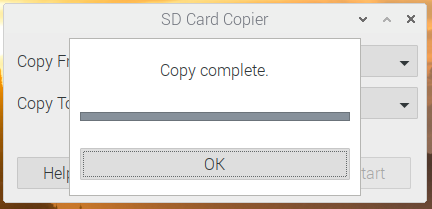

# 树莓派系统备份

> 记录下两种将树莓派的系统SD卡备份的方式，两种备份方式都不需要等大的SD卡，只需SD卡的空间能装下已经使用的系统资源即可。

## 方式一：SD Card Copier

这是一种通过显示界面操作系统备份的方式，SD Card Copier为树莓派自带的备份工具。

### 操作步骤

1. 将备用的SD卡格式化一下，可通过DiskGenius等软件来进行；
2. 将格式化好的SD卡通过读卡器插入树莓派；
3. 通过界面操作选择SD Card Copier


4. 选择你的系统卡和读卡器中的SD卡后，选择开始，静静等待其备份完成即可




## 方式二：gparted工具

通过gparted系统的进行裁剪，后通过Win32DiskImager将裁剪后的系统读出再烧入至新的SD卡，最后对新的SD卡进行扩容操作；

虽然操作比方式一复杂一些，但是裁剪出的系统进过压缩后，基本能缩小3倍左右，很适合存储与批量制作系统。

### 操作步骤

#### 生成系统的镜像文件

1. 在树莓派系统上下载gparted，通过命令`sudo apt-get install gparted`；

2. 插入需要备份的系统SD卡；

3. 运行`sudo gparted`命令;

4. 通过如下步骤，在Linux系统中进行操作：

   a. 选择SD卡


​		b. 取消挂载，更具以使用的系统大小，重新SD卡使用大小；


​		c. 根据已经使用的大小的基础上扩大个一些空间，来裁剪；


​		d. 确认无误，进行系统裁剪，期间会有警告，查看内容，并没有问题后选择Apply即可；


​		e. 等待其完成即可；


​		d. 成功裁剪后，可以看到未使用的SD卡部分已经不被分配了；


5. 弹出SD卡后，将SD卡插入个人电脑，通过Win32DiskImager软件进行镜像的读取，操作如下：


需要存储的话再将上传的img格式系统进行压缩，就很舒服了。


#### 恢复系统

1. 将需要烧系统的SD卡格式化后插入个人电脑；
2. 打开Win32DiskImager，将系统烧入SD卡中，如下：


3. 写入完成后，将SD卡插入树莓派，作为其系统卡，但是需要**为其进行扩容**；

   **方式一：通过Gparted**

   a. 还是使用`sudo gparted`命令，打开GParted应用，可以看到现在SD卡中有未被分配的空间，如下：

   

   b. 选择label为rootfs的行，将未分配的空间全部分配给它后确定即可，如下：

   
   
   **方式二：fdisk**
   
   a. 通过`df -h`命令查看内存是否需要扩容：
   
   ```bash
   pi@raspberrypi:~ $ df -h
   Filesystem      Size  Used Avail Use% Mounted on
   /dev/root       5.4G  3.5G  1.7G  69% /				# 此时我的容量不足需要扩容
   devtmpfs        1.8G     0  1.8G   0% /dev
   tmpfs           1.9G     0  1.9G   0% /dev/shm
   tmpfs           1.9G  8.6M  1.9G   1% /run
   tmpfs           5.0M  4.0K  5.0M   1% /run/lock
   tmpfs           1.9G     0  1.9G   0% /sys/fs/cgroup
   /dev/mmcblk0p1  253M   53M  200M  21% /boot
   tmpfs           386M     0  386M   0% /run/user/1000
   ```
   
   b. 通过命令：`cat /sys/block/mmcblk0/mmcblk0p2/start`查看第二分区起始地址：
   
   ```bash
   pi@raspberrypi:~ $ cat /sys/block/mmcblk0/mmcblk0p2/start
   532480  # 后续作为分区的起始地址
   ```
   
   c. 输入命令`sudo fdisk /dev/mmcblk0`开始重新分配内存；
   
   > 需要输入的指令通过**# 输入：**注释了
   
   ```bash
   pi@raspberrypi:~ $ sudo fdisk /dev/mmcblk0  # 输入：fdisk 开启fdisk
   
   Welcome to fdisk (util-linux 2.33.1).
   Changes will remain in memory only, until you decide to write them.
   Be careful before using the write command.
   
   
   Command (m for help): p  # 输入：p 查看内存分区情况
   Disk /dev/mmcblk0: 29.7 GiB, 31914983424 bytes, 62333952 sectors
   Units: sectors of 1 * 512 = 512 bytes
   Sector size (logical/physical): 512 bytes / 512 bytes
   I/O size (minimum/optimal): 512 bytes / 512 bytes
   Disklabel type: dos
   Disk identifier: 0xea7d04d6
   
   Device         Boot  Start      End  Sectors  Size Id Type
   /dev/mmcblk0p1        8192   532479   524288  256M  c W95 FAT32 (LBA)
   /dev/mmcblk0p2      532480 12066815 11534336  5.5G 83 Linux
   
   Command (m for help): d  # 输入：d 删除内存
   Partition number (1,2, default 2): 2  # 输入：2 删除第二个分区
   
   Partition 2 has been deleted.
   
   Command (m for help): n  # 输入：n 创建分区
   Partition type
      p   primary (1 primary, 0 extended, 3 free)
      e   extended (container for logical partitions)
   Select (default p): p  # 输入：p 创建主分区
   Partition number (2-4, default 2): 2  # 输入：2 创建第二个主分区
   First sector (2048-62333951, default 2048): 532480  # 输入：输入b步骤中查出的起始地址
   Last sector, +/-sectors or +/-size{K,M,G,T,P} (532480-62333951, default 62333951):   # 输入：回车 确认结束地址为最末尾
   
   Created a new partition 2 of type 'Linux' and of size 29.5 GiB.
   Partition #2 contains a ext4 signature.
   
   Do you want to remove the signature? [Y]es/[N]o: y  # 输入：输入y确认分区
   
   The signature will be removed by a write command.
   
   Command (m for help): w  # 输入：w 将分区结果保存
   The partition table has been altered.
   Syncing disks.
   ```
   
   d. 刷新：`sudo resize2fs /dev/mmcblk0p2`
   
   e. 再次通过`df -h`命令查看，分区已经成功了
   
   ```bash
   pi@raspberrypi:~ $ df -h
   Filesystem      Size  Used Avail Use% Mounted on
   /dev/root        29G  3.5G   25G  13% /				# 分区已经成功了
   devtmpfs        1.8G     0  1.8G   0% /dev
   tmpfs           1.9G     0  1.9G   0% /dev/shm
   tmpfs           1.9G  8.6M  1.9G   1% /run
   tmpfs           5.0M  4.0K  5.0M   1% /run/lock
   tmpfs           1.9G     0  1.9G   0% /sys/fs/cgroup
   /dev/mmcblk0p1  253M   53M  200M  21% /boot
   tmpfs           386M     0  386M   0% /run/user/1000
   ```

## 参考

https://blog.csdn.net/lynxzong/article/details/86647805

https://post.smzdm.com/p/apzkgne7/

https://www.jianshu.com/p/6588f935d41c