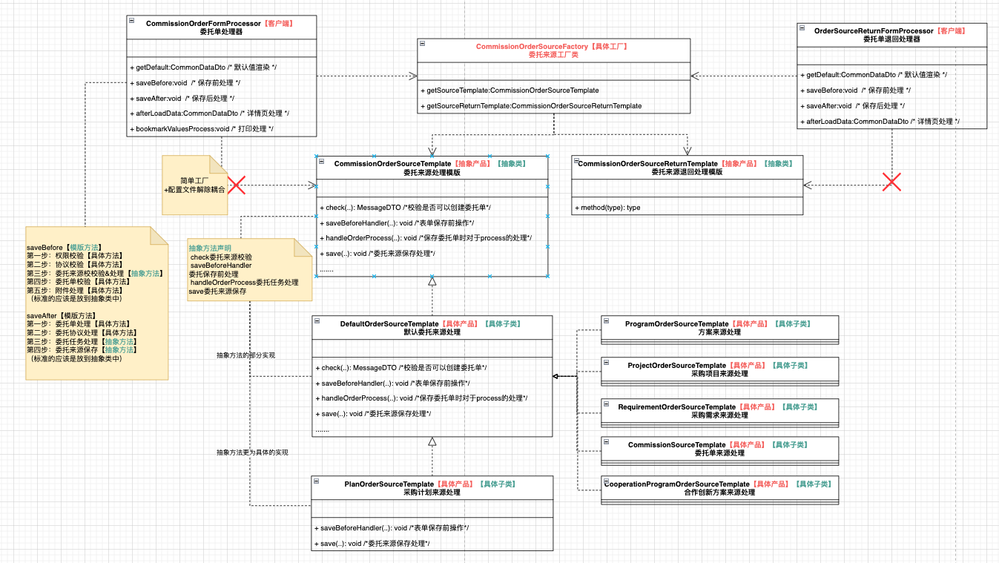
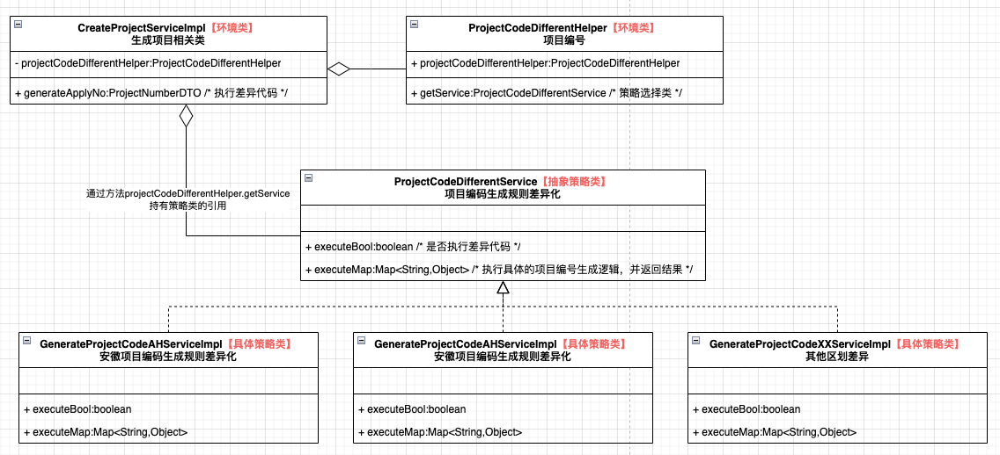

# 常用设计模式在日常开发中的使用

## 工厂模式+模板方法模式使用

### 工厂模式

工厂模式是**创建型设计模式**中的一种，它提供了一种创建对象的方式，而不需要指定具体的类。工厂模式将对象的创建过程封装在一个工厂类中，客户端只需要通过工厂来获取所需的对象，而不需要关心对象的具体创建细节。这种方式增强了系统的可扩展性、灵活性，并且使得代码的维护更加简单。

> 创建型模式：用于描述“**怎样创建对象**”，它的主要特点是“**将对象的创建与使用分离**”

**工厂模式的核心思想**

工厂模式的核心思想是将对象的创建与使用分离，客户端不需要关心对象的创建过程，只需要使用工厂来获得所需要的对象。这样可以减少系统中类之间的**耦合度**。

**工厂模式的类型**

* 简单工厂模式（Simple Factory Pattern）：又叫做静态工厂方法模式（Static Factory Method），它并不是一个严格意义上的设计模式。简单工厂模式通过一个工厂类根据传入的参数决定实例化哪一个产品类，适用于产品种类较少且固定的情况。
* 工厂方法模式（Factory Method Pattern）：定义一个创建对象的接口，但由子类决定实例化哪一个类。工厂方法模式让类的实例化推迟到子类中进行，具有更高的灵活性和可扩展性。

* 抽象工厂模式（Abstract Factory Pattern）：提供一个创建一系列相关或相互依赖对象的接口，而无需指定它们具体的类。抽象工厂模式通常是由多个工厂方法构成，每个工厂方法负责创建一类产品，适用于产品族的创建。

**工厂模式的主要组成部分**

1. **产品（Product）**：是工厂类所创建的对象，通常会有多个具体的实现类。

   抽象产品：定义了产品的规范，描述了产品的主要特性和功能。

   具体产品：实现或者继承抽象产品的子类。

2. **工厂（Creator / Factory）**：是负责创建产品的工厂类。它可以是一个简单的工厂类，也可以是一个抽象的工厂接口或抽象工厂类，具体工厂实现类根据不同需求创建不同的产品。

3. **具体工厂（Concrete Creator / Concrete Factory）**：在工厂方法模式和抽象工厂模式中，具体工厂类是工厂接口的实现类，负责实例化具体的产品对象。

**工厂模式的优缺点**

优点

- **解耦**：客户端不需要关心产品的具体实现类，工厂类隐藏了对象创建的细节，降低了系统的耦合性。
- **符合开闭原则**：增加新产品时，只需添加新的产品类和工厂类，无需修改原有的代码。
- **提高可维护性**：对象的创建集中管理，方便维护和修改。

缺点

- **增加复杂性**：如果产品种类较多，工厂模式可能导致工厂类数量激增，增加了系统的复杂性。
- **代码量较多**：需要为每个产品创建不同的工厂类或接口，增加了系统中的类数量。

### 模版方法模式

模板方法模式是**行为型设计模式**之一，它定义了一个操作中的算法框架，而将一些步骤的实现延迟到子类中。模板方法模式让子类在不改变算法结构的情况下，重新定义算法的某些特定步骤。换句话说，模板方法模式通过在父类中定义一个模板方法，控制算法的执行顺序，而让子类来具体实现某些细节操作。

> 用于描述**类或对象之间怎样相互协作共同完成单个对象无法单独完成的任务，以及怎样分配职责**。

**模板方法模式的核心思想**

模板方法模式的核心思想是将不变的部分放到父类中，将可变的部分留给子类去实现。通过模板方法，父类可以决定算法的骨架，而子类可以选择性地实现特定的步骤。这样，父类和子类能够保持一定的灵活性，同时又能保证算法的一致性和结构性。

**模板方法模式的主要组成部分**

抽象类（Abstract Class）：负责给出一个算法的轮廓和骨架。它由一个模板方法和若干个基本方法构成。

* 模板方法：定义了算法的骨架，按某种顺序调用其包含的基本方法。

  * 基本方法：是实现算法各个步骤的方法，是模板方法的组成部分。基本方法又可以分为三种：

    * 抽象方法(Abstract Method) ：一个抽象方法由抽象类声明、由其具体子类实现。

    * 具体方法(Concrete Method) ：一个具体方法由一个抽象类或具体类声明并实现，其子类可以进行覆盖也可以直接继承。

    * 钩子方法(Hook Method) ：在抽象类中已经实现，包括用于判断的逻辑方法和需要子类重写的空方法两种。

      > 一般钩子方法是用于判断的逻辑方法，这类方法名一般为isXxx，返回值类型为boolean类型

具体子类（Concrete Class）：实现抽象类中所定义的抽象方法和钩子方法，它们是一个顶级逻辑的组成步骤。

**优缺点**

优点：

* 提高代码复用性：将相同部分的代码放在抽象的父类中，而将不同的代码放入不同的子类中。

* 实现了反向控制：通过一个父类调用其子类的操作，通过对子类的具体实现扩展不同的行为，实现了反向控制，并符合“开闭原则”。

缺点：

* 对每个不同的实现都需要定义一个子类，这会导致类的个数增加，系统更加庞大，设计也更加抽象。
* 父类中的抽象方法由子类实现，子类执行的结果会影响父类的结果，这导致一种反向的控制结构，它提高了代码阅读的难度。

**适用场景**

算法的整体步骤很固定，但其中个别部分易变时，这时候可以使用模板方法模式，将容易变的部分抽象出来，供子类实现。

需要通过子类来决定父类算法中某个步骤是否执行，实现子类对父类的反向控制。

### 实际使用

**工厂模式的体现**：委托单在保存时会根据不同的委托来源进行不同的处理：采购计划、采购项目、采购方案...，这些不同的实现类通过工厂进行了管理，如下：cn.gov.zcy.gyarados.base.template.CommissionOrderSourceFactory

> 通过监听Spring应用上下文刷新事件，把加了对应的Bean注入到工厂中；

后续在使用时，只需要通过工厂来获得所需要的对象；

**模版方法模式体现**：拿委托单在保存前的处理为例（saveBefore），委托单在保存前会进行不同步骤的校验逻辑，大体可分为5步：第一步：权限校验；第二步：协议校验；第三步：委托来源校校验&处理；第四步：委托单校验；第五步：附件处理；

保存前的处理作为一个模版方法，控制了委托单在保存前的执行顺序，其中步骤1/2/4/5中的方法不会随着单据的不同而不同，作为不变的部分；其中步骤3会随着委托来源的不同而不同，这是可变的部分，通过将其抽象出来交给子类去进行实现。

## 策略模式使用

### 策略模式

策略模式是**行为型设计模式**之一，它定义了一系列的算法（策略），并将每一个算法封装起来，使它们可以互相替换。策略模式让算法的变化独立于使用算法的客户。换句话说，策略模式允许客户端在运行时选择不同的算法或行为，而不需要修改客户端的代码。

**策略模式的核心思想**

策略模式的核心思想是将一组算法（策略）封装到独立的类中，并让客户端根据需要选择合适的策略。这种方式可以有效地避免条件语句和多重继承问题，减少代码的耦合度。

**策略模式的结构**

* 抽象策略（Strategy）类：这是一个抽象角色，通常由一个接口或抽象类实现。此角色给出所有的具体策略类所需的接口。
* 具体策略（Concrete Strategy）类：实现了抽象策略定义的接口，提供具体的算法实现或行为。
* 环境（Context）类：持有一个策略类的引用，最终给客户端调用。

**优缺点**

优点：

* 策略类之间可以自由切换，由于策略类都实现同一个接口，所以使它们之间可以自由切换。

* 易于扩展，增加一个新的策略只需要添加一个具体的策略类即可，基本不需要改变原有的代码，符合“开闭原则“

* 避免使用多重条件选择语句（if else），充分体现面向对象设计思想。

缺点：

* 客户端必须知道所有的策略类，并自行决定使用哪一个策略类。
* 策略模式将造成产生很多策略类，可以通过使用享元模式在一定程度上减少对象的数量。

### 实际使用

不同的区划有不同的项目编号生成规则，将项目编号的算法进行封装，组成不同区划项目编号生成的策略类，具体如下：

* 抽象策略（Strategy）类：**ProjectCodeDifferentService**
* 具体策略（Concrete Strategy）类：
  * **GenerateProjectCodeAHServiceImpl**
  * **GenerateProjectCodeGXServiceImpl**
  * ...

环境（Context）类：**CreateProjectServiceImpl**中，持有策略类的引用

通过方法 `projectCodeDifferentHelper.getService(...)` 方法根据传入的参数（区划、单据类型等）选择具体的实现类（即具体的策略）。不同的区划和单据类型可能会有不同的项目编号生成规则，因此需要不同的实现类来处理。

## 适配器模式使用

> **结构型模式**：用于描述如何将**类或对象按某种布局组成更大的结构**，GoF（四人组）书中提供了代理、适配器、桥接、装饰、外观、享元、组合等 7 种结构型模式。
